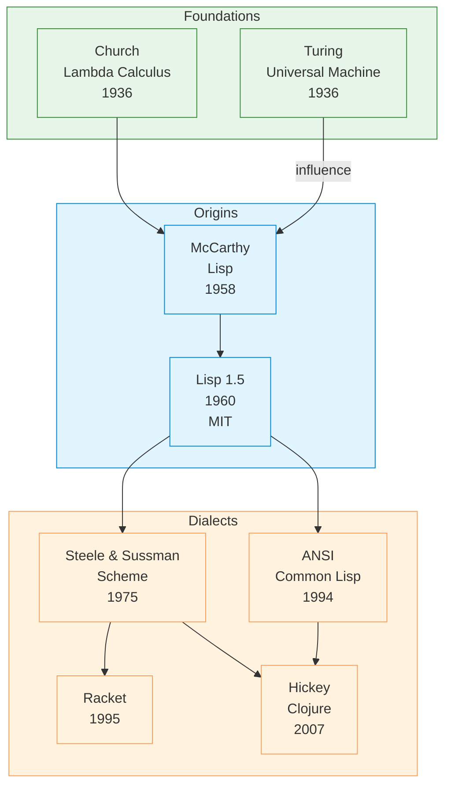

# Lisp

| | |
|---|---|
| **Year** | 1958 |
| **Creator(s)** | John McCarthy |
| **Paradigm(s)** | Functional, symbolic |
| **Typing** | Dynamic |
| **Platform** | Various (native, JVM, .NET) |
| **Key features** | Homoiconicity, macros, GC, REPL, symbolic computation |
| **Major dialects** | Common Lisp, Scheme, Clojure, Racket, Emacs Lisp |

---

## Contents

1. [Overview](#overview)
2. [Historical Context](#historical-context)
3. [Key Ideas](#key-ideas)
   - [Homoiconicity](#homoiconicity)
   - [Symbolic Computation](#symbolic-computation)
   - [Recursion as Primary Control Flow](#recursion-as-primary-control-flow)
   - [Garbage Collection](#garbage-collection)
4. [Language Features](#language-features)
   - [Syntax: S-expressions](#syntax-s-expressions)
   - [Lists and Cons Cells](#lists-and-cons-cells)
   - [Dynamic Typing](#dynamic-typing)
   - [Lexical vs Dynamic Scoping](#lexical-vs-dynamic-scoping)
5. [Dialects and Variants](#dialects-and-variants)
   - [Scheme (1975)](#scheme-1975)
   - [Common Lisp (1984)](#common-lisp-1984)
   - [Clojure (2007)](#clojure-2007)
   - [Racket (1995)](#racket-1995)
6. [Influence](#influence)
7. [Strengths and Weaknesses](#strengths-and-weaknesses)
8. [Code Examples](#code-examples)
9. [Related Authors](#related-authors)
10. [Related Topics](#related-topics)
11. [Further Reading](#further-reading)

---

## Overview

Lisp (LISt Processing) is the second-oldest high-level programming language
(after Fortran) and one of the most influential in computing history. Created
by John McCarthy in 1958, Lisp pioneered concepts that would become
foundational to modern programming:

- **Recursive functions** as primary control flow
- **Garbage collection** — first language to have it
- **Interactive REPL** — read-eval-print loop
- **Code-as-data** — homoiconicity
- **Higher-order functions** — functions as values
- **Symbolic computation** — manipulation of expressions, not just numbers

Lisp became the primary language of artificial intelligence research for decades and
continues to influence language design today.

## Historical Context



Lisp emerged from McCarthy's work on symbolic computation and artificial
intelligence at MIT. While Fortran (1957) was designed for numerical
calculation, Lisp was designed to **manipulate symbols, expressions, and
knowledge**.

The name "Lisp" originally meant "LISt Processing" — reflecting its
fundamental data structure, the linked list.

### Evolution of Lisp

| Era | Dialect | Key contribution |
|------|----------|-----------------|
| 1960 | Lisp 1.5 | First practical implementation on IBM 704 |
| 1975 | Scheme | Lexical scoping, proper tail recursion |
| 1984 | Common Lisp | Unification of major Lisp dialects |
| 1994 | ANSI Common Lisp | Standardized specification |
| 2007 | Clojure | Modern Lisp on JVM, persistent data structures |

## Key Ideas

### Homoiconicity

Lisp is **homoiconic** — code and data share the same representation
as nested lists (S-expressions). This means:

```lisp
;; This is a list of numbers
(list 1 2 3)
;; Output: (1 2 3)

;; This is code that adds numbers
(+ 1 2 3)
;; Output: 6

;; But the code IS also a list!
;; We can manipulate code as data
(setq my-code '(+ 1 2 3))
;; Output: (+ 1 2 3)

;; And evaluate it later!
(eval my-code)
;; Output: 6
```

Homoiconicity enables **macros** — programs that write programs. This is
powerful meta-programming capability not easily achieved in most languages.

### Symbolic Computation

Lisp was designed for symbolic AI:

```lisp
;; Representing knowledge as symbols
(setq is-mammal '(has-spine warm-blooded))
(setq is-fish '(has-fins lives-in-water))

;; Logical reasoning
(if (member 'warm-blooded is-mammal)
    (print "It might be a mammal"))
```

This capability made Lisp the language of choice for AI research from the
1960s through the 1980s.

### Recursion as Primary Control Flow

Lisp was one of the first languages to make recursion first-class:

```lisp
;; Recursive factorial
(defun factorial (n)
  (if (<= n 1)
      1
      (* n (factorial (- n 1))))

(factorial 5)  ; Output: 120
```

McCarthy argued that recursion was more natural for mathematical functions
than iterative loops with explicit state mutation.

### Garbage Collection

Lisp introduced automatic memory management in 1958 — a feature that would
not become mainstream until Java in 1995. This eliminated manual memory
management errors that plagued early programming.

## Language Features

### Syntax: S-expressions

Lisp uses **S-expressions** (Symbolic Expressions) for both code and data:

```lisp
;; Prefix notation: (operator operand1 operand2 ...)
(+ 1 2 3)           ; Addition
(* 2 3)               ; Multiplication
(if (> x 0) t nil)      ; Conditional
(defun greet (name)        ; Function definition
  (format t "Hello, ~a!" name))
```

### Lists and Cons Cells

The fundamental data structure is the linked list built from **cons cells**:

```lisp
;; Building lists
(setq lst '(1 2 3))           ; Direct quote
(setq lst2 (cons 1 '(2 3)))     ; cons (construct)

;; List operations
(car lst)      ; First element: 1
(cdr lst)      ; Rest of list: (2 3)
(length lst)    ; Length: 3
(member 2 lst)  ; Search for element
```

### Dynamic Typing

Variables (symbols) can reference any value:

```lisp
(setq x 42)           ; Integer
(setq x "hello")       ; String
(setq x '(1 2 3))      ; List
(setq x (lambda (y) y)) ; Function

;; Type checking happens at runtime
(+ x 5)  ; Works if x is a number, error otherwise
```

### Lexical vs Dynamic Scoping

Different Lisp dialects handle scope differently:

| Scoping | Description | Languages |
|----------|-------------|-------------|
| **Lexical** | Variables bound in environment where defined | Scheme, Common Lisp (modern style), Clojure |
| **Dynamic** | Variables bound in environment where called | Emacs Lisp, early Lisp |

Lexical scoping enables closures — functions that capture their environment:

```lisp
(defun make-adder (n)
  (lambda (x) (+ x n)))

(setq add-5 (make-adder 5))
(funcall add-5 3)  ; Output: 8
```

## Dialects and Variants

### Scheme (1975)

Created by Guy Steele and Gerald Sussman at MIT. Key innovations:

- **Lexical scoping** as default
- **Proper tail call optimization** (no stack overflow for recursion)
- **Minimalist design** — small core with powerful primitives

**Influenced:** Racket, Clojure, many functional languages

### Common Lisp (1984)

The result of unifying Lisp Machine Lisp, Interlisp, and others:

- **Multi-paradigm** — supports OOP (CLOS), FP, procedural
- **Huge standard library** — thousands of built-in functions
- **ANSI standardized** (1994)
- **Still widely used** in commercial and scientific applications

### Clojure (2007)

Created by Rich Hickey. Modern Lisp features:

- Runs on **Java Virtual Machine**
- **Immutable data structures** by default
- **Software transactional memory** for concurrency
- **Minimal syntax** — fewer parentheses

→ [Clojure](../clojure/)

### Racket (1995)

Evolution of Scheme with emphasis on:

- Language creation — Racket makes creating languages easy
- Typed Racket — optional gradual typing
- Extensive libraries

## Influence

Lisp's influence on programming is enormous:

### Languages Directly Inspired

| Language | Year | Lisp influence |
|-----------|--------|---------------|
| Scheme | 1975 | Dialect, minimalist Lisp |
| Common Lisp | 1984 | Dialect, unification |
| Smalltalk | 1972 | Message passing inspired by Lisp eval |
| Python | 1991 | List comprehensions, dynamic typing |
| Ruby | 1995 | Blocks, dynamic typing |
| Julia | 2012 | Multiple dispatch (inspired by CLOS) |
| Haskell | 1990 | Pattern matching, lazy evaluation roots |
| Clojure | 2007 | Lisp dialect on JVM |
| Racket | 1995 | Scheme evolution |

### Concepts Pioneered

| Concept | Origin | Modern equivalent |
|----------|---------|-------------------|
| Garbage collection | Lisp 1958 | Java, Python, Go, almost all modern languages |
| REPL | Lisp | Python shell, Node.js, modern dev tools |
| Higher-order functions | Lisp | `map`, `filter` in Python, JavaScript, Java streams |
| Macros / meta-programming | Lisp | Template metaprogramming (C++), macros (Rust) |
| Lexical closures | Scheme | Closures in JavaScript, Python, Java |
| Code-as-data | Lisp | AST manipulation, compilers, tooling |

### Academic Influence

Lisp shaped computer science education and research:

- **MIT AI Lab** — home of Lisp Machines (1970s-80s)
- **SICP** — Structure and Interpretation of Computer Programs uses Scheme
- **FP research** — almost all FP language papers reference Lisp

## Code Examples

See [examples/lisp/](../../../examples/lisp/) for runnable code:

| Example | Description |
|---------|-------------|
| [01 Hello World](../../../examples/lisp/01-hello-world/) | Basic syntax and output |
| [02 Variables & Types](../../../examples/lisp/02-variables-and-types/) | Dynamic typing, symbols, quoting |
| [03 Functions](../../../examples/lisp/03-functions/) | Function definition, recursion |
| [04 Control Flow](../../../examples/lisp/04-control-flow/) | Conditionals, iteration |
| [05 Data Structures](../../../examples/lisp/05-data-structures/) | Lists, alists, property lists |

## Strengths and Weaknesses

### Strengths

- **Meta-programming** — homoiconicity enables powerful macros
- **Rapid development** — REPL-driven, no compilation step
- **Symbolic AI** — excellent for knowledge representation
- **Expressiveness** — minimal syntax, flexible data structures

### Weaknesses

- **Performance** — dynamic typing and GC overhead vs compiled languages
- **Parentheses** — learning curve, syntax unfamiliar to most
- **Fragmentation** — many dialects, not a single "Lisp"
- **Deployment** — less tooling and ecosystem than mainstream languages

## Related Authors

- [John McCarthy](../authors/john-mccarthy.md) — creator of Lisp
- [Alonzo Church](../authors/alonzo-church.md) — lambda calculus inspiration
- [Guy Steele](../authors/guy-steele.md) — Scheme co-creator
- [Gerald Sussman](../authors/gerald-sussman.md) — Scheme co-creator
- [Rich Hickey](../authors/rich-hickey.md) — Clojure creator

## Related Topics

- [Functional Programming](../topics/functional/) — Lisp as first FP language
- [Type Systems](../topics/types/) — dynamic typing vs static
- [Paradigms](../topics/paradigms/) — symbolic and imperative paradigms
- [Macros & Meta-programming](../topics/macros/) — code-as-data *(future topic)*

## Further Reading

- McCarthy — [Recursive Functions of Symbolic Expressions (1960)](../works/papers/mccarthy-1960-recursive.md)
- Steele & Sussman — *Scheme: An Interpreter for Extended Lambda Calculus* (1975)
- Graham — *On Lisp* (1993)
- Abelson & Sussman — *Structure and Interpretation of Computer Programs* (SICP) (1985)

## Quotes

> "Lisp is worth learning for the profound enlightenment experience
> you will have when you finally get it. That experience will make you
> a better programmer for the rest of your days, even if you never actually
> use Lisp itself a lot."
>
> — Eric Raymond, *How to Become a Hacker*

> "The programmable programming language."
>
> — Common Lisp community slogan

---

See [Languages Index](../languages/) for other language profiles.
