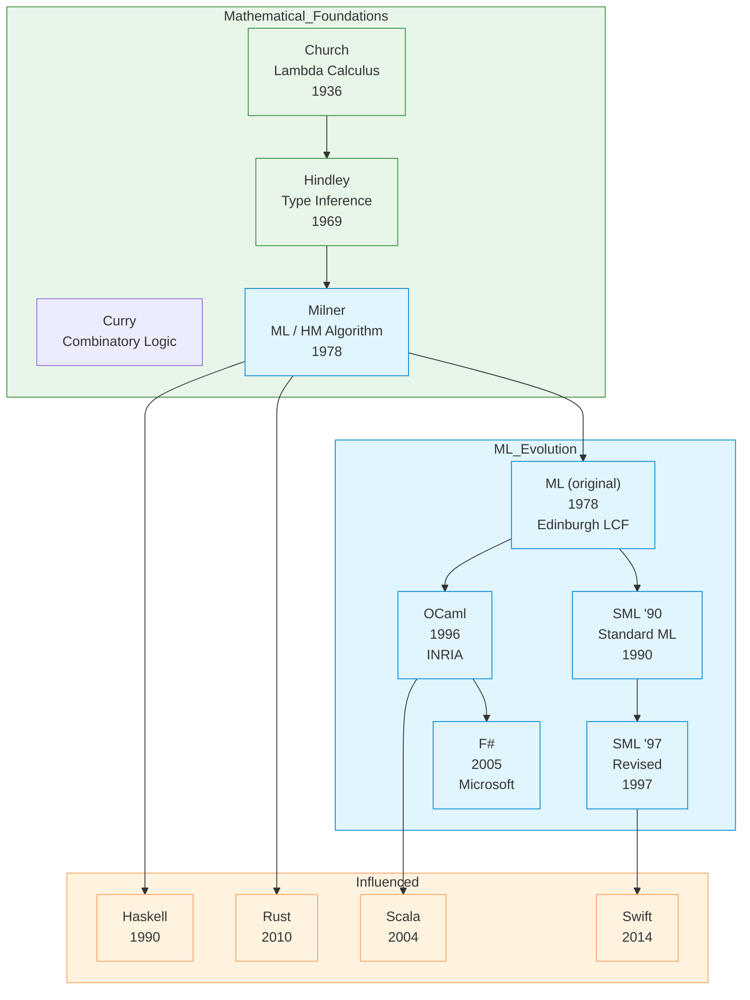

# ML

| | |
|---|---|
| **Year** | 1978 |
| **Creator(s)** | Robin Milner (University of Edinburgh) |
| **Paradigm(s)** | Functional, imperative (limited) |
| **Typing** | Static, inferred (Hindley–Milner) |
| **Platform** | Various (SML/NJ, OCaml, F#) |
| **Key features** | Type inference, pattern matching, modules |
| **Major dialects** | Standard ML (SML), OCaml, F# |

---

## Contents

1. [Overview](#overview)
2. [Historical Context](#historical-context)
3. [Key Ideas](#key-ideas)
   - [Hindley–Milner Type Inference](#hindleymilner-type-inference)
   - [Pattern Matching](#pattern-matching)
   - [Algebraic Data Types](#algebraic-data-types)
   - [Immutability](#immutability)
   - [Module System](#module-system)
4. [Language Features](#language-features)
   - [Functions and Recursion](#functions-and-recursion)
   - [Let and Let Rec](#let-and-let-rec)
   - [Records and Tuples](#records-and-tuples)
   - [Exceptions](#exceptions)
   - [Higher-Order Functions](#higher-order-functions)
5. [Dialects and Variants](#dialects-and-variants)
   - [Standard ML (SML)](#standard-ml-sml)
   - [OCaml](#ocaml)
   - [F#](#f)
6. [Ecosystem and Tools](#ecosystem-and-tools)
7. [Influence](#influence)
8. [Strengths and Weaknesses](#strengths-and-weaknesses)
9. [Code Examples](#code-examples)
10. [Related Authors](#related-authors)
11. [Related Topics](#related-topics)
12. [Further Reading](#further-reading)

---

## Overview

ML (Meta Language) is a general-purpose functional programming language
developed by Robin Milner and others in the late 1970s at the University
of Edinburgh. ML pioneered **static type inference** via the
Hindley–Milner algorithm, allowing the compiler to deduce types without
explicit annotations while maintaining type safety.

ML's distinctive characteristics:
- **Hindley–Milner type inference** — types inferred, rarely need annotations
- **Pattern matching** — expressive destructuring of data
- **Algebraic data types** — sum and product types
- **Immutability by default** — pure functional core
- **Module system** — structured programming at scale
- **Strong static typing** — catches errors at compile time

ML influenced generations of functional languages including Haskell,
OCaml, F#, Rust, and even aspects of Scala and Swift.

---

## Historical Context



### Edinburgh LCF and ML

ML was originally developed as the **Meta Language** for the Edinburgh
LCF (Logic for Computable Functions) theorem prover. It provided a
way to write proof tactics and manipulations. The type system ensured
that only well-formed proofs could be constructed.

---

## Key Ideas

### Hindley–Milner Type Inference

ML's most influential contribution — types inferred automatically:

```sml
(* Function definition - no types needed *)
fun add x y = x + y
(* Compiler infers: int -> int -> int *)

(* Type can be explicitly stated *)
fun add (x: int) (y: int): int = x + y

(* Polymorphic types inferred *)
fun length [] = 0
  | length (_::xs) = 1 + length xs
(* Inferred: 'a list -> int *)
```

**How it works:**
1. Generate type constraints from code structure
2. Unify constraints to find most general type
3. Report error if constraints cannot be unified

### Pattern Matching

ML popularized pattern matching as a primary control structure:

```sml
(* Match on list *)
fun sum [] = 0
  | sum (x::xs) = x + sum xs

(* Match on custom type *)
datatype shape = Circle of real
                | Rectangle of real * real
                | Triangle of real * real * real

fun area (Circle r) = Math.pi * r * r
  | area (Rectangle (w, h)) = w * h
  | area (Triangle (a, b, c)) =
      let val s = (a + b + c) / 2.0
      in Math.sqrt (s * (s - a) * (s - b) * (s - c))
      end
```

### Algebraic Data Types

Sum types (OR) and product types (AND) as first-class features:

```sml
(* Sum type: one of several variants *)
datatype 'a option = NONE
                   | SOME of 'a

(* Product type: tuple of values *)
type point = real * real

(* Recursive type *)
datatype 'a tree = Leaf
                  | Node of 'a * 'a tree * 'a tree

(* Parameterized type *)
datatype 'a either = Left of 'a
                   | Right of 'a
```

### Immutability

Data is immutable by default:

```sml
(* Variables are immutable (not reassignable) *)
val x = 42
(* x = 43 would be a syntax error *)

(* Instead, create new bindings *)
val x = 42
val y = x + 1

(* Lists are immutable *)
val nums = [1, 2, 3]
val nums2 = 0 :: nums
(* nums is still [1,2,3], nums2 is [0,1,2,3] *)
```

### Module System

ML pioneered sophisticated module systems:

```sml
(* Signature - module interface *)
signature QUEUE =
sig
  type 'a queue
  exception Empty
  val empty : 'a queue
  val enqueue : 'a -> 'a queue -> 'a queue
  val dequeue : 'a queue -> 'a * 'a queue
end

(* Structure - module implementation *)
structure Queue :> QUEUE =
struct
  datatype 'a queue = Q of 'a list * 'a list

  exception Empty

  val empty = Q ([], [])

  fun enqueue x (Q (in_list, out_list)) =
    Q (x::in_list, out_list)

  fun dequeue (Q ([], [])) = raise Empty
    | dequeue (Q (in_list, [])) =
        let val rev_list = rev in_list
        in dequeue (Q ([], rev_list))
        end
    | dequeue (Q (in_list, x::out_list)) =
        (x, Q (in_list, out_list))
end
```

---

## Language Features

### Functions and Recursion

```sml
(* Function definition *)
fun square x = x * x

(* Anonymous function (lambda) *)
val square = fn x => x * x

(* Recursion - must use 'rec' *)
fun factorial 0 = 1
  | factorial n = n * factorial (n - 1)

(* Higher-order function *)
fun apply_twice f x = f (f x)

(* Using it *)
val result = apply_twice square 5  (* 625 *)

(* Currying *)
fun add x y = x + y
(* add has type: int -> int -> int *)

(* Partial application *)
val add5 = add 5
val ten = add5 5  (* 10 *)
```

### Let and Let Rec

```sml
(* let introduces local bindings *)
let
  val x = 10
  val y = 20
in
  x + y
end
(* Result: 30 *)

(* let rec for recursive local functions *)
let
  fun sum 0 = 0
    | sum n = n + sum (n - 1)
in
  sum 100
end
```

### Records and Tuples

```sml
(* Tuple - ordered collection *)
val point = (3.0, 4.0)
val (x, y) = point
val first = #1 point
val second = #2 point

(* Record - named fields *)
type person = { name: string, age: int }

val alice = { name = "Alice", age = 30 }
val name = #name alice
val age = #age alice

(* Record pattern matching *)
fun greet { name = n, age = a } =
    "Hello, " ^ n ^ " (age " ^ Int.toString a ^ ")"
```

### Exceptions

```sml
(* Exception definition *)
exception DivideByZero
exception NotFound of string

(* Throwing exceptions *)
fun safe_divide _ 0 = raise DivideByZero
  | safe_divide x y = x div y

(* Handling exceptions *)
fun divide x y =
    safe_divide x y
    handle DivideByZero => 0
         | e => (print ("Unknown error: " ^ exnMessage e ^ "\n"); 0)
```

### Higher-Order Functions

```sml
(* map: applies function to each element *)
fun map _ [] = []
  | map f (x::xs) = f x :: map f xs

(* filter: keeps elements satisfying predicate *)
fun filter _ [] = []
  | filter p (x::xs) =
      if p x then x :: filter p xs
      else filter p xs

(* fold: reduces list to single value *)
fun foldl _ acc [] = acc
  | foldl f acc (x::xs) = foldl f (f (x, acc)) xs

(* Using them *)
val squares = map (fn x => x * x) [1,2,3,4,5]
val evens = filter (fn x => x mod 2 = 0) [1,2,3,4,5]
val sum = foldl (fn (x, acc) => x + acc) 0 [1,2,3,4,5]
```

---

## Dialects and Variants

### Standard ML (SML)

The original ML language, standardized:

- **SML '90** (1990) — First standard
- **SML '97** (1997) — Revised standard with modules

**Implementations:**
- **SML/NJ** — Standard ML of New Jersey
- **MLton** — Whole-program optimizing compiler
- **Moscow ML** — Lightweight, fast compilation

```sml
(* SML example *)
fun quicksort [] = []
  | quicksort (p::xs) =
      let
        val (less, greater) =
          List.partition (fn x => x < p) xs
      in
        quicksort less @ [p] @ quicksort greater
      end
```

### OCaml

Objective Caml — developed at INRIA, adds:

- **Object-oriented features** — classes, objects
- **Modules and functors** — Advanced module system
- **Optional label arguments** — Named parameters

```ocaml
(* OCaml example with classes *)
class counter initial =
  object (self)
    val mutable count = initial
    method get = count
    method inc = count <- count + 1
  end

let c = new counter 0 in
c#inc;
c#get  (* Returns 1 *)
```

### F#

Developed by Microsoft, ML family for .NET:

- **.NET integration** — Full access to .NET libraries
- **Computation expressions** — Monads with custom syntax
- **Active patterns** — Advanced pattern matching
- **Type providers** — Compile-time data access

```fsharp
// F# example
let numbers = [1..10]

let sumOfSquares =
    numbers
    |> List.map (fun x -> x * x)
    |> List.sum

// Computation expression (async)
async {
    let! data = downloadData url
    return processData data
}
```

---

## Ecosystem and Tools

| Tool | Purpose |
|------|---------|
| **sml** | SML interpreter |
| **mlton** | Optimizing SML compiler |
| **ocaml** | OCaml compiler |
| **dune** | OCaml build system |
| **fsc** | F# compiler |
| **opam** | OCaml package manager |

---

## Influence

### Languages Directly Inspired

| Language | ML influence |
|-----------|-----------------|
| **Haskell** | Type inference, algebraic data types |
| **OCaml** | Direct descendant of ML |
| **F#** | ML family on .NET |
| **Rust** | Pattern matching, algebraic data types |
| **Scala** | Pattern matching, case classes |
| **Swift** | Option type, pattern matching |
| **Elm** | ML-like syntax, pure functional |

### Concepts Pioneered

| Concept | Origin | Modern equivalent |
|----------|---------|-------------------|
| **HM type inference** | ML (1978) | Type inference in Haskell, Rust, Swift |
| **Pattern matching** | ML | `match` in Rust, Swift, Scala |
| **Algebraic data types** | ML | Enums in Rust, Swift; sealed classes in Java |
| **Module system** | ML | Namespaces, modules in many languages |
| **Functors** | ML | Generics with constraints |

---

## Strengths and Weaknesses

### Strengths

| Strength | Detail |
|----------|--------|
| **Type inference** | Write less, catch more errors |
| **Pattern matching** | Expressive, exhaustive |
| **Immutable default** | Easier reasoning, thread-safe |
| **Module system** | Scalable code organization |
| **Performance** | Compiles to efficient native code |
| **Concise syntax** | Less boilerplate |

### Weaknesses

| Weakness | Detail |
|----------|--------|
| **Learning curve** | Functional concepts take time |
| **Ecosystem** | Smaller than mainstream languages |
| **Tooling** | Not as mature as Java/TypeScript |
| **Industry adoption** | Less than mainstream languages |
| **Error messages** | Type errors can be cryptic |

---

## Code Examples

See [`examples/ml/`](../../examples/ml/index.md) for runnable code:

| Example | Description |
|---------|-------------|
| [01 Hello World](../../examples/ml/01-hello-world/index.md) | Basic syntax, printing |
| [02 Variables & Types](../../examples/ml/02-variables-and-types/index.md) | Type inference, basic types |
| [03 Functions](../../examples/ml/03-functions/index.md) | Functions, recursion, higher-order |
| [04 Control Flow](../../examples/ml/04-control-flow/index.md) | Pattern matching, conditionals |
| [05 Data Structures](../../examples/ml/05-data-structures/index.md) | Lists, records, trees |
| [06 OOP/Modules](../../examples/ml/06-oop-modules/index.md) | Modules, signatures, functors |

---

## Related Authors

- [Robin Milner](../../authors/robin-milner.md) — creator of ML, HM type inference
- [Haskell Curry](../../authors/haskell-curry.md) — combinatory logic influence
- [Alonzo Church](../../authors/alonzo-church.md) — lambda calculus foundation

---

## Related Topics

- [Functional Programming](../../topics/functional/index.md) — ML as functional pioneer |
- [Type Systems](../../topics/types/index.md) — HM type inference |
- [Haskell](../haskell/index.md) — ML's most prominent descendant |

---

## Further Reading

| Author | Title | Year | Focus |
|--------|-------|------|-------|
| Milner, Tofte, Harper | *The Definition of Standard ML* | 1990 | Language specification |
| Paulson | *ML for the Working Programmer* | 1996 | Practical guide |
| Ullman | *Elements of ML Programming* | 1998 | Beginner-friendly |
| Okasaki | *Purely Functional Data Structures* | 1998 | ML-based algorithms |

---

## Quotes

> "ML was designed to be a language for writing proof tactics,
> but it became a general-purpose programming language that
> influenced everything that came after."
> — Anonymous ML historian

> "The Hindley-Milner type system is one of the most important
> contributions to programming language theory."
> — Philip Wadler

---

*See [Languages Index](../languages/index.md) for other language profiles.*
