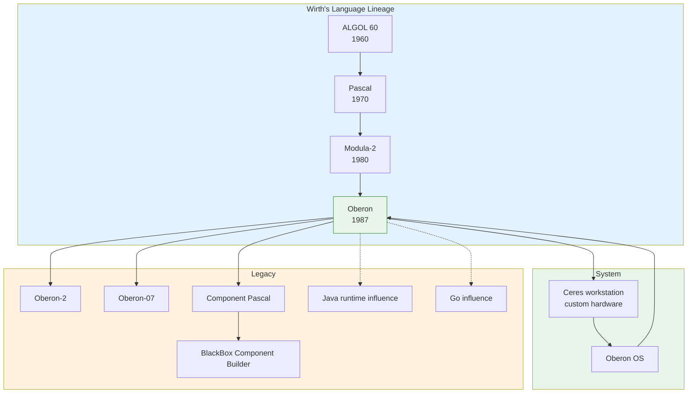

# Oberon

| | |
|---|---|
| **Year** | 1987 |
| **Creator(s)** | Niklaus Wirth (ETH Zurich) |
| **Paradigm(s)** | Imperative, structured, modular, object-based |
| **Typing** | Static, strong |
| **Platform** | Native (custom Ceres hardware), later general-purpose |
| **Key features** | GC on bare metal, modules, type extension, radical minimalism |
| **Major dialects** | Oberon-2, Oberon-07, Component Pascal |

---

## Contents

1. [Overview](#overview)
2. [Historical Context](#historical-context)
3. [Key Ideas](#key-ideas)
   - [Wirth's Line of Languages](#wirths-line-of-languages)
   - [Radical Minimalism](#radical-minimalism)
   - [Garbage Collection on Bare Metal](#garbage-collection-on-bare-metal)
   - [Modules and Type Extension](#modules-and-type-extension)
4. [Language Features](#language-features)
5. [Dialects and Variants](#dialects-and-variants)
6. [Influence](#influence)
7. [Strengths and Weaknesses](#strengths-and-weaknesses)
8. [Code Examples](#code-examples)
9. [Related Authors](#related-authors)
10. [Related Topics](#related-topics)
11. [Further Reading](#further-reading)

---

## Overview

Oberon is a systems programming language designed by Niklaus Wirth at ETH
Zurich in the 1980s. It is the culmination of Wirth's long quest for simplicity
in language design: each step from ALGOL to Pascal to Modula to Oberon reduced
the number of constructs in the grammar. Oberon was not merely a language — it
was the foundation of an entire computing environment, including the **Oberon
operating system**, which ran on custom hardware built at ETH.

Oberon demonstrated something that seemed radical at the time: a complete,
productive operating system could be written in a small, statically typed
language with garbage collection, running directly on bare metal.

## Historical Context



By the mid-1980s, Niklaus Wirth had already created ALGOL W, Pascal, and
Modula-2. At ETH Zurich he turned his attention to a new problem: how small and
simple could a complete system language be while still being usable for an
entire operating system?

The result was Oberon, first released in 1987. Wirth's team built custom
hardware — the **Ceres workstation** — specifically to run the Oberon operating
system, which was itself written almost entirely in Oberon. This was a rare
example of language, compiler, OS, and hardware co-designed together.

Oberon was shocking to many observers because it removed features that were
considered essential:
- no conventional object-oriented class hierarchy;
- no `FOR` loop;
- garbage collection inside a systems language.

Yet the system worked, and it worked well. Oberon offered a combined textual
and graphical user interface in which any text could become a command, near-
instant compilation, and dynamic module loading and unloading — all with
excellent performance for the era.

## Key Ideas

### Wirth's Line of Languages

Wirth's languages form a clear lineage of simplification. Each successor had a
smaller grammar than its predecessor:

```text
ALGOL 60 → Pascal → Modula-2 → Oberon
```

This trend is sometimes called the **"Wirth line"**: the deliberate removal of
redundant features rather than accumulation of new ones.

### Radical Minimalism

Oberon asks: "What is the smallest set of language features needed to build a
complete operating system and compiler?" The answer was surprisingly small.
Procedures, records, modules, and type extension replaced classes, inheritance,
and many control-flow constructs.

### Garbage Collection on Bare Metal

Oberon was not the first statically typed language with garbage collection —
Simula 67, ALGOL 68, and ML came earlier. However, it was the first **systems
language** to combine GC with the ability to run an operating system directly on
bare hardware. This proved that GC could be practical outside managed runtimes
and scripting languages.

### Modules and Type Extension

Oberon's module system controls visibility and dependencies explicitly. Its
type-extension mechanism (record extension) provides object-based polymorphism
without a full class system:

```oberon
TYPE
  Shape* = POINTER TO ShapeDesc;
  ShapeDesc = RECORD x, y: INTEGER END;
  Rectangle* = POINTER TO RectangleDesc;
  RectangleDesc = RECORD (ShapeDesc) w, h: INTEGER END;
```

## Language Features

- **Static strong typing** with module-level visibility.
- **Modules** as the primary unit of compilation and encapsulation.
- **Type extension** for safe, object-based polymorphism.
- **Procedure variables** for callbacks and delegates.
- **Garbage collection** built into the language runtime.
- **Dynamic module loading** — modules can be loaded and unloaded at runtime.

## Dialects and Variants

| Dialect | Year | Notes |
|---------|------|-------|
| Oberon | 1987 | Original language and OS |
| Oberon-2 | 1991 | Added type-bound procedures, more OOP-like features |
| Oberon-07 | 2007 | Revised, smaller language used in education |
| Component Pascal | 1997 | Oberon-2 descendant for component development |
| BlackBox Component Builder | 1990s | Commercial IDE based on Component Pascal; Byte "Best Development Software" award |

## Influence

Oberon's influence is larger than its direct usage:

| Area | Influence |
|------|-----------|
| **Java** | Sun Microsystems licensed the maximum Oberon material package and Jbed (a fast JVM for bare metal from Oberon Microsystems); this strongly influenced the Java runtime design. |
| **.NET / CLR** | Clemens Szyperski, who worked on Component Pascal and Oberon, later joined Microsoft and influenced the CLR design. |
| **Go** | Oberon's minimalism, fast compilation, module system, and systems orientation echo in Go. |
| **Component-based development** | BlackBox/Component Pascal pioneered component-builder ideas later seen in Delphi, Visual Basic, and .NET. |

## Strengths and Weaknesses

### Strengths

- **Minimal mental model** — small grammar, easy to learn and implement.
- **Fast compilation** — entire systems compile in seconds.
- **Safe systems programming** — strong typing plus GC on bare metal.
- **Dynamic module loading** — long before it became mainstream.
- **Educational clarity** — demonstrates how much can be done with little.

### Weaknesses

- **Sparse feature set** — can feel restrictive for large teams.
- **Limited commercial promotion** — Wirth was not interested in marketing.
- **Cooperative multitasking** in original Oberon OS.
- **Smaller ecosystem** than mainstream languages.

## Code Examples

```oberon
MODULE Hello;
  IMPORT Log;

  PROCEDURE Do*;
  BEGIN
    Log.String("Hello, Oberon!")
  END Do;

BEGIN
  Do
END Hello.
```

## Related Authors

- [Niklaus Wirth](../../authors/niklaus-wirth.md) — creator of Oberon

## Related Topics

- [Languages Genealogy](../../maps/languages-genealogy.md) — language family tree
- [Go](../go/index.md) — influenced by Oberon
- [ALGOL](../algol/index.md) — ancestor of Wirth's language line

## Further Reading

- Wirth & Gutknecht — *Project Oberon: The Design of an Operating System, a
  Compiler, and a Computer* (2013 edition)
- Wirth — *The Programming Language Oberon* (1990)
- [oberon.org](https://oberon.org/) — central collection of Oberon materials
- [blackboxframework.org](https://blackboxframework.org/) — BlackBox/Component
  Pascal community

---

See [Languages Index](../index.md) for other language profiles.
