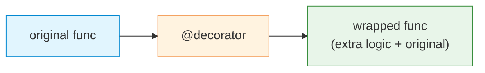

# Decorators

| Section | Content |
| :--- | :--- |
| **Description** | Decorators are a syntactic feature that allows modifying or enhancing functions and classes without changing their source code. A decorator is a callable that takes a function/class and returns a new one, often wrapping the original. |
| **API Purpose** | Cross-cutting concerns like logging, timing, caching, authentication, retry logic, and input validation. |
| **Terminology** | `@` syntax, wrapper, closure, `functools.wraps`, decorator factory, class decorator. |
| **Notes** | Use `functools.wraps` to preserve metadata (`__name__`, `__doc__`) of the original function. Decorators can be stacked, and they execute bottom-to-top. |



## Basic Decorator

```python
from functools import wraps

def timing(func):
    import time
    @wraps(func)
    def wrapper(*args, **kwargs):
        start = time.time()
        result = func(*args, **kwargs)
        print(f"{func.__name__} took {time.time() - start:.3f}s")
        return result
    return wrapper

@timing
def slow_function():
    import time
    time.sleep(0.1)
    return "done"

# Equivalent to: slow_function = timing(slow_function)
```

## Decorator with Arguments

```python
def repeat(times):
    def decorator(func):
        @wraps(func)
        def wrapper(*args, **kwargs):
            for _ in range(times):
                result = func(*args, **kwargs)
            return result
        return wrapper
    return decorator

@repeat(3)
def say_hello():
    print("Hello!")

# Equivalent to: say_hello = repeat(3)(say_hello)
```

## Class Decorator

```python
def singleton(cls):
    instances = {}
    @wraps(cls)
    def wrapper(*args, **kwargs):
        if cls not in instances:
            instances[cls] = cls(*args, **kwargs)
        return instances[cls]
    return wrapper

@singleton
class Database:
    def __init__(self):
        self.connection = "connected"

db1 = Database()
db2 = Database()
assert db1 is db2  # Same instance
```

## Built-in Decorators

| Decorator | Purpose |
|-----------|---------|
| `@staticmethod` | Method does not receive `self` |
| `@classmethod` | Method receives class as first arg |
| `@property` | Method becomes attribute-like getter |
| `@property.setter` | Define setter for property |
| `@property.deleter` | Define deleter for property |
| `@dataclass` | Auto-generate `__init__`, `__repr__`, etc. |
| `@lru_cache` | Memoization with least-recently-used eviction |

```python
class Circle:
    def __init__(self, radius):
        self._radius = radius

    @property
    def radius(self):
        return self._radius

    @radius.setter
    def radius(self, value):
        if value < 0:
            raise ValueError("Radius cannot be negative")
        self._radius = value

    @property
    def area(self):
        import math
        return math.pi * self._radius ** 2
```

---

Examples: [Functions](../../../examples/python/03-functions/README.md), [OOP/Modules](../../../examples/python/06-oop-modules/README.md)
