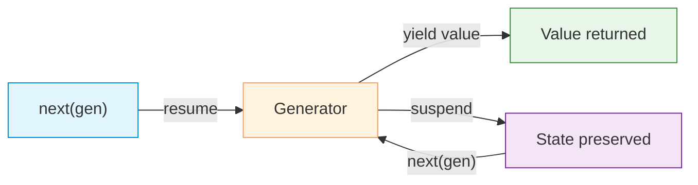

# Generators

| Section | Content |
| :--- | :--- |
| **Description** | Generators are iterators that produce values lazily, one at a time, using `yield`. They maintain state between calls, enabling memory-efficient processing of large or infinite sequences. |
| **API Purpose** | Lazy evaluation, memory-efficient iteration, and implementing custom iterators without the boilerplate of `__iter__`/`__next__`. |
| **Terminology** | `yield`, generator function, generator expression, `send()`, `throw()`, `close()`, `yield from`. |
| **Notes** | Generator functions pause execution at `yield` and resume on the next iteration. `yield from` delegates to another iterable/generator. Generators are single-use — once exhausted, they cannot be restarted. |



## Generator Function

```python
def count_up(n):
    i = 0
    while i < n:
        yield i
        i += 1

counter = count_up(3)
print(next(counter))  # 0
print(next(counter))  # 1
print(next(counter))  # 2
# next(counter) raises StopIteration
```

## Generator Expression

```python
# Memory efficient: only one value at a time
squares = (x * x for x in range(10_000_000))

# Can be consumed once
print(sum(squares))
# sum(squares)  # 0 — already exhausted
```

## yield from

```python
def flatten(nested):
    for item in nested:
        if isinstance(item, list):
            yield from flatten(item)  # delegate to sub-generator
        else:
            yield item

list(flatten([1, [2, [3, 4]], 5]))  # [1, 2, 3, 4, 5]
```

## Two-way Communication

```python
def accumulator():
    total = 0
    while True:
        value = yield total  # yield current total, receive value via send()
        if value is None:
            break
        total += value

acc = accumulator()
next(acc)           # prime the generator
print(acc.send(10))  # 10
print(acc.send(5))   # 15
print(acc.send(3))   # 18
acc.close()
```

## Comparison: List vs Generator

| Aspect | List Comprehension | Generator Expression |
|--------|-------------------|---------------------|
| Syntax | `[x for x in range(10)]` | `(x for x in range(10))` |
| Memory | Stores all elements | One element at a time |
| Iterations | Multiple | Single-use |
| Length | Known (`len()`) | Unknown |
| Indexing | Supported | Not supported |

```python
# List: all 10M numbers in memory
big_list = [x * x for x in range(10_000_000)]

# Generator: one number at a time
big_gen = (x * x for x in range(10_000_000))
```

---

Examples: [Data Structures](../../../examples/python/05-data-structures/README.md)
