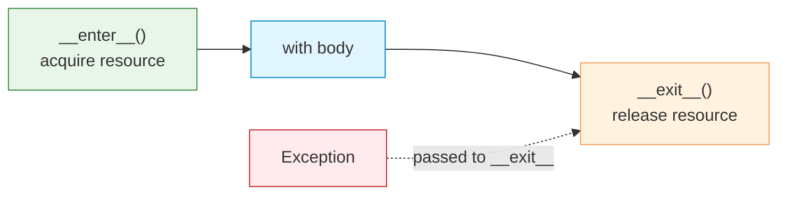

# Context Managers

| Section | Content |
| :--- | :--- |
| **Description** | Context managers provide a way to allocate and release resources precisely using the `with` statement. They guarantee cleanup (e.g., closing files, releasing locks) even if exceptions occur. |
| **API Purpose** | Resource management, ensuring acquisition and release are paired correctly. |
| **Terminology** | `with`, `__enter__`, `__exit__`, `@contextmanager`, `contextlib`, `suppress`, `redirect_stdout`. |
| **Notes** | The `__exit__` method receives exception info if one occurred; returning `True` suppresses it. `contextlib.contextmanager` lets you write generators instead of classes. `contextlib` provides useful utilities like `closing`, `suppress`, and `ExitStack`. |



## Class-based Context Manager

```python
class ManagedFile:
    def __init__(self, filename, mode):
        self.filename = filename
        self.mode = mode
        self.file = None

    def __enter__(self):
        self.file = open(self.filename, self.mode)
        return self.file

    def __exit__(self, exc_type, exc_val, exc_tb):
        if self.file:
            self.file.close()
        return False  # do not suppress exception

with ManagedFile("test.txt", "w") as f:
    f.write("Hello, World!")
# File is closed here, even if exception occurred
```

## @contextmanager Decorator

```python
from contextlib import contextmanager

@contextmanager
def managed_resource(name):
    print(f"Acquiring {name}")
    resource = {"name": name}
    try:
        yield resource
    finally:
        print(f"Releasing {name}")

with managed_resource("db_connection") as res:
    print(f"Using {res['name']}")
# Output:
# Acquiring db_connection
# Using db_connection
# Releasing db_connection
```

## Nested Context Managers

```python
with open("input.txt") as infile, open("output.txt", "w") as outfile:
    for line in infile:
        outfile.write(line.upper())
```

## contextlib Utilities

```python
from contextlib import suppress, redirect_stdout, ExitStack
import io

# Suppress specific exceptions
with suppress(FileNotFoundError):
    os.remove("maybe_missing.txt")

# Redirect stdout
f = io.StringIO()
with redirect_stdout(f):
    print("captured")
print(f.getvalue())  # "captured\n"

# Dynamic stack of context managers
with ExitStack() as stack:
    files = [stack.enter_context(open(fname)) for fname in filenames]
    # All files closed automatically when ExitStack exits
```

---

Examples: [Error Handling](../../../examples/python/08-error-handling/README.md)
