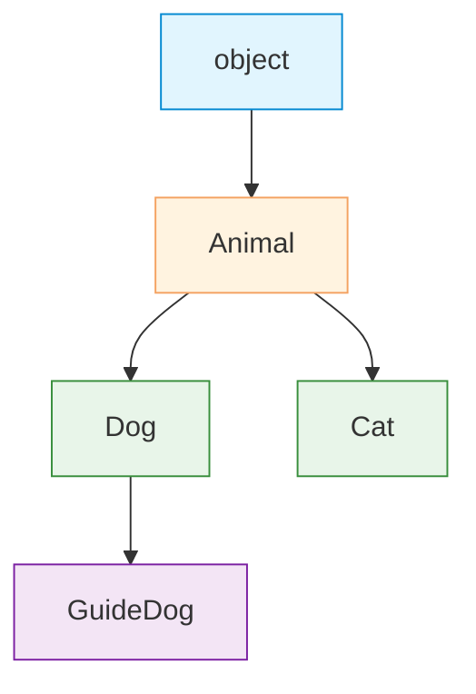

# Object-Oriented Programming

| Section | Content |
| :--- | :--- |
| **Description** | Python supports OOP with classes, inheritance, method overriding, and special methods (dunder methods). Classes are first-class objects, and everything in Python is an object with a type. |
| **API Purpose** | Encapsulating data and behavior, creating reusable blueprints, and implementing polymorphism. |
| **Terminology** | Class, instance, `self`, `__init__`, inheritance, method resolution order (MRO), `super()`, dunder methods, `@property`, `__slots__`. |
| **Notes** | Python supports multiple inheritance. MRO follows C3 linearization (accessible via `Class.__mro__`). Use `__slots__` to restrict attributes and reduce memory. All methods are virtual (no `final` by default). |



## Classes and Inheritance

```python
class Animal:
    def __init__(self, name):
        self.name = name

    def speak(self):
        raise NotImplementedError

    def __repr__(self):
        return f"{self.__class__.__name__}(name={self.name!r})"

class Dog(Animal):
    def __init__(self, name, breed):
        super().__init__(name)
        self.breed = breed

    def speak(self):
        return f"{self.name} says woof!"

class Cat(Animal):
    def speak(self):
        return f"{self.name} says meow!"

dog = Dog("Buddy", "Golden Retriever")
print(dog.speak())  # Buddy says woof!
```

## Dunder Methods

| Method | Purpose | Trigger |
|--------|---------|---------|
| `__init__` | Constructor | `Class()` |
| `__repr__` | Official string representation | `repr(obj)` |
| `__str__` | Informal string representation | `str(obj)`, `print()` |
| `__eq__` | Equality (`==`) | `a == b` |
| `__hash__` | Hash value | `hash(obj)`, `dict` key |
| `__len__` | Length | `len(obj)` |
| `__getitem__` | Index access | `obj[key]` |
| `__iter__` / `__next__` | Iterator protocol | `for x in obj` |
| `__enter__` / `__exit__` | Context manager | `with obj` |
| `__call__` | Callable instance | `obj()` |

```python
class Point:
    __slots__ = ("x", "y")  # restrict attributes, save memory

    def __init__(self, x, y):
        self.x = x
        self.y = y

    def __repr__(self):
        return f"Point({self.x}, {self.y})"

    def __eq__(self, other):
        if not isinstance(other, Point):
            return NotImplemented
        return self.x == other.x and self.y == other.y

    def __add__(self, other):
        return Point(self.x + other.x, self.y + other.y)

p1 = Point(1, 2)
p2 = Point(3, 4)
print(p1 + p2)  # Point(4, 6)
```

## Method Resolution Order (MRO)

```python
class A:
    def method(self):
        print("A")

class B(A):
    def method(self):
        print("B")
        super().method()

class C(A):
    def method(self):
        print("C")
        super().method()

class D(B, C):
    pass

D().method()
# B
# C
# A

print(D.__mro__)
# (<class 'D'>, <class 'B'>, <class 'C'>, <class 'A'>, <class 'object'>)
```

---

Examples: [OOP/Modules](../../../examples/python/06-oop-modules/README.md)
