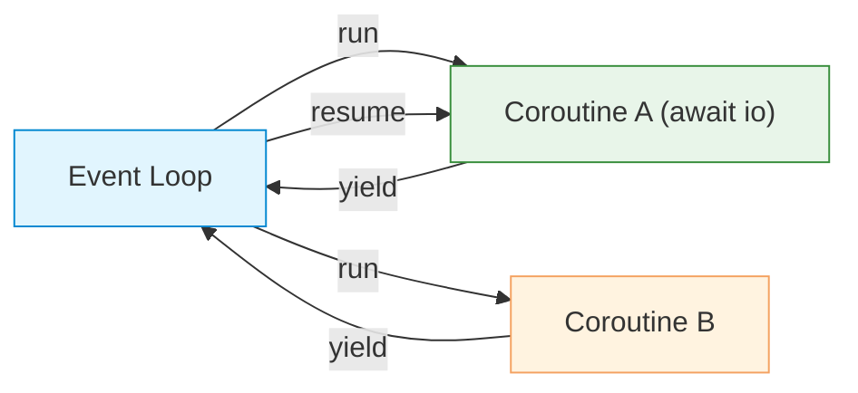

# Asyncio

| Section | Content |
| :--- | :--- |
| **Description** | `asyncio` is Python's standard library for writing concurrent code using the `async`/`await` syntax. It uses a single-threaded event loop to manage coroutines, enabling I/O-bound concurrency without threads. |
| **API Purpose** | High-performance I/O-bound concurrency: network servers, web clients, database connections. |
| **Terminology** | `async def`, `await`, coroutine, event loop, `asyncio.run`, `Task`, `Future`, `gather`, `create_task`. |
| **Notes** | `await` can only be used inside `async def` functions. `asyncio.gather` runs coroutines concurrently. `create_task` schedules a coroutine as a background task. The GIL is not a limitation for I/O-bound async code since it yields control during I/O waits. |



## Basic Coroutine

```python
import asyncio

async def say_hello():
    print("Hello")
    await asyncio.sleep(1)  # non-blocking sleep
    print("World")

asyncio.run(say_hello())
```

## Running Concurrently

```python
import asyncio

async def fetch_data(id, delay):
    print(f"Fetching {id}...")
    await asyncio.sleep(delay)
    print(f"Done {id}")
    return f"data-{id}"

async def main():
    # Run sequentially
    result1 = await fetch_data(1, 2)
    result2 = await fetch_data(2, 1)

    # Run concurrently
    results = await asyncio.gather(
        fetch_data(3, 2),
        fetch_data(4, 1),
        fetch_data(5, 1),
    )
    print(results)

asyncio.run(main())
```

## Tasks

```python
async def main():
    task1 = asyncio.create_task(fetch_data(1, 2))
    task2 = asyncio.create_task(fetch_data(2, 1))

    # Do other work while tasks run
    print("Tasks started")

    # Await results
    result1 = await task1
    result2 = await task2
    print(result1, result2)

asyncio.run(main())
```

## Async Context Managers and Iterators

```python
class AsyncConnection:
    async def __aenter__(self):
        await asyncio.sleep(0.1)  # simulate connection
        print("Connected")
        return self

    async def __aexit__(self, exc_type, exc, tb):
        print("Disconnected")

    async def __aiter__(self):
        self.count = 0
        return self

    async def __anext__(self):
        if self.count >= 3:
            raise StopAsyncIteration
        self.count += 1
        await asyncio.sleep(0.1)
        return f"item-{self.count}"

async def main():
    async with AsyncConnection() as conn:
        async for item in conn:
            print(item)

asyncio.run(main())
```

## Async vs Threading vs Multiprocessing

| Approach | Use Case | Overhead | GIL |
|----------|----------|----------|-----|
| `asyncio` | I/O-bound, many connections | Very low | Shared |
| `threading` | I/O-bound, blocking APIs | Medium | Shared |
| `multiprocessing` | CPU-bound | High | Bypassed |

---

Examples: [Concurrency](../../../examples/python/09-concurrency/README.md)
