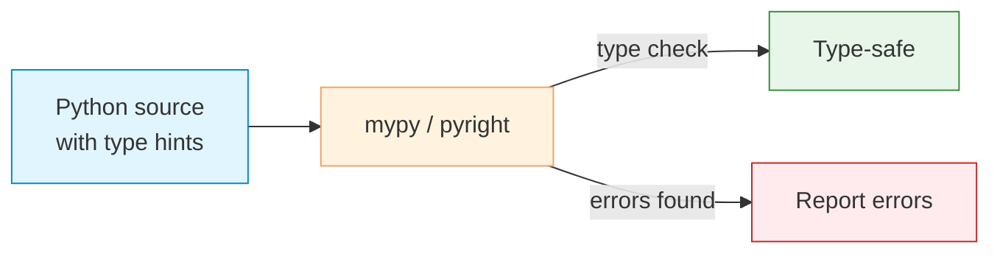

# Type Hints

| Section | Content |
| :--- | :--- |
| **Description** | Type hints (PEP 484+) allow annotating Python code with static types. They are not enforced at runtime but enable static analysis by tools like mypy, pyright, and IDE autocompletion. |
| **API Purpose** | Catching type errors before runtime, improving IDE support, documenting APIs, and enabling safer refactoring. |
| **Terminology** | `typing` module, `Optional`, `Union`, `List`, `Dict`, `Callable`, `TypeVar`, `Generic`, `Protocol`, `TypedDict`, `Final`, `Literal`. |
| **Notes** | Python 3.9+ supports built-in generic types (`list[int]` instead of `List[int]`). `typing.Protocol` enables structural subtyping ("duck typing" for static analysis). `TypedDict` specifies dict keys and value types. |



## Basic Type Hints

```python
# Python 3.9+ syntax
from typing import Optional, Union, Callable

def greet(name: str) -> str:
    return f"Hello, {name}!"

def find_user(user_id: int) -> Optional[dict]:
    # Returns dict or None
    ...

def process(value: Union[int, str]) -> str:
    # Accepts int or str
    return str(value)

# Callable
Predicate = Callable[[int], bool]

def filter_items(items: list[int], predicate: Predicate) -> list[int]:
    return [x for x in items if predicate(x)]
```

## Generic Types

```python
from typing import TypeVar, Generic

T = TypeVar("T")

class Stack(Generic[T]):
    def __init__(self) -> None:
        self._items: list[T] = []

    def push(self, item: T) -> None:
        self._items.append(item)

    def pop(self) -> T:
        return self._items.pop()

stack: Stack[int] = Stack()
stack.push(10)
```

## Protocol (Structural Subtyping)

```python
from typing import Protocol

class Drawable(Protocol):
    def draw(self) -> None: ...

class Circle:
    def draw(self) -> None:
        print("Drawing circle")

# Circle implicitly satisfies Drawable (no explicit inheritance)
def render(item: Drawable) -> None:
    item.draw()

render(Circle())  # OK
```

## TypedDict

```python
from typing import TypedDict

class Movie(TypedDict):
    name: str
    year: int
    rating: float

movie: Movie = {
    "name": "Inception",
    "year": 2010,
    "rating": 8.8,
}
# mypy catches: movie["yeer"]  # error: TypedDict key not found
```

## Advanced Features

```python
from typing import Literal, Final, TypeAlias

# Literal types
Direction = Literal["north", "south", "east", "west"]

def move(direction: Direction) -> None: ...

# Final
PI: Final[float] = 3.14159
# PI = 3.14  # mypy error

# TypeAlias
Vector = list[float]
Matrix = list[Vector]
```

---

Examples: [Variables & Types](../../../examples/python/02-variables-and-types/README.md)
