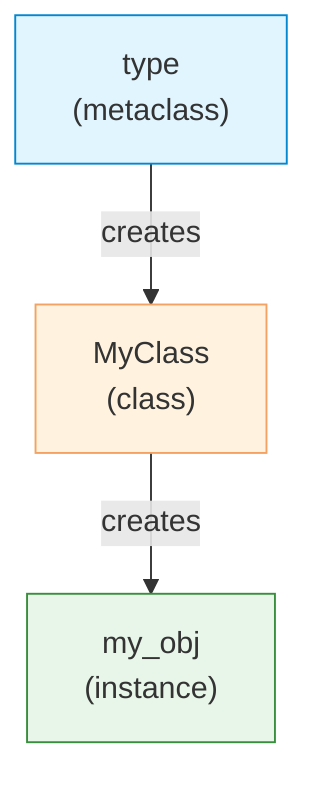

# Metaclasses

| Section | Content |
| :--- | :--- |
| **Description** | Metaclasses are the classes of classes. They control class creation, allowing customization of how classes are instantiated, named, and structured. `type` is the default metaclass for all Python classes. |
| **API Purpose** | Frameworks and libraries that need to enforce conventions, auto-register subclasses, validate class definitions, or inject methods dynamically. |
| **Terminology** | Metaclass, `type`, `__new__`, `__init__`, `__call__`, `__metaclass__`, `class Meta(type)`. |
| **Notes** | Use metaclasses sparingly — most needs can be satisfied with class decorators or `__init_subclass__`. Django ORM and SQLAlchemy use metaclasses to map classes to database tables. |



## Basic Metaclass

```python
class RegistryMeta(type):
    registry = {}

    def __new__(mcs, name, bases, namespace):
        cls = super().__new__(mcs, name, bases, namespace)
        if name != "BaseModel":  # don't register the base
            mcs.registry[name] = cls
        return cls

class BaseModel(metaclass=RegistryMeta):
    pass

class User(BaseModel):
    pass

class Product(BaseModel):
    pass

print(RegistryMeta.registry)
# {'User': <class '__main__.User'>, 'Product': <class '__main__.Product'>}
```

## __init_subclass__ Alternative

```python
# Modern alternative to metaclasses (Python 3.6+)
class PluginBase:
    plugins = []

    def __init_subclass__(cls, **kwargs):
        super().__init_subclass__(**kwargs)
        cls.plugins.append(cls)

class EmailPlugin(PluginBase):
    pass

class SmsPlugin(PluginBase):
    pass

print(PluginBase.plugins)
# [<class '__main__.EmailPlugin'>, <class '__main__.SmsPlugin'>]
```

## Custom Metaclass with Validation

```python
class ValidatorMeta(type):
    def __new__(mcs, name, bases, namespace):
        # Validate all attributes start with lowercase
        for attr_name in namespace:
            if not attr_name.startswith("_") and not attr_name.islower():
                raise TypeError(
                    f"Attribute '{attr_name}' must be lowercase"
                )
        return super().__new__(mcs, name, bases, namespace)

class MyClass(metaclass=ValidatorMeta):
    valid_attr = 1
    # InvalidAttr = 2  # TypeError at class definition time
```

## When to Use What

| Technique | Use Case |
|-----------|----------|
| Class decorator | Simple class modification |
| `__init_subclass__` | Auto-register subclasses, simple hooks |
| Metaclass | Complex class creation logic, DSLs |
| Descriptor | Custom attribute access |

---

Examples: [OOP/Modules](../../../examples/python/06-oop-modules/README.md)
