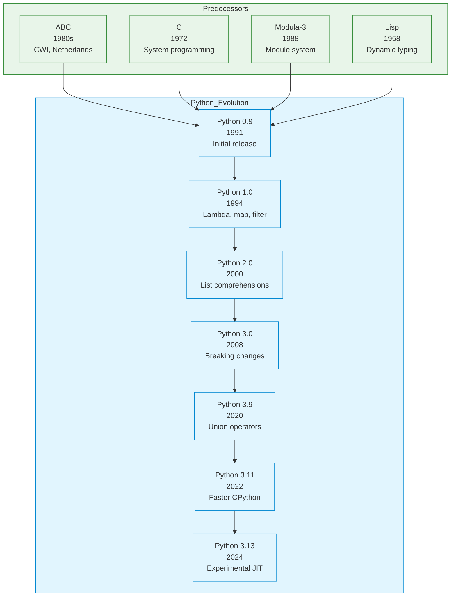

# Python

|                     |                                                             |
|---------------------|-------------------------------------------------------------|
| **Year**            | 1991                                                        |
| **Creator(s)**      | Guido van Rossum                                            |
| **Paradigm(s)**     | Multi-paradigm (OOP, functional, imperative)                |
| **Typing**          | Dynamic, strong                                             |
| **Platform**        | CPython, PyPy, Jython, IronPython                           |
| **Key features**    | Readable syntax, dynamic typing, extensive standard library |
| **Current version** | Python 3.13 (2024)                                          |

---

## Contents

1. [Overview](#overview)
2. [Historical Context](#historical-context)
3. [Language Evolution](#language-evolution)
4. [Key Ideas](#key-ideas)
   - [Readability Matters](#readability-matters)
   - [Dynamic Typing](#dynamic-typing)
   - [Everything is an Object](#everything-is-an-object)
   - [Indentation-Based Syntax](#indentation-based-syntax)
   - [Batteries Included](#batteries-included)
5. [Core Features](#core-features)
   - [Lists and Comprehensions](#lists-and-comprehensions)
   - [Dictionaries](#dictionaries)
   - [Functions and Closures](#functions-and-closures)
   - [Classes and Inheritance](#classes-and-inheritance)
   - [Decorators](#decorators)
   - [Generators and Iterators](#generators-and-iterators)
   - [Context Managers](#context-managers)
6. [Modern Python Features](#modern-python-features)
7. [Type Hints](#type-hints)
8. [Ecosystem and Tools](#ecosystem-and-tools)
9. [Influence](#influence)
10. [Strengths and Weaknesses](#strengths-and-weaknesses)
11. [Code Examples](#code-examples)
12. [Related Authors](#related-authors)
13. [Related Topics](#related-topics)
14. [Further Reading](#further-reading)

---

## Overview

Python is a high-level, interpreted programming language created by
Guido van Rossum and first released in 1991. Its design philosophy
emphasizes code **readability** with its notable use of significant
indentation.

Python's distinctive characteristics:
- **"Readability counts"** — clear, explicit syntax over clever code
- **"There should be one— and preferably only one —obvious way to do it"**
- **Dynamic typing** — flexibility at the cost of some compile-time safety
- **Everything is an object** — functions, classes, modules are first-class
- **Extensive standard library** — "batteries included"

Python powers:
- **Data science and ML** — NumPy, Pandas, scikit-learn, PyTorch, TensorFlow
- **Web development** — Django, Flask, FastAPI
- **Automation and scripting** — system administration, DevOps tooling
- **Education** — often the first language taught in CS courses

---

## Historical Context



### From ABC to Python

Guido van Rossum created Python at CWI in the Netherlands as a successor
to the ABC language. ABC was designed for teaching programming but was
too limited and had an unusual syntax. Python kept ABC's emphasis on
usability while making it a practical, general-purpose language.

### Python 2 to Python 3

The transition from Python 2 to Python 3 (2008) was a major, non-backward-
compatible release designed to fix fundamental design flaws:

| Aspect | Python 2 | Python 3 |
|--------|----------|----------|
| **Strings** | ASCII by default (`str`), Unicode as separate (`unicode`) | Unicode by default (`str`) |
| **Print** | Statement (`print "hello"`) | Function (`print("hello")`) |
| **Division** | Integer by default (`3/2 = 1`) | True division (`3/2 = 1.5`) |
| **`range`** | Returns list | Returns iterator |
| **`input`** | Evaluates input as code | Returns string |

---

## Language Evolution

| Version | Year | Key additions |
|---------|------|---------------|
| **0.9** | 1991 | Initial release at CWI |
| **1.0** | 1994 | Lambda, `map`, `filter`, `reduce` (functional features) |
| **1.6** | 2000 | Unicode support |
| **2.0** | 2000 | List comprehensions, garbage collection |
| **2.2** | 2001 | Unification of types and classes, generators |
| **2.4** | 2004 | Decorators, generator expressions |
| **2.5** | 2006 | `with` statement (context managers) |
| **2.7** | 2010 | Last Python 2 release (EOL: 2020) |
| **3.0** | 2008 | Major redesign, Unicode strings |
| **3.1** | 2009 | Ordered dictionaries |
| **3.3** | 2012 | `yield from`, namespace packages |
| **3.5** | 2015 | `async`/`await`, type hints |
| **3.6** | 2016 | f-strings, async generators |
| **3.7** | 2018 | Dataclasses, postponed evaluation of annotations |
| **3.8** | 2019 | Walrus operator (`:=`), positional-only parameters |
| **3.9** | 2020 | Dictionary merge operators (`|`, `|=`) |
| **3.10** | 2021 | Structural pattern matching (`match`/`case`) |
| **3.11** | 2022 | Exception groups, `Self` type, significant speedup |
| **3.12** | 2023 | f-string improvements, type parameter syntax |
| **3.13** | 2024 | Experimental JIT compiler, better error messages |

---

## Key Ideas

### Readability Matters

Python's most distinctive feature is its emphasis on readability:

```python
# Clear, explicit code
def calculate_total(items):
    total = 0
    for item in items:
        total += item.price
    return total

# Versus overly "clever" code (discouraged)
from operator import add
from functools import reduce
calculate_total = lambda i: reduce(add, (x.price for x in i), 0)
```

### Dynamic Typing

Variables are not declared with types:

```python
# Same variable can hold different types
x = 42          # int
x = "hello"     # str
x = [1, 2, 3]   # list
x = Person()    # custom object

# Duck typing: if it walks like a duck...
def greet(obj):
    if hasattr(obj, 'name'):
        return f"Hello, {obj.name}!"
    return "Hello, stranger!"
```

### Everything is an Object

```python
# Functions are first-class objects
def add(x, y):
    return x + y

# Can be assigned
my_func = add

# Can be passed
def apply(func, x, y):
    return func(x, y)

# Can have attributes
my_func.description = "Adds two numbers"

# Classes themselves are objects
class MyClass:
    pass

MyClass.custom_attr = "hello"
```

### Indentation-Based Syntax

Python uses indentation for block structure instead of braces:

```python
def process(items):
    if not items:
        return []

    # Indentation defines block
    result = []
    for item in items:
        if item > 0:
            result.append(item * 2)

    return result

# SyntaxError: inconsistent use of tabs and spaces
# SyntaxError: unindent does not match any outer indentation level
```

### Batteries Included

Python's standard library is extensive:

```python
# JSON handling (no external dependency needed)
import json
data = json.loads('{"name": "Alice"}')

# HTTP requests
import urllib.request
response = urllib.request.urlopen('https://example.com')

# Date/time manipulation
from datetime import datetime, timedelta
tomorrow = datetime.now() + timedelta(days=1)

# Regular expressions
import re
emails = re.findall(r'\S+@\S+', text)
```

---

## Core Features

### Lists and Comprehensions

List comprehensions are Pythonic way to create lists:

```python
# Traditional loop
squares = []
for i in range(10):
    squares.append(i * i)

# List comprehension
squares = [i * i for i in range(10)]

# With filtering
evens = [i for i in range(20) if i % 2 == 0]

# Nested
matrix = [[i * j for j in range(5)] for i in range(5)]
```

### Dictionaries

Hash maps with syntactic sugar:

```python
# Literal syntax
person = {
    "name": "Alice",
    "age": 30,
    "city": "NYC"
}

# Dictionary comprehension
squares = {x: x * x for x in range(10)}

# Default values (since 3.9)
merged = dict1 | dict2
dict1 |= dict2

# Common operations
person.get("name", "Unknown")  # Safe access
"age" in person                 # Check key
person.keys()                   # View of keys
person.values()                 # View of values
```

### Functions and Closures

```python
# Default arguments
def greet(name, greeting="Hello"):
    return f"{greeting}, {name}!"

# *args and **kwargs
def func(*args, **kwargs):
    print(args)    # tuple
    print(kwargs)  # dict

func(1, 2, 3, a=4, b=5)
# (1, 2, 3)
# {'a': 4, 'b': 5}

# Closures capture their environment
def make_multiplier(factor):
    def multiply(x):
        return x * factor  # factor is captured
    return multiply

times3 = make_multiplier(3)
times3(5)  # 15
```

### Classes and Inheritance

```python
# Class definition
class Animal:
    def __init__(self, name):
        self.name = name

    def speak(self):
        raise NotImplementedError

# Inheritance
class Dog(Animal):
    def speak(self):
        return f"{self.name} says woof!"

class Cat(Animal):
    def speak(self):
        return f"{self.name} says meow!"

# Multiple inheritance
class FlyingDog(Dog, FlyingMixin):
    def speak(self):
        return super().speak() + " while flying!"
```

### Decorators

Functions that modify other functions:

```python
# Simple decorator
def timing(func):
    import time
    def wrapper(*args, **kwargs):
        start = time.time()
        result = func(*args, **kwargs)
        print(f"{func.__name__} took {time.time() - start:.3f}s")
        return result
    return wrapper

@timing
def slow_function():
    import time
    time.sleep(0.1)
    return "done"

# Equivalent to:
# slow_function = timing(slow_function)

# Decorator with arguments
def repeat(times):
    def decorator(func):
        def wrapper(*args, **kwargs):
            for _ in range(times):
                func(*args, **kwargs)
        return wrapper
    return decorator

@repeat(3)
def say_hello():
    print("Hello!")
```

### Generators and Iterators

Lazy evaluation via generators:

```python
# Generator function
def count_up(n):
    for i in range(n):
        yield i

# Consumes one value at a time
counter = count_up(1_000_000)
next(counter)  # 0
next(counter)  # 1

# Generator expression
squares = (i * i for i in range(10_000_000))

# Memory efficient: only one value in memory at a time
sum(squares)  # Processes lazily
```

### Context Managers

Resource management via `with` statement:

```python
# Built-in context manager
with open('file.txt', 'r') as f:
    content = f.read()
# File automatically closed here

# Custom context manager
from contextlib import contextmanager

@contextmanager
def timer():
    import time
    start = time.time()
    yield
    print(f"Elapsed: {time.time() - start:.3f}s")

with timer():
    # Do work
    time.sleep(0.1)
# Prints elapsed time
```

---

## Modern Python Features

### F-strings (Python 3.6+)

```python
name = "Alice"
age = 30

# Old style
print("Hello, %s! You are %d years old." % (name, age))

# str.format()
print("Hello, {}! You are {} years old.".format(name, age))

# f-string (Python 3.6+)
print(f"Hello, {name}! You are {age} years old.")

# Expressions
print(f"Next year you'll be {age + 1}")

# Debugging (Python 3.8+)
print(f"{name=}, {age=}")
# name='Alice', age=30
```

### Pattern Matching (Python 3.10+)

```python
def describe(value):
    match value:
        case 0:
            return "zero"
        case int(n) if n > 0:
            return f"positive integer: {n}"
        case str(s):
            return f"string: {s}"
        case [x, y]:
            return f"two-item list: {x}, {y}"
        case {"name": name, **rest}:
            return f"dict with name {name}"
        case _:
            return "something else"
```

### Walrus Operator (Python 3.8+)

```python
# Assignment expression
while (line := file.readline()) != "":
    process(line)

# In list comprehensions
numbers = [16, 36, 49, 64]
roots = [n for x in numbers if (n := x ** 0.5) > 5]
# [6.0, 7.0, 8.0]
```

---

## Type Hints (Python 3.5+)

Optional static typing via type hints:

```python
from typing import List, Dict, Optional, Union

# Basic types
def greet(name: str) -> str:
    return f"Hello, {name}!"

# Collections
def get_scores() -> List[int]:
    return [85, 92, 78]

def get_mapping() -> Dict[str, int]:
    return {"alice": 85, "bob": 92}

# Optional and Union
def find_user(id: int) -> Optional[User]:
    # Returns User or None
    ...

def process(value: Union[int, str]) -> str:
    return str(value)

# Type alias
UserId = int
UserIdOrEmail = Union[UserId, str]

def get_user(id_or_email: UserIdOrEmail) -> User:
    ...

# Generic types (Python 3.9+)
from collections.abc import Sequence

def first(items: Sequence[T]) -> T:
    return items[0]
```

> Type hints are **optional** and not enforced at runtime. They're used
> by type checkers (mypy, pyright) and IDEs for better tooling.

---

## Ecosystem and Tools

### Package Management

| Tool | Purpose |
|------|---------|
| **pip** | Package installer |
| **virtualenv / venv** | Virtual environments |
| **conda** | Environment + package manager (data science) |
| **poetry** | Modern dependency management |
| **uv** | Fast, modern package installer |

```bash
# Create virtual environment
python -m venv venv
source venv/bin/activate  # Windows: venv\Scripts\activate

# Install packages
pip install numpy pandas

# Freeze requirements
pip freeze > requirements.txt

# Install from requirements
pip install -r requirements.txt
```

### Major Frameworks

| Framework | Domain |
|-----------|--------|
| **Django** | Full-stack web framework |
| **Flask** | Micro web framework |
| **FastAPI** | Async web, API-first |
| **NumPy** | Numerical computing |
| **Pandas** | Data analysis |
| **scikit-learn** | Machine learning |
| **PyTorch / TensorFlow** | Deep learning |
| **Selenium / Playwright** | Browser automation |

### Testing

| Tool | Purpose |
|------|---------|
| **pytest** | Testing framework |
| **unittest** | Standard library testing |
| **hypothesis** | Property-based testing |
| **coverage** | Code coverage |

---

## Influence

### Languages Inspired

| Language | Python influence |
|-----------|-----------------|
| **Boo** | Python-like syntax on .NET |
| **Cobra** | Python-inspired .NET language |
| **Julia** | Semicolon-free, interactive |
| **Swift** | Optional chaining, similar feel |
| **Rust** | List comprehensions (limited) |

### Design Philosophy Impact

Python's emphasis on readability influenced:
- **Modern API design** — clarity over cleverness
- **Documentation practices** — readable docstrings
- **Teaching** — Python as first language
- **Scientific computing** — REPL-driven exploration

---

## Strengths and Weaknesses

### Strengths

| Strength | Detail |
|----------|--------|
| **Readability** | Clear, explicit syntax, English-like |
| **Fast development** | Less boilerplate, REPL-driven |
| **Ecosystem** | PyPI has 500,000+ packages |
| **Community** | Large, welcoming, extensive tutorials |
| **Data science** | De facto standard for ML/AI |
| **Cross-platform** | Runs everywhere, easy deployment |
| **Integration** | Easy to call C/C++ libraries |

### Weaknesses

| Weakness | Detail |
|----------|--------|
| **Performance** | Interpreted, slower than compiled languages |
| **GIL** | Global Interpreter Lock limits true parallelism |
| **Dynamic typing** | Runtime errors vs compile-time safety |
| **Packaging** | Historically fragmented, improving |
| **Version 2/3 split** | Legacy code requires migration |
| **Memory usage** | Higher than C/Rust for some workloads |

> **GIL (Global Interpreter Lock):** CPython's GIL prevents multiple
> native threads from executing Python bytecodes at once. For CPU-bound
> parallel work, use `multiprocessing` or libraries like NumPy that
> release the GIL.

---

## Code Examples

See [`examples/python/`](../../../examples/python/index.md) for runnable code:

| Example                                                                           | Description                         |
|-----------------------------------------------------------------------------------|-------------------------------------|
| [01 Hello World](../../../examples/python/01-hello-world/README.md)               | Basic syntax, print, input          |
| [02 Variables & Types](../../../examples/python/02-variables-and-types/README.md) | Dynamic typing, type hints          |
| [03 Functions](../../../examples/python/03-functions/README.md)                   | Functions, closures, decorators     |
| [04 Control Flow](../../../examples/python/04-control-flow/README.md)             | Loops, conditionals, match          |
| [05 Data Structures](../../../examples/python/05-data-structures/README.md)       | Lists, dicts, sets, comprehensions  |
| [06 OOP/Modules](../../../examples/python/06-oop-modules/README.md)               | Classes, inheritance, modules       |
| [07 FP Features](../../../examples/python/07-fp-features/README.md)               | Lambdas, map/filter/reduce          |
| [08 Error Handling](../../../examples/python/07-error-handling/README.md)         | Try/except, context managers        |
| [09 Concurrency](../../../examples/python/08-concurrency/README.md)               | Threading, asyncio, multiprocessing |
| [10 Testing](../../../examples/python/09-testing/README.md)                       | pytest, fixtures, mocks             |

---

## Related Authors

- [Guido van Rossum](../../authors/guido-van-rossum.md) — creator of Python
- [Barry Warsaw](../../authors/barry-warsaw.md) — early contributor
- [Raymond Hettinger](../../authors/raymond-hettinger.md) — core developer

---

## Related Topics

- [Functional Programming](../../topics/functional/index.md) — Python's FP features
- [Type Systems](../../topics/types/index.md) — dynamic vs static typing
- [Paradigms](../../topics/paradigms/index.md) — Python as multi-paradigm
- [Process](../../topics/process/index.md) — Python's tooling and packaging

---

## Further Reading

| Author             | Title                           | Year    | Focus                        |
|--------------------|---------------------------------|---------|------------------------------|
| van Rossum         | *The Python Language Reference* | Ongoing | Language specification       |
| Ramalho            | *Fluent Python*                 | 2015    | Idiomatic, advanced Python   |
| Beazley & Jones    | *Python Cookbook*               | 2013    | Recipes, best practices      |
| C. Alvarado et al. | *Composing Programs*            | 2016    | CS education in Python       |
| Lutz               | *Learning Python*               | 2013    | Comprehensive beginner guide |

---

## Quotes

> "Python is an experiment in how much freedom programmers need.
> Too much freedom and nobody can read another's code; too little and
> expressiveness is endangered."
> — Guido van Rossum

> "Readability counts."
> — The Zen of Python (PEP 20)

> "Simple is better than complex."
> — The Zen of Python (PEP 20)

---

*See [Languages Index](../index.md) for other language profiles.*