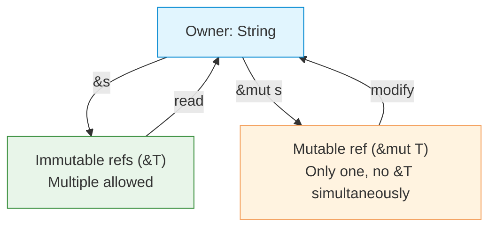

# Borrowing

| Section | Content |
| :--- | :--- |
| **Description** | Borrowing allows temporary access to a value without taking ownership. Immutable references (`&T`) allow multiple readers; mutable references (`&mut T`) allow exactly one writer. The borrow checker enforces these rules at compile time. |
| **API Purpose** | Accessing data without transferring ownership, enabling safe sharing and mutation. |
| **Terminology** | Reference (`&T`), mutable reference (`&mut T`), borrow checker, dangling reference, aliasing. |
| **Notes** | The borrow checker prevents data races: either multiple immutable references OR one mutable reference, never both simultaneously. References must always be valid (no dangling pointers). |



## Immutable Borrowing

```rust
fn main() {
    let s = String::from("hello");
    let r1 = &s;
    let r2 = &s;     // Multiple immutable refs OK
    println!("{} {}", r1, r2);
}
```

## Mutable Borrowing

```rust
fn main() {
    let mut s = String::from("hello");
    let r = &mut s;
    r.push_str(" world");
    println!("{}", r);
    // println!("{}", s);  // ERROR: s is borrowed mutably
}
```

## The Rules

```rust
// This is OK — multiple immutable references
let r1 = &s;
let r2 = &s;

// This is OK — single mutable reference
let r = &mut s;

// This is NOT OK — mixed
let r1 = &s;
let r2 = &mut s;  // ERROR: cannot borrow as mutable
```

## Borrowing in Functions

```rust
fn calculate_length(s: &str) -> usize {
    s.len()  // borrow ends here, s is not dropped
}

fn append_world(s: &mut String) {
    s.push_str(" world");
}

fn main() {
    let mut s = String::from("hello");
    let len = calculate_length(&s);
    append_world(&mut s);
    println!("{} (length: {})", s, len);
}
```

## Slices

Slices borrow a portion of a collection:

```rust
let s = String::from("hello world");
let hello = &s[0..5];   // immutable borrow of a substring
let world = &s[6..11];

let arr = [1, 2, 3, 4, 5];
let slice = &arr[1..3];  // [2, 3]
```

---

Examples: [Variables & Types](../../../examples/rust/02-variables-and-types/README.md)
