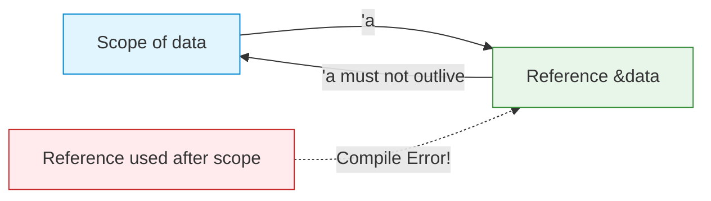

# Lifetimes

| Section | Content |
| :--- | :--- |
| **Description** | Lifetimes are compile-time annotations that ensure references never outlive the data they point to. They prevent dangling references by tracking how long each reference is valid. |
| **API Purpose** | Guaranteeing reference validity across function boundaries and data structures. |
| **Terminology** | Lifetime parameter (`'a`), lifetime elision, `'static`, scope, dangling reference. |
| **Notes** | Most lifetimes are inferred via elision rules. Explicit lifetimes are needed when the compiler cannot determine relationships, such as when a function returns a reference derived from input parameters. |



## Explicit Lifetimes

```rust
// The returned reference lives as long as the shorter of x and y
fn longest<'a>(x: &'a str, y: &'a str) -> &'a str {
    if x.len() > y.len() { x } else { y }
}

fn main() {
    let s1 = String::from("long");
    let result;
    {
        let s2 = String::from("x");
        result = longest(&s1, &s2);
        println!("{}", result);  // OK — s2 still in scope
    }
    // println!("{}", result);  // ERROR: s2 dropped
}
```

## Lifetime Elision

The compiler infers lifetimes in common patterns:

```rust
// These three are equivalent:
fn first_word(s: &str) -> &str { ... }
fn first_word<'a>(s: &'a str) -> &str { ... }
fn first_word<'a>(s: &'a str) -> &'a str { ... }  // fully explicit
```

## Lifetimes in Structs

```rust
// A struct holding a reference must declare a lifetime
struct Excerpt<'a> {
    part: &'a str,
}

fn main() {
    let text = String::from("hello world");
    let excerpt = Excerpt { part: &text[0..5] };
    println!("{}", excerpt.part);
} // excerpt and text dropped here
```

## Static Lifetime

`'static` means the reference lives for the entire program duration:

```rust
let s: &'static str = "I live forever";  // string literal

fn returns_static() -> &'static str {
    "this is static"
}
```

## Lifetime Bounds

```rust
// T must live at least as long as 'a
type Ref<'a, T: 'a> = &'a T;

// Generic with lifetime bound
fn longest_with_announcement<'a, T>(x: &'a str, y: &'a str, ann: T) -> &'a str
where
    T: std::fmt::Display,
{
    println!("Announcement: {}", ann);
    if x.len() > y.len() { x } else { y }
}
```

---

Examples: [Variables & Types](../../../examples/rust/02-variables-and-types/README.md)
