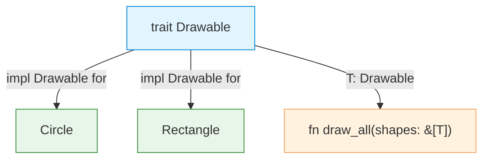

# Traits

| Section | Content |
| :--- | :--- |
| **Description** | Traits define shared behavior (similar to interfaces in other languages). They declare method signatures that types can implement, enabling polymorphism and code reuse. Traits are the foundation of Rust's abstraction system. |
| **API Purpose** | Defining contracts, enabling polymorphism, and writing generic code over shared capabilities. |
| **Terminology** | Trait, `impl`, trait bound (`T: Trait`), associated type, default implementation, trait object (`dyn Trait`). |
| **Notes** | Traits can have default method implementations. The `#[derive]` macro auto-implements common traits (`Debug`, `Clone`, `PartialEq`, etc.). Trait objects (`dyn Trait`) enable runtime polymorphism at the cost of dynamic dispatch. |



## Defining and Implementing Traits

```rust
trait Drawable {
    fn draw(&self);
    fn describe(&self) -> String {
        String::from("A drawable shape")
    }
}

struct Circle { radius: f64 }

impl Drawable for Circle {
    fn draw(&self) {
        println!("Drawing circle with r={}", self.radius);
    }
}
```

## Trait Bounds

```rust
fn draw_all<T: Drawable>(shapes: &[T]) {
    for shape in shapes {
        shape.draw();
    }
}

// Multiple bounds
fn process<T: Drawable + Clone + Debug>(item: T) { ... }

// Where clause for complex bounds
fn process2<T>(item: T)
where
    T: Drawable + Clone,
{
    ...
}
```

## Associated Types

```rust
trait Iterator {
    type Item;  // associated type
    fn next(&mut self) -> Option<Self::Item>;
}

struct Counter { count: u32 }

impl Iterator for Counter {
    type Item = u32;
    fn next(&mut self) -> Option<Self::Item> {
        self.count += 1;
        Some(self.count)
    }
}
```

## Common Standard Traits

| Trait | Purpose |
|-------|---------|
| `Clone` | Explicit deep copy (`clone()`) |
| `Copy` | Implicit bitwise copy |
| `Debug` | Format with `{:?}` |
| `Display` | Format with `{}` |
| `PartialEq` / `Eq` | Equality comparison |
| `PartialOrd` / `Ord` | Ordering comparison |
| `Default` | Default value construction |
| `Drop` | Cleanup on scope exit |
| `Sized` | Known size at compile time |

```rust
#[derive(Debug, Clone, PartialEq)]
struct Point { x: i32, y: i32 }
```

## Trait Objects

```rust
// Dynamic dispatch — type erased at runtime
fn draw_anything(item: &dyn Drawable) {
    item.draw();
}

// Must be behind pointer (&, Box, Arc, etc.)
let shapes: Vec<Box<dyn Drawable>> = vec![
    Box::new(Circle { radius: 1.0 }),
    Box::new(Rectangle { w: 2.0, h: 3.0 }),
];
```

---

Examples: [OOP/Modules](../../../examples/rust/06-oop-modules/README.md)
