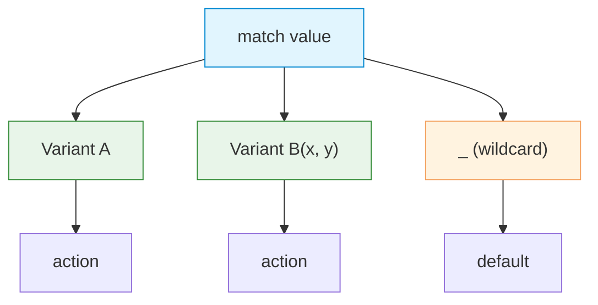

# Pattern Matching

| Section | Content |
| :--- | :--- |
| **Description** | Rust's `match` expression provides exhaustive, expressive pattern matching on enums, structs, literals, and guards. The compiler ensures all cases are handled, preventing runtime omissions. |
| **API Purpose** | Destructuring data, handling all cases of an enum, and writing expressive conditional logic. |
| **Terminology** | `match`, pattern, arm, guard (`if`), binding, refutable/irrefutable, `if let`, `while let`, `@` binding. |
| **Notes** | Patterns must be exhaustive — the compiler rejects `match` expressions that don't cover all variants. `_` is a wildcard that matches any value. The `if let` and `while let` constructs provide concise partial matching. |



## Match Expression

```rust
enum Message {
    Quit,
    Move { x: i32, y: i32 },
    Write(String),
    ChangeColor(u8, u8, u8),
}

fn process(msg: Message) {
    match msg {
        Message::Quit => println!("Quit"),
        Message::Move { x, y } => println!("Move to {}, {}", x, y),
        Message::Write(text) => println!("Text: {}", text),
        Message::ChangeColor(r, g, b) => {
            println!("Color: {}, {}, {}", r, g, b)
        }
    }
}
```

## Guards and Multiple Patterns

```rust
match number {
    1 => println!("One"),
    2 | 3 | 5 | 7 => println!("Prime"),
    n if n % 2 == 0 => println!("Even: {}", n),
    _ => println!("Odd: {}", number),
}
```

## If Let and While Let

```rust
// Concise partial matching
if let Message::Write(text) = msg {
    println!("Writing: {}", text);
}

// Iterate while pattern matches
let mut stack = vec![1, 2, 3];
while let Some(top) = stack.pop() {
    println!("{}", top);
}
```

## Destructuring

```rust
struct Point { x: i32, y: i32 }

let p = Point { x: 0, y: 7 };
let Point { x, y } = p;  // destructuring

// Destructure with match
match p {
    Point { x, y: 0 } => println!("On x-axis at {}", x),
    Point { x: 0, y } => println!("On y-axis at {}", y),
    Point { x, y } => println!("At {}, {}", x, y),
}

// Ignore fields with ..
match p {
    Point { x, .. } => println!("x is {}", x),
}
```

## @ Binding

```rust
enum Message {
    Hello { id: i32 },
}

match msg {
    Message::Hello {
        id: id_variable @ 3..=7,
    } => println!("Found id in range: {}", id_variable),
    Message::Hello { id: 10..=12 } => println!("Found id in another range"),
    Message::Hello { id } => println!("Found some other id: {}", id),
}
```

---

Examples: [Data Structures](../../../examples/rust/05-data-structures/README.md)
