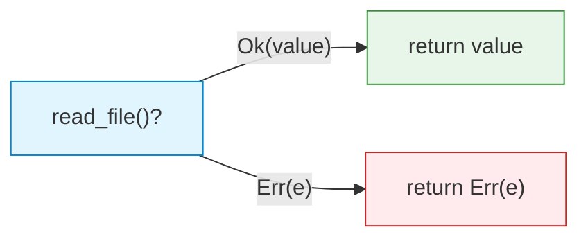

# Error Handling

| Section | Content |
| :--- | :--- |
| **Description** | Rust uses the `Result<T, E>` and `Option<T>` enums for error handling instead of exceptions. The `?` operator provides ergonomic error propagation, while `panic!` is reserved for unrecoverable errors. |
| **API Purpose** | Explicit, composable error handling with compile-time safety. |
| **Terminology** | `Result<T, E>`, `Option<T>`, `Ok`, `Err`, `Some`, `None`, `?` operator, `unwrap`, `expect`, `panic!`, `match`. |
| **Notes** | The `?` operator automatically returns `Err` early or unwraps `Ok`. `unwrap` and `expect` are convenient for prototyping but panic on error. `Result` implements `From` for automatic error conversion. |



## Result

```rust
use std::fs::File;
use std::io::{self, Read};

fn read_file(path: &str) -> Result<String, io::Error> {
    let mut file = File::open(path)?;  // ? propagates Err early
    let mut contents = String::new();
    file.read_to_string(&mut contents)?;
    Ok(contents)
}

fn main() {
    match read_file("hello.txt") {
        Ok(contents) => println!("{}", contents),
        Err(e) => eprintln!("Error: {}", e),
    }
}
```

## Option

```rust
fn find_char(s: &str, c: char) -> Option<usize> {
    s.find(c)
}

fn main() {
    let result = find_char("hello", 'e');
    
    // Pattern match
    match result {
        Some(index) => println!("Found at {}", index),
        None => println!("Not found"),
    }
    
    // Or use methods
    let index = result.unwrap_or(0);
    let value = result.map(|i| i * 2);
}
```

## The `?` Operator

```rust
fn read_config() -> Result<Config, Box<dyn std::error::Error>> {
    let file = std::fs::read_to_string("config.json")?;
    let config: Config = serde_json::from_str(&file)?;
    Ok(config)
}

// In main with anyhow
fn main() -> anyhow::Result<()> {
    let config = read_config()?;
    println!("{:?}", config);
    Ok(())
}
```

## Converting Errors

```rust
#[derive(Debug)]
enum AppError {
    Io(std::io::Error),
    Parse(std::num::ParseIntError),
}

impl From<std::io::Error> for AppError {
    fn from(e: std::io::Error) -> Self { AppError::Io(e) }
}

impl From<std::num::ParseIntError> for AppError {
    fn from(e: std::num::ParseIntError) -> Self { AppError::Parse(e) }
}

fn do_stuff() -> Result<i32, AppError> {
    let s = std::fs::read_to_string("num.txt")?;  // io::Error -> AppError
    let n: i32 = s.trim().parse()?;                // ParseIntError -> AppError
    Ok(n)
}
```

## Panic

```rust
// Unrecoverable error — aborts the current thread
panic!("Something went wrong!");

// Assert conditions
assert!(x > 0, "x must be positive");
assert_eq!(a, b);

// unwrap/expect for prototyping
let file = File::open("config.txt").expect("config.txt must exist");
```

---

Examples: [Error Handling](../../../examples/rust/07-error-handling/README.md)
