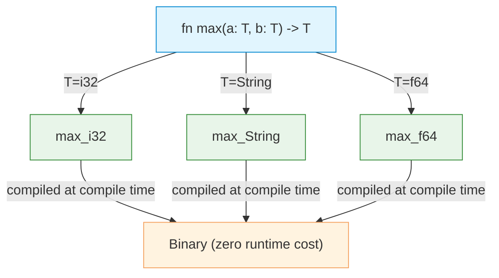

# Generics

| Section | Content |
| :--- | :--- |
| **Description** | Generics enable writing code that works with any type while maintaining compile-time type safety. Rust uses monomorphization — generating specialized code for each concrete type at compile time, resulting in zero runtime cost. |
| **API Purpose** | Writing reusable data structures and algorithms without sacrificing performance or type safety. |
| **Terminology** | Type parameter (`T`), trait bound, monomorphization, associated type, const generics, generic associated types (GATs). |
| **Notes** | Every concrete instantiation of a generic produces a separate compiled version. The `where` clause provides cleaner syntax for complex bounds. Const generics allow parameterizing by constant values (e.g., array size). |



## Generic Functions

```rust
fn largest<T: PartialOrd>(list: &[T]) -> &T {
    let mut largest = &list[0];
    for item in list {
        if item > largest {
            largest = item;
        }
    }
    largest
}

fn main() {
    let nums = vec![1, 5, 3];
    println!("{}", largest(&nums));  // T = i32

    let chars = vec!['a', 'z', 'm'];
    println!("{}", largest(&chars));  // T = char
}
```

## Generic Structs

```rust
struct Point<T> {
    x: T,
    y: T,
}

impl<T> Point<T> {
    fn x(&self) -> &T { &self.x }
}

// Specialized impl for a specific type
impl Point<f32> {
    fn distance_from_origin(&self) -> f32 {
        (self.x.powi(2) + self.y.powi(2)).sqrt()
    }
}
```

## Generic Enums

```rust
enum Option<T> {
    Some(T),
    None,
}

enum Result<T, E> {
    Ok(T),
    Err(E),
}
```

## Multiple Type Parameters

```rust
struct KeyValue<K, V> {
    key: K,
    value: V,
}

fn swap<T, U>(a: T, b: U) -> (U, T) {
    (b, a)
}
```

## Const Generics

```rust
struct Array<T, const N: usize> {
    data: [T; N],
}

impl<T: Default, const N: usize> Array<T, N> {
    fn new() -> Self {
        Self { data: [T::default(); N] }
    }
}

let arr: Array<i32, 5> = Array::new();  // N = 5
```

---

Examples: [FP Features](../../../examples/rust/07-fp-features/README.md)
