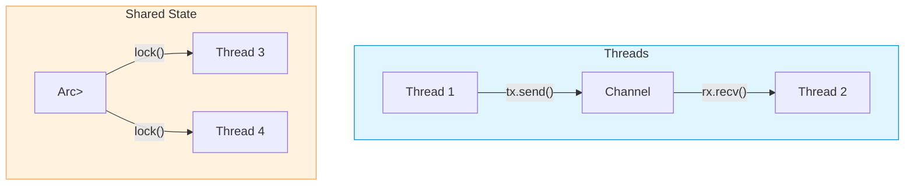

# Concurrency

| Section | Content |
| :--- | :--- |
| **Description** | Rust's ownership and type system prevent data races at compile time. `Send` and `Sync` traits mark types that can be safely transferred or shared between threads. Message passing via channels and shared state via `Arc<Mutex<T>>` are the two primary concurrency patterns. |
| **API Purpose** | Writing safe, concurrent code with compile-time guarantees against data races. |
| **Terminology** | `std::thread`, `join`, `move` closure, `mpsc` channel, `Arc`, `Mutex`, `RwLock`, `Send`, `Sync`, `Atomic*`. |
| **Notes** | `Send`: safe to transfer ownership to another thread. `Sync`: safe to share references between threads (`&T` is `Send` if `T: Sync`). The compiler automatically implements these for types composed only of `Send`/`Sync` fields. |



## Spawning Threads

```rust
use std::thread;

fn main() {
    let handle = thread::spawn(|| {
        println!("Hello from spawned thread!");
    });

    println!("Hello from main thread!");
    handle.join().unwrap();  // wait for thread to finish
}
```

## Move Closures

```rust
let v = vec![1, 2, 3];

let handle = thread::spawn(move || {
    println!("Vector: {:?}", v);  // v moved into thread
});

// println!("{}", v);  // ERROR: v was moved
handle.join().unwrap();
```

## Message Passing

```rust
use std::sync::mpsc;
use std::thread;

fn main() {
    let (tx, rx) = mpsc::channel();

    thread::spawn(move || {
        tx.send("hello from thread").unwrap();
    });

    let msg = rx.recv().unwrap();
    println!("{}", msg);
}
```

## Shared State

```rust
use std::sync::{Arc, Mutex};
use std::thread;

fn main() {
    let counter = Arc::new(Mutex::new(0));
    let mut handles = vec![];

    for _ in 0..10 {
        let counter = Arc::clone(&counter);
        let handle = thread::spawn(move || {
            let mut num = counter.lock().unwrap();
            *num += 1;
        });
        handles.push(handle);
    }

    for handle in handles {
        handle.join().unwrap();
    }

    println!("Result: {}", *counter.lock().unwrap());
}
```

## Atomic Types

```rust
use std::sync::atomic::{AtomicUsize, Ordering};

static COUNTER: AtomicUsize = AtomicUsize::new(0);

COUNTER.fetch_add(1, Ordering::Relaxed);
```

| Ordering | Description |
|----------|-------------|
| `Relaxed` | No ordering guarantees, fastest |
| `Acquire` / `Release` | Synchronize-with relationship |
| `SeqCst` | Sequential consistency, strictest |

---

Examples: [Concurrency](../../../examples/rust/08-concurrency/README.md)
