# Rust

| | |
|---|---|
| **Year** | 2010 |
| **Creator(s)** | Graydon Hoare (Mozilla Research) |
| **Paradigm(s)** | Multi-paradigm (functional, imperative, OOP-ish) |
| **Typing** | Static, affine (ownership) |
| **Platform** | Native (LLVM-based) |
| **Key features** | Ownership, borrow checker, zero-cost abstractions, pattern matching |
| **Current version** | Rust 1.83 (2024) |

---

## Contents

1. [Overview](#overview)
2. [Historical Context](#historical-context)
3. [Key Ideas](#key-ideas)
   - [Ownership](#ownership)
     - [Drop Flags](#drop-flags)
   - [Borrowing and References](#borrowing-and-references)
     - [Aliasing Models: Stacked vs. Tree Borrows](#aliasing-models-stacked-vs-tree-borrows)
     - [Strict Provenance](#strict-provenance)
   - [Lifetimes](#lifetimes)
   - [Zero-Cost Abstractions](#zero-cost-abstractions)
     - [Compilation Pipeline](#compilation-pipeline)
     - [MIR: Basic Blocks and the Borrow Checker](#mir-basic-blocks-and-the-borrow-checker)
   - [Pattern Matching](#pattern-matching)
4. [Key Features In Depth](#key-features-in-depth)
   - [01. Ownership](#01-ownership)
   - [02. Borrowing](#02-borrowing)
   - [03. Lifetimes](#03-lifetimes)
   - [04. Traits](#04-traits)
   - [05. Pattern Matching](#05-pattern-matching)
   - [06. Error Handling](#06-error-handling)
   - [07. Generics](#07-generics)
   - [08. Concurrency](#08-concurrency)
5. [Core Features](#core-features)
   - [Structs and Enums](#structs-and-enums)
     - [Niche Optimization](#niche-optimization)
   - [Traits](#traits)
   - [Error Handling](#error-handling)
   - [Generics](#generics)
     - [Monomorphization](#monomorphization)
   - [Iterators and Closures](#iterators-and-closures)
   - [Concurrency](#concurrency)
6. [Modern Rust Features](#modern-rust-features)
   - [Async/Await](#asyncawait-rust-139)
     - [Compiler Lowering: async → state machine](#compiler-lowering-async-state-machine)
   - [Const Generics](#const-generics-rust-151)
   - [Const Evaluation](#const-evaluation)
   - [Let-Else](#let-else-rust-165)
6. [Ecosystem and Tools](#ecosystem-and-tools)
7. [Influence](#influence)
8. [Strengths and Weaknesses](#strengths-and-weaknesses)
9. [Code Examples](#code-examples)
10. [Related Authors](#related-authors)
11. [Related Topics](#related-topics)
12. [Further Reading](#further-reading)

---

## Overview

Rust is a systems programming language focused on **safety, concurrency, and
performance**. Created by Graydon Hoare in 2010 and sponsored by Mozilla,
Rust provides memory safety without garbage collection through its novel
**ownership system**.

Rust's distinctive characteristics:
- **Memory safety without GC** — compile-time guarantees via ownership
- **Fearless concurrency** — data races caught at compile time
- **Zero-cost abstractions** — high-level code compiles to efficient machine code
- **Pattern matching** — expressive, exhaustive destructuring
- **Cargo** — integrated package manager and build tool

Rust powers:
- **Firefox** — Stylo (CSS engine), WebRender
- **Servo** — experimental browser engine
- **Linux kernel** — since 6.1 (2022), first non-C language
- **Infrastructure** — AWS, Cloudflare, Microsoft Azure
- **WebAssembly** — leading language for Wasm targets

---

## Historical Context

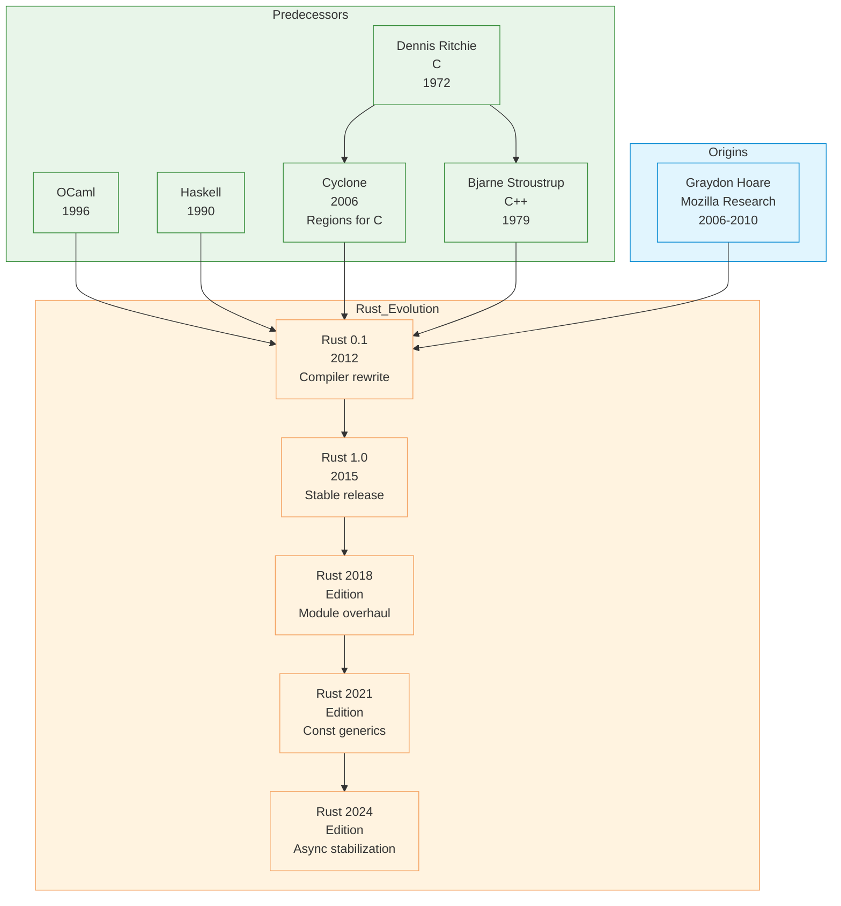

### The Problem Rust Solves

Rust was created to address memory safety issues in C++ while maintaining
control and performance:

| Issue | C++ | Rust |
|-------|-----|------|
| **Use after free** | Undefined behavior | Compile-time error |
| **Dangling pointers** | Undefined behavior | Compile-time error |
| **Data races** | Undefined behavior | Compile-time error |
| **Null pointer** | Segfault / UB | `Option<T>` type |
| **Memory leaks** | Possible (manual) | Compile-time detected |
| **Performance** | Manual management | Same as C/C++ |

---

## Key Ideas

### Ownership

Each value has a single **owner**; when the owner goes out of scope,
the value is dropped:

```rust
// Simple ownership transfer (move)
let s1 = String::from("hello");
let s2 = s1;  // s1 is moved, no longer valid
// println!("{}", s1);  // Error: use of moved value

// Copy types (implement Copy trait)
let x = 5;
let y = x;  // x is copied, still valid
println!("{}", x);  // OK
```

**Ownership Rules:**
1. Each value has an owner
2. There can only be one owner at a time
3. When the owner goes out of scope, the value is dropped

Dropping is governed by the `Drop` trait, whose `drop` method runs automatically
when a value goes out of scope. For composite values where ownership of fields
can be transferred independently, the compiler tracks **drop flags** to decide
which fields still need dropping at scope exit.

#### Drop Flags

Partial moves mean `drop` cannot always be decided statically for every field.
The compiler inserts hidden boolean **drop flags** into the stack frame (outside
`size_of`); at scope exit each field's flag is consulted, and LLVM usually
elides the check entirely when the result is provable.

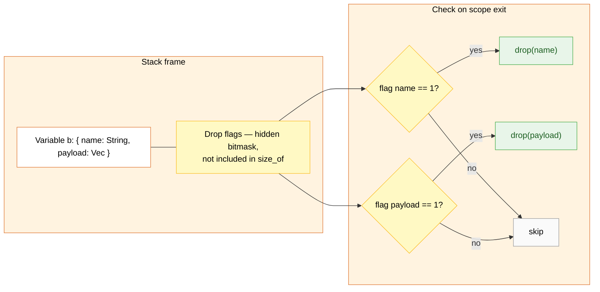

### Borrowing and References

You can **borrow** a value without taking ownership:

```rust
// Immutable borrow (multiple allowed)
let s = String::from("hello");
let r1 = &s;  // OK
let r2 = &s;  // OK
// let r3 = &mut s;  // Error: cannot borrow as mutable

// Mutable borrow (only one allowed)
let mut s = String::from("hello");
let r1 = &mut s;
r1.push_str(" world");
// let r2 = &s;  // Error: cannot borrow as immutable
```

**Borrow Checker Rules:**
- Any number of immutable borrows OR exactly one mutable borrow
- Borrows must last no longer than the owner

#### Aliasing Models: Stacked vs. Tree Borrows

Rust's aliasing rules give LLVM `noalias` annotations so it can optimize
aggressively (similar to C's `restrict`, but stricter). The original
**Stacked Borrows** model proved too strict for legitimate raw-pointer
code, so Rust is migrating to the more permissive **Tree Borrows** model
based on a tree of borrow provenances.

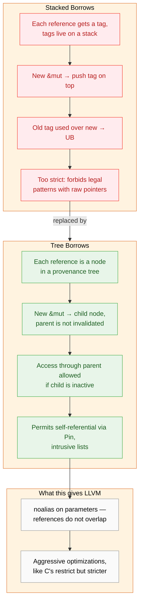

#### Strict Provenance

Casting a pointer to `usize` and back loses **provenance** and can become
silent UB under `-O2` because LLVM's alias analysis assumes that distinct
provenances never refer to the same object. **Strict Provenance** replaces
such casts with `.addr()` / `.with_addr()`, keeping provenance attached
so alias analysis stays sound.

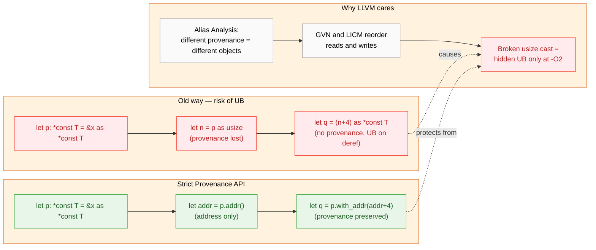

### Lifetimes

Lifetimes ensure references remain valid:

```rust
// Explicit lifetime annotation
fn longest<'a>(x: &'a str, y: &'a str) -> &'a str {
    if x.len() > y.len() { x } else { y }
}

// Lifetime elision (compiler infers)
fn first_word(s: &str) -> &str {
    let bytes = s.as_bytes();
    for (i, &byte) in bytes.iter().enumerate() {
        if byte == b' ' {
            return &s[0..i];
        }
    }
    &s[..]
}

// Static lifetime
let s: &'static str = "I live forever";
```

### Zero-Cost Abstractions

High-level features compile to efficient code:

```rust
// Iterator: high-level, no runtime overhead
fn sum_squares(numbers: &[i32]) -> i32 {
    numbers.iter()
        .map(|x| x * x)
        .sum()
}
// Compiles to same code as hand-written loop

// Generics: monomorphization at compile time
fn identity<T>(x: T) -> T { x }
// Compiles to specialized versions for each type used
```

#### Compilation Pipeline

Rust compiles through several well-separated stages. The frontend lowers
source to HIR and MIR; the borrow checker, const evaluator and drop-flag
insertion all run on MIR; LLVM then optimizes and emits a native binary.
MIRI is a separate interpreter over MIR used in tests to catch undefined
behavior that the borrow checker cannot.

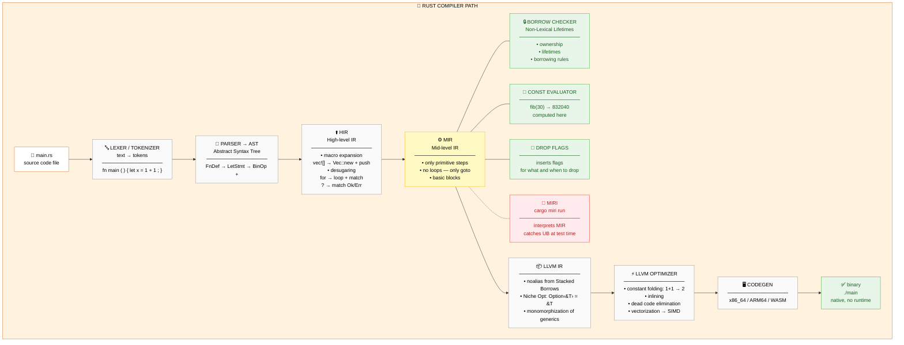

#### MIR: Basic Blocks and the Borrow Checker

MIR is a control-flow graph of **basic blocks**, each ending in an explicit
terminator (`goto`, `switchInt`, `return`, `drop`). A `while` loop becomes
four blocks; the borrow checker reasons over this graph, which is exactly
why **NLL** (Non-Lexical Lifetimes) accepts patterns the old AST-level
checker rejected.

```rust
const fn fib(n: u32) -> u64 {
    let (mut a, mut b) = (0u64, 1u64);
    let mut i = 0;
    while i < n { let t = a + b; a = b; b = t; i += 1; }
    a
}
```

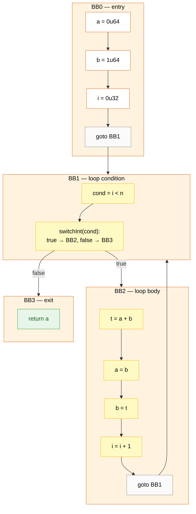

After borrow checking, MIR is lowered to LLVM IR where the same graph
structure appears as `br`, `switch` and `ret` instructions.

### Pattern Matching

Exhaustive, expressive pattern matching:

```rust
enum Message {
    Quit,
    Move { x: i32, y: i32 },
    Write(String),
    ChangeColor(i32, i32, i32),
}

fn process(msg: Message) {
    match msg {
        Message::Quit => println!("Quit"),
        Message::Move { x, y } => println!("Move to {}, {}", x, y),
        Message::Write(text) => println!("{}", text),
        Message::ChangeColor(r, g, b) => println!("Color: {}, {}, {}", r, g, b),
    }
}

// If-let for partial matching
if let Message::Write(text) = msg {
    println!("Writing: {}", text)
}

// While-let for iteration
while let Some(i) = iterator.next() {
    println!("{}", i);
}
```

---

## Key Features In Depth

### 01. Ownership

| Section | Content |
| :--- | :--- |
| **Description** | Each value has exactly one owner; when the owner goes out of scope, the value is dropped. |
| **API Purpose** | Memory safety without garbage collection. |
| **Terminology** | Owner, move, copy, clone, `Drop` trait. |

Read more: **[Detailed description and examples](./01-ownership.md)**  
Examples: [Variables & Types](../../../examples/rust/02-variables-and-types/README.md)

---

### 02. Borrowing

| Section | Content |
| :--- | :--- |
| **Description** | Temporary access to a value without taking ownership. |
| **API Purpose** | Safe sharing and mutation of data. |
| **Terminology** | Reference (`&T`), mutable reference (`&mut T`), borrow checker. |

Read more: **[Detailed description and examples](./02-borrowing.md)**  
Examples: [Variables & Types](../../../examples/rust/02-variables-and-types/README.md)

---

### 03. Lifetimes

| Section | Content |
| :--- | :--- |
| **Description** | Compile-time annotations ensuring references never outlive their data. |
| **API Purpose** | Guaranteeing reference validity across function boundaries. |
| **Terminology** | Lifetime parameter (`'a`), elision, `'static`. |

Read more: **[Detailed description and examples](./03-lifetimes.md)**  
Examples: [Variables & Types](../../../examples/rust/02-variables-and-types/README.md)

---

### 04. Traits

| Section | Content |
| :--- | :--- |
| **Description** | Shared behavior definitions that types implement implicitly. |
| **API Purpose** | Polymorphism and code reuse through contracts. |
| **Terminology** | Trait, `impl`, trait bound, associated type, `dyn Trait`. |

Read more: **[Detailed description and examples](./04-traits.md)**  
Examples: [OOP/Modules](../../../examples/rust/06-oop-modules/README.md)

---

### 05. Pattern Matching

| Section | Content |
| :--- | :--- |
| **Description** | Exhaustive matching on enums, structs, literals, and guards. |
| **API Purpose** | Destructuring data and handling all cases. |
| **Terminology** | `match`, arm, guard, `if let`, `while let`. |

Read more: **[Detailed description and examples](./05-pattern-matching.md)**  
Examples: [Data Structures](../../../examples/rust/05-data-structures/README.md)

---

### 06. Error Handling

| Section | Content |
| :--- | :--- |
| **Description** | `Result` and `Option` enums with the `?` operator for propagation. |
| **API Purpose** | Explicit, composable error handling. |
| **Terminology** | `Result<T, E>`, `Option<T>`, `?`, `unwrap`, `panic!`. |

Read more: **[Detailed description and examples](./06-error-handling.md)**  
Examples: [Error Handling](../../../examples/rust/07-error-handling/README.md)

---

### 07. Generics

| Section | Content |
| :--- | :--- |
| **Description** | Type-safe code reuse with zero runtime cost via monomorphization. |
| **API Purpose** | Reusable data structures and algorithms. |
| **Terminology** | Type parameter, trait bound, const generics, monomorphization. |

Read more: **[Detailed description and examples](./07-generics.md)**  
Examples: [FP Features](../../../examples/rust/07-fp-features/README.md)

---

### 08. Concurrency

| Section | Content |
| :--- | :--- |
| **Description** | Fearless concurrency via ownership — data races prevented at compile time. |
| **API Purpose** | Safe concurrent programming with `Send` and `Sync` traits. |
| **Terminology** | `thread`, `move` closure, `mpsc`, `Arc`, `Mutex`, `Send`, `Sync`. |

Read more: **[Detailed description and examples](./08-concurrency.md)**  
Examples: [Concurrency](../../../examples/rust/08-concurrency/README.md)

---

## Core Features

### Structs and Enums

```rust
// Struct with named fields
struct Point {
    x: f64,
    y: f64,
}

// Tuple struct
struct Color(i32, i32, i32);

// Unit-like struct
struct Unit;

// Enum with data variants
enum Option<T> {
    Some(T),
    None,
}

enum Result<T, E> {
    Ok(T),
    Err(E),
}

// Pattern matching with struct
let p = Point { x: 0.0, y: 0.0 };
let Point { x, y } = p;  // Destructuring

// Enum with methods
impl Option<i32> {
    fn unwrap_or_default(self) -> i32 {
        match self {
            Some(v) => v,
            None => 0,
        }
    }
}
```

#### Niche Optimization

Rust enums store their discriminant in unused bit patterns ("niches") of
their payload whenever possible. The result: `Option<&T>` is the size of
one pointer (`None` is the null address), and `Option<NonZeroU8>` is one
byte. The same trick stacks recursively — `Option<Option<bool>>` still
fits in a single byte.

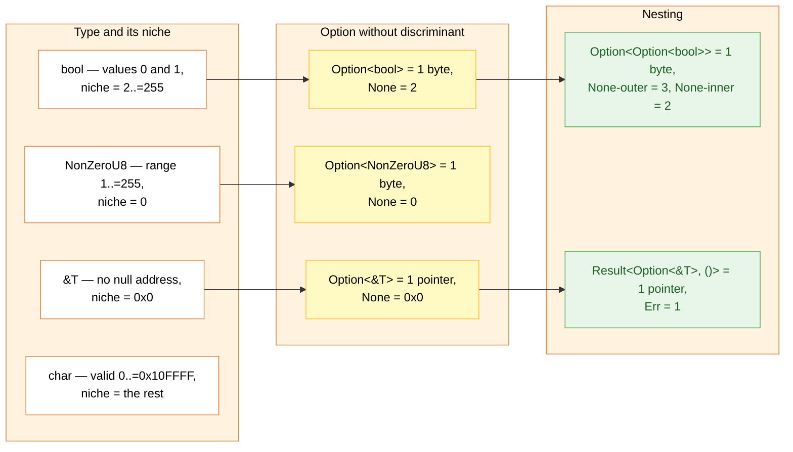

Across crate boundaries the compiler treats foreign layouts as **unstable**,
so niche optimization only applies when the outer enum has variants with
no payload. A wrapper that adds a non-trivial variant pays a separate
discriminant byte instead.

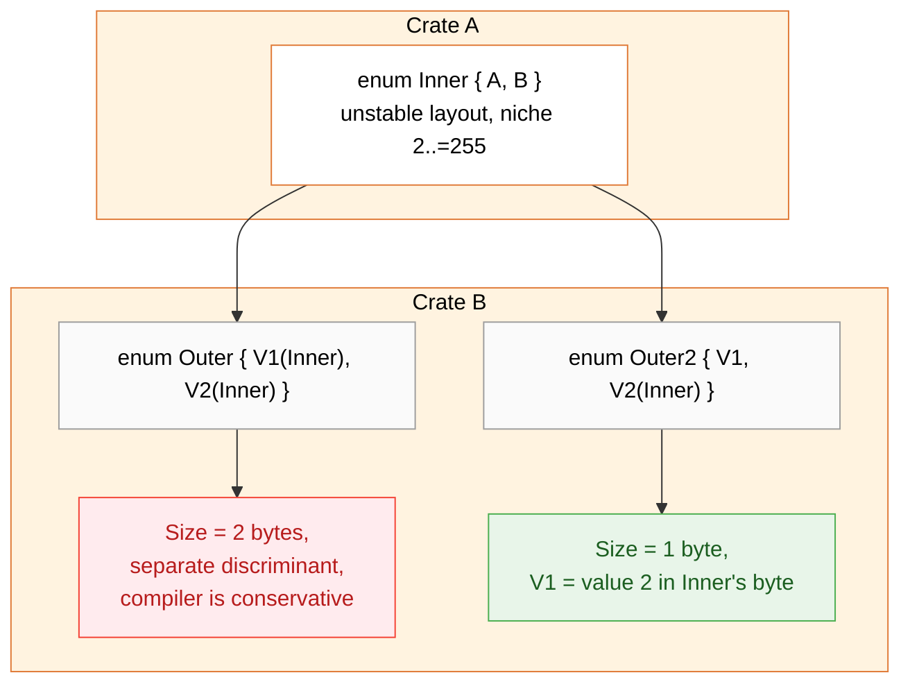

### Traits

Rust's way of sharing behavior (like interfaces/type classes):

```rust
// Trait definition
trait Drawable {
    fn draw(&self);
    fn area(&self) -> f64;
}

// Implementation for type
struct Circle {
    radius: f64,
}

impl Drawable for Circle {
    fn draw(&self) {
        println!("Drawing circle r={}", self.radius);
    }

    fn area(&self) -> f64 {
        std::f64::consts::PI * self.radius * self.radius
    }
}

// Trait bounds (generics with constraints)
fn draw_all<T: Drawable>(shapes: &[T]) {
    for shape in shapes {
        shape.draw();
    }
}

// Or "where" clause
fn draw_all2<T>(shapes: &[T])
where
    T: Drawable,
{
    // ...
}

// Default implementation
trait Summary {
    fn summarize(&self) -> String {
        String::from("(Read more...)")
    }
}

// Associated types (type family)
trait Iterator {
    type Item;
    fn next(&mut self) -> Option<Self::Item>;
}
```

### Error Handling

No exceptions — explicit `Result` and `Option`:

```rust
// Returning errors
fn read_file(path: &str) -> Result<String, std::io::Error> {
    let content = std::fs::read_to_string(path)?;
    Ok(content)
}

// Propagating with `?`
fn parse_number(s: &str) -> Result<i32, std::num::ParseIntError> {
    let n: i32 = s.parse()?;
    Ok(n * 2)
}

// Chaining results
fn process() -> Result<String, Box<dyn std::error::Error>> {
    let content = read_file("data.txt")?;
    let number: i32 = content.parse()?;
    Ok(format!("Double: {}", number * 2))
}

// Handling errors
match result {
    Ok(value) => println!("Success: {}", value),
    Err(e) => eprintln!("Error: {}", e),
}

// Panic for unrecoverable errors
panic!("Something went wrong!");
```

### Generics

```rust
// Generic function
fn largest<T: PartialOrd>(list: &[T]) -> &T {
    let mut largest = &list[0];
    for item in list {
        if item > largest {
            largest = item;
        }
    }
    largest
}

// Generic struct
struct Point<T> {
    x: T,
    y: T,
}

impl<T> Point<T> {
    fn x(&self) -> &T { &self.x }
}

// Method with specific type
impl Point<f32> {
    fn distance_from_origin(&self) -> f32 {
        (self.x.powi(2) + self.y.powi(2)).sqrt()
    }
}

// Const generics (Rust 1.51+)
struct Array<T, const N: usize> {
    data: [T; N],
}

// Generic associated types (GATs, Rust 1.65+)
trait StreamingIterator {
    type Item<'a> where Self: 'a;
    fn next<'a>(&'a mut self) -> Option<Self::Item<'a>>;
}
```

#### Monomorphization

Every concrete use of a generic produces a specialized copy: `process<i32>`,
`process<String>`, `process<f64>`. When the type parameter is unused in
the body, **polymorphization** collapses copies; **share-generics** lets
downstream crates reuse upstream instantiations to fight binary bloat.

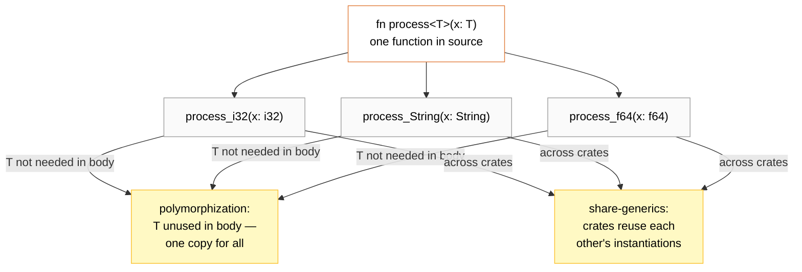

### Iterators and Closures

```rust
// Closures capture environment
let x = 4;
let equal_to_x = |z| z == x;  // captures x by reference

let x = vec![1, 2, 3];
let consumes_x = |z| z == x.len();  // captures x by value (move)

// Iterator chain
let numbers = vec![1, 2, 3, 4, 5];
let sum: i32 = numbers.iter()
    .filter(|&&x| x % 2 == 0)
    .map(|x| x * x)
    .sum();

// Collect into different types
let evens: Vec<i32> = numbers.into_iter()
    .filter(|x| x % 2 == 0)
    .collect();

// Lazy evaluation
let v: Vec<_> = (0..10).map(|x| x * x).collect();
```

### Concurrency

Fearless concurrency via ownership:

```rust
// Thread with move closure
use std::thread;

let data = vec![1, 2, 3, 4, 5];

thread::spawn(move || {
    println!("Here's a vector: {:?}", data);
    // data is moved into this thread
}).join().unwrap();

// Message passing (channels)
use std::sync::mpsc;

let (tx, rx) = mpsc::channel();
thread::spawn(move || {
    tx.send(42).unwrap();
});

let received = rx.recv().unwrap();

// Shared state with Arc<Mutex<T>>
use std::sync::{Arc, Mutex};

let counter = Arc::new(Mutex::new(0));
let mut handles = vec![];

for _ in 0..10 {
    let counter = Arc::clone(&counter);
    let handle = thread::spawn(move || {
        let mut num = counter.lock().unwrap();
        *num += 1;
    });
    handles.push(handle);
}

for handle in handles {
    handle.join().unwrap();
}
```

---

## Modern Rust Features

### Async/Await (Rust 1.39+)

```rust
use std::time::Duration;

async fn hello() -> String {
    tokio::time::sleep(Duration::from_secs(1)).await;
    "Hello, world!".to_string()
}

#[tokio::main]
async fn main() {
    let result = hello().await;
    println!("{}", result);
}
```

#### Compiler Lowering: async → state machine

`async fn` is compiled into a state-machine enum implementing
`Future::poll`. Locals that live across `.await` become enum fields,
which is why a future holding a 1 KB stack buffer is itself at least
1 KB; non-overlapping lifetimes can share a slot, and `Pin` keeps the
address stable so self-references in the enum remain valid.

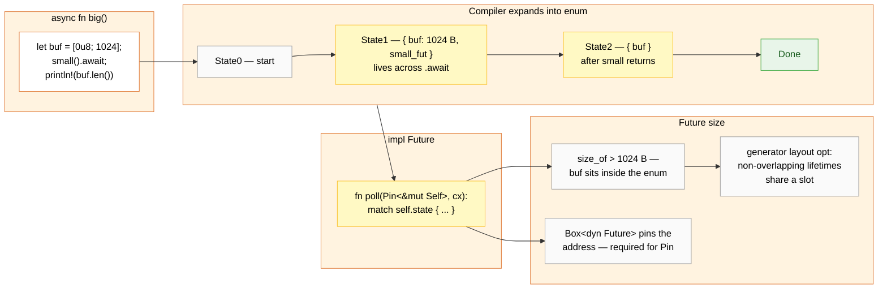

### Const Generics (Rust 1.51+)

```rust
struct Array<T, const N: usize> {
    data: [T; N],
}

impl<T: Default, const N: usize> Default for Array<T, N> {
    fn default() -> Self {
        Self {
            data: [T::default(); N],
        }
    }
}
```

### Const Evaluation

`const fn` is executed at compile time by a **MIR interpreter** with its
own memory model and UB checks. The interpreter walks the same basic-block
graph used by codegen (see [MIR: Basic Blocks](#mir-basic-blocks-and-the-borrow-checker)
above), then emits the result as a constant directly into LLVM IR.

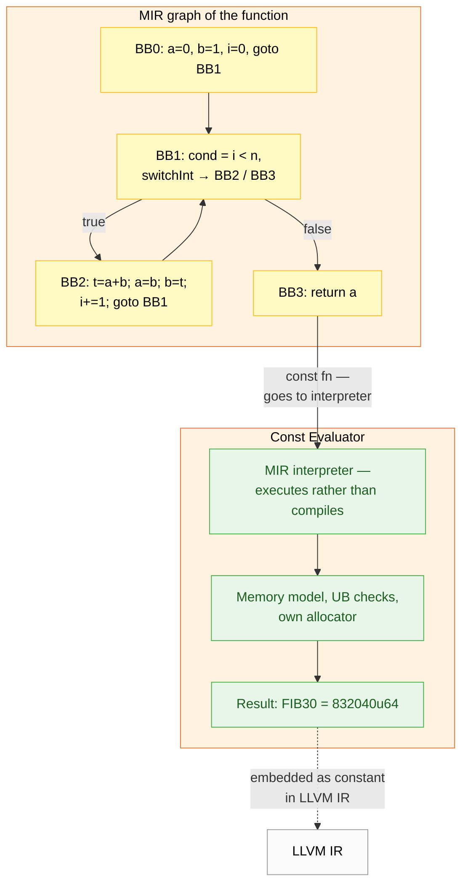

### Let-Else (Rust 1.65+)

```rust
let Some(x) = opt else { return };
```

---

## Ecosystem and Tools

| Tool | Purpose |
|------|---------|
| **cargo** | Package manager, build tool, test runner |
| **rustup** | Toolchain installer |
| **rustfmt** | Code formatter |
| **clippy** | Linter with suggestions |
| **miri** | MIR interpreter, detects UB at test time (`cargo miri run`) |
| **rust-analyzer** | Language server for IDEs |

```bash
# New project
cargo new my_project

# Build
cargo build

# Run
cargo run

# Test
cargo test

# Add dependency
cargo add serde

# Format
cargo fmt

# Lint
cargo clippy
```

### Major Crates

| Crate | Domain |
|-------|--------|
| **serde** | Serialization/deserialization |
| **tokio** | Async runtime |
| **clap** | Command-line parsing |
| **reqwest** | HTTP client |
| **axum** | Web framework |
| **tracing** | Structured logging |
| **anyhow** | Error handling |
| **thiserror** | Error deriving |

---

## Influence

### Languages Influenced

| Language | Rust influence |
|-----------|-----------------|
| **Swift** | Ownership-inspired borrowing (Swift 5) |
| **Nim** | Ownership system proposal |
| **Carbon** | Interoperable with C++, Rust-inspired |
| **V** | Option types, error handling |
| **C++** | Borrowing checker (Lifetimes library) |

### Systems Programming Impact

Rust has changed systems programming:
- **Linux kernel** — first non-C language accepted
- **Microsoft** — rewriting Windows components
- **AWS** — Firecracker microVM, Lambda runtime
- **Cloudflare** — networking infrastructure

---

## Strengths and Weaknesses

### Strengths

| Strength | Detail |
|----------|--------|
| **Memory safety** | Compile-time guarantees, no GC |
| **Concurrency** | Data races caught at compile time |
| **Performance** | Comparable to C/C++ |
| **Package manager** | Cargo is excellent |
| **Tooling** | rustfmt, clippy, rust-analyzer |
| **Community** | Helpful, RFC-driven development |

### Weaknesses

| Weakness | Detail |
|----------|--------|
| **Learning curve** | Borrow checker, lifetimes take time |
| **Compilation time** | Slower than Go, improving |
| **IDE maturity** | Good, but less than Java/TypeScript |
| **Ecosystem size** | Smaller than Python/JavaScript |
| **Async complexity** | Multiple runtimes, learning curve |

---

## Code Examples

See [`examples/rust/`](../../examples/rust/index.md) for runnable code:

| Example | Description |
|---------|-------------|
| [01 Hello World](../../examples/rust/01-hello-world/index.md) | Cargo, basics, printing |
| [02 Variables & Types](../../examples/rust/02-variables-and-types/index.md) | Ownership, mutability, types |
| [03 Functions](../../examples/rust/03-functions/index.md) | Closures, higher-order functions |
| [04 Control Flow](../../examples/rust/04-control-flow/index.md) | Loops, match, if-let |
| [05 Data Structures](../../examples/rust/05-data-structures/index.md) | Structs, enums, pattern matching |
| [06 OOP/Modules](../../examples/rust/06-oop-modules/index.md) | Traits, impl blocks, modules |

---

## Related Authors

- [Graydon Hoare](../../authors/graydon-hoare.md) — creator of Rust
- [Brendan Eich](../../authors/brendan-eich.md) — influenced Servo project |
- [Bjarne Stroustrup](../../authors/bjarne-stroustrup.md) — C++, Rust's "better C++" goal |

---

## Related Topics

- [Type Systems](../../topics/types/index.md) — ownership, lifetimes |
- [Concurrency](../../topics/concurrency/index.md) — fearless concurrency |
- [Paradigms](../../topics/paradigms/index.md) — Rust as multi-paradigm |
- [Architecture](../../topics/architecture/index.md) — Rust in systems programming |

---

## Further Reading

| Author | Title | Year | Focus |
|--------|-------|------|-------|
| Klabnik & Nichols | *The Rust Programming Language* | 2019 | Official book, comprehensive |
| Gjengset | *Rust for Rustaceans* | 2020 | Advanced, idiomatic |
| Timm | *Programming Rust* | 2021 | Practical, hands-on |
| McBride | *Rust in Action* | 2021 | Systems programming |

---

## Quotes

> "Rust is a systems programming language that runs blazingly fast,
> prevents segfaults, and guarantees thread safety."
> — Rust Documentation

> "The borrow checker is your friend. It catches bugs before they happen."
> — Anonymous Rustacean

> "Rust doesn't just prevent bugs — it prevents entire classes of bugs."
> — Graydon Hoare

---

*See [Languages Index](../languages/index.md) for other language profiles.*
