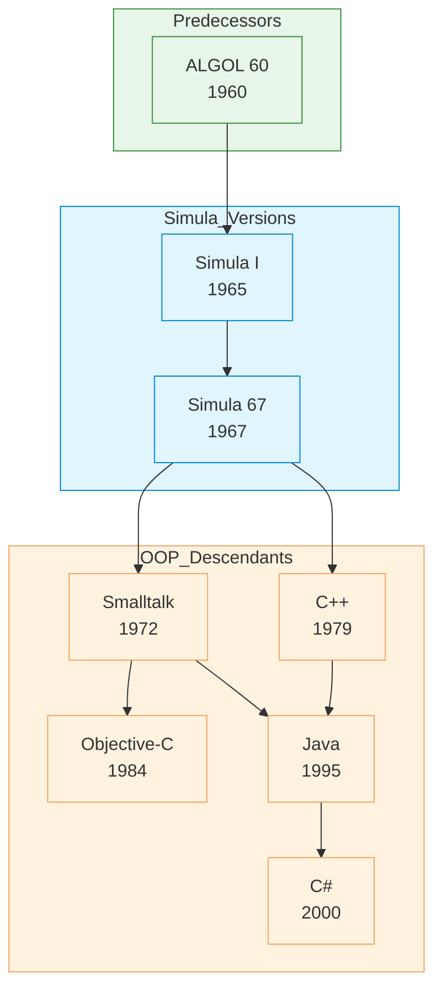

# Simula

| | |
|---|---|
| **Year** | 1967 |
| **Creator(s)** | Ole-Johan Dahl, Kristen Nygaard |
| **Paradigm(s)** | Object-oriented |
| **Typing** | Static |
| **Platform** | Various (interpreted/compiled) |
| **Key features** | Classes, inheritance, objects, coroutines |
| **Legacy** | First true OOP language |

---

## Contents

1. [Overview](#overview)
2. [Historical Context](#historical-context)
3. [Key Ideas](#key-ideas)
    - [Classes and Objects](#classes-and-objects)
    - [Objects and References](#objects-and-references)
    - [Inheritance](#inheritance)
    - [Coroutines](#coroutines)
4. [Language Features](#language-features)
    - [Block Structure](#block-structure)
    - [Types](#types)
    - [Control Flow](#control-flow)
    - [Procedures and Functions](#procedures-and-functions)
5. [Ecosystem](#ecosystem)
6. [Influence](#influence)
7. [Strengths and Weaknesses](#strengths-and-weaknesses)
8. [Code Examples](#code-examples)
9. [Related Authors](#related-authors)
10. [Related Topics](#related-topics)
11. [Further Reading](#further-reading)

---

## Overview

Simula (SIMulation LAnguage) was the first language to introduce
**true object-oriented programming**. Created by Ole-Johan Dahl and
Kristen Nygaard at the Norwegian Computing Centre in Oslo in 1967,
Simula pioneered concepts that would become foundational to
modern OOP. The canonical OOP release, Simula 67, formalised
classes, inheritance, and virtual methods.

Simula's revolutionary ideas:
- **Classes and objects** — combining data with behaviour
- **Inheritance** — added in Simula 67, allowing code reuse and specialisation
- **Objects as instances** — creating multiple instances of a class
- **Coroutines** — cooperative multitasking before threads

Simula became popular beyond simulation, paving the way
for Smalltalk, Objective-C, C++, Java, and other OOP languages.

## Historical Context



### Predecessor: ALGOL 60

Simula was based on ALGOL 60, but introduced a radical
departure:

- **Block structures** — for procedures and classes
- **Object instances** — separate from procedures
- **Reference types** — pointers to objects

This was the step from procedural programming to OOP.

### Language Versions

| Version | Year | Key features |
|---------|-------|---------------|
| Simula I | 1965 | Classes, objects, coroutines |
| Simula 67 | 1967 | Classes, inheritance, virtual methods, coroutines |

Simula 67 was the canonical public release. It unified the language
and made inheritance and virtual methods part of the standard model.

## Key Ideas

### Classes and Objects

Simula introduced the concept that **data and behaviour**
can be bundled together:

```simula
CLASS Account;
BEGIN
    REAL balance;

    PROCEDURE deposit(amount);
    REAL amount;
    BEGIN
        balance := balance + amount;
    END deposit;

    PROCEDURE withdraw(amount);
    REAL amount;
    BEGIN
        IF amount <= balance THEN
            balance := balance - amount;
        ELSE
            OutText("Insufficient funds");
            OutImage;
    END withdraw;
END Account;
```

**Key innovations:**
- **CLASS declaration** — `Class Name; ... End;`
- **Objects** — instances created with `NEW ClassName(args)`
- **Procedures** — methods grouped within classes
- **Class prefixing** — superclass-before-subclass inheritance syntax

### Objects and References

Simula pioneered object references (similar to pointers):

```simula
CLASS Point(x, y);
INTEGER x, y;
BEGIN
END Point;

REF(Point) p1;
REF(Point) p2;

comment Creating objects;
p1 :- NEW Point(0, 0);
p2 :- NEW Point(10, 10);

PROCEDURE printLocation(p);
REF(Point) p;
BEGIN
    OutText("Location: ");
    OutInt(p.x, 0);
    OutText(",");
    OutInt(p.y, 0);
    OutImage;
END printLocation;
```

References enable:
- **Multiple aliases** — same object accessed from different names
- **Indirect access** — clean separation of interface from implementation
- **Memory management** — explicit `NEW` and object lifecycle

### Inheritance

Simula pioneered inheritance for code reuse:

```simula
CLASS Animal;
BEGIN
    PROCEDURE speak;
    BEGIN
        OutText("Animal sound");
        OutImage;
    END speak;
END Animal;

Animal class Dog;
BEGIN
    PROCEDURE speak;
    BEGIN
        OutText("Bark!");
        OutImage;
    END speak;
END Dog;
```

**Subclasses** — classes that inherit all behaviour and add
specialisation (introduced in Simula 67).

### Coroutines

Simula supported cooperative multitasking for simulations.
The exact coroutine/process syntax varied across implementations,
but the key idea was that a process could yield control and resume later.

```simula
comment Simplified coroutine-style yield;
detach;
```

Coroutines enable:
- **Cooperative multitasking** — coroutines yield control voluntarily
- **Simulation support** — multiple concurrent activities
- **State preservation** — each coroutine maintains its own stack

## Language Features

### Block Structure

Simula uses explicit `BEGIN` and `END` for blocks:

```simula
comment Outer block;
BEGIN
    comment Declarations;
    comment Procedure definitions;
END;

comment Inner block (class or procedure);
CLASS Example;
BEGIN
    PROCEDURE method;
    BEGIN
        comment Method body;
    END method;
END Example;
```

### Types

Simula supports several structured types:

| Type | Description |
|------|-------------|
| **INTEGER** | Whole numbers |
| **REAL** | Floating-point numbers |
| **BOOLEAN** | True/False values |
| **CHARACTER** | Single characters |
| **TEXT** | Strings |
| **ARRAY** | Fixed-size collections |
| **REF** | Object references |

### Control Flow

```simula
comment Conditional;
IF condition THEN
    comment True branch;
ELSE
    comment False branch;

comment Loops;
WHILE condition DO
    comment Body;

comment For loop;
FOR i := 1 STEP 1 UNTIL 10 DO
    comment Body;

comment GOTO (use sparingly);
GOTO label;
```

### Procedures and Functions

```simula
comment Procedure definition;
PROCEDURE name(param1, param2);
REAL param1;
INTEGER param2;
BEGIN
    comment Procedure body;
END name;
```

Procedures are the primary building blocks for code reuse in Simula.

## Ecosystem

| Aspect | Status |
|-----------|----------|
| **Compilers** | Various implementations existed |
| **Modern use** | Primarily historical interest |
| **Libraries** | Limited standard library |

## Influence

### Languages Directly Inspired

| Language | Simula contribution |
|-----------|-----------------|
| **Smalltalk** | Classes, objects (via Kay) |
| **C++** | Classes, inheritance (Stroustrup explicitly cited Simula) |
| **Java** | Classes, OOP (Gosling studied Simula) |
| **C#** | Classes, OOP |
| **Python** | Classes, OOP |
| **Eiffel** | Classes, OOP (Meyer credited Simula) |

### Concepts Pioneered

| Concept | Origin | Modern equivalent |
|----------|---------|-------------------|
| **Classes** | Simula I | Classes in all OOP languages |
| **Inheritance** | Simula 67 | Subclassing in C++, Java, etc. |
| **Coroutines** | Simula I | Generators (Python), async/await (JavaScript) |
| **Object references** | Simula I | References and pointers in OOP languages |
| **Class prefixing** | Simula 67 | Inheritance syntax in class-based OOP |

### Academic Impact

Simula was taught extensively in universities:

- **CS curriculum** — foundational OOP concepts
- **Research** — language design and typing theory
- **Thesis topics** — many PhDs on OOP and type systems

## Code Examples

See [examples/simula/](../../../examples/simula/index.md) for runnable code *(planned)*

## Strengths and Weaknesses

### Strengths

- **First OOP** — pioneered object-oriented programming
- **Structured** — clear block syntax, ALGOL foundation
- **Coroutines** — built-in concurrency support
- **Inheritance** — powerful code reuse mechanism
- **Influential** — shaped decades of programming language design

### Weaknesses

- **Complex syntax** — verbose block structure and class prefixing syntax
- **Historically slower compilation** — implementations varied, tooling was limited
- **Limited ecosystem** — few modern tools or libraries
- **Runtime overhead** — more resource usage than C-like languages
- **Limited modern implementations** — primarily historical interest now

## Related Authors

- [Ole-Johan Dahl](../../authors/ole-johan-dahl.md) — co-creator
- [Kristen Nygaard](../../authors/kristen-nygaard.md) — co-creator
- [Alan Kay](../../authors/alan-kay.md) — saw Simula, influenced Smalltalk
- [Bjarne Stroustrup](../../authors/bjarne-stroustrup.md) — C++ inheritance credited to Simula
- [James Gosling](../../authors/james-gosling.md) — studied Simula, Java classes

## Related Topics

- [OOP & Design](../../topics/design/index.md) — Simula as OOP foundation
- [Paradigms](../../topics/paradigms/index.md) — Simula's role in OOP evolution
- [Type Systems](../../topics/types/index.md) — static typing, references
- [Architecture](../../topics/architecture/index.md) — classes as architectural pattern

## Further Reading

- Dahl & Nygaard — ["SIMULA — A Common Base Language for Discrete Simulation"](../../works/papers/dahl-nygaard-1967-simula.md) (1967)
- Birtwistle et al. — *Programming in Simula 67* (1983)
- Holmevik — *Simula Common Base Language Programming* (1983)

## Quotes

> "The most important thing we have accomplished, as a result of developing
> Simula, is to demonstrate that a language can be simultaneously powerful and
> general-purpose."
> — Ole-Johan Dahl & Kristen Nygaard

---

See [Languages Index](../languages/index.md) for other language profiles.
