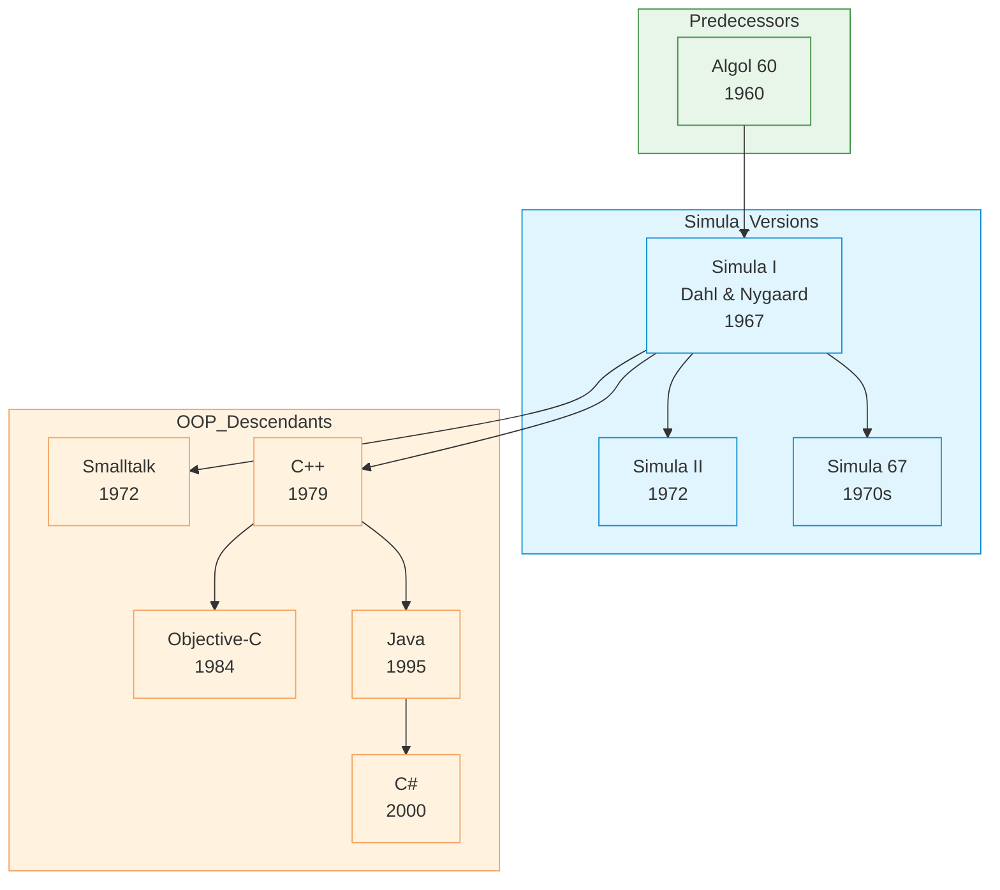

# Simula

| | |
|---|---|
| **Year** | 1967 |
| **Creator(s)** | Ole-Johan Dahl, Kristen Nygaard |
| **Paradigm(s)** | Object-oriented |
| **Typing** | Static |
| **Platform** | Various (interpreted/compiled) |
| **Key features** | Classes, inheritance, objects, coroutines |
| **Legacy** | First true OOP language |

---

## Contents

1. [Overview](#overview)
2. [Historical Context](#historical-context)
3. [Key Ideas](#key-ideas)
   - [Classes and Objects](#classes-and-objects)
   - [Objects and References](#objects-and-references)
   - [Inheritance](#inheritance)
   - [Coroutines](#coroutines)
4. [Language Features](#language-features)
   - [Block Structure](#block-structure)
   - [Types](#types)
   - [Control Flow](#control-flow)
   - [Procedures and Functions](#procedures-and-functions)
5. [Ecosystem](#ecosystem)
6. [Influence](#influence)
7. [Strengths and Weaknesses](#strengths-and-weaknesses)
8. [Code Examples](#code-examples)
9. [Related Authors](#related-authors)
10. [Related Topics](#related-topics)
11. [Further Reading](#further-reading)

---

## Overview

Simula (SIMulation LAnguage) was the first language to introduce
**true object-oriented programming**. Created by Ole-Johan Dahl and
Kristen Nygaard at the Norwegian Computing Centre in Oslo in 1967,
Simula pioneered concepts that would become foundational to
modern OOP.

Simula's revolutionary ideas:
- **Classes and objects** — combining data with behaviour
- **Inheritance** — allowing code reuse and specialisation
- **Objects as instances** — creating multiple instances of a class
- **Coroutines** — cooperative multitasking before threads

Simula became popular beyond simulation, paving the way
for Smalltalk, C++, Java, and other OOP languages.

## Historical Context



### Predecessor: ALGOL 60

Simula was based on ALGOL 60, but introduced a radical
departure:

- **Block structures** — for procedures and classes
- **Object instances** — separate from procedures
- **Reference types** — pointers to objects

This was the step from procedural programming to OOP.

### Language Versions

| Version | Year | Key features |
|---------|-------|---------------|
| Simula I | 1967 | Classes, objects, coroutines |
| Simula II | 1972 | Extended coroutines, string handling |
| Simula 67 | 1970s | Standardised version |

Simula 67 unified Simula I and II into a single language.

## Key Ideas

### Classes and Objects

Simula introduced the concept that **data and behaviour**
can be bundled together:

```simula
CLASS Account;
BEGIN
    REAL balance;

    PROCEDURE deposit(REAL amount);
    BEGIN
        IF amount < 0 THEN
            OutText("Invalid deposit");
        ELSE
            balance :- balance + amount;
    END deposit;

    PROCEDURE withdraw(REAL amount);
    BEGIN
        IF amount > balance THEN
            OutText("Insufficient funds");
        ELSE
            balance :- balance - amount;
    END withdraw;
END Account;
```

**Key innovations:**
- **CLASS declaration** — `CLASS Name; ... END Name;`
- **Objects** — instances created with `NEW ClassName(args)`
- **Procedures** — methods grouped within classes
- **Prefix notation** — `object.method(args)`

### Objects and References

Simula pioneered object references (similar to pointers):

```simula
!-- Creating objects
REF(Point) p1;
REF(Point) p2;

p1 :- NEW Point(0, 0);   ! Create new point
p2 :- NEW Point(10, 10); ! Create another point

!-- Pass references
PROCEDURE printLocation(point);
BEGIN
    CLASS Point;
    BEGIN
        REF(Point) loc;
        loc :- point;
        OutText("Location: ", loc.x, ",", loc.y);
    END printLocation;
END;
```

References enable:
- **Multiple aliases** — same object accessed from different names
- **Indirect access** — clean separation of interface from implementation
- **Memory management** — explicit `NEW` and object lifecycle

### Inheritance

Simula pioneered inheritance for code reuse:

```simula
CLASS Animal;
BEGIN
    PROCEDURE speak;
    BEGIN
        OutText("Animal sound");
    END speak;
END Animal;

CLASS Dog SUBCLASS Animal;
BEGIN
    PROCEDURE speak;
    BEGIN
        OutText("Bark!");
    END speak;
END Dog;
```

**Subclasses** — classes that inherit all behaviour and add
specialisation (added in Simula II).

### Coroutines

Simula I included **coroutines** — cooperative multitasking:

```simula
!-- Coroutine definition
INSPECT CLASS Coroutine;
BEGIN
    BOOLEAN resume;
END Coroutine;

!-- Coroutine class
CLASS Producer IMPLEMENTS Coroutine;
BEGIN
    PROCEDURE produce;
    BEGIN
        OutInt(1);  ! Produced item
    END produce;
END Producer;

!-- Detaching coroutines (resume later)
DETACH p;
```

Coroutines enable:
- **Cooperative multitasking** — coroutines yield control voluntarily
- **Simulation support** — multiple concurrent activities
- **State preservation** — each coroutine maintains its own stack

## Language Features

### Block Structure

Simula uses explicit `BEGIN` and `END` for blocks:

```simula
!-- Outer block
BEGIN
    ! Declarations
    ! Procedure definitions
END;

!-- Inner block (class or procedure)
CLASS Example;
BEGIN
    PROCEDURE method;
    BEGIN
        ! Method body
    END method;
END Example;
```

### Types

Simula supports several structured types:

| Type | Description |
|------|-------------|
| **INTEGER** | Whole numbers |
| **REAL** | Floating-point numbers |
| **BOOLEAN** | True/False values |
| **CHARACTER** | Single characters |
| **TEXT** | Strings |
| **ARRAY** | Fixed-size collections |
| **REF** | Object references |

### Control Flow

```simula
!-- Conditional
IF condition THEN
    ! True branch
ELSE
    ! False branch
END IF;

!-- Loops
WHILE condition DO
    ! Body
END WHILE;

!-- For loop
FOR i := 1 STEP 1 UNTIL 10 DO
    ! Body
END FOR;

!-- GOTO (use sparingly)
GOTO label;
```

### Procedures and Functions

```simula
!-- Procedure definition
PROCEDURE name(PARAM1, PARAM2);
BEGIN
    ! Procedure body
    ! RETURN value (optional)
END name;
```

Procedures are the primary building blocks for code reuse in Simula.

## Ecosystem

| Aspect | Status |
|-----------|----------|
| **Compilers** | Various implementations existed |
| **Modern use** | Primarily historical interest |
| **Libraries** | Limited standard library |

## Influence

### Languages Directly Inspired

| Language | Simula contribution |
|-----------|-----------------|
| **Smalltalk** | Classes, objects (via Kay) |
| **C++** | Classes, inheritance (Stroustrup cited Simula) |
| **Java** | Classes, OOP (Gosling studied Simula) |
| **C#** | Classes, OOP |
| **Python** | Classes, OOP |
| **Eiffel** | Classes, OOP (Meyer credited Simula) |

### Concepts Pioneered

| Concept | Origin | Modern equivalent |
|----------|---------|-------------------|
| **Classes** | Simula I | Classes in all OOP languages |
| **Inheritance** | Simula II | Subclassing in C++, Java, etc. |
| **Coroutines** | Simula I | Generators (Python), async/await (JavaScript) |
| **Object references** | Simula I | Smart pointers (C++), References (Java, C#) |
| **Prefix notation** | Simula I | Method chaining (Ruby, Eiffel) |

### Academic Impact

Simula was taught extensively in universities:

- **CS curriculum** — foundational OOP concepts
- **Research** — language design and typing theory
- **Thesis topics** — many PhDs on OOP and type systems

## Code Examples

See [examples/simula/](../../../examples/simula/index.md) for runnable code *(planned)*

## Strengths and Weaknesses

### Strengths

- **First OOP** — pioneered object-oriented programming
- **Structured** — clear block syntax, ALGOL foundation
- **Coroutines** — built-in concurrency support
- **Inheritance** — powerful code reuse mechanism
- **Influential** — shaped decades of programming language design

### Weaknesses

- **Complex syntax** — verbose block structure, prefix notation
- **Slow compilation** — compiled to bytecode, not native
- **Limited ecosystem** — few modern tools or libraries
- **Runtime overhead** — more resource usage than C-like languages
- **No modern implementations** — primarily historical interest now

## Related Authors

- [Ole-Johan Dahl](../../authors/ole-johan-dahl.md) — co-creator
- [Kristen Nygaard](../../authors/kristen-nygaard.md) — co-creator
- [Alan Kay](../../authors/alan-kay.md) — saw Simula, influenced Smalltalk
- [Bjarne Stroustrup](../../authors/bjarne-stroustrup.md) — C++ inheritance credited to Simula
- [James Gosling](../../authors/james-gosling.md) — studied Simula, Java classes

## Related Topics

- [OOP & Design](../../topics/design/index.md) — Simula as OOP foundation |
- [Paradigms](../../topics/paradigms/index.md) — Simula's role in OOP evolution |
- [Type Systems](../../topics/types/index.md) — static typing, references |
- [Architecture](../../topics/architecture/index.md) — classes as architectural pattern |

## Further Reading

- Dahl & Nygaard — ["SIMULA — A Common Base Language for Discrete Simulation"](../../works/papers/dahl-nygaard-1967-simula.md) (1967)
- Birtwistle et al. — *Programming in Simula 67* (1983)
- Holmevik — *Simula Common Base Language Programming* (1983)

## Quotes

> "The most important thing we have accomplished, as a result of developing
> Simula, is to demonstrate that a language can be simultaneously powerful and
> general-purpose."
> — Ole-Johan Dahl & Kristen Nygaard

---

See [Languages Index](../languages/index.md) for other language profiles.
