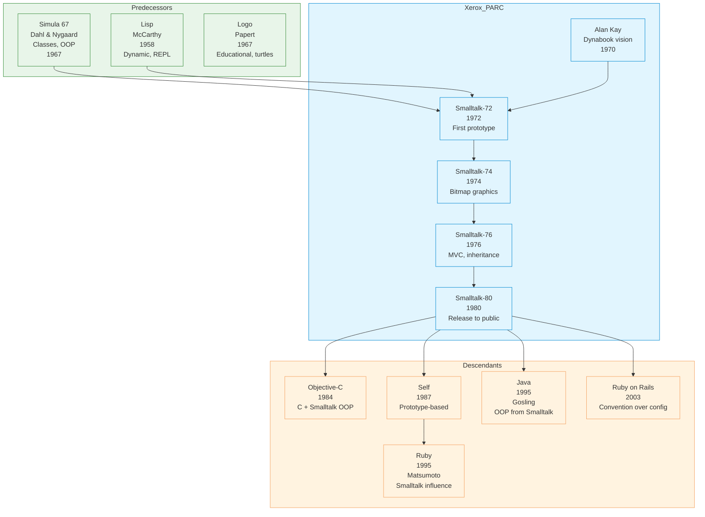

# Smalltalk

|                           |                                                     |
|---------------------------|-----------------------------------------------------|
| **Year**                  | 1972                                                |
| **Creator(s)**            | Alan Kay, Dan Ingalls, Adele Goldberg (Xerox PARC)  |
| **Paradigm(s)**           | Object-oriented, message passing                    |
| **Typing**                | Dynamic                                             |
| **Platform**              | Originally Smalltalk-80 VM, various implementations |
| **Key features**          | Pure OOP, image-based development, live coding      |
| **Major implementations** | Squeak, Pharo, VisualWorks                          |

---

## Contents

1. [Overview](#overview)
2. [Historical Context](#historical-context)
3. [Key Ideas](#key-ideas)
   - [Everything is an Object](#everything-is-an-object)
   - [Message Passing](#message-passing)
   - [Image-Based Development](#image-based-development)
   - [Live Coding](#live-coding)
   - [The MVC Pattern](#the-mvc-pattern)
4. [Language Features](#language-features)
   - [Classes and Methods](#classes-and-methods)
   - [Blocks and Closures](#blocks-and-closures)
   - [Control Flow](#control-flow)
   - [Collections](#collections)
   - [Reflection](#reflection)
5. [The Smalltalk Environment](#the-smalltalk-environment)
6. [Implementations](#implementations)
7. [Influence](#influence)
8. [Strengths and Weaknesses](#strengths-and-weaknesses)
9. [Code Examples](#code-examples)
10. [Related Authors](#related-authors)
11. [Related Topics](#related-topics)
12. [Further Reading](#further-reading)

---

## Overview

Smalltalk is a pure object-oriented programming language with a
reflective, class-based design. Created at Xerox PARC in 1972 by Alan
Kay and others, Smalltalk pioneered many concepts now considered
fundamental to object-oriented programming.

Smalltalk's distinctive characteristics:
- **Everything is an object** — numbers, booleans, even classes
- **Message passing** — no direct method calls, only messages
- **Image-based development** — entire system state in one file
- **Live coding** — modify code while the system runs
- **Integrated environment** — editor, debugger, browser all one
- **Simple syntax** — minimal, readable

Smalltalk influenced:
- **GUI development** — windows, menus, icons invented at PARC
- **OOP languages** — Objective-C, Ruby, Python, Java, Swift
- **Development tools** — IDEs, debuggers, class browsers
- **Web frameworks** — Rails inspired by Smalltalk patterns

---

## Historical Context



### Xerox PARC and the Dynabook

Alan Kay's vision for the **Dynabook** — a personal computer for children
to learn — drove Smalltalk's design. At Xerox PARC, the team developed
not just a language but an entire computing environment including:
- **Bitmapped display** — first with overlapping windows
- **Mouse-driven GUI** — point-and-click interface
- **WIMP interface** — Windows, Icons, Menus, Pointer
- **Ethernet networking** — networked workstations

---

## Key Ideas

### Everything is an Object

In Smalltalk, literally everything is an object:

```smalltalk
"Even numbers are objects"
3 + 4
"Actually sends the '+' message with argument 4 to object 3"

"Booleans are objects with methods"
condition ifTrue: [ ... ] ifFalse: [ ... ]
"Sends ifTrue:ifFalse: message to boolean object"

"Classes are objects too"
Class new
"The class Class is itself an object"

"Even nil is an object"
nil ifNil: [ 'handle nil' ]
```

### Message Passing

Smalltalk has no direct method calls — only message passing:

```smalltalk
"Sending a message"
anObject doSomething

"Message with arguments"
anObject doSomethingWith: arg1 and: arg2

"Cascaded messages (same receiver)"
anObject
    doSomething;
    doSomethingElse;
    andAnother

"Chained messages"
anObject doSomething doSomethingElse
"Sends doSomethingElse to result of doSomething"
```

**Message lookup:**
1. Object looks for method in its class
2. If not found, looks in superclass
3. Continues up inheritance chain
4. If not found in Object, sends `doesNotUnderstand:`

### Image-Based Development

Smalltalk saves the entire system state in an **image**:

```smalltalk
"Save current state"
Smalltalk snapshot: 'myWork.image'

"Resume from saved state"
"Simply open the image file"
```

**Benefits:**
- All objects preserved exactly as they were
- No compilation or deployment steps
- Seamless continuation of work
- Perfect for exploratory programming

### Live Coding

Modify code while the system runs:

```smalltalk
"Open a class browser, modify method, save —"
" — and all instances immediately use new behavior"

"Example: Change a method definition"
Person >> greet
    ^ 'Hello, my name is ', self name
"Ctrl+S saves and immediately updates all Person instances"
```

### The MVC Pattern

Smalltalk-80 introduced the **Model-View-Controller** pattern:

```smalltalk
"Model: data and business logic"
model := Person new name: 'Alice'; age: 30.

"View: display logic"
view := PersonView new.

"Controller: user input handling"
controller := PersonController new
    model: model;
    view: view.

"Connect them"
view controller: controller.
controller view: view.
```

MVC became foundational for GUI frameworks across all platforms.

---

## Language Features

### Classes and Methods

```smalltalk
"Class definition"
Object subclass: #Person
    instanceVariableNames: 'name age'
    classVariableNames: ''
    package: 'MyApp'

"Instance methods"
Person >> name
    ^ name

Person >> name: aString
    name := aString

Person >> greet
    ^ 'Hello, I am ', name, ', age ', age

"Class methods (like static)"
Person class >> named: aString age: anInteger
    ^ self new name: aString; age: anInteger; yourself

"Using it"
alice := Person named: 'Alice' age: 30.
alice greet.
" -> 'Hello, I am Alice, age 30'"
```

### Blocks and Closures

Blocks are anonymous functions that capture their environment:

```smalltalk
"Simple block"
[ 1 + 2 ]
"Returns 3 when sent 'value'"

"Block with parameters"
[ :x :y | x + y ]
"Use with value:value:"
[ :x :y | x + y ] value: 3 value: 4.  " -> 7"

"Blocks capture scope"
x := 10.
addX := [ :y | x + y ].
addX value: 5.  " -> 15 (x still 10)"

"Higher-order functions"
numbers := #(1 2 3 4 5).
squared := numbers collect: [ :n | n * n ].
" -> #(1 4 9 16 25)"

"Blocks for control flow"
condition
    ifTrue: [ 'yes' ]
    ifFalse: [ 'no' ].

3 timesRepeat: [ Transcript show: 'Hi! ' ].
```

### Control Flow

Control flow is done through message passing:

```smalltalk
"Conditional"
condition ifTrue: [ ... ].
condition ifFalse: [ ... ].
condition ifTrue: [ ... ] ifFalse: [ ... ].

"Loops"
10 timesRepeat: [ ... ].
1 to: 10 do: [ :i | ... ].
collection do: [ :each | ... ].
[ condition ] whileTrue: [ ... ].
[ condition ] whileFalse: [ ... ].

"Case-like"
value caseOf: {
    [1] -> [ 'one' ].
    [2] -> [ 'two' ].
    [3] -> [ 'three' ]
} otherwise: [ 'other' ].
```

### Collections

Rich collection hierarchy:

```smalltalk
"Array (fixed size)"
arr := #(1 2 3 4 5).

"OrderedCollection (dynamic)"
list := OrderedCollection new.
list add: 1; add: 2; add: 3.

"Dictionary"
dict := Dictionary new.
dict at: 'name' put: 'Alice'.
dict at: 'age' put: 30.
dict at: 'name'.  " -> 'Alice'"

"Set"
set := Set new.
set add: 1; add: 2; add: 1.  "1 added only once"

"Collection operations"
numbers := #(1 2 3 4 5).
sum := numbers inject: 0 into: [ :acc :n | acc + n ].
evens := numbers select: [ :n | n even ].
doubled := numbers collect: [ :n | n * 2 ].
any := numbers anySatisfy: [ :n | n > 3 ].
```

### Reflection

Smalltalk is fully reflective:

```smalltalk
"Inspect object"
anObject inspect.

"Get class"
anObject class.

"List methods"
anObject class methodDict keys.

"Get method"
method := anObject class >> #methodName.

"Execute method"
method valueWithReceiver: anObject arguments: #().

"Create class at runtime"
Object subclass: #DynamicClass
    instanceVariableNames: 'x'
    classVariableNames: ''
    package: 'Dynamic'.
```

---

## The Smalltalk Environment

Smalltalk isn't just a language — it's a complete development environment:

| Component | Purpose |
|-----------|---------|
| **Class Browser** | Navigate and edit classes |
| **Method Browser** | Find and edit methods |
| **Inspector** | Examine object internals |
| **Debugger** | Debug live code |
| **Transcript** | Console output |
| **Workspace** | Evaluate expressions |
| **Test Runner** | Run unit tests |
| **Monticello** | Version control |

---

## Implementations

| Implementation | Focus |
|----------------|-------|
| **Squeak** | Open source, educational |
| **Pharo** | Clean, modern fork of Squeak |
| **VisualWorks** | Commercial, enterprise |
| **GNU Smalltalk** | GNU project, standards-compliant |
| **Cuis** | Minimalist, educational |
| **Amber Smalltalk** | Compiles to JavaScript |

---

## Influence

### Languages Directly Inspired

| Language | Smalltalk influence |
|-----------|---------------------|
| **Objective-C** | Syntax, message passing, dynamic dispatch |
| **Ruby** | Blocks, everything is object, metaprogramming |
| **Python** | Everything is object, interactive shell |
| **Java** | OOP model (simplified from Smalltalk) |
| **Swift** | Optionals, closures, OOP |
| **Scala** | Everything is object, uniformity |

### Concepts Pioneered

| Concept | Origin | Modern equivalent |
|----------|---------|-------------------|
| **GUI** | Smalltalk @ PARC | Windows, macOS, modern UI |
| **MVC** | Smalltalk-80 | Web frameworks, UI design |
| **Live coding** | Smalltalk image | REPL, hot reload |
| **Reflection** | Smalltalk | Java reflection, Python introspection |
| **IDE** | Smalltalk environment | VS Code, IntelliJ |
| **Unit testing** | Smalltalk | JUnit, pytest |
| **Version control** | Monticello | Git, Mercurial |

---

## Strengths and Weaknesses

### Strengths

| Strength           | Detail                                 |
|--------------------|----------------------------------------|
| **Pure OOP**       | Consistent model, everything is object |
| **Live coding**    | Immediate feedback, no rebuild         |
| **Simple syntax**  | Minimal, easy to learn                 |
| **Powerful tools** | Integrated, reflective                 |
| **Uniformity**     | Same model everywhere                  |
| **Educational**    | Great for teaching OOP                 |

### Weaknesses

| Weakness              | Detail                            |
|-----------------------|-----------------------------------|
| **Performance**       | Slower than compiled languages    |
| **Ecosystem**         | Smaller than mainstream languages |
| **Industry adoption** | Limited commercial use            |
| **Learning curve**    | Different paradigm                |
| **Tooling**           | Less mature than Java/JavaScript  |

---

## Code Examples

See [`examples/smalltalk/`](../../examples/smalltalk/index.md) for runnable code:

| Example                                                                          | Description               |
|----------------------------------------------------------------------------------|---------------------------|
| [01 Hello World](../../examples/smalltalk/01-hello-world/index.md)               | Basic syntax, Transcript  |
| [02 Variables & Types](../../examples/smalltalk/02-variables-and-types/index.md) | Dynamic typing, objects   |
| [03 Functions](../../examples/smalltalk/03-functions/index.md)                   | Methods, blocks           |
| [04 Control Flow](../../examples/smalltalk/04-control-flow/index.md)             | Conditionals, loops       |
| [05 Data Structures](../../examples/smalltalk/05-data-structures/index.md)       | Collections, dictionaries |
| [06 OOP/Modules](../../examples/smalltalk/06-oop-modules/index.md)               | Classes, inheritance      |

---

## Related Authors

- [Alan Kay](../../authors/alan-kay.md) — creator, Dynabook vision
- [Dan Ingalls](../../authors/dan-ingalls.md) — key implementer, live coding
- [Adele Goldberg](../../authors/adele-goldberg.md) — Smalltalk-80 book, education

---

## Related Topics

- [OOP & Design](../../topics/design/index.md) — Smalltalk as OOP pioneer |
- [Paradigms](../../topics/paradigms/index.md) — Pure object-oriented programming |
- [Architecture](../../topics/architecture/index.md) — MVC pattern origins |

---

## Further Reading

| Author            | Title                                                   | Year | Focus              |
|-------------------|---------------------------------------------------------|------|--------------------|
| Goldberg & Robson | *Smalltalk-80: The Language*                            | 1989 | Language reference |
| Goldberg & Robson | *Smalltalk-80: The Interactive Programming Environment* | 1989 | Environment        |
| Beck              | *Smalltalk Best Practice Patterns*                      | 1997 | Idiomatic usage    |
| Ingalls et al.    | *Back to the Future: The Story of Squeak*               | 1997 | Squeak history     |

---

## Quotes

> "The best way to predict the future is to invent it."
> — Alan Kay

> "Simple things should be simple, complex things should be possible."
> — Alan Kay

> "Object-oriented programming is an exceptionally bad idea which could only have originated in California."
> — Edsger Dijkstra (controversial, shows the revolutionary nature)

> "Smalltalk is not only NOT its syntax or the class library, it is not even about classes. I'm sorry that I long ago coined the term 'objects' for this topic because it gets people to focus on the lesser idea. The big idea is 'messaging'."
> — Alan Kay

---

*See [Languages Index](../index.md) for other language profiles.*
