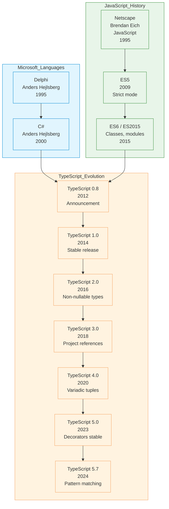

# TypeScript

| | |
|---|---|
| **Year** | 2012 |
| **Creator(s)** | Anders Hejlsberg (Microsoft) |
| **Paradigm(s)** | Multi-paradigm (OOP, functional, imperative) |
| **Typing** | Static, structural, optional |
| **Platform** | Compiles to JavaScript (runs everywhere JS does) |
| **Key features** | Type safety, type inference, ES6+ features |
| **Current version** | TypeScript 5.7 (2024) |

---

## Contents

1. [Overview](#overview)
2. [Historical Context](#historical-context)
3. [Key Ideas](#key-ideas)
   - [Static Typing for JavaScript](#static-typing-for-javascript)
   - [Structural Typing](#structural-typing)
   - [Type Inference](#type-inference)
   - [Gradual Typing](#gradual-typing)
   - [Tooling and Developer Experience](#tooling-and-developer-experience)
4. [Core Types](#core-types)
5. [Advanced Types](#advanced-types)
6. [Classes and Interfaces](#classes-and-interfaces)
7. [Generics](#generics)
8. [Utility Types](#utility-types)
9. [Modern TypeScript Features](#modern-typescript-features)
10. [Ecosystem and Tools](#ecosystem-and-tools)
11. [Influence](#influence)
12. [Strengths and Weaknesses](#strengths-and-weaknesses)
13. [Code Examples](#code-examples)
14. [Related Authors](#related-authors)
15. [Related Topics](#related-topics)
16. [Further Reading](#further-reading)

---

## Overview

TypeScript is a strongly typed programming language that builds on
JavaScript, giving you better tooling at any scale. Created by Anders
Hejlsberg at Microsoft in 2012, TypeScript adds static typing, classes,
and interfaces to JavaScript while compiling to plain JavaScript that
runs in any browser or Node.js environment.

TypeScript's distinctive characteristics:
- **Static typing** — optional but powerful type system
- **Structural typing** — types are based on shape, not names
- **Excellent tooling** — IntelliSense, refactoring, navigation
- **JavaScript compatibility** — any valid JS is valid TS
- **Type inference** — types inferred where possible
- **Target independence** — compiles to any JavaScript version

TypeScript powers:
- **Angular** — built with TypeScript from the start
- **VS Code** — written in TypeScript
- **Modern React development** — Create React App uses TS by default
- **Enterprise frontends** — type safety at scale

---

## Historical Context



### From JavaScript to TypeScript

JavaScript's flexibility is both a strength and a weakness. As codebases
grew large, developers needed better tooling and error catching.
TypeScript was designed to add optional static typing while maintaining
full JavaScript compatibility.

---

## Key Ideas

### Static Typing for JavaScript

```typescript
// JavaScript (no types)
function greet(name) {
    return "Hello, " + name;
}

// TypeScript (explicit types)
function greet(name: string): string {
    return "Hello, " + name;
}

// Type error caught at compile time
greet(42);  // Error: Argument of type 'number' not assignable to 'string'
```

### Structural Typing

Types are compatible if they have the same shape:

```typescript
interface Point {
    x: number;
    y: number;
}

function printPoint(p: Point) {
    console.log(`(${p.x}, ${p.y})`);
}

// These are all compatible with Point
printPoint({ x: 1, y: 2 });
printPoint({ x: 1, y: 2, z: 3 });  // Extra properties OK

class Point3D {
    x: number;
    y: number;
    z: number;
    constructor(x: number, y: number, z: number) {
        this.x = x;
        this.y = y;
        this.z = z;
    }
}

printPoint(new Point3D(1, 2, 3));  // Compatible!
```

### Type Inference

Types are inferred where possible:

```typescript
// Type inferred as number
let x = 42;

// Type inferred as string
let message = "hello";

// Type inferred as (x: number, y: number) => number
const add = (x: number, y: number) => x + y;

// Array type inferred
const numbers = [1, 2, 3];  // number[]
```

### Gradual Typing

TypeScript allows gradual adoption:

```typescript
// Any type: opt-out of typing
let data: any = getUnknownData();

// Unknown type: safer than any
let result: unknown = JSON.parse(json);
if (typeof result === 'string') {
    console.log(result.toUpperCase());  // Type narrowed to string
}

// Type assertions: tell compiler you know better
const canvas = document.getElementById('canvas') as HTMLCanvasElement;
```

### Tooling and Developer Experience

TypeScript enables powerful tooling:

- **IntelliSense** — autocomplete, parameter hints
- **Refactoring** — rename symbol, extract function
- **Navigation** — go to definition, find references
- **Error checking** — catch bugs before runtime

---

## Core Types

```typescript
// Primitives
let num: number = 42;
let str: string = "hello";
let bool: boolean = true;

// Arrays
let nums: number[] = [1, 2, 3];
let strs: Array<string> = ["a", "b", "c"];

// Tuples (fixed length, specific types)
let point: [number, number] = [10, 20];
let info: [string, number, boolean] = ["Alice", 30, true];

// Enums
enum Color {
    Red,
    Green,
    Blue
}
let c: Color = Color.Red;

// Any and Unknown
let anything: any = 42;  // Opt-out of type checking
let something: unknown = 42;  // Safer, requires type guard

// Void, Null, Undefined
function log(): void {
    console.log("logged");
}

let nothing: null = null;
let notDefined: undefined = undefined;

// Never (unreachable)
function fail(message: string): never {
    throw new Error(message);
}

// Object
let obj: object = { name: "Alice" };
```

---

## Advanced Types

### Union Types

```typescript
// Union type
function printId(id: number | string) {
    if (typeof id === "string") {
        console.log(id.toUpperCase());
    } else {
        console.log(id);
    }
}

// Literal types
type Direction = "up" | "down" | "left" | "right";

function move(dir: Direction) {
    // ...
}

// Discriminated unions
interface Square {
    kind: "square";
    size: number;
}

interface Circle {
    kind: "circle";
    radius: number;
}

type Shape = Square | Circle;

function area(shape: Shape): number {
    switch (shape.kind) {
        case "square": return shape.size * shape.size;
        case "circle": return Math.PI * shape.radius ** 2;
    }
}
```

### Intersection Types

```typescript
interface Person {
    name: string;
}

interface Employee {
    employeeId: number;
}

// Intersection: has properties of both
type PersonEmployee = Person & Employee;

const pe: PersonEmployee = {
    name: "Alice",
    employeeId: 123
};
```

### Type Guards and Narrowing

```typescript
// Type guard function
function isString(value: unknown): value is string {
    return typeof value === 'string';
}

// Using type guard
function process(value: unknown) {
    if (isString(value)) {
        console.log(value.toUpperCase());  // Type narrowed to string
    }
}

// Discriminant narrowing
interface Cat {
    type: 'cat';
    meow: () => void;
}

interface Dog {
    type: 'dog';
    bark: () => void;
}

function makeSound(animal: Cat | Dog) {
    if (animal.type === 'cat') {
        animal.meow();  // Type narrowed to Cat
    } else {
        animal.bark();  // Type narrowed to Dog
    }
}
```

### Conditional Types

```typescript
// Conditional type
type NonNullable<T> = T extends null | undefined ? never : T;

type A = NonNullable<string | null>;  // string

// Infer keyword
type ReturnType<T> = T extends (...args: any[]) => infer R ? R : any;

function f() { return { x: 10, y: 20 }; }
type FReturn = ReturnType<typeof f>;  // { x: number; y: number; }
```

---

## Classes and Interfaces

```typescript
// Interface
interface Animal {
    name: string;
    speak(): void;
}

// Class implementing interface
class Dog implements Animal {
    constructor(public name: string) {}

    speak() {
        console.log(`${this.name} says woof!`);
    }
}

// Access modifiers
class BankAccount {
    private balance: number;
    protected owner: string;

    constructor(initialBalance: number, owner: string) {
        this.balance = initialBalance;
        this.owner = owner;
    }

    public deposit(amount: number): void {
        this.balance += amount;
    }

    protected getBalance(): number {
        return this.balance;
    }
}

// Inheritance
class SavingsAccount extends BankAccount {
    private interestRate: number;

    constructor(balance: number, owner: string, rate: number) {
        super(balance, owner);
        this.interestRate = rate;
    }

    applyInterest(): void {
        const balance = this.getBalance();  // Can access protected
        this.deposit(balance * this.interestRate);
    }
}

// Abstract class
abstract class Shape {
    abstract area(): number;
}

class Rectangle extends Shape {
    constructor(private width: number, private height: number) {
        super();
    }

    area(): number {
        return this.width * this.height;
    }
}
```

---

## Generics

```typescript
// Generic function
function identity<T>(arg: T): T {
    return arg;
}

const num = identity<number>(42);
const str = identity("hello");  // Type inferred

// Generic interface
interface Box<T> {
    value: T;
}

const numBox: Box<number> = { value: 42 };
const strBox: Box<string> = { value: "hello" };

// Generic class
class Stack<T> {
    private items: T[] = [];

    push(item: T): void {
        this.items.push(item);
    }

    pop(): T | undefined {
        return this.items.pop();
    }
}

// Generic constraints
interface Lengthwise {
    length: number;
}

function loggingIdentity<T extends Lengthwise>(arg: T): T {
    console.log(arg.length);
    return arg;
}

// Default type parameters
interface Container<T = string> {
    value: T;
}

const c1: Container = { value: "hello" };  // T inferred as string
const c2: Container<number> = { value: 42 };
```

---

## Utility Types

```typescript
// Partial<T> - makes all properties optional
interface User {
    name: string;
    age: number;
    email: string;
}

function updateUser(id: number, updates: Partial<User>) {
    // ...
}

// Required<T> - makes all properties required
interface Config {
    apiUrl?: string;
    timeout?: number;
}

type RequiredConfig = Required<Config>;

// Readonly<T> - makes all properties readonly
interface Point {
    x: number;
    y: number;
}

const origin: Readonly<Point> = { x: 0, y: 0 };
// origin.x = 1;  // Error

// Record<K, T> - creates object type with keys of K and values of T
type Pages = Record<string, { title: string; content: string }>;

// Pick<T, K> - picks subset of properties
type UserSummary = Pick<User, "name" | "email">;

// Omit<T, K> - omits specific properties
type CreateUser = Omit<User, "id">;

// Exclude<T, U> - excludes types from union
type NonNullable<T> = Exclude<T, null | undefined>;

// Extract<T, U> - extracts types from union
type Numbers = Extract<string | number, number>;

// ReturnType<T> - gets return type of function
function greet(): string {
    return "hello";
}
type GreetReturn = ReturnType<typeof greet>;  // string

// Parameters<T> - gets parameter types
function add(a: number, b: number): number {
    return a + b;
}
type AddParams = Parameters<typeof add>;  // [number, number]
```

---

## Modern TypeScript Features

### Pattern Matching (TS 5.7+, experimental)

```typescript
type Shape =
    | { kind: "circle", radius: number }
    | { kind: "square", size: number }
    | { kind: "triangle", base: number, height: number };

function area(shape: Shape): number {
    switch (shape) {
        case { kind: "circle", radius: r }: return Math.PI * r * r;
        case { kind: "square", size: s }: return s * s;
        case { kind: "triangle", base: b, height: h }: return 0.5 * b * h;
    }
}
```

### Satisfies Operator (TS 4.9+)

```typescript
type Colors = Record<string, string | { r: number; g: number; b: number }>;

const theme: Colors = {
    primary: "#007bff",
    secondary: { r: 0, g: 123, b: 255 }
};

// With satisfies: more specific type inferred
const theme2 = {
    primary: "#007bff",
    secondary: { r: 0, g: 123, b: 255 }
} satisfies Colors;
```

### const Assertions (TS 3.4+)

```typescript
// Type: string[]
const colors = ["red", "green", "blue"];

// Type: readonly ["red", "green", "blue"]
const colors2 = ["red", "green", "blue"] as const;
```

---

## Ecosystem and Tools

| Tool | Purpose |
|------|---------|
| **tsc** | TypeScript compiler |
| **npm/yarn/pnpm** | Package managers |
| **ts-node** | Execute TS directly |
| **tsx** | Fast TS execution |
| **esbuild/swc** | Fast TypeScript bundlers |

### TypeScript Config

```json
{
  "compilerOptions": {
    "target": "ES2020",
    "module": "ESNext",
    "lib": ["ES2020", "DOM"],
    "strict": true,
    "esModuleInterop": true,
    "skipLibCheck": true,
    "forceConsistentCasingInFileNames": true,
    "moduleResolution": "node",
    "resolveJsonModule": true
  }
}
```

### Major Frameworks with TypeScript

| Framework | TS Support |
|-----------|------------|
| **Angular** | First-class, required |
| **React** | Excellent, Create React App |
| **Vue** | Official support |
| **Svelte** | Official support |
| **NestJS** | Built with TS |

---

## Influence

### Languages and Tools Influenced

| Language/Tool | TypeScript influence |
|---------------|---------------------|
| **Deno** | Runtime built with TS |
| **Bun** | TypeScript-first runtime |
| **Flow** | Competing type system for JS |
| **Elm** | Static typing for web |
| **Rescript** | ML-style for web |

---

## Strengths and Weaknesses

### Strengths

| Strength | Detail |
|----------|--------|
| **Type safety** | Catch errors at compile time |
| **Excellent tooling** | IntelliSense, refactoring |
| **Gradual adoption** | Start with JS, add types progressively |
| **JavaScript compatible** | Any valid JS is valid TS |
| **Community** | Large, growing ecosystem |
| **Cross-platform** | Runs wherever JS runs |

### Weaknesses

| Weakness | Detail |
|----------|--------|
| **Build step** | Requires compilation |
| **Complexity** | Type system can be complex |
| **Type definitions** | Need `@types/*` for untyped libraries |
| **Compilation time** | Can be slow for large projects |
| **Learning curve** | Especially advanced types |

---

## Code Examples

See [`examples/typescript/`](../../examples/typescript/index.md) for runnable code:

| Example | Description |
|---------|-------------|
| [01 Hello World](../../examples/typescript/01-hello-world/index.md) | Setup, compilation, basic syntax |
| [02 Variables & Types](../../examples/typescript/02-variables-and-types/index.md) | Type annotations, inference, any |
| [03 Functions](../../examples/typescript/03-functions/index.md) | Return types, overloads, generics |
| [04 Control Flow](../../examples/typescript/04-control-flow/index.md) | Type guards, narrowing |
| [05 Data Structures](../../examples/typescript/05-data-structures/index.md) | Interfaces, classes, enums |
| [06 OOP/Modules](../../examples/typescript/06-oop-modules/index.md) | Classes, inheritance, modules |

---

## Related Authors

- [Anders Hejlsberg](../../authors/anders-hejlsberg.md) — creator of TypeScript, C#, Delphi |
- [Brendan Eich](../../authors/brendan-eich.md) — creator of JavaScript |
- [Bjarne Stroustrup](../../authors/bjarne-stroustrup.md) — C++, influence on TS design |

---

## Related Topics

- [Type Systems](../../topics/types/index.md) — structural typing, generics |
- [Paradigms](../../topics/paradigms/index.md) — TS as multi-paradigm |
- [Web Development](../../topics/web/index.md) — TypeScript in modern web |

---

## Further Reading

| Author | Title | Year | Focus |
|--------|-------|------|-------|
| Microsoft | *TypeScript Handbook* | Ongoing | Official documentation |
| B. Carlson | *Programming TypeScript* | 2019 | Comprehensive guide |
| B. Lenz | *Learning TypeScript* | 2022 | Beginner-friendly |
| M. Nedelec | *TypeScript Quickly* | 2020 | Practical, hands-on |

---

## Quotes

> "TypeScript is JavaScript that scales."
> — TypeScript Documentation

> "JavaScript is the assembly language of the web, and TypeScript
> is the language you actually want to write in."
> — Anonymous developer

> "The best thing about TypeScript is that it makes working
> with JavaScript tolerable at scale."
> — Anonymous developer

---

*See [Languages Index](../languages/index.md) for other language profiles.*
