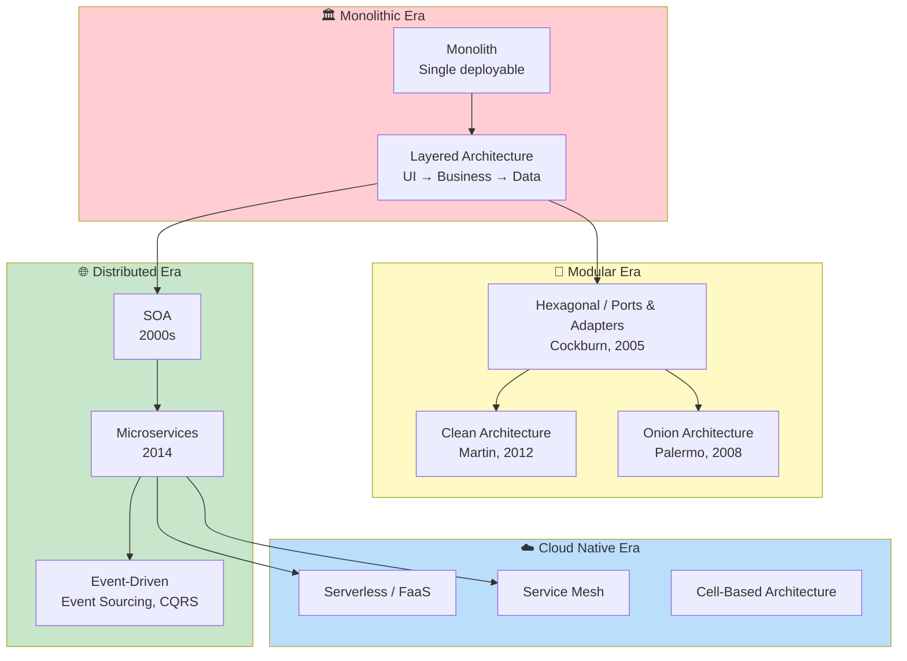
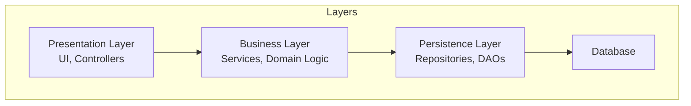
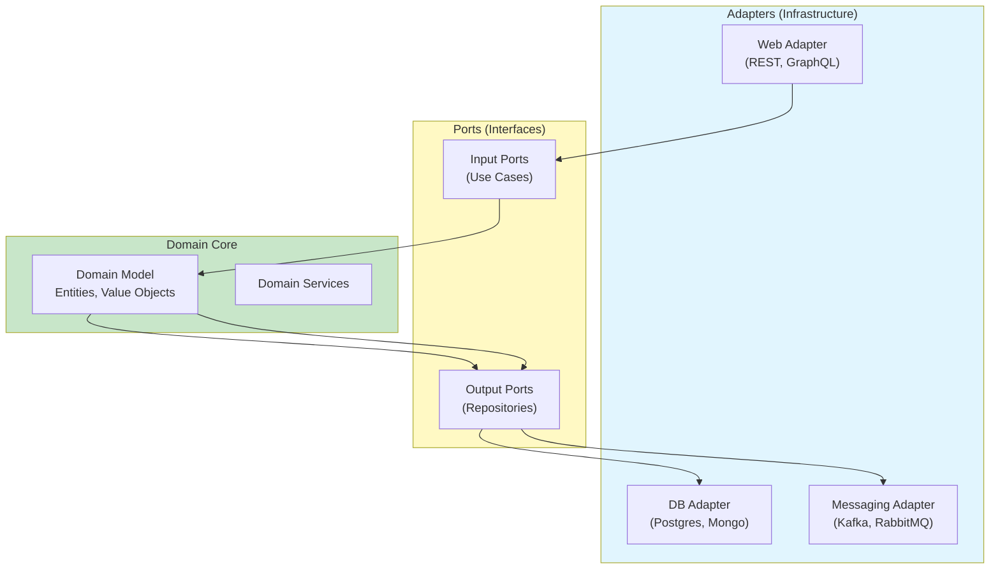
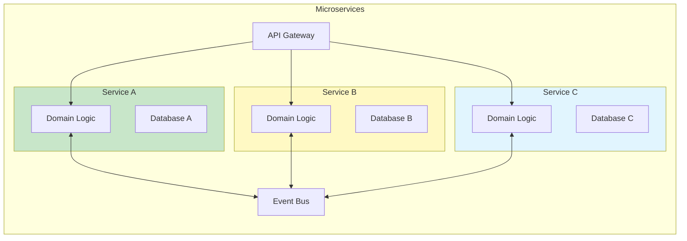
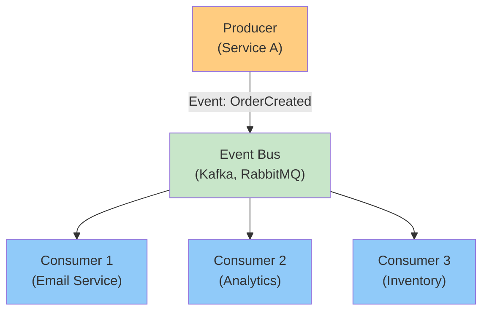
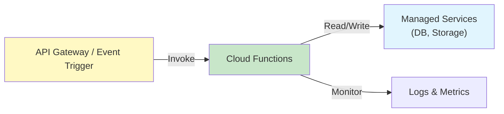
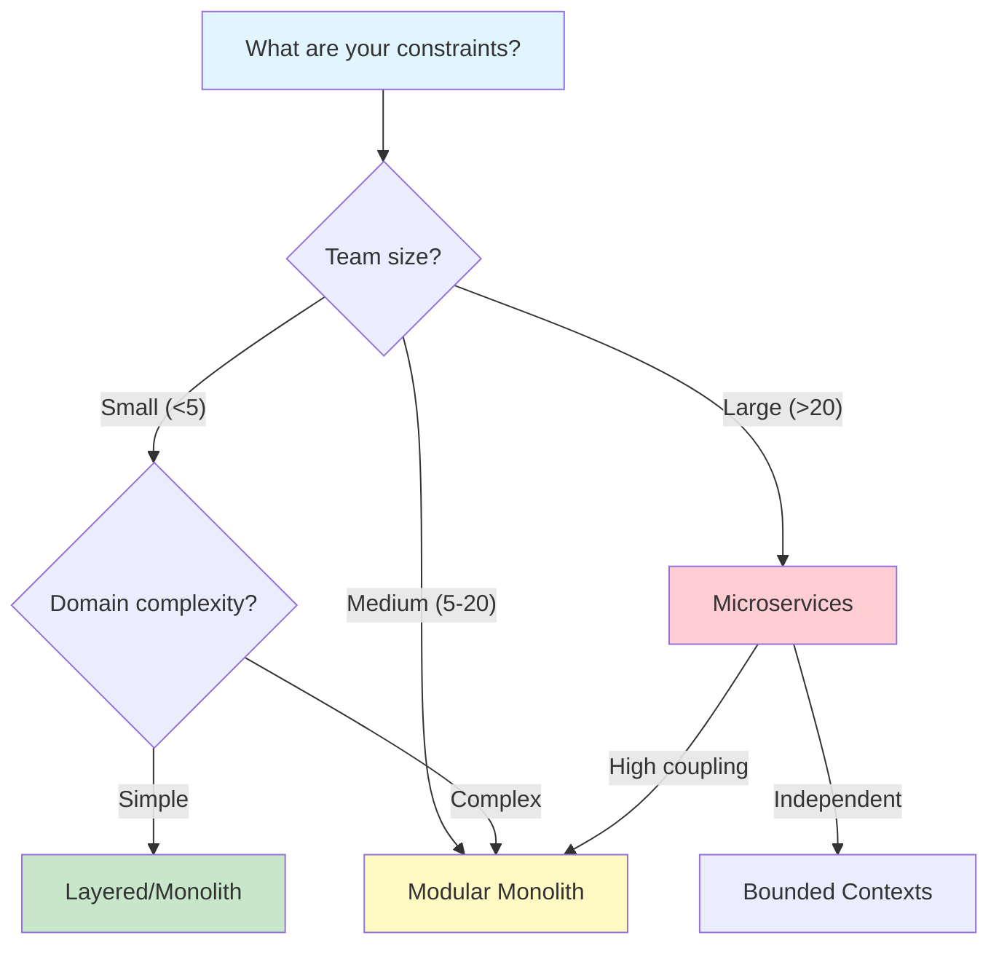

# Architecture Map

How software architecture patterns evolved.

## Architecture Evolution

## Architecture Patterns Deep Dive

### 🏛 Layered Architecture

The traditional "N-tier" approach.

| Aspect | Description |
|--------|-------------|
| **Key idea** | Horizontal separation of concerns |
| **Pros** | Simple, well-understood, good for CRUD |
| **Cons** | Database-centric, business logic scattered |
| **When to use** | Simple applications, form-based UIs |

### 🔌 Hexagonal Architecture (Ports & Adapters)

Domain at the center, infrastructure at the edges.

| Aspect | Description |
|--------|-------------|
| **Key idea** | Domain doesn't depend on infrastructure |
| **Invented by** | Alistair Cockburn, 2005 |
| **Pros** | Testable core, pluggable adapters |
| **Cons** | More complex initially |
| **When to use** | Complex business logic, multiple integrations |

### 🌐 Microservices Architecture

| Aspect | Description |
|--------|-------------|
| **Key idea** | Deploy independently owned services |
| **Pros** | Independent deployment, polyglot, failure isolation |
| **Cons** | Distributed complexity, data consistency challenges |
| **When to use** | Large teams, independent lifecycles |

### 📨 Event-Driven Architecture

| Aspect | Description |
|--------|-------------|
| **Key idea** | Services communicate via events |
| **Patterns** | Event Sourcing, CQRS, Saga |
| **Pros** | Loose coupling, async processing |
| **Cons** | Eventual consistency, debugging complexity |
| **When to use** | High throughput, distributed systems |

### ☁️ Serverless / FaaS

| Aspect | Description |
|--------|-------------|
| **Key idea** | Execute code on demand, pay per execution |
| **Pros** | No server management, auto-scaling |
| **Cons** | Cold starts, vendor lock-in |
| **When to use** | Event-driven, sporadic workloads |

## Architecture Decision Framework

### Trade-offs Considerations

| Concern | Monolith | Modular | Microservices |
|---------|----------|---------|---------------|
| **Development Speed** | Fast initially, slows over time | Medium | Slower initially |
| **Deployment** | All-or-nothing | Better boundaries | Independent |
| **Scalability** | Scale the whole | Scale components | Scale services independently |
| **Data Consistency** | Strong via transactions | Strong | Eventual across services |
| **Team Size** | Small teams | Medium | Large teams |
| **Organizational Fit** | One team | Few teams | Many teams |

### When to Choose What

## Architectural Principles

### Core Principles

1. **High Cohesion** — related functionality belongs together
2. **Low Coupling** — minimize dependencies between components
3. **Separation of Concerns** — each component has one responsibility
4. **Dependency Inversion** — depend on abstractions, not concretions
5. **Information Hiding** — hide implementation details

### Conway's Law in Architecture

> "Organizations which design systems are constrained to produce designs which are copies of the communication structures of these organizations."

**Implication:** Align architecture with team structure.

## Cross-References

- **Process:** [Process Map](./process-map.md) — how processes enable architectures
- **Languages:** [Languages Genealogy](./languages-genealogy.md) — languages that enable patterns
- **Individual Papers:**
  - [Parnas — Information Hiding](../works/papers/parnas-1972-modules.md)
  - [Brewer — CAP Theorem](../works/papers/brewer-2000-cap.md)
  - [Helland — Beyond Distributed Transactions](../works/papers/helland-2007-beyond-dt.md)
- **Individual Books:**
  - [Brooks — Mythical Man-Month](../works/books/brooks-1975-mmm.md)
  - [Newman — Building Microservices](../works/books/newman-2015-microservices.md)
