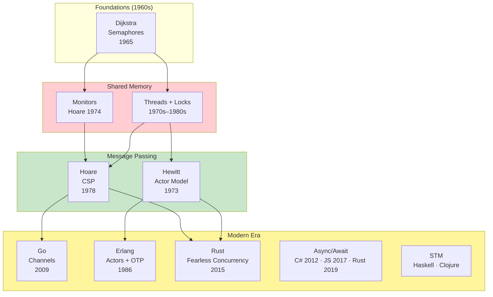
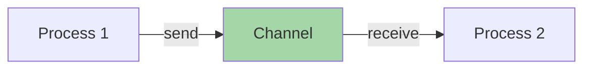
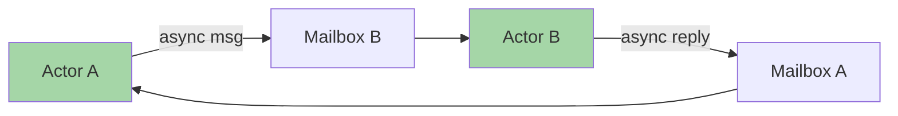

# Concurrency Map

How concurrent programming models evolved from shared memory to message passing and structured concurrency.

## The Big Picture



## Timeline

| Year | Event | Impact |
|------|-------|--------|
| 1965 | Dijkstra — Semaphores | Classic shared-memory primitive |
| 1973 | Hewitt — Actor Model | Message-based concurrency theory |
| 1974 | Hoare — Monitors | Structured mutex + signaling |
| 1978 | Hoare — CSP | Channels + process algebra |
| 1986 | Erlang begins | Industrial actor model |
| 2007 | Clojure (STM, immutability) | Composable transactions in FP |
| 2009 | Go | CSP for everyday developers |
| 2012 | C# async/await | Task concurrency goes mainstream |
| 2015 | Rust 1.0 | Ownership-based concurrency safety |
| 2017 | JavaScript async/await (ES2017) | Async in the browser and Node |
| 2019 | Rust async/await (1.39) | Zero-cost futures |

---

## Shared Memory: Threads + Locks

### The Problem

Multiple threads operate on shared mutable state.
Synchronization primitives prevent races and deadlocks:

| Primitive | Purpose | Examples |
|-----------|---------|----------|
| **Mutex** | Mutual exclusion for critical sections | Java `synchronized`, C++ `std::mutex`, Rust `Mutex<T>` |
| **Semaphore** | Counting semaphore, limited access | Java `Semaphore`, POSIX `sem_t` |
| **Monitor** | Mutex + condition variable as one unit | Java `synchronized` + `wait`/`notify` |
| **Atomic operations** | Lock-free primitive operations | Go `atomic`, Rust `AtomicU64`, C++ `std::atomic` |
| **Condition variables** | Thread signaling / pausing | Java `Condition`, POSIX `pthread_cond_t` |

### Example: Race Condition (Go)

```go
// RACE — two goroutines increment the same counter
var counter int

// Goroutine 1
go func() {
    for i := 0; i < 1000; i++ {
        counter++ // unsynchronized read-modify-write
    }
}()

// Goroutine 2
go func() {
    for i := 0; i < 1000; i++ {
        counter++
    }
}()

// Result: counter < 2000 (lost updates!)
```

**Solution with Mutex:**

```go
var (
    counter int
    mu      sync.Mutex
)

increment := func() {
    for i := 0; i < 1000; i++ {
        mu.Lock()
        counter++
        mu.Unlock()
    }
}

go increment()
go increment()
// Result: counter == 2000
```

### Failure Modes

| Problem | Description |
|---------|-------------|
| **Data races** | Unsynchronized access to shared data |
| **Deadlocks** | Circular wait where threads block each other |
| **Priority inversion** | Low-priority thread holds lock needed by high-priority thread |
| **Lock contention** | Threads spend more time waiting than working |

→ [Concurrency topic](../topics/concurrency/)

---

## CSP — Communicating Sequential Processes

### The Model

Independent processes communicate via **synchronous channels**.
No shared state — coordination happens through send/receive.



**Key properties:**

- **Blocking send** — sender waits until receiver is ready
- **Blocking receive** — receiver waits until data arrives
- **No shared state** — processes are isolated
- **Select** — multiplex over several channels

### Example: Go Channels

```go
ch := make(chan int)

// Producer
go func() {
    ch <- 42
    ch <- 43
    ch <- 44
    close(ch)
}()

// Consumer
for value := range ch {
    fmt.Println(value)
}
```

### CSP-Influenced Languages and Libraries

| Language | Implementation |
|----------|---------------|
| **Go** | `chan`, `select` — built into the language |
| **Clojure** | `core.async` — channels + go blocks |
| **Rust** | `crossbeam::channel`, `tokio::sync::mpsc` |
| **OCaml** | `Eio` (effects-based), `Lwt` (promises) |

→ [Hoare — CSP (1978)](../works/papers/hoare-1978-csp.md) ·
[Go language page](../../languages/go/)

---

## Actor Model

### The Model

**Isolated actors** communicate via **asynchronous messages** through mailboxes.
Each actor processes one message at a time.



**Key properties:**

- **Isolated state** — each actor owns its data, no sharing
- **Asynchronous messaging** — fire-and-forget sends
- **Location transparency** — actors can be local or remote
- **Supervision trees** — handle failures hierarchically ("let it crash")

### Example: Erlang

```erlang
-module(counter).
-export([start/0, increment/1, get/1]).

start() ->
    spawn(fun() -> loop(0) end).

increment(Pid) ->
    Pid ! increment.

get(Pid) ->
    Pid ! {get, self()},
    receive
        {count, Value} -> Value
    end.

loop(Count) ->
    receive
        increment ->
            loop(Count + 1);
        {get, From} ->
            From ! {count, Count},
            loop(Count)
    end.
```

### Actor Implementations

| Language / Framework | Notes |
|----------------------|-------|
| **Erlang / OTP** | Native processes, supervision, distribution |
| **Elixir** | Erlang VM with modern syntax |
| **Akka** (Scala/Java) | Typed actors, clustering |
| **Pekko** (Java/Scala) | Apache fork of Akka |
| **Orleans** (.NET) | Virtual actors ("grains") |

→ [Joe Armstrong](../../authors/joe-armstrong.md) ·
[Erlang language page](../../languages/erlang/)

---

## Modern Approaches

### Async/Await

Write asynchronous I/O code in sequential style.
The runtime manages scheduling (event loop, thread pool, or both).

```typescript
// TypeScript
async function fetchUser(id: number): Promise<User> {
    const response = await fetch(`/api/users/${id}`);
    return response.json();
}

const user = await fetchUser(123);
```

| Language | Since | Runtime Model |
|----------|-------|---------------|
| **C#** | 2012 | Thread pool (Task) |
| **JavaScript** | ES2017 | Single-threaded event loop |
| **Python** | 3.5 (2015) | Single-threaded event loop (asyncio) |
| **Rust** | 1.39 (2019) | Pluggable executor (tokio, async-std) |
| **Kotlin** | 1.3 (2018) | Coroutines + dispatchers |

> **Note:** Go's goroutines serve a similar purpose (cheap concurrent tasks)
> but use a different mechanism — multiplexed green threads, not async/await syntax.

### Software Transactional Memory (STM)

**Composable transactions** over shared mutable references.
Conflicts are detected and retried automatically — no manual locking.

```clojure
;; Clojure STM — refs + dosync
(def account-a (ref 1000))
(def account-b (ref 2000))

(defn transfer [from to amount]
  (dosync
    (alter from - amount)
    (alter to + amount)))

(transfer account-a account-b 100)
;; account-a → 900, account-b → 2100
```

| Language | Implementation |
|----------|---------------|
| **Haskell** | `Control.Concurrent.STM` — `TVar`, `atomically` |
| **Clojure** | `ref`, `dosync`, `alter`, `commute` |

### Rust — Fearless Concurrency

The ownership system prevents data races **at compile time**.
If it compiles, there are no races.

```rust
use std::sync::mpsc;
use std::thread;

fn main() {
    let (tx, rx) = mpsc::channel();

    // Spawn a sender — `tx` is moved into the thread
    thread::spawn(move || {
        tx.send("hello from thread").unwrap();
    });

    // Receive on the main thread — `rx` is owned here
    let msg = rx.recv().unwrap();
    println!("{msg}");
}
```

> `mpsc::Receiver` is **not** `Clone`.
> For multiple consumers, use `crossbeam::channel` or wrap in `Arc<Mutex<Receiver>>`.

→ [Rust language page](../../languages/rust/)

---

## Comparative Summary

| Model | State | Communication | Strengths | Weaknesses |
|-------|-------|---------------|-----------|------------|
| **Threads + Locks** | Shared mutable | Direct access + locks | Maps to hardware | Races, deadlocks, hard to reason about |
| **CSP (Channels)** | Isolated | Synchronous channels | Safe, composable pipelines | Channel management can get complex |
| **Actors** | Isolated | Async messages | Fault-tolerant, distributable | Mailbox overflow, ordering subtleties |
| **Async/Await** | Varies | Language-dependent | Ergonomic I/O concurrency | Colored functions, runtime dependency |
| **STM** | Transactional refs | Implicit (retry) | Composable, no deadlocks | Retry overhead, limited ecosystem |

---

## Further Reading

- [Hoare — CSP (1978)](../works/papers/hoare-1978-csp.md)
- [Lamport — Time, Clocks... (1978)](../works/papers/lamport-1978-clocks.md)
- [Go language page](../../languages/go/)
- [Erlang language page](../../languages/erlang/)
- [Concurrency topic](../topics/concurrency/)

---

## Related Maps

- [Process Map](./process-map.md) — how development practices evolved
- [Distributed Systems Map](./distributed/) — consensus, replication, CAP
- [Languages Genealogy](./languages-genealogy.md) — how languages influenced each other
