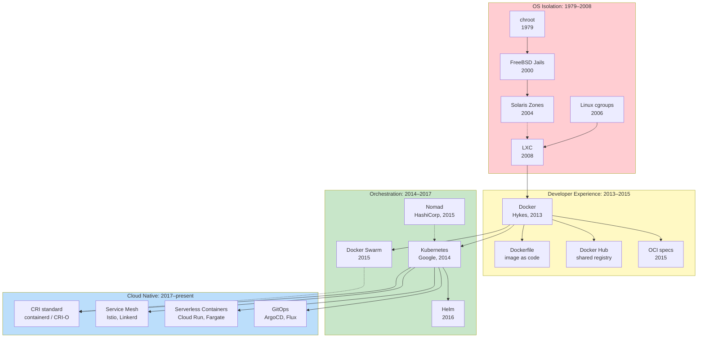
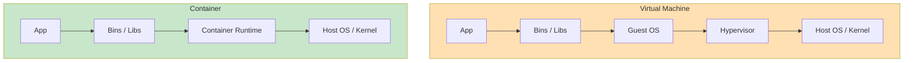
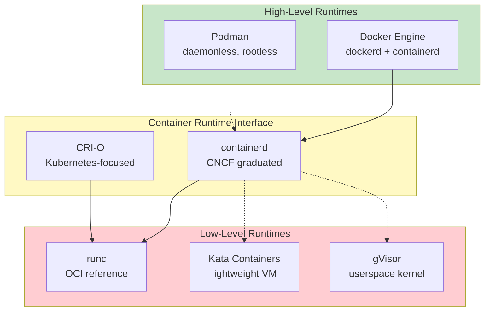
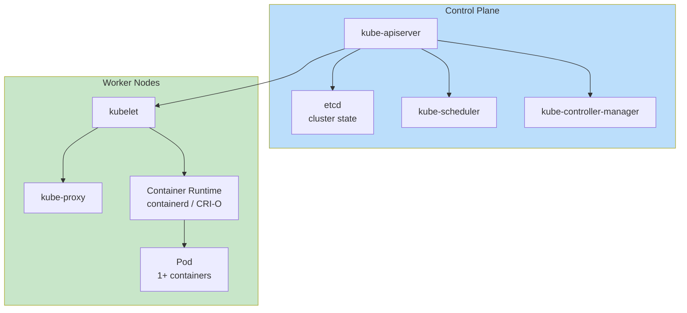

# Containers & Orchestration Map

How container technology evolved from OS-level isolation to the modern cloud-native stack.

## The Big Picture

## Timeline

| Year | Event | Impact |
|------|-------|--------|
| 1979 | chroot in Unix V7 | First filesystem isolation primitive |
| 2000 | FreeBSD Jails | OS-level virtualization with own users, network |
| 2004 | Solaris Zones | Production-ready containers with resource controls |
| 2006 | Linux cgroups (Google) | Resource limiting for processes |
| 2008 | LXC — first Linux container manager | Combined namespaces + cgroups in one tool |
| 2013 | Docker released (Hykes / dotCloud) | Single CLI, Dockerfile, registry — containers go mainstream |
| 2014 | Kubernetes 1.0 (Google) | Production orchestrator based on Borg experience |
| 2015 | Open Container Initiative (OCI) | Standardized image and runtime formats |
| 2016 | Helm — Kubernetes package manager | Templating and release management for K8s |
| 2017 | Kubernetes wins the orchestrator wars | Docker Swarm fades, K8s becomes de facto standard |
| 2019 | containerd graduates from CNCF | Low-level runtime becomes independent project |
| 2022 | Kubernetes 1.24 removes dockershim | Docker shim removed; containerd becomes default |

---

## From VMs to Containers

| Aspect | Virtual Machine | Container |
|--------|-----------------|-----------|
| **Isolation** | Hardware-level (hypervisor) | OS-level (namespaces + cgroups) |
| **Boot time** | Minutes | Seconds |
| **Image size** | GBs | MBs |
| **Kernel** | Each VM has its own | Shared with host |
| **Density** | Tens per host | Hundreds per host |
| **Use case** | Multi-tenant isolation, legacy apps | Microservices, CI/CD, scalable workloads |

---

## Container Runtimes

### The Runtime Stack

### Runtime Comparison

| Runtime | Daemon | Rootless | OCI | K8s CRI | Build support | Compose |
|---------|--------|----------|-----|---------|--------------|---------|
| **Docker** | Yes (`dockerd`) | Optional | Yes | via containerd | BuildKit | `docker compose` |
| **Podman** | No | Default | Yes | via CRI-O | Buildah | `podman-compose`, Quadlet |
| **containerd** | Yes | Optional | Yes | Yes (native) | via BuildKit | — |
| **CRI-O** | Yes | Limited | Yes | Yes (native) | — | — |
| **LXC / LXD** | Yes | Yes | Partial | No | — | — |

---

## Orchestrators

### Orchestrator Comparison

| Orchestrator | Scheduling | Networking | Storage | HA | Ecosystem | Learning Curve |
|-------------|-----------|-----------|--------|-----|----------|----------------|
| **Kubernetes** | Pods + controllers | CNI plugins, NetworkPolicy | CSI / PV / PVC | etcd Raft | Vast (CNCF) | Steep |
| **Docker Swarm** | Services + tasks | Built-in overlay | Volumes / plugins | Raft (managers) | Limited | Gentle |
| **Nomad** | Jobs + groups | Consul (optional) | CSI plugins | Raft | Consul / Vault | Moderate |
| **Amazon ECS** | Tasks + services | AWS VPC | EBS / EFS | AWS-managed | AWS-only | Gentle (in AWS) |

### Kubernetes Architecture

---

## Build Tools

| Tool | Daemon | Rootless | Output | Notes |
|------|--------|----------|--------|-------|
| **Dockerfile + BuildKit** | Yes | Optional | OCI image | Default for Docker; advanced cache and secrets |
| **Buildah** | No | Yes | OCI image | Podman's build tool; scriptable beyond Dockerfile |
| **Kaniko** | No | Yes | OCI image | Runs inside K8s pods; popular in CI |
| **ko** | No | Yes | OCI image | Go-specific; no Dockerfile needed |
| **Jib** | No | Yes | OCI image | [Maven](../topics/process/build-systems/maven.md) / [Gradle](../topics/process/build-systems/gradle.md) plugin for Java |

---

## Core Concepts Across Tools

| Concept | Docker | Podman | Kubernetes | Docker Swarm | Nomad |
|---------|--------|--------|-----------|--------------|-------|
| **Unit of execution** | Container | Container / Pod | Pod | Task | Allocation |
| **Workload definition** | `docker run` / Compose service | `podman run` / Quadlet | Deployment / StatefulSet | Service | Job |
| **Networking** | Bridge / overlay | slirp4netns / CNI | CNI plugin | Overlay (VXLAN) | Consul / CNI |
| **Storage** | Volume / bind | Volume / bind | PV / PVC | Volume / plugin | Host volume / CSI |
| **Secrets** | Docker Secret (Swarm) | Secrets via files | Secret object | Docker Secret | Vault integration |
| **Configuration** | Env / file | Env / file | ConfigMap | Config | Template stanza |

---

## Standards: OCI and CRI

Two specifications keep the ecosystem interoperable:

| Spec | What it defines | Maintained by |
|------|----------------|---------------|
| **OCI image-spec** | Image format on disk and in registries | Open Container Initiative |
| **OCI runtime-spec** | Contract between higher-level tools and low-level runtimes | Open Container Initiative |
| **OCI distribution-spec** | Registry HTTP API | Open Container Initiative |
| **Kubernetes CRI** | Container Runtime Interface — how kubelet talks to runtimes | Kubernetes project |

Without OCI, every runtime and orchestrator would speak its own format and images would not be portable. The 2015 donation of `runc` and the image specification by Docker, Inc. created this common ground.

---

## Sandboxed and MicroVM Runtimes

When kernel sharing is unacceptable (multi-tenant clouds, untrusted workloads), specialized runtimes add isolation:

| Runtime | Mechanism | Use Case |
|---------|-----------|----------|
| **gVisor** | Userspace kernel that intercepts syscalls | Google Cloud Run, sandboxed containers |
| **Kata Containers** | Runs each container in a lightweight VM | Multi-tenant environments |
| **Firecracker** | Minimal micro-VM hypervisor | AWS Lambda, AWS Fargate |

---

## See Also

- [Containers & Orchestration topic](../topics/containers/index.md)
- [Docker](../topics/containers/docker.md) · [Podman](../topics/containers/podman.md) · [containerd](../topics/containers/containerd.md)
- [Kubernetes](../topics/containers/kubernetes.md) · [Helm](../topics/containers/helm.md)
- [Solomon Hykes](../../authors/solomon-hykes.md) — Docker creator
- [Diego Ongaro](../../authors/diego-ongaro.md) — Raft consensus, used by etcd in Kubernetes

---

## Related Maps

- [Architecture Map](./architecture-map.md) — microservices, cloud-native patterns
- [Process Map](./process-map.md) — DevOps, CI/CD
- [Distributed Systems Map](../topics/distributed/index.md) — consensus, replication, CAP
