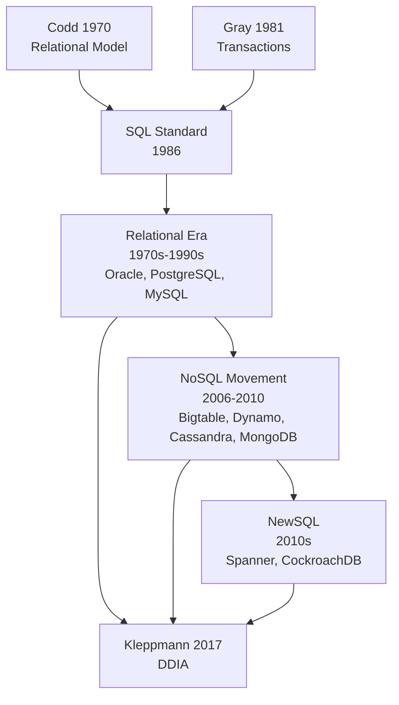
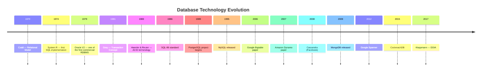
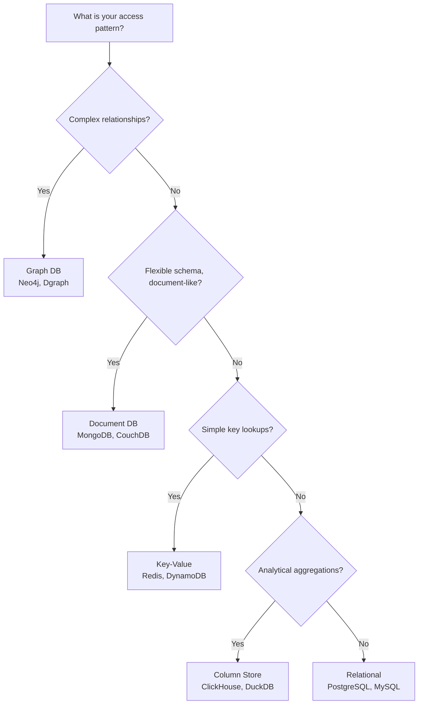

# Databases Map

Visual timeline and concept evolution of database technology — from Codd's
relational model through storage engines to distributed databases.

---

## The Big Picture

---

## A Brief History

---

## Data Model Decision Tree

---

## Storage Engine Comparison

```mermaid
flowchart TB
    subgraph BTree["B-Tree Engine"]
        BT1["In-place updates"] --> BT2["Fixed-size pages"]
        BT2 --> BT3["Read-optimized\nPostgreSQL, MySQL"]
    end

    subgraph LSM["LSM-Tree Engine"]
        L1["Sequential writes"] --> L2["Immutable SSTables"]
        L2 --> L3["Compaction merges"]
        L3 --> L4["Write-optimized\nRocksDB, Cassandra"]
    end

    subgraph Column["Column-Oriented"]
        C1["Columns stored separately"] --> C2["Aggressive compression"]
        C2 --> C3["Batch-optimized\nClickHouse, DuckDB"]
    end
```

---

## Cross-Track Connections

Databases do not exist in isolation. They connect to every other lineage
in the atlas:

| From                          | To                              | Relationship                                                              |
|-------------------------------|---------------------------------|---------------------------------------------------------------------------|
| Codd (Databases)              | Relational Model (Architecture) | Data model shapes system structure                                        |
| Gray (Databases)              | ACID (Distributed)              | Single-node transactions are the baseline distributed systems depart from |
| Dynamo (Databases)            | Brewer (Distributed)            | Leaderless design is an AP choice under CAP                               |
| SQL (Databases)               | Type Systems                    | Relational algebra shares roots with type theory                          |
| PostgreSQL (Databases)        | Containers                      | Stateful workloads need persistent volumes                                |
| Event Sourcing (Architecture) | Databases                       | The log is a unifying abstraction                                         |

---

## Node Inventory

| Year | Node                       | Type | Lineage                | Atlas role     |
|------|----------------------------|------|------------------------|----------------|
| 1970 | Codd — Relational Model    | [P]  | Databases              | foundation     |
| 1974 | System R                   | [L]  | Databases              | embodiment     |
| 1981 | Gray — Transaction Concept | [P]  | Databases              | foundation     |
| 1983 | Haerder & Reuter — ACID    | [R]  | Databases              | formalization  |
| 1986 | SQL standard               | [R]  | Databases              | formalization  |
| 1989 | PostgreSQL                 | [L]  | Databases              | embodiment     |
| 1995 | MySQL                      | [L]  | Databases              | popularization |
| 2006 | Google Bigtable            | [P]  | Databases              | foundation     |
| 2007 | Amazon Dynamo              | [P]  | Databases              | foundation     |
| 2008 | Cassandra                  | [L]  | Databases              | popularization |
| 2009 | MongoDB                    | [L]  | Databases              | popularization |
| 2012 | Google Spanner             | [P]  | Databases              | synthesis      |
| 2017 | Kleppmann — DDIA           | [B]  | Databases, Distributed | synthesis      |

---

## Related

- [Databases topic](../topics/databases/index.md)
- [Distributed Systems map](distributed-map.md)
- [Architecture map](architecture-map.md)
- [Master Timeline](master-timeline.md)