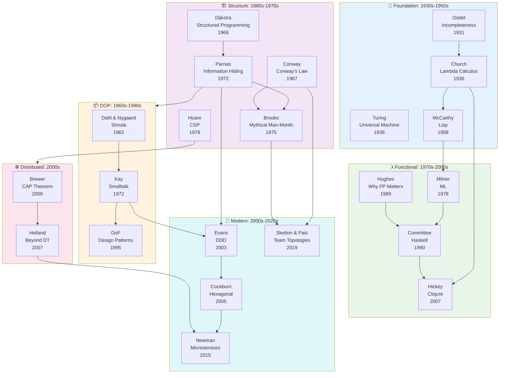
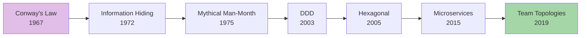
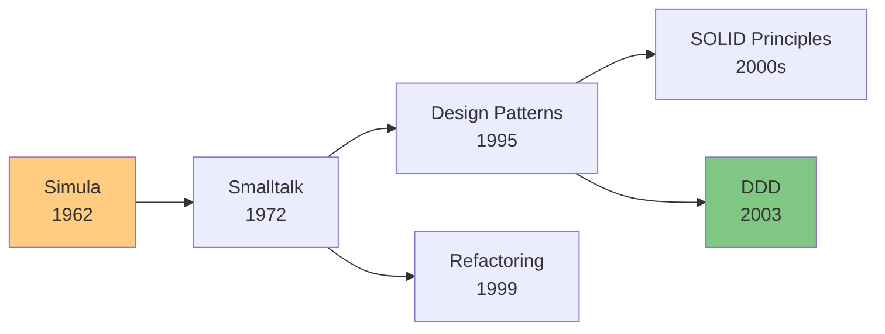
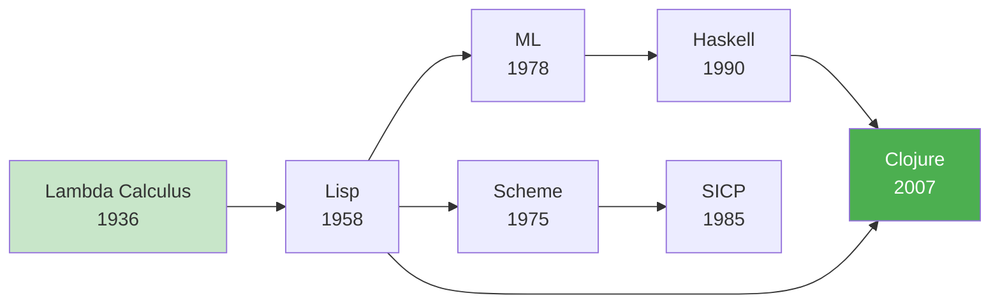
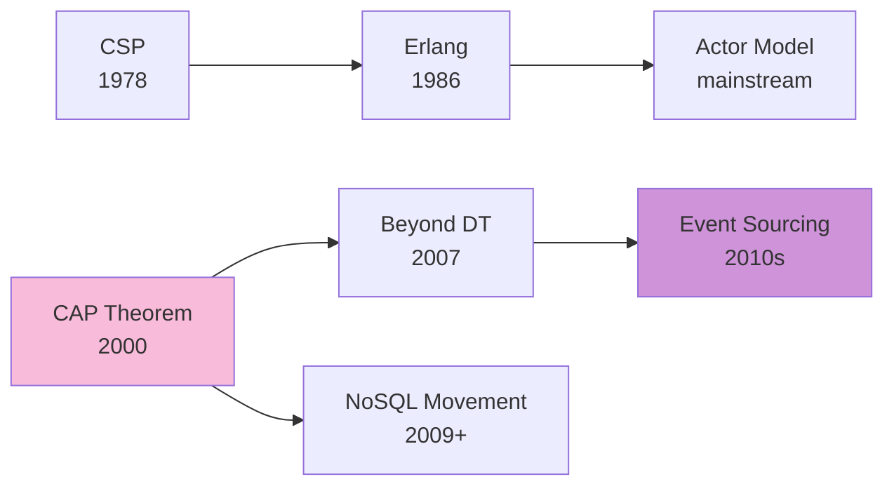
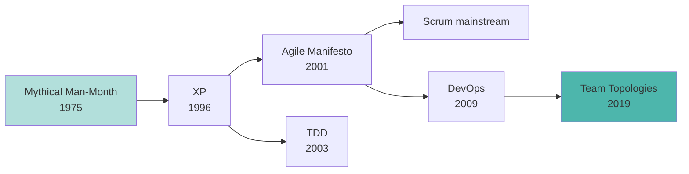

# Ideas Evolution Map

Visual diagram showing how ideas influenced each other across decades.

## The Big Picture

## Timeline of Key Ideas

| Era | Key Ideas | Authors | Legacy |
|------|-----------|----------|--------|
| 1930-1950 | Incompleteness, Lambda calculus, Universal Machine | Gödel, Church, Turing | Theoretical CS foundation |
| 1950-1970 | Lisp, Algol, Structured programming | McCarthy, Dijkstra | First programming paradigms |
| 1970-1980 | Information Hiding, OOP, CSP | Parnas, Kay, Hoare | Modularity, concurrency |
| 1980-1990 | Why FP Matters, Erlang, ML | Hughes, Armstrong | FP renaissance seeds |
| 1990-2000 | Design Patterns, Agile, Refactoring | GoF, Beck, Fowler | OOP maturity, process revolution |
| 2000-2010 | DDD, CAP, Hexagonal | Evans, Brewer, Cockburn | Architecture patterns |
| 2010-2020 | Microservices, Team Topologies | Newman, Skelton | Org + tech co-design |

## Category Breakdown

### 🏗 Architecture & Modularity

The lineage of thinking about system structure.

**Core insight:** Organizations and systems co-evolve. Good boundaries require understanding both.

### 📦 OOP & Design

From Simula to modern design patterns.

**Core insight:** OOP is about messages between objects, not about inheritance hierarchies.

### λ Functional Programming

The long journey from lambda calculus to mainstream.

**Core insight:** Pure functions and immutability make programs easier to reason about.

### 🌐 Distributed Systems

Understanding the limits and patterns of distributed computing.

**Core insight:** Distributed transactions don't scale; design around eventual consistency.

### 📋 Process & Practices

How we work together on software.

**Core insight:** Small teams, short iterations, continuous feedback.

## See Also

- [Master Timeline](./master-timeline.md)
- [Languages Genealogy](./languages-genealogy.md)
- [Paradigms Map](./paradigms-map.md)
