# Maps

Visual diagrams showing how ideas, authors, languages, and practices
connect and influence each other over time.

## Available Maps

| Map | Description |
|-----|-------------|
| [Master Timeline](master-timeline.md) | Chronological view of all major milestones |
| [Ideas Evolution](ideas-evolution.md) | How concepts flow from one to another |
| [Paradigms](paradigms-map.md) | Programming paradigm relationships |
| [Architecture](architecture-map.md) | Evolution of architecture styles |
| [Languages Genealogy](languages-genealogy.md) | Language family tree |
| [Process](process-map.md) | Development methodology evolution |

## How to Read the Maps

- **Solid arrows** (→) indicate direct influence or derivation
- **Dashed arrows** (⇢) indicate indirect or partial influence
- **Nodes** represent authors, works, or concepts
- **Years** show when an idea was published or became prominent

---

## Detailed overview — lineages × era

> This map expands the [Overview map](../../README.md#overview-timeline-major-lineages--era)
> by splitting the four coarse tracks into **seven thematic lineages**
> and adding second-order nodes that were deliberately omitted from
> the overview for clarity.
>
> **Legend for node types** (used in the inventory table below):
>
> | Marker | Kind | Example |
> |--------|------|---------|
> | 📄 | paper / theory | λ-calculus, CAP conjecture |
> | 📘 | book | *Design Patterns*, *DDIA* |
> | 🎤 | talk | *Simple Made Easy* |
> | λ | language | Lisp, Haskell, Clojure |
> | 🧭 | principle / paradigm | SOLID, DbC |
> | ⚙ | practice / methodology | TDD, DevOps |
> | 🏗 | architecture style | Hexagonal, Microservices |

---

### Detailed timeline

```mermaid
timeline
    title Detailed Overview · 7 lineages × 4 eras

    section 1936–1967 · Foundations
        FP              : 📄 λ-calculus (Church 1936)
                        : λ Lisp (McCarthy 1958)
                        : 📄 ISWIM (Landin 1966)
        OOP & Design    : λ Simula (Dahl & Nygaard 1967)
        Types           : 📄 Simply typed λ-calculus (Church 1940)
        Architecture    : 📄 Conway's Law (1967)
        Process         : Early SDLC concepts (1950s)
        Concurrency     : 📄 Semaphores (Dijkstra 1965)
        Distributed     : Centralized mainframes (context)

    section 1968–1989 · Formalization
        FP              : 📄 FP Manifesto (Backus 1978)
                        : λ ML / HM type inference (Milner 1978)
                        : 📄 Why FP Matters (Hughes 1989)
                        : λ Miranda (Turner 1985)
        OOP & Design    : λ Smalltalk (Kay 1972)
                        : 🧭 Design by Contract (Meyer 1988)
                        : 🧭 CQS (Meyer 1988)
                        : 📄 LSP introduced (Liskov 1987)
        Types           : 📄 ADT / CLU (Liskov 1974)
                        : 📄 Hindley–Milner (1978)
                        : 📄 System F (Girard 1972 / Reynolds 1974)
        Architecture    : 📄 Go To Considered Harmful (Dijkstra 1968)
                        : 📄 Information Hiding (Parnas 1972)
                        : 📘 Mythical Man-Month (Brooks 1975)
                        : 📄 No Silver Bullet (Brooks 1986)
                        : 📄 Relational Model (Codd 1970)
        Process         : ⚙ NATO conference (1968)
                        : 📄 Royce — phased lifecycle (1970)
                        : ⚙ SEI CMM (late 1980s)
                        : λ SUnit (Beck 1994 concept, Smalltalk)
        Concurrency     : 📄 Actor Model (Hewitt 1973)
                        : 📄 Monitors (Hoare 1974)
                        : 📄 CSP (Hoare 1978)
                        : λ Erlang (Armstrong 1986)
        Distributed     : 📄 Logical Clocks (Lamport 1978)
                        : 📄 Byzantine Generals (Lamport et al. 1982)
                        : 🧭 ACID (Gray 1983)
                        : 📄 Paxos circulated (Lamport 1989)

    section 1990–2005 · Consolidation
        FP              : λ Haskell 1.0 (1990)
                        : 📄 Monads for FP (Wadler 1992/1995)
                        : 📄 Type classes (Wadler & Blott 1989 — codified in Haskell)
        OOP & Design    : 📘 Design Patterns (GoF 1994)
                        : 📘 Refactoring (Fowler 1999)
                        : 🧭 SOLID principles (Martin, 1990s–2000s)
                        : 📘 POODR concept (Metz, codified later 2012)
        Types           : 📄 LSP formalized (Liskov & Wing 1994)
                        : λ Java generics (Java 5, 2004)
                        : λ Scala (Odersky 2004)
        Architecture    : 📘 SW Architecture (Shaw & Garlan 1996)
                        : 📘 Arch in Practice (Bass et al. 1998)
                        : 📄 REST (Fielding 2000)
                        : 📘 PoEAA (Fowler 2002)
                        : 📘 DDD (Evans 2003)
                        : 🏗 Hexagonal Architecture (Cockburn 2005)
        Process         : ⚙ Scrum (Schwaber & Sutherland 1995)
                        : ⚙ XP (Beck 1999)
                        : ⚙ Agile Manifesto (2001)
                        : 📘 TDD by Example (Beck 2002)
                        : λ JUnit (Beck & Gamma 1997)
                        : λ QuickCheck (Claessen & Hughes 2000)
                        : 📘 Legacy Code (Feathers 2004)
        Concurrency     : λ Java threads / monitors (1995)
                        : 📄 STM (Shavit & Touitou 1995; Harris et al. 2005)
        Distributed     : 📄 Fallacies of Distributed Computing (Deutsch 1994)
                        : 📄 Paxos published (Lamport 1998)
                        : 📄 CAP conjecture (Brewer 2000)
                        : 📄 CAP theorem formalized (Gilbert & Lynch 2002)

    section 2006–present · Scaling & operations
        FP              : λ Clojure (Hickey 2007)
                        : 🎤 Simple Made Easy (Hickey 2011)
                        : 🎤 Boundaries / FC-IS (Bernhardt 2012)
                        : λ Java 8 lambdas (2014)
                        : 📘 Domain Modeling Made Functional (Wlaschin 2018)
        OOP & Design    : 📘 Clean Code (Martin 2008)
                        : 📘 POODR (Metz 2012)
                        : 📘 Philosophy of Software Design (Ousterhout 2018)
        Types           : λ Rust / ownership and affine types (2010)
                        : λ TypeScript / structural types (2012)
                        : λ Kotlin (2016)
        Architecture    : 🏗 CQRS / Event Sourcing (~2010)
                        : 🧭 12-Factor App (Wiggins 2011)
                        : 🏗 C4 Model (Brown 2011+)
                        : 🏗 Microservices (~2011–2015; Newman book 2015)
                        : 📘 Team Topologies (Skelton & Pais 2019)
        Process         : ⚙ DevOps movement (2009)
                        : 📘 Continuous Delivery (Humble & Farley 2010)
                        : ⚙ SRE (Google; public book 2016)
                        : 📘 Accelerate / DORA (Forsgren et al. 2018)
        Concurrency     : λ Go / channels (2009)
                        : λ Rust fearless concurrency (2015)
                        : ⚙ async/await wave (C# 2012, JS 2017, Rust 2019)
        Distributed     : 📄 Dynamo paper (Amazon 2007)
                        : 📄 Life Beyond DT (Helland 2007)
                        : 📄 CRDTs (Shapiro et al. 2011)
                        : 📄 Raft (Ongaro & Ousterhout 2014)
                        : 📘 DDIA (Kleppmann 2017)
```

---

### Detailed lineage graph

The graph below expands the README flowchart by splitting the
yellow subgraph into three distinct areas (OOP & Design, Types,
FP) and pulling Concurrency out of Distributed.

```mermaid
%%{init: {'theme': 'default', 'themeVariables': {'fontSize': '14px'}}}%%
flowchart TB

  subgraph ARCH["🏗 Architecture & Modularity"]
    Conway["Conway · 1967<br/>Conway's Law"]
    Dijkstra["Dijkstra · 1968<br/>Structured Prog"]
    Parnas["Parnas · 1972<br/>Info Hiding"]
    Codd["Codd · 1970<br/>Relational Model"]
    Brooks["Brooks · 1975–86<br/>MMM · NSB"]
    Shaw["Shaw & Garlan · 1996<br/>SW Architecture"]
    Bass["Bass et al. · 1998<br/>Arch in Practice"]
    Fielding["Fielding · 2000<br/>REST"]
    FowlerEAA["Fowler · 2002<br/>PoEAA"]
    Evans["Evans · 2003<br/>DDD"]
    Cockburn["Cockburn · 2005<br/>Hexagonal"]
    TwelveFactor["Wiggins · 2011<br/>12-Factor"]
    Brown["Brown · 2011+<br/>C4 Model"]
    Newman["Newman · 2015<br/>Microservices"]
    Skelton["Skelton & Pais · 2019<br/>Team Topologies"]

    Dijkstra --> Parnas
    Parnas --> Brooks
    Parnas --> Shaw
    Shaw --> Bass
    Bass --> Cockburn
    Bass --> Brown
    Evans --> Newman
    Newman --> TwelveFactor
    Conway --> Skelton
  end

  subgraph OOP["🧩 OOP & Design"]
    Simula["Dahl & Nygaard · 1967<br/>Simula"]
    Kay["Alan Kay · 1972<br/>Smalltalk"]
    Meyer["Meyer · 1988<br/>DbC · CQS"]
    GoF["GoF · 1994<br/>Design Patterns"]
    FowlerRef["Fowler · 1999<br/>Refactoring"]
    Martin["R.C. Martin<br/>SOLID (1990s–2000s)"]
    Metz["Metz · 2012<br/>POODR"]
    Ousterhout["Ousterhout · 2018<br/>Phil. of SW Design"]

    Simula --> Kay
    Kay --> GoF
    GoF --> FowlerRef
    Meyer --> Martin
    FowlerRef --> Metz
  end

  subgraph TYP["🔠 Types"]
    ChurchTyped["Church · 1940<br/>Typed λ"]
    Liskov["Liskov · 1974–94<br/>ADT · CLU · LSP"]
    Milner["Milner · 1978<br/>ML · HM"]
    SystemF["Girard / Reynolds<br/>1972/74 · System F"]
    Wadler["Wadler · 1989–95<br/>Type classes · Monads"]
    RustTypes["Rust · 2010<br/>Ownership · Affine"]
    TSTypes["TypeScript · 2012<br/>Structural types"]

    ChurchTyped --> Milner
    ChurchTyped --> SystemF
    SystemF --> Wadler
    Milner --> Wadler
    Liskov --> Martin
  end

  subgraph FP["λ Functional Programming"]
    Church["Church · 1936<br/>λ-calculus"]
    McCarthy["McCarthy · 1958<br/>Lisp"]
    Backus["Backus · 1978<br/>FP Manifesto"]
    Hughes["Hughes · 1989<br/>Why FP Matters"]
    Haskell["Haskell · 1990"]
    Hickey["Hickey · 2007+<br/>Clojure · SME"]
    Bernhardt["Bernhardt · 2012<br/>FC / IS"]
    Wlaschin["Wlaschin · 2018<br/>DM Made Functional"]

    Church --> McCarthy
    Church --> Backus
    Backus --> Hughes
    Hughes --> Haskell
    Hughes --> Hickey
    Hickey --> Bernhardt
    Milner --> Haskell
    Wadler --> Haskell
    Milner --> Wlaschin
  end

  subgraph PROC["🧪 Process & Testing"]
    NATO68["NATO conf. · 1968<br/>Software Engineering"]
    Royce["Royce · 1970<br/>Phased lifecycle"]
    Deming["Deming · 1982<br/>Systems thinking"]
    SUnit["Beck · 1994<br/>SUnit"]
    QC["Claessen & Hughes<br/>2000 · QuickCheck"]
    Beck["Beck · 1999–2002<br/>XP · TDD"]
    Agile["Agile Manifesto · 2001"]
    Feathers["Feathers · 2004<br/>Legacy Code"]
    CD["Humble & Farley · 2010<br/>Continuous Delivery"]
    Forsgren["Forsgren et al. · 2018<br/>Accelerate · DORA"]

    NATO68 --> Royce
    NATO68 -.-> Deming
    Deming --> Beck
    SUnit --> Beck
    Beck --> Agile
    Beck --> Feathers
    Agile --> CD
    CD --> Forsgren
  end

  subgraph CONC["⚡ Concurrency"]
    DijkSem["Dijkstra · 1965<br/>Semaphores"]
    Hewitt["Hewitt · 1973<br/>Actor Model"]
    Hoare["Hoare · 1974–78<br/>Monitors · CSP"]
    Erlang["Armstrong · 1986<br/>Erlang"]
    GoChan["Go · 2009<br/>Goroutines · Channels"]
    RustConc["Rust · 2015<br/>Fearless concurrency"]

    DijkSem --> Hoare
    Hewitt --> Erlang
    Hoare --> GoChan
    Kay --> Erlang
    Hoare -.-> Erlang
  end

  subgraph DIST["🌐 Distributed Systems"]
    Lamport["Lamport · 1978–89<br/>Clocks · ByzGen · Paxos"]
    Gray["Gray · 1981<br/>Transactions · ACID"]
    Fallacies["Deutsch · 1994<br/>Fallacies of Dist. Comp."]
    Brewer["Brewer · 2000–02<br/>CAP"]
    Helland["Helland · 2007<br/>Life Beyond DT"]
    Dynamo["Amazon · 2007<br/>Dynamo"]
    CRDTs["Shapiro et al. · 2011<br/>CRDTs"]
    Raft["Ongaro · 2014<br/>Raft"]
    Kleppmann["Kleppmann · 2017<br/>DDIA"]

    Lamport --> Brewer
    Lamport --> Raft
    Gray --> Brewer
    Brewer --> Helland
    Helland --> Kleppmann
    Dynamo --> CRDTs
    Raft --> Kleppmann
  end

  %% Cross-track edges
  Parnas -. "modularity" .-> Martin
  Parnas -. "modularity" .-> Evans
  Evans -. "DDD + FP" .-> Wlaschin
  Church --> ChurchTyped
  Liskov --> Cockburn
  Hughes --> QC

  style ARCH fill:#dbeafe,stroke:#3b82f6,stroke-width:2px
  style OOP fill:#fef9c3,stroke:#eab308,stroke-width:2px
  style TYP fill:#fce7f3,stroke:#ec4899,stroke-width:2px
  style FP fill:#fff7ed,stroke:#f97316,stroke-width:2px
  style PROC fill:#dcfce7,stroke:#22c55e,stroke-width:2px
  style CONC fill:#e0f2fe,stroke:#0ea5e9,stroke-width:2px
  style DIST fill:#f3e8ff,stroke:#a855f7,stroke-width:2px
```

---

### Cross-track connections

The table below documents every **dotted edge** — relationships
that cross lineage boundaries and make the atlas a graph, not a tree.

| From | To | Relationship | Explanation |
|------|----|-------------|-------------|
| Parnas (Arch) | Martin (OOP) | modularity → design principles | Information hiding is the intellectual ancestor of SRP and DIP. |
| Parnas (Arch) | Evans (Arch) | modularity → bounded contexts | DDD's module boundaries descend from Parnas's decomposition criteria. |
| Evans (Arch) | Wlaschin (FP) | DDD + FP | *Domain Modeling Made Functional* applies DDD modeling inside an FP type system. |
| Church (FP) | Church Typed (Types) | λ → typed λ | Church himself extended the untyped calculus with simple types. |
| Liskov (Types) | Cockburn (Arch) | ADT contracts → port contracts | Hexagonal ports echo the idea of abstract interfaces from CLU. |
| Hughes (FP) | QuickCheck (Process) | FP → property-based testing | QuickCheck is a direct application of FP composition to test generation. |
| Kay (OOP) | Erlang (Conc) | message passing | Erlang's process model echoes Smalltalk's "everything is a message." |
| Hoare (Conc) | Erlang (Conc) | CSP → supervision | Erlang combines actor semantics with ideas from process algebras. |
| Hewitt (Conc) | Erlang (Conc) | Actor Model → Erlang processes | The most direct theoretical ancestor of Erlang's concurrency model. |
| NATO 1968 (Proc) | Deming (Proc) | discipline → quality | The recognition that software needs engineering discipline opened the door to quality-systems thinking. |
| Milner (Types) | Haskell (FP) | HM inference → Haskell | Haskell's type system is built on Hindley–Milner and extensions by Wadler. |
| Milner (Types) | Wlaschin (FP) | ML lineage → F# / DM | Wlaschin works in F#, a direct descendant of ML. |

---

### Node inventory

Every node that appears in the detailed graph, sorted chronologically,
with its type and the lineage(s) it belongs to.

| Year | Node | Type | Lineage(s) | Atlas role |
|------|------|------|-----------|------------|
| 1936 | Church — λ-calculus | 📄 | FP, Types | foundation |
| 1940 | Church — Typed λ | 📄 | Types | foundation |
| 1958 | McCarthy — Lisp | λ | FP | embodiment |
| 1965 | Dijkstra — Semaphores | 📄 | Concurrency | foundation |
| 1966 | Landin — ISWIM | 📄 | FP | foundation |
| 1967 | Conway — Conway's Law | 📄 | Architecture | foundation |
| 1967 | Dahl & Nygaard — Simula | λ | OOP | embodiment |
| 1968 | Dijkstra — Structured Programming | 📄 | Architecture | foundation |
| 1968 | NATO conference | ⚙ | Process | foundation |
| 1970 | Codd — Relational Model | 📄 | Architecture (data) | foundation |
| 1970 | Royce — Phased lifecycle | 📄 | Process | foundation |
| 1972 | Kay — Smalltalk | λ | OOP | embodiment |
| 1972 | Parnas — Information Hiding | 📄 | Architecture | foundation |
| 1972/74 | Girard / Reynolds — System F | 📄 | Types | foundation |
| 1973 | Hewitt — Actor Model | 📄 | Concurrency | foundation |
| 1974 | Hoare — Monitors | 📄 | Concurrency | foundation |
| 1974 | Liskov — CLU / ADT | 📄 | Types, OOP | foundation |
| 1975 | Brooks — Mythical Man-Month | 📘 | Architecture, Process | popularization |
| 1978 | Backus — FP Manifesto | 📄 | FP | foundation |
| 1978 | Hoare — CSP | 📄 | Concurrency | foundation |
| 1978 | Lamport — Logical Clocks | 📄 | Distributed | foundation |
| 1978 | Milner — ML / HM | λ 📄 | Types, FP | foundation |
| 1982 | Deming — Systems thinking | 📘 | Process | foundation |
| 1982 | Lamport et al. — Byzantine Generals | 📄 | Distributed | foundation |
| 1983 | Gray — ACID | 🧭 | Distributed | formalization |
| 1985 | Turner — Miranda | λ | FP | embodiment |
| 1986 | Armstrong — Erlang | λ | Concurrency, FP | embodiment |
| 1986 | Brooks — No Silver Bullet | 📄 | Architecture | foundation |
| 1987 | Liskov — LSP (introduced) | 📄 | Types, OOP | foundation |
| 1988 | Meyer — DbC / CQS | 🧭 | OOP | formalization |
| 1989 | Hughes — Why FP Matters | 📄 | FP | foundation |
| 1989 | Lamport — Paxos (circulated) | 📄 | Distributed | foundation |
| 1989–95 | Wadler — Type classes, Monads for FP | 📄 | Types, FP | formalization |
| 1990 | Haskell 1.0 | λ | FP, Types | embodiment |
| 1994 | Beck — SUnit | λ | Process | embodiment |
| 1994 | Deutsch — Fallacies of Distributed Computing | 🧭 | Distributed | formalization |
| 1994 | GoF — Design Patterns | 📘 | OOP | popularization |
| 1994 | Liskov & Wing — LSP formalized | 📄 | Types | formalization |
| 1995 | Schwaber & Sutherland — Scrum | ⚙ | Process | popularization |
| 1996 | Shaw & Garlan — SW Architecture | 📘 | Architecture | formalization |
| 1997 | Beck & Gamma — JUnit | λ | Process | embodiment |
| 1998 | Bass et al. — Arch in Practice | 📘 | Architecture | popularization |
| 1998 | Lamport — Paxos (published) | 📄 | Distributed | formalization |
| 1999 | Beck — Extreme Programming | 📘 | Process | popularization |
| 1999 | Fowler — Refactoring | 📘 | OOP | popularization |
| 2000 | Brewer — CAP conjecture | 📄 | Distributed | foundation |
| 2000 | Claessen & Hughes — QuickCheck | λ 📄 | Process, FP | embodiment |
| 2000 | Fielding — REST | 📄 | Architecture | formalization |
| 2001 | Agile Manifesto | ⚙ | Process | popularization |
| 2002 | Beck — TDD by Example | 📘 | Process | popularization |
| 2002 | Fowler — PoEAA | 📘 | Architecture | popularization |
| 2002 | Gilbert & Lynch — CAP formalized | 📄 | Distributed | formalization |
| 2003 | Evans — DDD | 📘 | Architecture | popularization |
| 2003 | Martin — SOLID | 🧭 | OOP | formalization |
| 2004 | Feathers — Legacy Code | 📘 | Process | popularization |
| 2004 | Odersky — Scala | λ | FP, Types | embodiment |
| 2005 | Cockburn — Hexagonal Architecture | 🏗 | Architecture | formalization |
| 2007 | Amazon — Dynamo paper | 📄 | Distributed | foundation |
| 2007 | Helland — Life Beyond DT | 📄 | Distributed | foundation |
| 2007 | Hickey — Clojure | λ | FP | embodiment |
| 2009 | Go language | λ | Concurrency | embodiment |
| 2009 | DevOps movement | ⚙ | Process | popularization |
| 2010 | Humble & Farley — Continuous Delivery | 📘 | Process | popularization |
| 2010 | Rust announced | λ | Types, Concurrency | embodiment |
| ~2010 | CQRS / Event Sourcing | 🏗 | Architecture | formalization |
| 2011 | Brown — C4 Model | 🏗 | Architecture | formalization |
| 2011 | Hickey — Simple Made Easy | 🎤 | FP, Design | popularization |
| 2011 | Shapiro et al. — CRDTs | 📄 | Distributed | foundation |
| 2011 | Wiggins — 12-Factor App | 🧭 | Architecture | formalization |
| 2012 | Bernhardt — Boundaries / FC-IS | 🎤 | FP, Architecture | popularization |
| 2012 | Metz — POODR | 📘 | OOP | popularization |
| 2012 | TypeScript | λ | Types | embodiment |
| 2014 | Java 8 — lambdas | λ | FP | embodiment |
| 2014 | Ongaro & Ousterhout — Raft | 📄 | Distributed | formalization |
| 2015 | Newman — Building Microservices | 📘 | Architecture | popularization |
| 2016 | Google SRE book | 📘 | Process | popularization |
| 2017 | Kleppmann — DDIA | 📘 | Distributed | synthesis |
| 2018 | Forsgren et al. — Accelerate / DORA | 📘 | Process | synthesis |
| 2018 | Ousterhout — Philosophy of SW Design | 📘 | OOP, Architecture | popularization |
| 2018 | Wlaschin — Domain Modeling Made Functional | 📘 | FP, Architecture | synthesis |
| 2019 | Skelton & Pais — Team Topologies | 📘 | Architecture, Process | synthesis |

---

### Date conventions

To avoid ambiguity, this atlas uses the following notation:

| Format | Meaning | Example |
|--------|---------|---------|
| `1999` | Single canonical date | Fowler — Refactoring (1999) |
| `1999 / 2002` | Practice existed earlier; canonical book later | XP (1999) / TDD book (2002) |
| `2000; formalized 2002` | Conjecture first, then rigorous proof | CAP conjecture / theorem |
| `~2011–2015` | A gradual industry wave, not a single point | Microservices |
| `2011+` | Introduced and continuously refined | C4 Model |
| `1989; published 1998` | Written (or circulated) earlier, formally published later | Paxos |

---

### How the detailed map relates to the overview

| Aspect | Overview (README) | Detailed map (this page) |
|--------|------------------|---------------------|
| Tracks | 4 coarse (Arch, OOP+FP+Types, Process, Distributed) | 7 (Arch, OOP, Types, FP, Process, Concurrency, Distributed) |
| Nodes per epoch | 2–4 anchors per track | 4–8 nodes per track |
| Node types | Implicit | Explicitly marked (📄 📘 🎤 λ 🧭 ⚙ 🏗) |
| Atlas roles | Implicit | Labeled (foundation / formalization / embodiment / popularization / synthesis) |
| Cross-track links | 4 dotted edges | 12 documented edges with explanations |
| Purpose | Orientation, "where am I?" | Navigation, "what connects to what and why?" |

> Next level of detail → individual [topic pages](../topics/)
> and [reading paths](../reading-paths/).