# Maps

Visual diagrams showing how ideas, authors, languages, and practices
connect and influence each other over time.

## Available Maps

| Map                                           | Description                                |
|-----------------------------------------------|--------------------------------------------|
| [Master Timeline](master-timeline.md)         | Chronological view of all major milestones |
| [Ideas Evolution](ideas-evolution.md)         | How concepts flow from one to another      |
| [Paradigms](paradigms-map.md)                 | Programming paradigm relationships         |
| [Architecture](architecture-map.md)           | Evolution of architecture styles           |
| [Languages Genealogy](languages-genealogy.md) | Language family tree                       |
| [Process](process-map.md)                     | Development methodology evolution          |

## How to Read the Maps

- **Solid arrows** (→) indicate direct influence or derivation
- **Dashed arrows** (⇢) indicate indirect or partial influence
- **Nodes** represent authors, works, or concepts
- **Years** show when an idea was published or became prominent

---

## Detailed overview — lineages x era

> This map expands the [Overview map](../../README.md#overview-timeline-major-lineages--era)
> by splitting the four coarse tracks into **seven thematic lineages**
> and adding second-order nodes that were deliberately omitted from
> the overview for clarity.
>
> **Legend for node types** (used in the inventory table below):
>
> | Marker | Kind                   | Example                         |
> |--------|------------------------|---------------------------------|
> | [P]    | paper / theory         | lambda-calculus, CAP conjecture |
> | [B]    | book                   | Design Patterns, DDIA           |
> | [T]    | talk                   | Simple Made Easy                |
> | [L]    | language               | Lisp, Haskell, Clojure          |
> | [R]    | principle / paradigm   | SOLID, DbC                      |
> | [X]    | practice / methodology | TDD, DevOps                     |
> | [A]    | architecture style     | Hexagonal, Microservices        |

---

### Detailed timeline

```mermaid
timeline
    title Detailed Overview - 7 lineages x 4 eras

    section 1936-1967 Foundations
        FP 1936             : [P] lambda-calculus (Church 1936)
        FP 1958             : [L] Lisp (McCarthy 1958)
        FP 1966             : [P] ISWIM (Landin 1966)
        OOP 1967            : [L] Simula (Dahl and Nygaard 1967)
        Types 1940          : [P] Typed lambda-calculus (Church 1940)
        Types 1969          : [P] HM type inference - Hindley 1969
        Architecture 1967   : [P] Conways Law (Conway 1967)
        Process 1950s       : Early SDLC concepts (1950s)
        Concurrency 1965    : [P] Semaphores (Dijkstra 1965)
        Distributed 1960s   : Centralized mainframes (context)

    section 1968-1989 Formalization
        FP 1978a            : [P] FP Manifesto (Backus 1978)
        FP 1978b            : [L] ML and HM inference (Milner 1978)
        FP 1982             : [P] HM Algorithm W (Damas and Milner 1982)
        FP 1985             : [L] Miranda (Turner 1985)
        FP 1989a            : [P] Why FP Matters (Hughes 1989)
        FP 1989b            : [P] Type classes (Wadler and Blott 1989)
        OOP 1972            : [L] Smalltalk (Kay 1972)
        OOP 1987            : [R] LSP introduced - talk (Liskov 1987)
        OOP 1988            : [R] Design by Contract and CQS (Meyer 1988)
        Types 1972          : [P] System F (Girard 1972 / Reynolds 1974)
        Types 1974          : [P] ADT and CLU (Liskov 1974)
        Architecture 1968a  : [P] Go To Considered Harmful (Dijkstra 1968)
        Architecture 1968b  : [X] NATO Software Engineering conf (1968)
        Architecture 1970   : [P] Relational Model (Codd 1970)
        Architecture 1972   : [P] Information Hiding (Parnas 1972)
        Architecture 1975   : [B] Mythical Man-Month (Brooks 1975)
        Architecture 1986   : [P] No Silver Bullet (Brooks 1986)
        Process 1970        : [P] Phased lifecycle (Royce 1970)
        Process 1982        : [B] Quality and PDCA (Deming 1982)
        Process 1988        : [X] SEI CMM (late 1980s)
        Concurrency 1973    : [P] Actor Model (Hewitt et al 1973)
        Concurrency 1974    : [P] Monitors (Hoare 1974)
        Concurrency 1978    : [P] CSP (Hoare 1978)
        Concurrency 1986    : [L] Erlang (Armstrong 1986)
        Distributed 1978    : [P] Logical Clocks (Lamport 1978)
        Distributed 1982    : [P] Byzantine Generals (Lamport et al 1982)
        Distributed 1983    : [R] ACID (Haerder and Reuter 1983)
        Distributed 1989    : [P] Paxos circulated (Lamport 1989)

    section 1990-2005 Consolidation
        FP 1990             : [L] Haskell 1.0 (1990)
        FP 1992             : [P] Monads for FP (Wadler 1992)
        OOP 1994            : [B] Design Patterns (GoF 1994)
        OOP 1999            : [B] Refactoring (Fowler 1999)
        OOP 2003            : [R] SOLID principles (Martin 2003)
        Types 1994          : [P] LSP formalized (Liskov and Wing 1994)
        Types 2004          : [L] Scala (Odersky 2004)
        Architecture 1996   : [B] SW Architecture (Shaw and Garlan 1996)
        Architecture 1998   : [B] Arch in Practice (Bass et al 1998)
        Architecture 2000   : [P] REST (Fielding 2000)
        Architecture 2002   : [B] PoEAA (Fowler 2002)
        Architecture 2003   : [B] DDD (Evans 2003)
        Architecture 2005   : [A] Hexagonal Architecture (Cockburn 2005)
        Process 1994        : [L] SUnit (Beck 1994)
        Process 1995        : [X] Scrum (Schwaber 1995)
        Process 1997        : [L] JUnit (Beck and Gamma 1997)
        Process 1999        : [B] Extreme Programming (Beck 1999)
        Process 2000        : [L] QuickCheck (Claessen and Hughes 2000)
        Process 2001        : [X] Agile Manifesto (2001)
        Process 2002        : [B] TDD by Example (Beck 2002)
        Process 2004        : [B] Working with Legacy Code (Feathers 2004)
        Concurrency 1995    : [L] Java threads and monitors (1995)
        Concurrency 1995b   : [P] STM (Shavit and Touitou 1995)
        Distributed 1994    : [R] Fallacies of Distributed Computing (Deutsch 1994)
        Distributed 1998    : [P] Paxos published (Lamport 1998)
        Distributed 2000    : [P] CAP conjecture (Brewer 2000)
        Distributed 2002    : [P] CAP theorem (Gilbert and Lynch 2002)

    section 2006-present Scaling and operations
        FP 2007             : [L] Clojure (Hickey 2007)
        FP 2011             : [T] Simple Made Easy (Hickey 2011)
        FP 2012             : [T] Boundaries and FC-IS (Bernhardt 2012)
        FP 2014             : [L] Java 8 lambdas (2014)
        FP 2018             : [B] Domain Modeling Made Functional (Wlaschin 2018)
        OOP 2008            : [B] Clean Code (Martin 2008)
        OOP 2012            : [B] POODR (Metz 2012)
        OOP 2018            : [B] Philosophy of SW Design (Ousterhout 2018)
        Types 2010          : [L] Rust - ownership and affine types (2010)
        Types 2012          : [L] TypeScript - structural types (2012)
        Types 2016          : [L] Kotlin (2016)
        Architecture 2010   : [A] CQRS and Event Sourcing (Young ~2010)
        Architecture 2011a  : [R] 12-Factor App (Wiggins 2011)
        Architecture 2011b  : [A] C4 Model (Brown 2011+)
        Architecture 2015   : [A] Microservices (Newman 2015)
        Architecture 2019   : [B] Team Topologies (Skelton and Pais 2019)
        Process 2009        : [X] DevOps movement (Debois 2009)
        Process 2010        : [B] Continuous Delivery (Humble and Farley 2010)
        Process 2016        : [B] SRE book (Google 2016)
        Process 2018        : [B] Accelerate and DORA (Forsgren et al 2018)
        Concurrency 2009    : [L] Go - goroutines and channels (2009)
        Concurrency 2015    : [L] Rust fearless concurrency (2015)
        Concurrency 2017    : [X] async/await wave (C# 2012 JS 2017 Rust 2019)
        Distributed 2007a   : [P] Dynamo paper (Amazon 2007)
        Distributed 2007b   : [P] Life Beyond DT (Helland 2007)
        Distributed 2011    : [P] CRDTs (Shapiro et al 2011)
        Distributed 2014    : [P] Raft (Ongaro and Ousterhout 2014)
        Distributed 2017    : [B] DDIA (Kleppmann 2017)
```

---

### Detailed lineage graph

The graph below expands the README flowchart by splitting the
yellow subgraph into three distinct areas (OOP and Design, Types,
FP) and pulling Concurrency out of Distributed.

```mermaid
%%{init: {'theme': 'default', 'themeVariables': {'fontSize': '14px'}}}%%
flowchart TB

  subgraph ARCH["Architecture and Modularity"]
    Conway["Conway 1967\nConway's Law"]
    Dijkstra68["Dijkstra 1968\nStructured Prog"]
    Parnas["Parnas 1972\nInfo Hiding"]
    Codd["Codd 1970\nRelational Model"]
    Brooks["Brooks 1975-86\nMMM / NSB"]
    Shaw["Shaw and Garlan 1996\nSW Architecture"]
    Bass["Bass et al 1998\nArch in Practice"]
    Fielding["Fielding 2000\nREST"]
    FowlerEAA["Fowler 2002\nPoEAA"]
    Evans["Evans 2003\nDDD"]
    Cockburn["Cockburn 2005\nHexagonal"]
    TwelveFactor["Wiggins 2011\n12-Factor"]
    Brown["Brown 2011+\nC4 Model"]
    YoungCQRS["Young ~2010\nCQRS / Event Sourcing"]
    Newman["Newman 2015\nMicroservices"]
    Skelton["Skelton and Pais 2019\nTeam Topologies"]

    Dijkstra68 --> Parnas
    Parnas --> Brooks
    Parnas --> Shaw
    Shaw --> Bass
    Bass --> Cockburn
    Bass --> Brown
    Evans --> Newman
    Newman --> TwelveFactor
    Conway --> Skelton
    FowlerEAA --> YoungCQRS
  end

  subgraph OOP["OOP and Design"]
    Simula["Dahl and Nygaard 1967\nSimula"]
    Kay["Alan Kay 1972\nSmalltalk"]
    Meyer["Meyer 1988\nDbC / CQS"]
    GoF["GoF 1994\nDesign Patterns"]
    FowlerRef["Fowler 1999\nRefactoring"]
    Martin["R.C. Martin 2003\nSOLID"]
    Metz["Metz 2012\nPOODR"]
    Ousterhout["Ousterhout 2018\nPhil of SW Design"]

    Simula --> Kay
    Kay --> GoF
    GoF --> FowlerRef
    Meyer --> Martin
    FowlerRef --> Metz
  end

  subgraph TYP["Types"]
    ChurchTyped["Church 1940\nTyped lambda"]
    Hindley["Hindley 1969\nHM inference"]
    Liskov["Liskov 1974-94\nADT / CLU / LSP"]
    SystemF["Girard / Reynolds\n1972-74 System F"]
    Milner["Milner 1978\nML / HM"]
    DamasMilner["Damas and Milner 1982\nAlgorithm W"]
    WadlerTypes["Wadler and Blott 1989\nType classes"]
    RustTypes["Rust 2010\nOwnership / Affine"]
    TSTypes["TypeScript 2012\nStructural types"]

    ChurchTyped --> Hindley
    ChurchTyped --> SystemF
    Hindley --> Milner
    SystemF --> WadlerTypes
    Milner --> WadlerTypes
    Milner --> DamasMilner
  end

  subgraph FP["Functional Programming"]
    Church["Church 1936\nlambda-calculus"]
    McCarthy["McCarthy 1958\nLisp"]
    Landin["Landin 1966\nISWIM"]
    Backus["Backus 1978\nFP Manifesto"]
    Hughes["Hughes 1989\nWhy FP Matters"]
    Haskell["Haskell 1990"]
    WadlerMonads["Wadler 1992\nMonads for FP"]
    Hickey["Hickey 2007+\nClojure / SME"]
    Bernhardt["Bernhardt 2012\nFC / IS"]
    Wlaschin["Wlaschin 2018\nDM Made Functional"]

    Church --> McCarthy
    Church --> Backus
    McCarthy --> Landin
    Landin --> Backus
    Backus --> Hughes
    Hughes --> Haskell
    Hughes --> Hickey
    Haskell --> WadlerMonads
    Hickey --> Bernhardt
  end

  subgraph PROC["Process and Testing"]
    NATO68["NATO conf 1968\nSoftware Engineering"]
    Royce["Royce 1970\nPhased lifecycle"]
    Deming["Deming 1982\nQuality / PDCA"]
    SUnit["Beck 1994\nSUnit"]
    Beck["Beck 1999-2002\nXP / TDD"]
    QC["Claessen and Hughes 2000\nQuickCheck"]
    Agile["Agile Manifesto 2001"]
    Feathers["Feathers 2004\nLegacy Code"]
    CD["Humble and Farley 2010\nContinuous Delivery"]
    Forsgren["Forsgren et al 2018\nAccelerate / DORA"]

    NATO68 --> Royce
    NATO68 -.-> Deming
    Deming --> Beck
    SUnit --> Beck
    Beck --> Agile
    Beck --> Feathers
    Agile --> CD
    CD --> Forsgren
  end

  subgraph CONC["Concurrency"]
    DijkSem["Dijkstra 1965\nSemaphores"]
    Hewitt["Hewitt et al 1973\nActor Model"]
    Hoare["Hoare 1974-78\nMonitors / CSP"]
    Agha["Agha 1986\nActors formalized"]
    Erlang["Armstrong 1986\nErlang"]
    GoChan["Go 2009\nGoroutines / Channels"]
    RustConc["Rust 2015\nFearless concurrency"]

    DijkSem --> Hoare
    Hewitt --> Agha
    Agha --> Erlang
    Hoare --> GoChan
    Hoare -.-> Erlang
  end

  subgraph DIST["Distributed Systems"]
    Lamport["Lamport 1978-98\nClocks / ByzGen / Paxos"]
    HaerderReuter["Haerder and Reuter 1983\nACID"]
    Fallacies["Deutsch 1994\nFallacies of Dist Comp"]
    Brewer["Brewer 2000-02\nCAP"]
    Helland["Helland 2007\nLife Beyond DT"]
    Dynamo["Amazon 2007\nDynamo"]
    CRDTs["Shapiro et al 2011\nCRDTs"]
    Raft["Ongaro 2014\nRaft"]
    Kleppmann["Kleppmann 2017\nDDIA"]

    Lamport --> Brewer
    Lamport --> Raft
    HaerderReuter --> Brewer
    Brewer --> Helland
    Helland --> Kleppmann
    Dynamo --> CRDTs
    Raft --> Kleppmann
  end

  %% Cross-track edges
  Parnas -. "modularity" .-> Martin
  Parnas -. "modularity" .-> Evans
  Evans -. "DDD + FP" .-> Wlaschin
  Church --> ChurchTyped
  Liskov -. "ADT contracts" .-> Cockburn
  Hughes -. "FP composition" .-> QC
  Kay -. "message passing" .-> Erlang
  Milner --> Haskell
  WadlerTypes --> Haskell
  WadlerMonads --> Hickey
  Milner -. "ML lineage" .-> Wlaschin

  style ARCH fill:#dbeafe,stroke:#3b82f6,stroke-width:2px
  style OOP  fill:#fef9c3,stroke:#eab308,stroke-width:2px
  style TYP  fill:#fce7f3,stroke:#ec4899,stroke-width:2px
  style FP   fill:#fff7ed,stroke:#f97316,stroke-width:2px
  style PROC fill:#dcfce7,stroke:#22c55e,stroke-width:2px
  style CONC fill:#e0f2fe,stroke:#0ea5e9,stroke-width:2px
  style DIST fill:#f3e8ff,stroke:#a855f7,stroke-width:2px
```

---

### Cross-track connections

The table below documents every **dotted edge** — relationships
that cross lineage boundaries and make the atlas a graph, not a tree.

| From                 | To                   | Relationship                    | Explanation                                                                                         |
|----------------------|----------------------|---------------------------------|-----------------------------------------------------------------------------------------------------|
| Parnas (Arch)        | Martin (OOP)         | modularity to design principles | Information hiding is the intellectual ancestor of SRP and DIP.                                     |
| Parnas (Arch)        | Evans (Arch)         | modularity to bounded contexts  | DDD's module boundaries descend from Parnas's decomposition criteria.                               |
| Evans (Arch)         | Wlaschin (FP)        | DDD + FP                        | *Domain Modeling Made Functional* applies DDD modeling inside an FP type system.                    |
| Church (FP)          | Church Typed (Types) | lambda to typed lambda          | Church himself extended the untyped calculus with simple types (1940).                              |
| Liskov (Types)       | Cockburn (Arch)      | ADT contracts to port contracts | Hexagonal ports echo the idea of abstract interfaces from CLU.                                      |
| Hughes (FP)          | QuickCheck (Process) | FP to property-based testing    | QuickCheck is a direct application of FP composition to test generation.                            |
| Kay (OOP)            | Erlang (Conc)        | message passing                 | Erlang's process model echoes Smalltalk's "everything is a message."                                |
| Hoare (Conc)         | Erlang (Conc)        | CSP to supervision trees        | Erlang combines actor semantics with ideas from process algebras (CSP).                             |
| Hewitt (Conc)        | Agha (Conc)          | Actor Model formalized          | Agha's 1986 dissertation gave the Actor Model its rigorous operational semantics.                   |
| NATO 1968 (Proc)     | Deming (Proc)        | discipline to quality           | Recognition that software needs engineering discipline opened the door to quality-systems thinking. |
| Milner (Types)       | Haskell (FP)         | HM inference to Haskell         | Haskell's type system is built on Hindley-Milner and extensions by Wadler.                          |
| Milner (Types)       | Wlaschin (FP)        | ML lineage to F#                | Wlaschin works in F#, a direct descendant of ML via OCaml.                                          |
| Wadler Types (Types) | Haskell (FP)         | type classes to Haskell         | Wadler and Blott's 1989 type classes paper was directly incorporated into Haskell.                  |
| Wadler Monads (FP)   | Hickey (FP)          | monadic patterns                | Clojure's sequence abstractions and transducers echo monadic composition.                           |

---

### Node inventory

Every node that appears in the detailed graph, sorted chronologically,
with its type and the lineage(s) it belongs to.

| Year    | Node                                         | Type   | Lineage(s)            | Atlas role     |
|---------|----------------------------------------------|--------|-----------------------|----------------|
| 1936    | Church — lambda-calculus                     | [P]    | FP, Types             | foundation     |
| 1940    | Church — Typed lambda                        | [P]    | Types                 | foundation     |
| 1958    | McCarthy — Lisp                              | [L]    | FP                    | embodiment     |
| 1965    | Dijkstra — Semaphores                        | [P]    | Concurrency           | foundation     |
| 1966    | Landin — ISWIM                               | [P]    | FP                    | foundation     |
| 1967    | Conway — Conway's Law                        | [P]    | Architecture          | foundation     |
| 1967    | Dahl and Nygaard — Simula                    | [L]    | OOP                   | embodiment     |
| 1968    | Dijkstra — Structured Programming            | [P]    | Architecture          | foundation     |
| 1968    | NATO conference                              | [X]    | Process               | foundation     |
| 1969    | Hindley — HM type inference                  | [P]    | Types                 | foundation     |
| 1970    | Codd — Relational Model                      | [P]    | Architecture (data)   | foundation     |
| 1970    | Royce — Phased lifecycle                     | [P]    | Process               | foundation     |
| 1972    | Kay — Smalltalk                              | [L]    | OOP                   | embodiment     |
| 1972    | Parnas — Information Hiding                  | [P]    | Architecture          | foundation     |
| 1972/74 | Girard / Reynolds — System F                 | [P]    | Types                 | foundation     |
| 1973    | Hewitt, Bishop, Steiger — Actor Model        | [P]    | Concurrency           | foundation     |
| 1974    | Hoare — Monitors                             | [P]    | Concurrency           | foundation     |
| 1974    | Liskov — CLU / ADT                           | [P]    | Types, OOP            | foundation     |
| 1975    | Brooks — Mythical Man-Month                  | [B]    | Architecture, Process | popularization |
| 1978    | Backus — FP Manifesto                        | [P]    | FP                    | foundation     |
| 1978    | Hoare — CSP                                  | [P]    | Concurrency           | foundation     |
| 1978    | Lamport — Logical Clocks                     | [P]    | Distributed           | foundation     |
| 1978    | Milner — ML / HM                             | [L][P] | Types, FP             | foundation     |
| 1982    | Damas and Milner — Algorithm W               | [P]    | Types                 | formalization  |
| 1982    | Deming — Quality / PDCA                      | [B]    | Process               | foundation     |
| 1982    | Lamport et al. — Byzantine Generals          | [P]    | Distributed           | foundation     |
| 1983    | Haerder and Reuter — ACID                    | [P]    | Distributed           | formalization  |
| 1985    | Turner — Miranda                             | [L]    | FP                    | embodiment     |
| 1986    | Agha — Actors formalized                     | [P]    | Concurrency           | formalization  |
| 1986    | Armstrong — Erlang                           | [L]    | Concurrency, FP       | embodiment     |
| 1986    | Brooks — No Silver Bullet                    | [P]    | Architecture          | foundation     |
| 1987    | Liskov — LSP talk at OOPSLA                  | [P]    | Types, OOP            | foundation     |
| 1988    | LSP published in SIGPLAN Notices             | [P]    | Types, OOP            | formalization  |
| 1988    | Meyer — DbC / CQS                            | [R]    | OOP                   | formalization  |
| 1989    | Hughes — Why FP Matters                      | [P]    | FP                    | foundation     |
| 1989    | Lamport — Paxos (circulated)                 | [P]    | Distributed           | foundation     |
| 1989    | Wadler and Blott — Type classes              | [P]    | Types, FP             | formalization  |
| 1990    | Haskell 1.0                                  | [L]    | FP, Types             | embodiment     |
| 1992    | Wadler — Monads for FP                       | [P]    | FP, Types             | formalization  |
| 1994    | Beck — SUnit                                 | [L]    | Process               | embodiment     |
| 1994    | Deutsch — Fallacies of Distributed Computing | [R]    | Distributed           | formalization  |
| 1994    | GoF — Design Patterns                        | [B]    | OOP                   | popularization |
| 1994    | Liskov and Wing — LSP formalized             | [P]    | Types                 | formalization  |
| 1995    | Schwaber — Scrum                             | [X]    | Process               | popularization |
| 1995    | Shavit and Touitou — STM                     | [P]    | Concurrency           | foundation     |
| 1996    | Shaw and Garlan — SW Architecture            | [B]    | Architecture          | formalization  |
| 1997    | Beck and Gamma — JUnit                       | [L]    | Process               | embodiment     |
| 1998    | Bass et al. — Arch in Practice               | [B]    | Architecture          | popularization |
| 1998    | Lamport — Paxos (published)                  | [P]    | Distributed           | formalization  |
| 1999    | Beck — Extreme Programming                   | [B]    | Process               | popularization |
| 1999    | Fowler — Refactoring                         | [B]    | OOP                   | popularization |
| 2000    | Brewer — CAP conjecture                      | [P]    | Distributed           | foundation     |
| 2000    | Claessen and Hughes — QuickCheck             | [L][P] | Process, FP           | embodiment     |
| 2000    | Fielding — REST                              | [P]    | Architecture          | formalization  |
| 2001    | Agile Manifesto                              | [X]    | Process               | popularization |
| 2002    | Beck — TDD by Example                        | [B]    | Process               | popularization |
| 2002    | Fowler — PoEAA                               | [B]    | Architecture          | popularization |
| 2002    | Gilbert and Lynch — CAP formalized           | [P]    | Distributed           | formalization  |
| 2003    | Evans — DDD                                  | [B]    | Architecture          | popularization |
| 2003    | Martin — SOLID                               | [R]    | OOP                   | formalization  |
| 2004    | Feathers — Working with Legacy Code          | [B]    | Process               | popularization |
| 2004    | Odersky — Scala                              | [L]    | FP, Types             | embodiment     |
| 2005    | Cockburn — Hexagonal Architecture            | [A]    | Architecture          | formalization  |
| 2007    | Amazon — Dynamo paper                        | [P]    | Distributed           | foundation     |
| 2007    | Helland — Life Beyond DT                     | [P]    | Distributed           | foundation     |
| 2007    | Hickey — Clojure                             | [L]    | FP                    | embodiment     |
| 2009    | Debois — DevOps movement                     | [X]    | Process               | popularization |
| 2009    | Go language                                  | [L]    | Concurrency           | embodiment     |
| 2010    | Humble and Farley — Continuous Delivery      | [B]    | Process               | popularization |
| 2010    | Rust announced                               | [L]    | Types, Concurrency    | embodiment     |
| ~2010   | Young — CQRS / Event Sourcing                | [A]    | Architecture          | formalization  |
| 2011    | Brown — C4 Model                             | [A]    | Architecture          | formalization  |
| 2011    | Hickey — Simple Made Easy                    | [T]    | FP, Design            | popularization |
| 2011    | Shapiro et al. — CRDTs                       | [P]    | Distributed           | foundation     |
| 2011    | Wiggins — 12-Factor App                      | [R]    | Architecture          | formalization  |
| 2012    | Bernhardt — Boundaries / FC-IS               | [T]    | FP, Architecture      | popularization |
| 2012    | Metz — POODR                                 | [B]    | OOP                   | popularization |
| 2012    | TypeScript                                   | [L]    | Types                 | embodiment     |
| 2014    | Java 8 lambdas                               | [L]    | FP                    | embodiment     |
| 2014    | Ongaro and Ousterhout — Raft                 | [P]    | Distributed           | formalization  |
| 2015    | Newman — Building Microservices              | [B]    | Architecture          | popularization |
| 2015    | Rust stable release                          | [L]    | Types, Concurrency    | embodiment     |
| 2016    | Google — SRE book                            | [B]    | Process               | popularization |
| 2016    | Kotlin stable                                | [L]    | Types, FP             | embodiment     |
| 2017    | Kleppmann — DDIA                             | [B]    | Distributed           | synthesis      |
| 2018    | Forsgren et al. — Accelerate / DORA          | [B]    | Process               | synthesis      |
| 2018    | Ousterhout — Philosophy of SW Design         | [B]    | OOP, Architecture     | popularization |
| 2018    | Wlaschin — Domain Modeling Made Functional   | [B]    | FP, Architecture      | synthesis      |
| 2019    | Skelton and Pais — Team Topologies           | [B]    | Architecture, Process | synthesis      |

---

### Date conventions

To avoid ambiguity, this atlas uses the following notation:

| Format                  | Meaning                                                        | Example                     |
|-------------------------|----------------------------------------------------------------|-----------------------------|
| `1999`                  | Single canonical date                                          | Fowler — Refactoring (1999) |
| `1999 / 2002`           | Practice existed earlier; canonical book later                 | XP (1999) / TDD book (2002) |
| `2000; formalized 2002` | Conjecture first, then rigorous proof                          | CAP conjecture / theorem    |
| `~2011-2015`            | A gradual industry wave, not a single point                    | Microservices               |
| `2011+`                 | Introduced and continuously refined                            | C4 Model                    |
| `1989; published 1998`  | Written (or circulated) earlier, formally published later      | Paxos                       |
| `1969 / 1978 / 1982`    | Independent discovery, then applied, then algorithm formalized | Hindley-Milner              |

---

### How the detailed map relates to the overview

| Aspect            | Overview (README)                                   | Detailed map (this page)                                                       |
|-------------------|-----------------------------------------------------|--------------------------------------------------------------------------------|
| Tracks            | 4 coarse (Arch, OOP+FP+Types, Process, Distributed) | 7 (Arch, OOP, Types, FP, Process, Concurrency, Distributed)                    |
| Nodes per epoch   | 2-4 anchors per track                               | 4-8 nodes per track                                                            |
| Node types        | Implicit                                            | Explicitly marked ([P] [B] [T] [L] [R] [X] [A])                                |
| Atlas roles       | Implicit                                            | Labeled (foundation / formalization / embodiment / popularization / synthesis) |
| Cross-track links | 4 dotted edges                                      | 14 documented edges with explanations                                          |
| Purpose           | Orientation, "where am I?"                          | Navigation, "what connects to what and why?"                                   |

> Next level of detail: individual [topic pages](../topics/index.md)
> and [reading paths](../reading-paths/index.md).