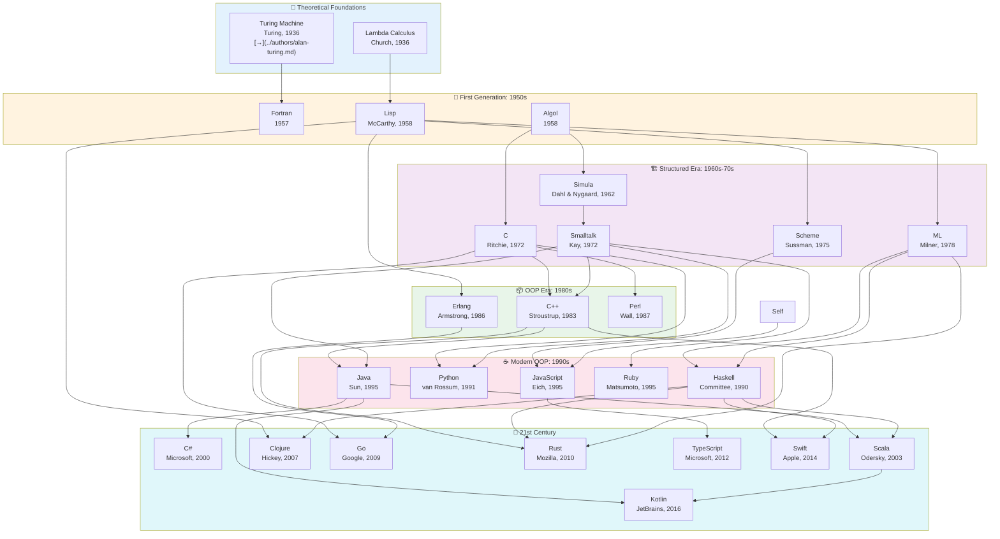
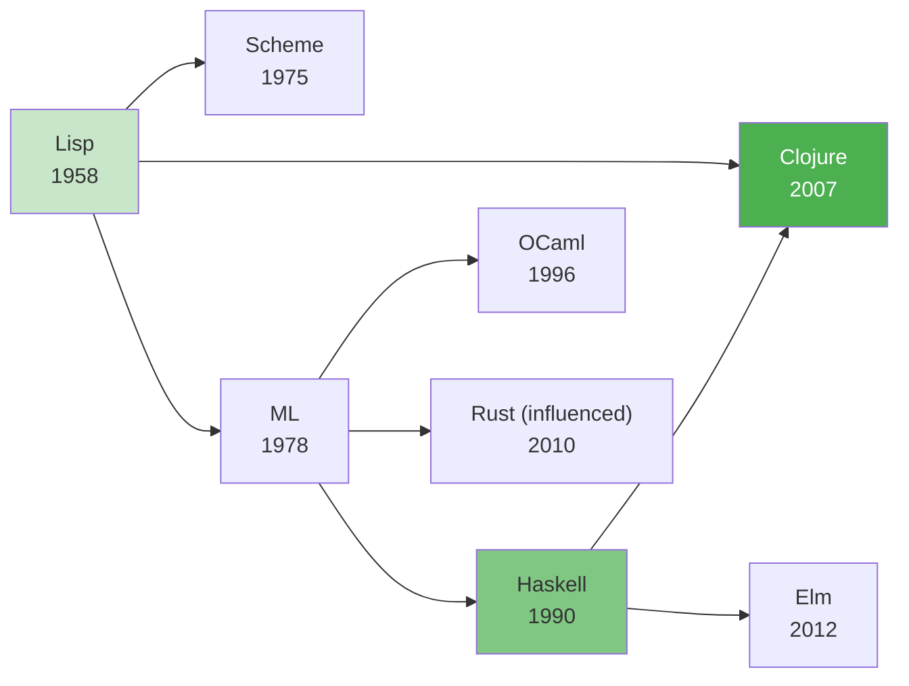
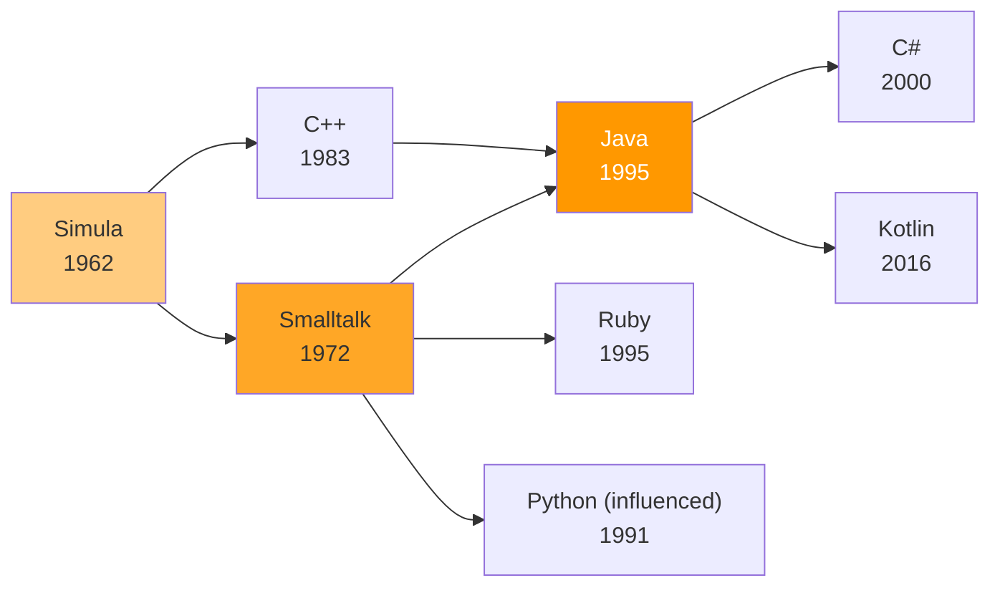
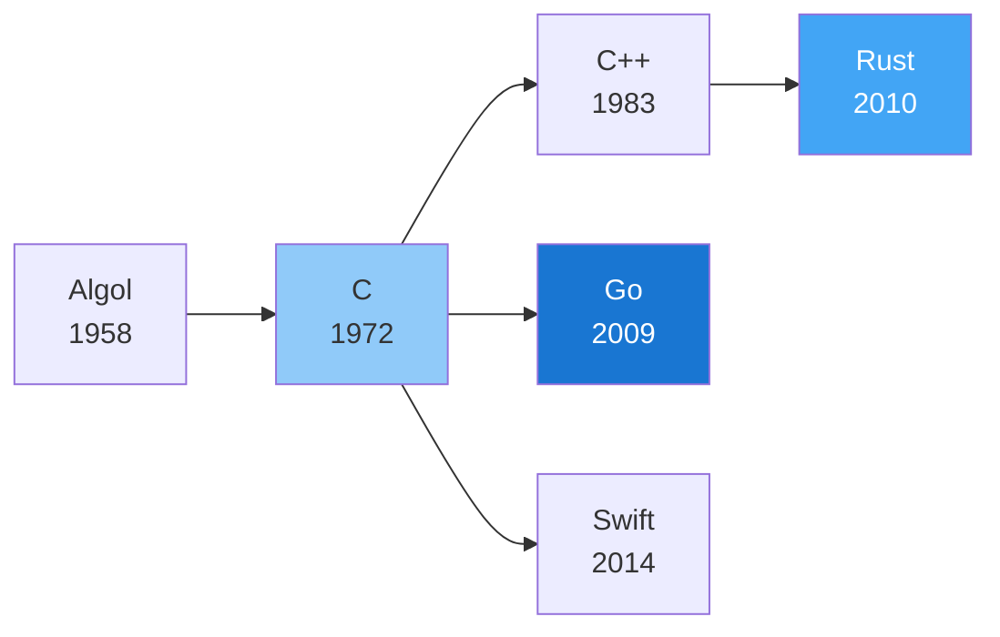
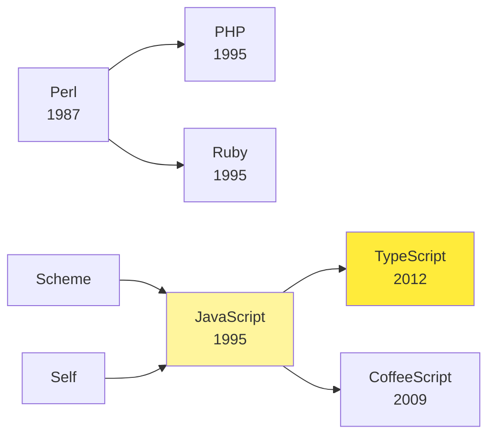
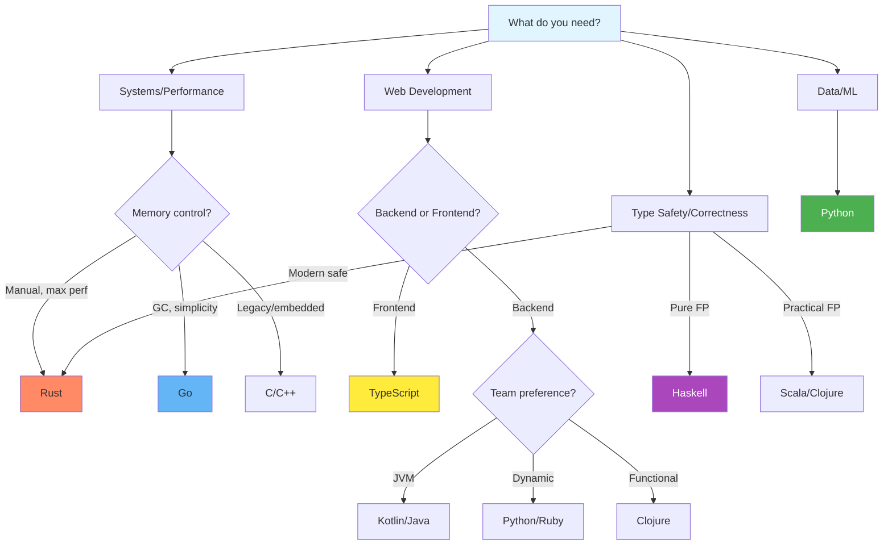

# Languages Genealogy Map

Visual diagram showing how programming languages evolved and influenced each other.

## Language Family Tree

## Language Families

### λ Functional Family

**Characteristics:** Immutability, first-class functions, pattern matching, type inference (ML-family).

### 📦 OOP Family

**Characteristics:** Classes, inheritance, encapsulation, polymorphism.

### ⚡ Systems Programming Family

**Characteristics:** Low-level control, memory management, performance focus.

### 🌐 Web & Scripting Family

**Characteristics:** Dynamic typing, rapid development, web-native.

## Quick Reference

| Language | Year | Primary Paradigm | Influenced By | Influenced |
|----------|------|------------------|---------------|------------|
| Lisp | 1958 | Functional | Lambda calculus | Scheme, ML, Clojure, Ruby |
| Simula | 1962 | OOP | Algol | Smalltalk, C++, all OOP |
| C | 1972 | Imperative | Algol, BCPL | C++, Go, Rust, most systems |
| Smalltalk | 1972 | OOP | Simula | Ruby, Python, Java, ObjC |
| ML | 1978 | Functional | Lisp | Haskell, OCaml, Rust |
| Erlang | 1986 | Functional, Actor | Lisp, Prolog | Go (concurrency), Elixir |
| Haskell | 1990 | Pure Functional | ML, Miranda | Rust, Swift, PureScript |
| Python | 1991 | Multi-paradigm | C, Smalltalk | Julia, Nim |
| Java | 1995 | OOP | C++, Smalltalk | C#, Kotlin, Scala |
| JavaScript | 1995 | Multi-paradigm | Scheme, Self | TypeScript, countless |
| Ruby | 1995 | OOP | Smalltalk, Perl, Lisp | Crystal, Elixir |
| Clojure | 2007 | Functional | Lisp, Haskell | — |
| Go | 2009 | Imperative | C, CSP, Erlang | Zig |
| Rust | 2010 | Multi-paradigm | C++, Haskell, ML | — |
| TypeScript | 2012 | Multi-paradigm | JavaScript, C# | — |

## Language Selection Guide

## See Also

- [Master Timeline](./master-timeline.md)
- [Paradigms Map](./paradigms-map.md)
- [Individual Language Pages](../languages/)
