# Master Timeline

A comprehensive chronological view of key milestones in software development.

## Interactive Timeline

```mermaid
timeline
    title Key Milestones — Major Lineages × Era

    section 1936–1967 · Foundations
        1936 : λ-calculus (Church)
        1958 : Lisp (McCarthy)
        1967 : Simula (Dahl & Nygaard) : Conway's Law

    section 1968–1989 · Formalization
        1968 : NATO conference — software engineering
        1970 : Royce — phased lifecycle
        1972 : Information Hiding (Parnas) : Smalltalk (Kay) : Prolog (Colmerauer)
        1973 : Actor Model (Hewitt)
        1974 : Abstract Data Types (Liskov)
        1975 : Mythical Man-Month (Brooks)
        1978 : ML / Hindley–Milner (Milner) : CSP (Hoare) : Logical Clocks (Lamport) : FP Manifesto (Backus)
        1982 : Byzantine Generals (Lamport et al.)
        1983 : ACID (Gray)
        1986 : Erlang (Armstrong)
        1987 : LSP introduced (Liskov)
        1988 : Design by Contract (Meyer)
        1989 : Why FP Matters (Hughes)

    section 1990–2005 · Consolidation
        1990 : Haskell 1.0
        1994 : Design Patterns (GoF) : LSP formalized (Liskov & Wing)
        1995 : Scrum (Schwaber & Sutherland)
        1996 : Shaw & Garlan — Software Architecture
        1998 : Bass et al. : Paxos published (Lamport)
        1999 : Refactoring (Fowler) : XP (Beck)
        2000 : CAP conjecture (Brewer)
        2001 : Agile Manifesto
        2002 : CAP formalized : TDD (Beck)
        2003 : DDD (Evans)
        2005 : Hexagonal Architecture (Cockburn)

    section 2006–present · Scaling & Operations
        2007 : Clojure (Hickey) : Dynamo / cloud era (Amazon)
        2009 : DevOps movement : Go / channels (Google)
        2010 : Continuous Delivery (Humble & Farley) : Rust / ownership types
        2011 : Microservices emerging : C4 Model (Brown) : CRDTs (Shapiro et al.)
        2014 : Raft (Ongaro & Ousterhout)
        2016 : SRE book (Google)
        2018 : DORA metrics
        2019 : Team Topologies (Skelton & Pais)
```

## By Era

### 1930-1959: Theoretical Foundations

| Year | Event | Author/Creator | Significance |
|------|-------|----------------|--------------|
| 1931 | Incompleteness Theorems | Kurt Gödel | Fundamental limits of formal systems |
| 1936 | Lambda Calculus | Alonzo Church | Mathematical foundation for FP |
| 1936 | Turing Machine | Alan Turing | Theoretical model of computation |
| 1958 | Lisp | John McCarthy | First functional programming language |

**Key Insight:** Before software, mathematicians created the theoretical models that would underpin all programming.

### 1960-1969: The Birth of Software Engineering

| Year | Event | Author/Creator | Significance |
|------|-------|----------------|--------------|
| 1962 | Simula | Dahl & Nygaard | First OOP concepts (classes, objects) |
| 1967 | Conway's Law | Melvin Conway | Organizations shape systems |
| 1968 | Go To Considered Harmful | Dijkstra | Structured programming manifesto |
| 1968 | NATO Conference | Various | Term "Software Engineering" coined |

**Key Insight:** The 60s saw the transition from programming as craft to engineering discipline.

### 1970-1979: Modularity & Theory

| Year | Event | Author/Creator | Significance |
|------|-------|----------------|--------------|
| 1972 | Information Hiding | Parnas | Foundation of modular design |
| 1972 | Smalltalk | Alan Kay | Pure OOP, GUI concepts |
| 1972 | C Language | Ritchie | Systems programming lingua franca |
| 1975 | Mythical Man-Month | Brooks | Project management classic |
| 1978 | CSP | Tony Hoare | Concurrency algebra |

**Key Insight:** The 70s established the theoretical frameworks we still use today.

### 1980-1989: Languages Proliferate

| Year | Event | Author/Creator | Significance |
|------|-------|----------------|--------------|
| 1983 | C++ | Stroustrup | OOP for systems programming |
| 1986 | Erlang | Ericsson | Concurrency, fault tolerance |
| 1987 | Perl | Larry Wall | Text processing, CGI scripting |
| 1989 | Why FP Matters | John Hughes | Influential FP advocacy |

**Key Insight:** Languages began specializing for different domains and paradigms.

### 1990-1999: The Web Changes Everything

| Year | Event | Author/Creator | Significance |
|------|-------|----------------|--------------|
| 1990 | Haskell 1.0 | Committee | Pure functional language |
| 1991 | Python | Van Rossum | Readable, general-purpose |
| 1995 | Java | Sun | Write once, run anywhere |
| 1995 | Design Patterns | GoF | Vocabulary for OOP solutions |
| 1995 | Ruby | Matsumoto | Developer happiness |
| 1996 | Extreme Programming | Beck | Agile precursor |
| 1999 | Refactoring | Fowler | Code improvement discipline |

**Key Insight:** The internet demanded new languages and practices, and the Agile movement began.

### 2000-2009: Distributed Systems & Agile

| Year | Event | Author/Creator | Significance |
|------|-------|----------------|--------------|
| 2000 | CAP Theorem | Brewer | Distributed systems limits |
| 2001 | Agile Manifesto | 17 signatories | Process revolution |
| 2003 | Domain-Driven Design | Evans | Strategic design language |
| 2005 | Hexagonal Architecture | Cockburn | Ports & adapters |
| 2007 | Clojure | Hickey | Modern Lisp for JVM |
| 2007 | Beyond Distributed Transactions | Helland | Scalability patterns |
| 2009 | Go | Google | Simple systems language |
| 2009 | Node.js | Dahl | JavaScript on server |

**Key Insight:** Scale forced new thinking about data, consistency, and team organization.

### 2010-2019: Modern Architecture

| Year | Event | Author/Creator | Significance |
|------|-------|----------------|--------------|
| 2010 | Rust | Mozilla | Memory safety without GC |
| 2011 | Simple Made Easy | Hickey | Simplicity manifesto |
| 2012 | TypeScript | Microsoft | Typed JavaScript |
| 2012 | Boundaries | Bernhardt | FP/OOP synthesis |
| 2014 | Microservices | Various | Architectural style named |
| 2015 | Building Microservices | Newman | Practical guide |
| 2017 | DDIA | Kleppmann | Distributed systems guide |
| 2019 | Team Topologies | Skelton & Pais | Org design for flow |

**Key Insight:** Architecture became about managing complexity at scale, both technical and organizational.

## Cross-References

- **Languages:** [Languages Genealogy](./languages-genealogy.md)
- **Paradigms:** [Paradigms Map](./paradigms-map.md)
- **Architecture:** [Architecture Map](./architecture-map.md)
- **Ideas:** [Ideas Evolution](./ideas-evolution.md)
