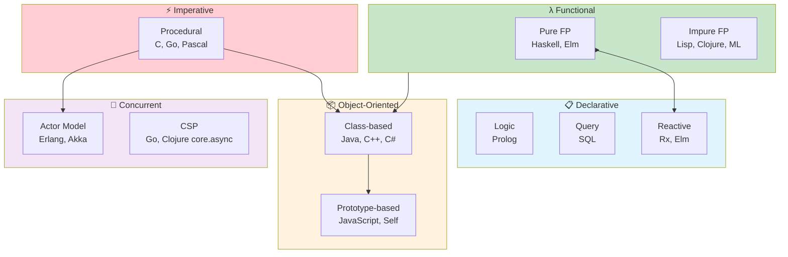
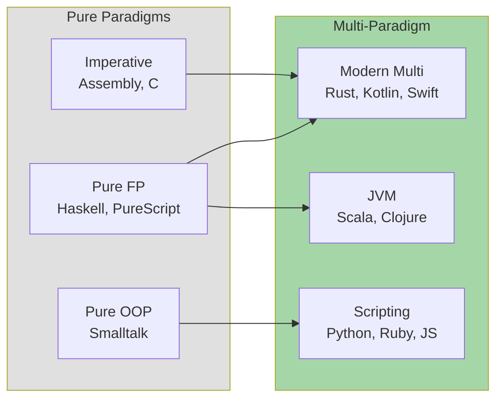
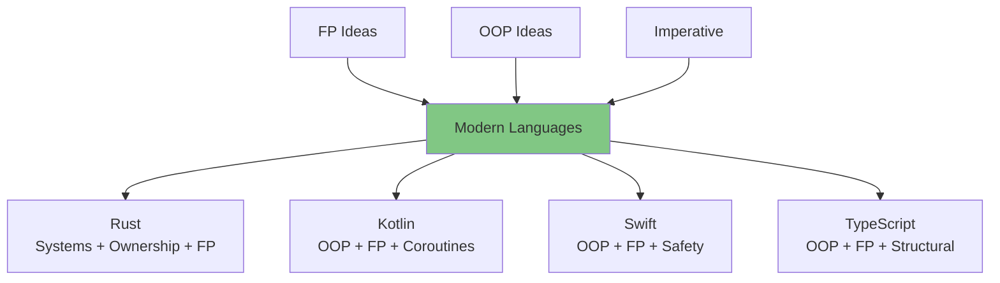

# Paradigms Map

How programming paradigms relate and evolved over time.

## Paradigm Overview



## Paradigm Deep Dive

### ⚡ Imperative Programming

**Core Idea:** Programs as sequences of commands that change state.

| Aspect | Description |
|--------|-------------|
| **Focus** | How to do something (step by step) |
| **State** | Mutable, explicit |
| **Control** | Loops, conditionals, goto |
| **Languages** | C, Go, Pascal, Fortran |

```c
// Imperative: explicit steps
int sum = 0;
for (int i = 0; i < n; i++) {
    sum += arr[i];
}
```

**Strengths:** Direct hardware mapping, performance, explicit control flow.

**Weaknesses:** State management complexity, harder to parallelize.

### 📦 Object-Oriented Programming

**Core Idea:** Programs as collections of objects that communicate via messages.

| Aspect | Description |
|--------|-------------|
| **Focus** | Data + behavior bundled together |
| **State** | Encapsulated in objects |
| **Key concepts** | Encapsulation, inheritance, polymorphism |
| **Languages** | Java, C++, C#, Python, Ruby |

```java
// OOP: objects with behavior
class Account {
    private double balance;

    public void deposit(double amount) {
        this.balance += amount;
    }
}
```

**Strengths:** Modeling real-world domains, code reuse, encapsulation.

**Weaknesses:** Inheritance hierarchies can be rigid, shared mutable state.

#### Subparadigms

- **Class-based** (Java, C++): Objects are instances of classes
- **Prototype-based** (JavaScript, Self): Objects clone from other objects

### λ Functional Programming

**Core Idea:** Programs as composition of pure functions transforming immutable data.

| Aspect | Description |
|--------|-------------|
| **Focus** | What to compute (transformations) |
| **State** | Immutable values |
| **Key concepts** | Pure functions, higher-order functions, recursion |
| **Languages** | Haskell, Clojure, Erlang, ML, Lisp |

```haskell
-- Functional: declarative transformation
sum = foldr (+) 0
```

**Strengths:** Testability, concurrency safety, reasoning about code.

**Weaknesses:** Learning curve, performance overhead (mitigated in practice).

#### Subparadigms

- **Pure FP** (Haskell): All side effects tracked in type system
- **Impure FP** (Clojure, Lisp): FP style with pragmatic escape hatches

### 📋 Declarative Programming

**Core Idea:** Describe what you want, not how to get it.

| Aspect | Description |
|--------|-------------|
| **Focus** | Specification of desired result |
| **Languages** | SQL, Prolog, HTML/CSS, Terraform |

```sql
-- Declarative: what, not how
SELECT name FROM users WHERE age > 18
```

**Strengths:** Expressiveness, optimization opportunities, domain focus.

**Weaknesses:** Less control, can be opaque.

### 🔄 Concurrent Programming Paradigms

#### Actor Model

**Core Idea:** Isolated actors communicate via async messages.

| Aspect | Description |
|--------|-------------|
| **Key insight** | No shared state between actors |
| **Languages** | Erlang, Elixir, Akka (Scala/Java) |

```erlang
% Erlang: actors receive messages
loop(State) ->
    receive
        {add, X} -> loop(State + X);
        {get, Pid} -> Pid ! State, loop(State)
    end.
```

#### CSP (Communicating Sequential Processes)

**Core Idea:** Processes communicate via channels, synchronously.

| Aspect | Description |
|--------|-------------|
| **Key insight** | Channel is the synchronization point |
| **Languages** | Go, Clojure (core.async) |

```go
// Go: CSP-style channels
ch := make(chan int)
go func() { ch <- 42 }()
value := <-ch
```

## Languages by Paradigm



## Paradigm Selection Guide

| Problem Domain | Recommended Paradigm | Why |
|----------------|----------------------|-----|
| System utilities | Imperative (Go, Rust) | Direct, efficient |
| Business apps | OOP + FP mix (Kotlin, C#) | Domain modeling |
| Data pipelines | Functional (Clojure, Elixir) | Transformations |
| Highly concurrent | Actor/CSP (Erlang, Go) | Isolation |
| Proofs/safety | Pure FP (Haskell, Idris) | Mathematical properties |
| Quick scripting | Multi-paradigm (Python) | Flexibility |

## The Synthesis: Modern Multi-Paradigm

Modern languages blend paradigms:



**Key insight:** The best modern code uses:
- **Immutability by default** (from FP)
- **Encapsulation** (from OOP)
- **Explicit effects** (from Pure FP)
- **Pragmatic escape hatches** (from Imperative)

## See Also

- [Languages Genealogy](./languages-genealogy.md)
- [Ideas Evolution](./ideas-evolution.md)
- [Functional Programming Topic](../topics/paradigms/functional/index.md)
