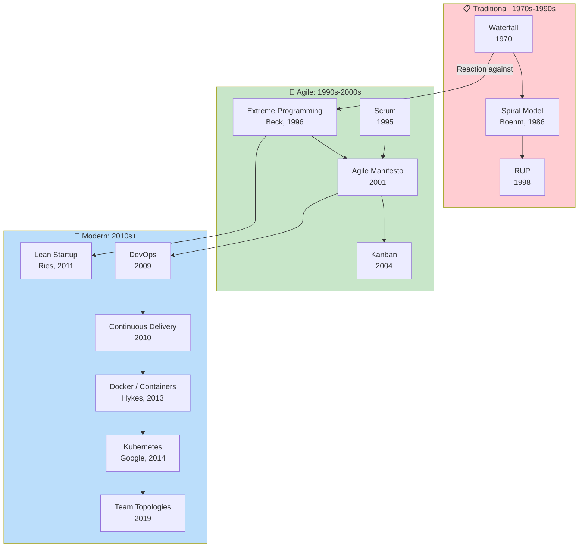
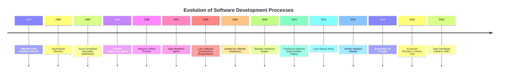
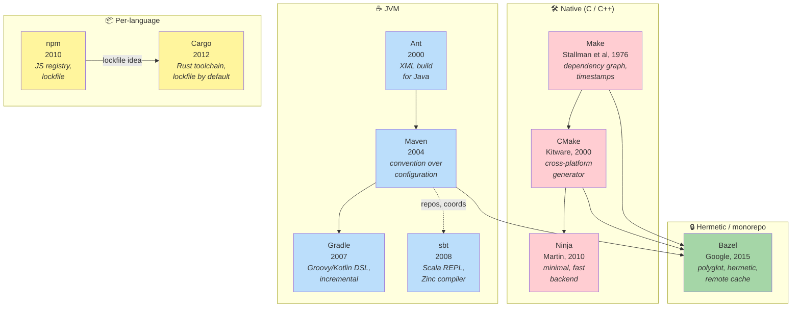
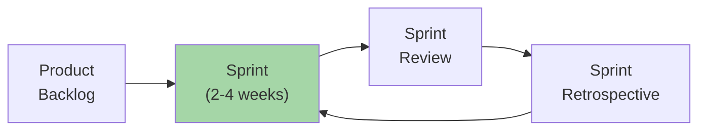
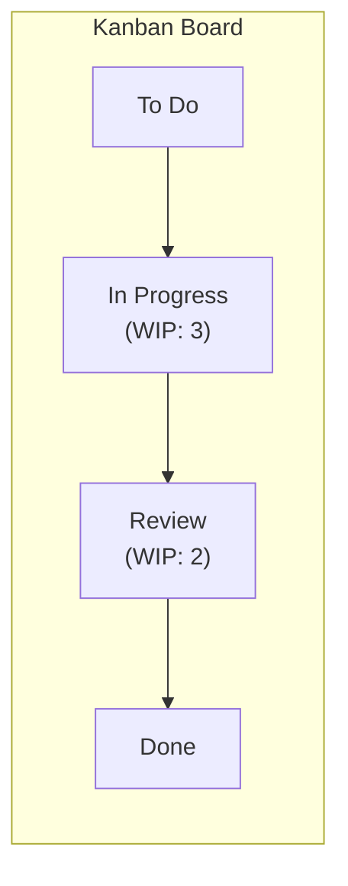
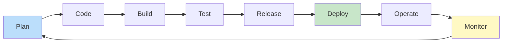
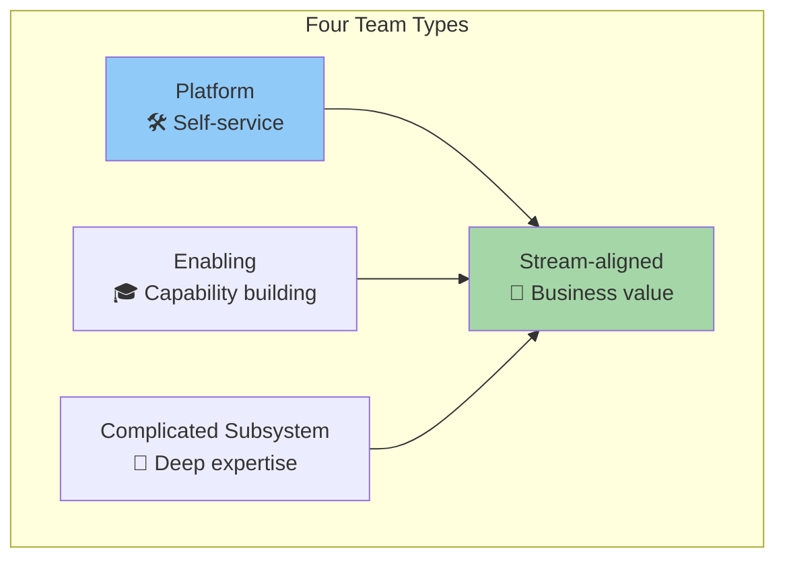

# Process Map

How software development processes evolved.

## Process Evolution

## Timeline

## Build Tools Evolution

Build systems evolved alongside the methodologies above. Each generation
solved specific pain points: dependency resolution, cross-platform
config, polyglot monorepos, hermetic reproducibility.

| Year | Tool | Ecosystem | Key innovation |
|------|------|-----------|---------------|
| 1976 | **Make** | Native | Dependency graph + timestamp-based rebuilds |
| 2000 | **Ant** | JVM | XML build script, Java-aware (predecessor of Maven) |
| 2000 | **CMake** | Native | Cross-platform meta-build, generates Make/Ninja/MSBuild |
| 2004 | **Maven** | JVM | Convention over configuration; central repository |
| 2007 | **Gradle** | JVM, polyglot | Groovy/Kotlin DSL, task graph, incremental builds |
| 2008 | **sbt** | Scala | Interactive shell, Zinc incremental Scala compiler |
| 2010 | **Ninja** | Native | Minimal, fast build executor (CMake/Bazel backend) |
| 2010 | **npm** | JavaScript | Public registry + lockfile for transitive deps |
| 2012 | **Cargo** | Rust | First-class package manager bundled with the toolchain |
| 2015 | **Bazel** | Polyglot | Hermetic builds + remote cache + remote execution |

→ See [Build Systems chapter](../topics/process/build-systems/index.md)
for detailed per-tool guides.

## Key Methodologies

### 📋 Waterfall (1970)

| Aspect | Description |
|--------|-------------|
| **Principle** | Sequential phases, complete each before next |
| **Documentation** | Heavy, upfront |
| **Change** | Expensive, discouraged |
| **When to use** | Regulatory requirements, well-understood domains |

### 🔄 Extreme Programming (1996)

| Practice | Description |
|----------|-------------|
| **Pair Programming** | Two developers, one keyboard |
| **TDD** | Write tests first |
| **Continuous Integration** | Integrate frequently |
| **Refactoring** | Improve code constantly |
| **Simple Design** | YAGNI — You Aren't Gonna Need It |
| **Collective Ownership** | Anyone can change any code |

**Key insight:** Embrace change through technical practices.

### 🏃 Scrum (1995)

| Role | Responsibility |
|------|----------------|
| **Product Owner** | What to build, prioritization |
| **Scrum Master** | Process facilitation, impediment removal |
| **Development Team** | Self-organizing delivery |

**Ceremonies:** Sprint Planning, Daily Standup, Sprint Review, Retrospective.

### 📊 Kanban (2004)

| Principle | Description |
|-----------|-------------|
| **Visualize work** | Make work visible on board |
| **Limit WIP** | Limit work in progress |
| **Manage flow** | Optimize for throughput |
| **Make policies explicit** | Clear definition of done |
| **Improve collaboratively** | Evolve based on feedback |

**Key insight:** Stop starting, start finishing.

### 🔁 DevOps (2009)

| Pillar | Description |
|--------|-------------|
| **Culture** | Collaboration between Dev and Ops |
| **Automation** | CI/CD pipelines, infrastructure as code |
| **Measurement** | Metrics, monitoring, feedback loops |
| **Sharing** | Shared responsibility, knowledge transfer |

**Key metrics (DORA):**
- Deployment frequency
- Lead time for changes
- Change failure rate
- Time to restore service

### 📐 Team Topologies (2019)

| Team Type | Purpose | Interaction |
|-----------|---------|-------------|
| **Stream-aligned** | Deliver value for a flow of work | Primary team type |
| **Enabling** | Help stream teams overcome obstacles | Temporary collaboration |
| **Complicated Subsystem** | Own complex components | X-as-a-Service |
| **Platform** | Provide self-service capabilities | X-as-a-Service |

**Key insight:** Design team structures for fast flow, not for org charts.

## Process Selection Guide

| Context | Recommended | Why |
|---------|-------------|-----|
| Startup, uncertain requirements | Kanban + XP practices | Flexibility, speed |
| Established product team | Scrum | Rhythm, predictability |
| Regulated industry | Waterfall + Agile elements | Documentation + adaptability |
| Platform team | DevOps + SRE | Automation, reliability |
| Large organization | Team Topologies | Flow optimization |

## The Agile Manifesto (2001)

> **Individuals and interactions** over processes and tools
>
> **Working software** over comprehensive documentation
>
> **Customer collaboration** over contract negotiation
>
> **Responding to change** over following a plan

_While there is value in the items on the right, we value the items on the left more._

## See Also

- [Team Topologies Authors](../authors/matthew-skelton.md)
- [Brooks — Mythical Man-Month](../works/books/brooks-1975-mmm.md)
- [Build Systems](../topics/process/build-systems/index.md)
- [Containers & Orchestration](../topics/containers/index.md)
- [Architecture Map](./architecture-map.md)
