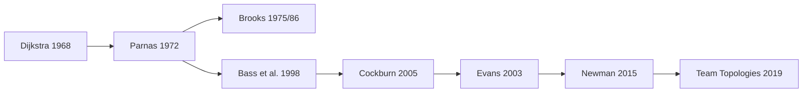

# Reading Path — Architecture & Modularity

Goal: understand the evolution of "boundaries" in software — from structured
programming and information hiding to DDD, microservices, and organizational design.

## For whom

- developers who "write services" but want to understand architectural trade-offs
- team leads/architects who need to explain "why"

## Outcomes

You will be able to:
- explain modularity through **information hiding**
- distinguish layered from hexagonal/clean
- use DDD bounded contexts as boundaries
- understand the cost of microservices (not just benefits)
- connect architecture and org structure (Conway + Team Topologies)

## Map

## Steps

### 1) Structured thinking
- Read: [Dijkstra — Go To Considered Harmful (1968)](../works/papers/dijkstra-1968-goto.md)
- Question: why do "constraints" on code style increase manageability?

### 2) Foundation of modularity
- Read: Parnas — modules (if you have the page: `parnas-1972-modules.md`)
- Focus: **module = what hides a decision that can change**

### 3) Complexity and communication
- Read: Brooks — *Mythical Man-Month* (if page exists) + "No Silver Bullet" (optional)
- Focus: why architecture is not "diagrams," but a means of managing complexity and communication

### 4) Architecture as a discipline
- Read: Bass/Clements/Kazman — *Software Architecture in Practice* (if exists) or summary on quality attributes
- Focus: architecture = trade-offs on NFRs (latency, availability, modifiability…)

### 5) Turning dependencies inward
- Read: [Cockburn — Hexagonal Architecture](../topics/architecture/index.md) (section) + related literature
- Task: formulate "ports" for your service (which dependencies should be interfaces?)

### 6) DDD as architectural boundaries
- Read: [Evans — DDD (2003)](../works/books/evans-2003-ddd.md)
- Practice: sketch bounded contexts and ubiquitous language for your domain

### 7) Microservices: the price of independence
- Read: [Newman — Building Microservices (2015)](../works/books/newman-2015-microservices.md)
- Focus: data ownership, integration styles, operational burden

### 8) Org design completes the chain
- Read: [Skelton & Pais — Team Topologies (2019)](../works/books/skelton-2019-team-topologies.md)
- Question: which team boundaries correspond to your bounded contexts?

## Mini-project (1–2 evenings)

Choose a familiar product and create 3 artifacts:
1. **Context map** (bounded contexts + integrations)
2. **Hexagonal sketch** of one context (ports/adapters)
3. **Team topology** (stream-aligned + platform/enabling if needed)

## Related

- [Architecture topic](../topics/architecture/index.md)
- [OOP & Design](../topics/design/index.md)
- [Distributed Systems](../topics/distributed/index.md)
