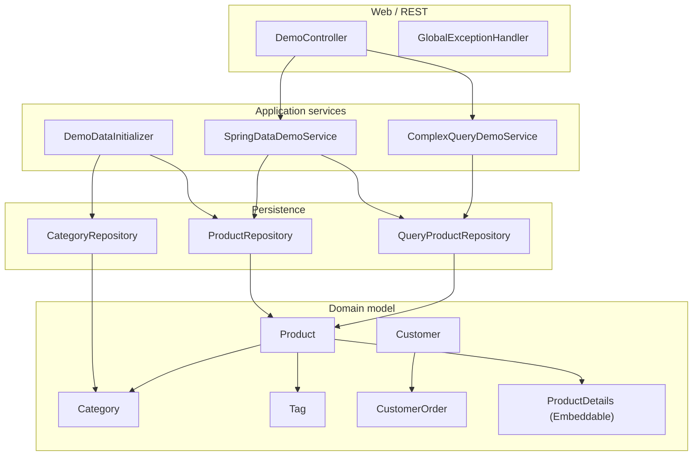

# Layered Architecture

**Category:** Domain-Centric  
**Source:** Bass, Clements & Kazman — *Software Architecture in Practice* (1998)

> Divide the system into horizontal layers, each depending only on the layer below.

Codified by Bass, Clements & Kazman (*Software Architecture in Practice*, 1998), though the idea is older. The system is divided into horizontal layers, each depending only on the layer below:

```
┌─────────────────────────┐
│     Presentation        │  UI, API endpoints
├─────────────────────────┤
│     Business Logic      │  Domain rules, use cases
├─────────────────────────┤
│     Data Access         │  Database queries, file I/O
├─────────────────────────┤
│     Infrastructure      │  OS, network, hardware
└─────────────────────────┘
          │
          │  dependencies flow downward
          ▼
```

Below is a concrete example of layered architecture from a Spring Boot project — showing how controllers, services, repositories and domain entities map to the layers above:



**Strengths:**

- Simple mental model
- Separation of concerns
- Each layer can be tested independently

**Weaknesses:**

- Business logic depends on data access (implementation detail)
- Changes to database schema ripple upward
- Difficult to swap infrastructure without touching business logic

## See Also

- [Hexagonal Architecture](hexagonal-architecture.md)
- [Onion Architecture](onion-architecture.md)
- [Clean Architecture](clean-architecture.md)
