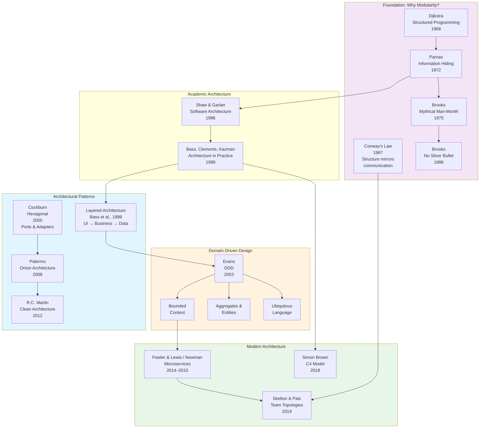
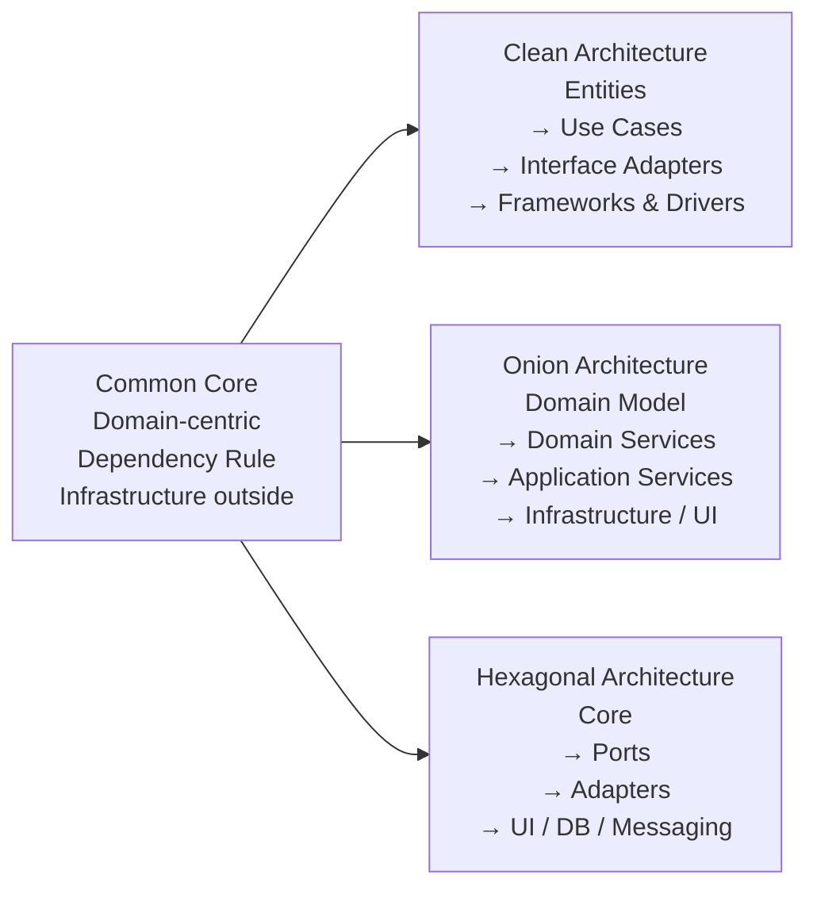
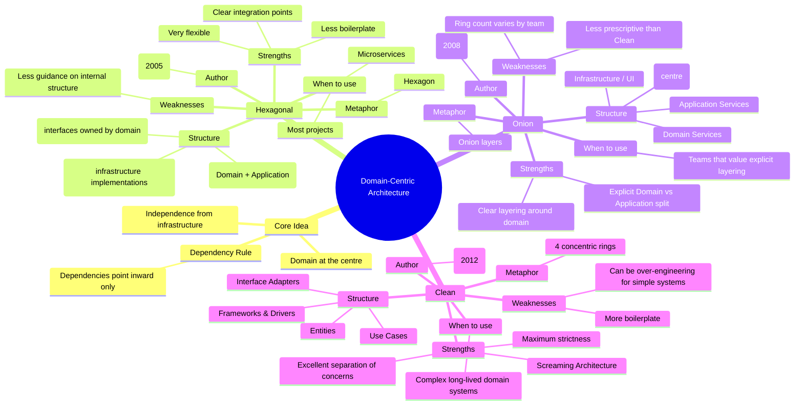

# Architecture & Modularity

How we structure software systems — where to put boundaries, how
to manage dependencies, and how to make systems that can evolve
over time.

## Contents

- [The Big Picture](#the-big-picture)
- [Why Architecture Matters](#why-architecture-matters)
- [Foundational Principles](#foundational-principles)
    - [Conway's Law (1967)](#conways-law-1967)
    - [Information Hiding (Parnas, 1972)](#information-hiding-parnas-1972)
    - [No Silver Bullet (Brooks, 1986)](#no-silver-bullet-brooks-1986)
- [Architectural Patterns](#architectural-patterns)
    - [Domain-Centric](#domain-centric-patterns)
    - [Communication](#communication-patterns)
    - [Structural](#structural-patterns)
    - [Data](#data-patterns)
    - [Integration](#integration-patterns)
    - [Resilience](#resilience-patterns)
- [Domain-Driven Design (DDD, 2003)](#domain-driven-design-ddd-2003)
    - [Strategic Design](#strategic-design-system-level)
    - [Tactical Design](#tactical-design-code-level)
- [Domain-Centric Architectures Compared](#domain-centric-architectures-compared)
- [The C4 Model (2018)](#the-c4-model-2018)
- [Team Topologies (2019)](#team-topologies-2019)
- [Evolution of Ideas](#evolution-of-ideas)
- [Guiding Principles](#guiding-principles)
- [Further Reading](#further-reading)
- [Related Topics](#related-topics)
- [Related Authors](#related-authors)

---

## The Big Picture



---

## Why Architecture Matters

Every non-trivial software system must be decomposed into parts.
**Architecture** is the set of decisions about:

- What the parts are (modules, services, layers)
- How they relate to each other (dependencies, interfaces, protocols)
- What each part hides from others (encapsulation boundaries)

Bad architecture makes change expensive. Good architecture makes
the system **easy to change** in the directions change is likely.

!!! quote "Fred Brooks, No Silver Bullet (1986)"
    "The essence of a software entity is a construct of interlocking
    concepts: data sets, relationships among data items, algorithms,
    and invocations of functions. This essence is abstract, in that
    the conceptual construct is the same under many different
    representations."

---

## Foundational Principles

### Conway's Law (1967)

> "Any organization that designs a system will produce a design
> whose structure is a copy of the organization's communication
> structure."

This is not a suggestion — it's an observation about how communication
constraints shape design. If three teams build a compiler, you get a
three-pass compiler.

**Implications:**

- Architecture and team structure must evolve together
- Want microservices? You need small, autonomous teams
- Want a monolith? A single team with strong internal communication works
- The "Inverse Conway Maneuver" (Skelton & Pais, 2019): deliberately
  shape teams to get the architecture you want

### Information Hiding (Parnas, 1972)

Parnas's key paper argued that modules should be defined not by their
function in a flowchart but by what **design decisions** they hide:

> "We propose that one begins with a list of difficult design decisions
> or design decisions which are likely to change. Each module is then
> designed to hide such a decision from the others."

**What to hide:**

| Decision type | Example | Module boundary |
|--------------|---------|-----------------|
| Data representation | Array vs linked list | Data structure module |
| Algorithm choice | Sort algorithm | Algorithm module |
| I/O format | JSON vs XML vs binary | Serialization module |
| Hardware details | File system, network | OS abstraction layer |
| External system | Database vendor, API | Adapter / gateway |

**This is the foundation of all software architecture.** Every
architectural pattern since — layers, hexagonal, clean, microservices —
is a specific strategy for deciding **what to hide where**.

→ [David Parnas](../../authors/david-parnas.md) ·
[On the Criteria...](../../works/papers/parnas-1972-modules.md)

### No Silver Bullet (Brooks, 1986)

Brooks distinguished **essential complexity** (inherent in the problem)
from **accidental complexity** (introduced by our tools and processes):

| Type | Source | Can be reduced? |
|------|--------|----------------|
| Essential | The problem domain itself | No — only managed |
| Accidental | Languages, tools, processes | Yes — through better tools |

Brooks argued that most remaining complexity is essential, so no single
technique can deliver order-of-magnitude improvements ("no silver
bullet"). This means architecture — managing essential complexity
through good decomposition — is the primary lever.

Note: Brooks made an earlier and equally important contribution in
*The Mythical Man-Month* (1975), which argued that adding people to a
late project makes it later — because communication overhead grows
quadratically with team size. Both works together frame why decomposition
and team structure matter so much.

→ [Fred Brooks](../../authors/fred-brooks.md)

---

## Architectural Patterns

### Domain-Centric Patterns

Patterns that place the domain model at the centre and structure dependencies around it:

- [Layered Architecture](domain-centric/layered-architecture.md) — Bass et al., 1998
- [Hexagonal Architecture (Ports & Adapters)](domain-centric/hexagonal-architecture.md) — Cockburn, 2005
- [Onion Architecture](domain-centric/onion-architecture.md) — Palermo, 2008
- [Clean Architecture](domain-centric/clean-architecture.md) — R.C. Martin, 2012
- [Industrial Functional Architecture](domain-centric/industrial-functional-architecture.md) — Zhidkov, 2020+

### Communication Patterns

Patterns for how components exchange information:

- [Event-Driven Architecture](communication/event-driven-architecture.md)
- [Message-Driven Architecture](communication/message-driven-architecture.md)
- [Service-Oriented Architecture (SOA)](communication/service-oriented-architecture.md)
- [Publish-Subscribe](communication/publish-subscribe.md)

### Structural Patterns

Patterns for how systems are decomposed and deployed:

- [Microservices](structural/microservices.md) — Fowler & Lewis / Newman, 2014–2015
- [Modular Monolith](structural/modular-monolith.md)
- [Monolith](structural/monolith.md)

### Data Patterns

Patterns for managing data in distributed and complex systems:

- [CQRS](data/cqrs.md) — Command Query Responsibility Segregation
- [Event Sourcing](data/event-sourcing.md)

### Integration Patterns

Patterns for connecting systems and services:

- [API Gateway](integration/api-gateway.md)
- [Backend for Frontend (BFF)](integration/backend-for-frontend.md)
- [Anti-Corruption Layer](integration/anti-corruption-layer.md)
- [Ambassador Pattern](integration/ambassador-pattern.md)

### Resilience Patterns

Patterns for keeping systems available under failure:

- [Circuit Breaker](resilience/circuit-breaker.md) — Nygard, 2007
- [Saga Pattern](resilience/saga-pattern.md)
- [Bulkhead](resilience/bulkhead.md) — Nygard, 2007
- [Retry Pattern](resilience/retry-pattern.md)

---

## Domain-Driven Design (DDD, 2003)

Eric Evans introduced a comprehensive approach to modelling complex
business domains. DDD operates at two levels:

### Strategic Design (System Level)

**Bounded Context** — the most important DDD concept. A bounded context
is a boundary within which a particular domain model is defined and
applicable. Different contexts may have different models of the same
real-world concept:

```
┌──────────────────┐     ┌──────────────────┐
│  Sales Context   │     │ Shipping Context  │
│                  │     │                  │
│  Customer:       │     │  Customer:       │
│   - name         │     │   - name         │
│   - credit_limit │     │   - address      │
│   - orders[]     │     │   - parcels[]    │
│                  │     │                  │
│  (different model│     │ (different model  │
│   of "Customer") │     │  of "Customer")  │
└──────────────────┘     └──────────────────┘
         ↕         context map         ↕
```

**Ubiquitous Language** — within each bounded context, developers and
domain experts share a common language. The code uses the same terms
as domain experts, eliminating translation errors.

### Tactical Design (Code Level)

| Pattern | Purpose | Rule |
|---------|---------|------|
| **Entity** | Object with identity | Identity survives state changes |
| **Value Object** | Object defined by attributes | Immutable, equality by value |
| **Aggregate** | Consistency boundary | External refs only to root |
| **Repository** | Collection-like interface for persistence | Hides storage mechanism |
| **Domain Service** | Logic that doesn't belong to any entity | Stateless, named in domain terms |
| **Domain Event** | Something that happened in the domain | Immutable record of a fact |

**Example:**

```java
// Order is an Aggregate Root
public class Order {
    private OrderId id;              // Entity identity
    private Money total;             // Value Object
    private List<LineItem> items;    // Entities within aggregate
    private OrderStatus status;

    public void addItem(Product p, int qty) {
        // Business rule enforced inside the aggregate
        if (items.size() >= 50) throw new TooManyItemsException();
        items.add(new LineItem(p, qty));
        recalculateTotal();
    }

    public void submit() {
        if (items.isEmpty()) throw new EmptyOrderException();
        this.status = OrderStatus.SUBMITTED;
        // Raise domain event via injected publisher, not a static call
        publisher.publish(new OrderSubmitted(this.id));
    }
}
```

→ [Eric Evans](../../authors/eric-evans.md) ·
[DDD book](../../works/books/evans-2003-ddd.md) ·
[Wlaschin — DDD + FP](../../works/books/wlaschin-2018-dmf.md)

---

## Domain-Centric Architectures Compared

Hexagonal, Onion and Clean Architecture share a common core idea but
differ in emphasis. The diagram below shows what they have in common
and where they diverge:



> Note: arrows here show derivation/relationship, not runtime dependencies.
> In all three architectures, runtime dependencies point **inward** toward the domain.



### Practical summary

| Approach | Author | Metaphor | Centre | Strength | Weakness | When to use |
|----------|--------|----------|--------|----------|----------|-------------|
| **Hexagonal** | Cockburn (2005) | Hexagon | Core + Ports | Flexible, clear integration points | Less internal structure guidance | Most projects, microservices |
| **Onion** | Palermo (2008) | Onion | Domain Model | Clear domain/application split | Less prescriptive | Teams that value explicit layers |
| **Clean** | R.C. Martin (2012) | 4 rings | Entities + Use Cases | Maximum separation of concerns | More boilerplate | Complex, long-lived systems |

In practice these approaches are often mixed. What matters is not the
label but adherence to the **Dependency Rule** and keeping the domain
independent of infrastructure.

---

## The C4 Model (2018)

Simon Brown created a hierarchical approach to diagramming software
architecture with four levels of abstraction:

```
Level 1: System Context
         ↓
Level 2: Container (applications, databases, message queues)
         ↓
Level 3: Component (major structural pieces within a container)
         ↓
Level 4: Code (classes, functions — optional, often auto-generated)
```

Each level answers different questions:

| Level | Audience | Question answered |
|-------|----------|-------------------|
| Context | Everyone | What is this system? Who uses it? What else does it talk to? |
| Container | Technical leaders | What are the major technical building blocks? |
| Component | Developers | How is each container structured internally? |
| Code | Developers | How is each component implemented? |

---

## Team Topologies (2019)

Skelton and Pais applied Conway's Law deliberately, defining four
fundamental team types:

| Team type | Purpose | Interaction mode |
|-----------|---------|-----------------|
| **Stream-aligned** | Delivers value on a business stream | Primary team type |
| **Enabling** | Helps stream-aligned teams adopt new skills | Facilitating |
| **Complicated-subsystem** | Owns complex technical domains | X-as-a-Service |
| **Platform** | Provides internal services to reduce cognitive load | X-as-a-Service |

The key insight: team structure should be designed to produce the
architecture you want (the Inverse Conway Maneuver), not the other
way around.

→ [Skelton & Pais](../../authors/skelton-pais.md)

---

## Evolution of Ideas

| Year | Author | Contribution | Key insight |
|------|--------|-------------|-------------|
| 1967 | Conway | Conway's Law | Structure follows communication |
| 1968 | Dijkstra | Structured programming | Control flow should be clear |
| 1972 | Parnas | Information hiding | Hide what is likely to change |
| 1975 | Brooks | Mythical Man-Month | Communication overhead grows quadratically |
| 1986 | Brooks | No Silver Bullet | Essential vs accidental complexity |
| 1996 | Shaw & Garlan | SW Architecture | Architecture as a discipline |
| 1998 | Bass, Clements, Kazman | Architecture in Practice | Quality attributes drive architecture |
| 2003 | Evans | DDD | Model the domain, not the data |
| 2005 | Cockburn | Hexagonal Architecture | Domain at the centre, ports & adapters |
| 2008 | Palermo | Onion Architecture | Concentric layers around domain model |
| 2012 | R.C. Martin | Clean Architecture | Strict Dependency Rule, named rings |
| 2014 | Fowler & Lewis | Microservices (article) | Independent deployment per bounded context |
| 2015 | Newman | Building Microservices | Operational practices for microservices |
| 2018 | Brown | C4 Model | Hierarchical diagramming |
| 2018 | Ousterhout | Philosophy of SW Design | Deep vs shallow modules |
| 2019 | Skelton & Pais | Team Topologies | Teams as architecture |
| 2020+ | Zhidkov | Industrial Functional Architecture | Functional style in practical Java/Kotlin |

---

## Guiding Principles

Across all architectural approaches, these principles recur:

1. **Separate what changes from what doesn't** (Parnas)
2. **Dependencies should point toward stability** (Martin)
3. **Make the domain the centre** (Evans, Cockburn, Palermo)
4. **Hide implementation details behind interfaces** (all)
5. **Design for change over reuse as a primary goal** (Parnas, Brooks)
6. **Match team structure to desired architecture** (Conway, Skelton)
7. **Prefer simple, deep modules over shallow ones** (Ousterhout)

---

## Further Reading

- Parnas — ["On the Criteria..."](../../works/papers/parnas-1972-modules.md) (1972)
- Brooks — [*The Mythical Man-Month*](../../works/books/brooks-1975-mmm.md) (1975)
- Evans — [*Domain-Driven Design*](../../works/books/evans-2003-ddd.md) (2003)
- Newman — [*Building Microservices*](../../works/books/newman-2015-microservices.md) (2015)
- Ousterhout — [*A Philosophy of Software Design*](../../works/books/ousterhout-2018-philosophy.md) (2018)

---

## Related Topics

- [OOP & Design](../design/) — component-level design (SOLID, patterns)
- [Paradigms](../paradigms/) — how paradigms shape architecture
- [Distributed Systems](../distributed/) — architecture across machines
- [Process & Testing](../process/) — how process supports architecture

---

## Related Authors

- [David Parnas](../../authors/david-parnas.md)
- [Alistair Cockburn](../../authors/alistair-cockburn.md)
- [Jeffrey Palermo](../../authors/jeffrey-palermo.md)
- [Robert C. Martin](../../authors/robert-c-martin.md)
- [Eric Evans](../../authors/eric-evans.md)
- [Sam Newman](../../authors/sam-newman.md)
- [Alexander Zhidkov](../../authors/alexander-zhidkov.md)
