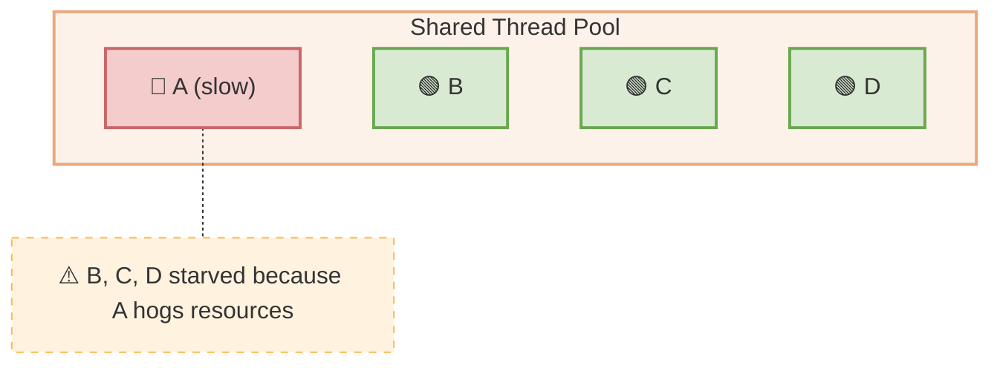
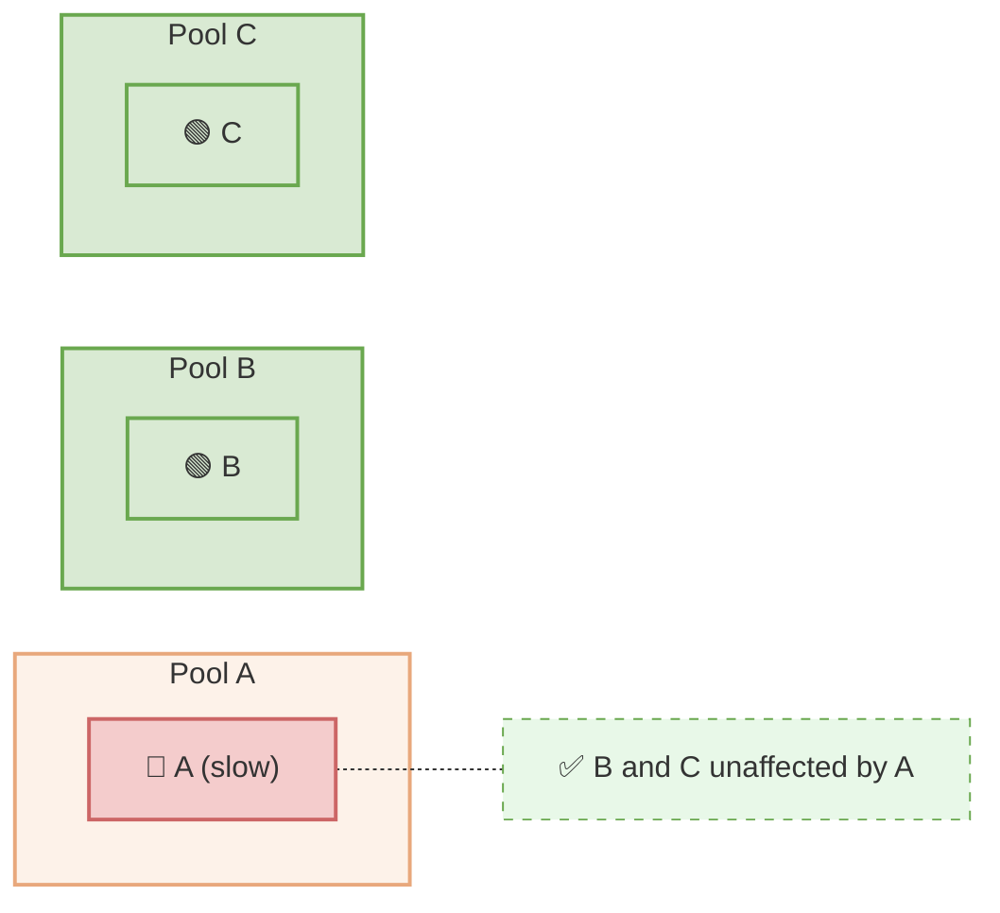

# Bulkhead

**Category:** Resilience  
**Source:** Michael Nygard — *Release It!* (2007)

> Isolate failures by partitioning resources so that a failure in one partition does not exhaust resources for others.

Named after ship bulkheads — watertight compartments that prevent a breach in one section from flooding the entire vessel. In software, bulkheads partition thread pools, connection pools, or memory so that a runaway consumer cannot starve others.

## Without Bulkhead — Problem

## With Bulkhead — Solution

## See Also

- [Circuit Breaker](circuit-breaker.md)
- [Retry Pattern](retry-pattern.md)
