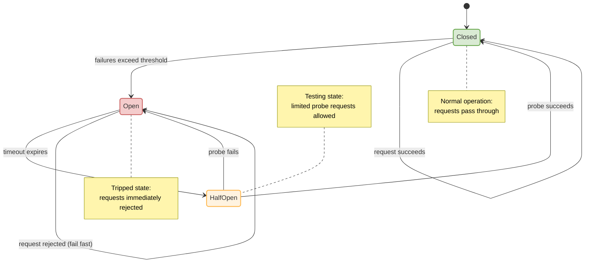

# Circuit Breaker

**Category:** Resilience  
**Source:** Michael Nygard — *Release It!* (2007)

> Prevent cascading failures by stopping requests to a failing service until it recovers.

When a remote service is failing or slow, every caller waits, threads block, and the entire system can seize up. The Circuit Breaker monitors failures and, when a threshold is exceeded, "opens" the circuit — failing fast instead of waiting.

## State Diagram

## Strengths

- Prevents cascading failures
- Allows failing services time to recover
- Fails fast, preserving caller resources

## Weaknesses

- Requires careful tuning of thresholds and timeouts
- Can hide transient issues if not monitored
- Adds complexity to testing

→ [Michael Nygard](../../authors/michael-nygard.md)

## See Also

- [Retry Pattern](retry-pattern.md)
- [Bulkhead](bulkhead.md)
- [Saga Pattern](saga-pattern.md)
