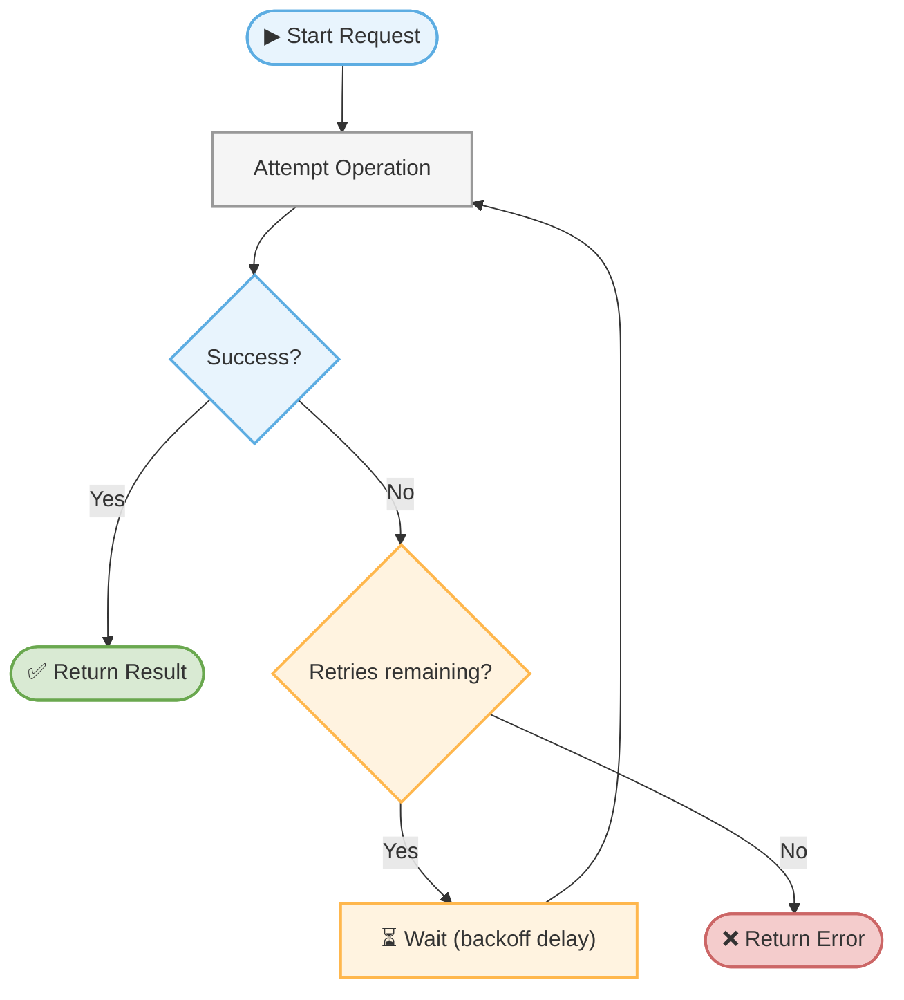
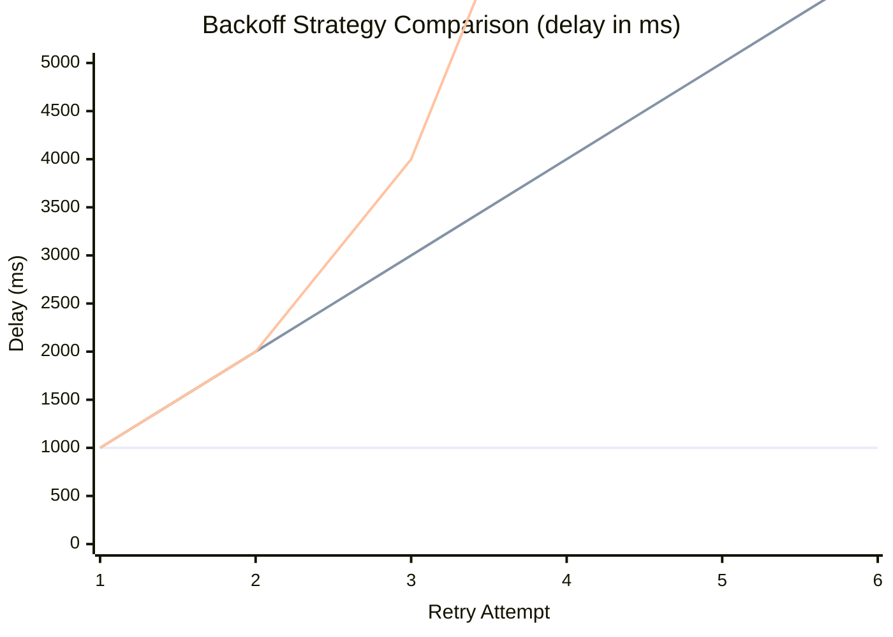

# Retry Pattern

**Category:** Resilience  
**Source:** Industry pattern; documented in Microsoft *Cloud Design Patterns* (2014)

> Automatically retry failed operations that are likely to succeed on subsequent attempts.

Transient failures — network hiccups, brief service unavailability, throttling — are common in distributed systems. The Retry pattern automatically re-executes a failed operation, often with a backoff strategy.

## Retry Flow

## Backoff Strategies

| Strategy | Description |
|----------|-------------|
| **Fixed** | Wait a constant delay between retries |
| **Linear** | Increase delay by a fixed amount each time |
| **Exponential** | Double the delay after each attempt (most common) |
| **Jitter** | Add randomness to prevent thundering herd |

## When NOT to Retry

- Non-idempotent operations without deduplication
- Authentication failures
- Client-side validation errors
- Timeouts where the request may have already succeeded

## See Also

- [Circuit Breaker](circuit-breaker.md)
- [Bulkhead](bulkhead.md)
