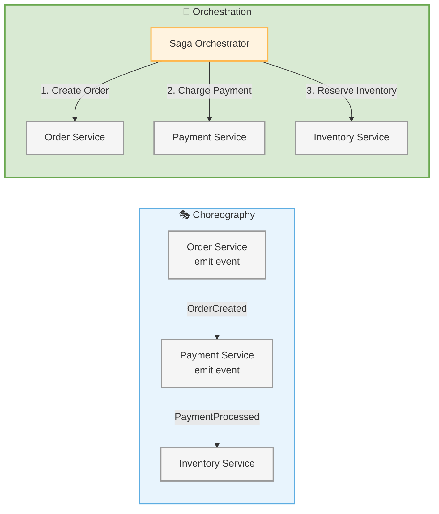
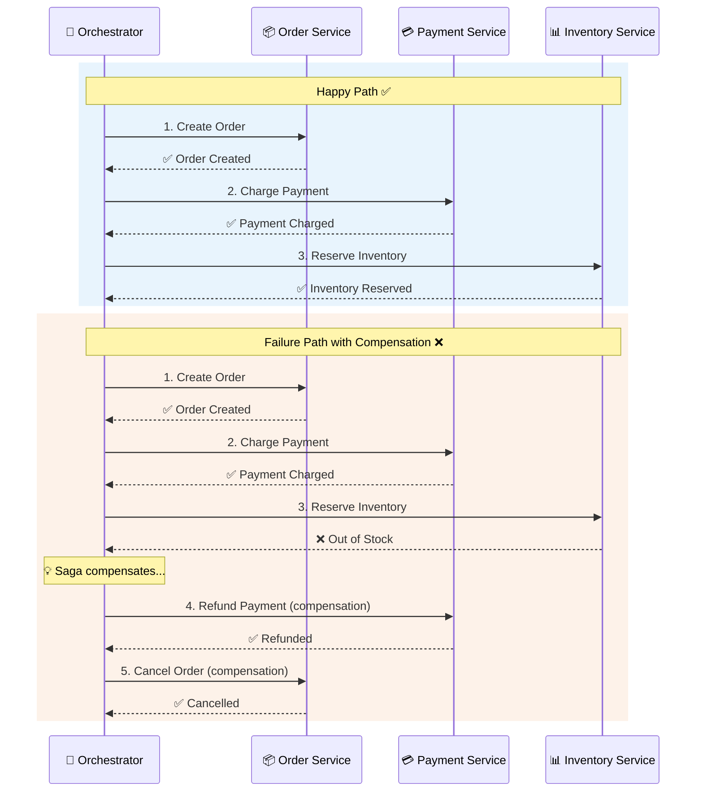

# Saga Pattern

**Category:** Resilience  
**Source:** Hector Garcia-Molina & Kenneth Salem — *Sagas* (1987); popularised in microservices by Chris Richardson

> Manage long-running transactions by breaking them into a sequence of local transactions with compensating actions.

In distributed systems, ACID transactions across services are impractical. A saga splits a business transaction into a sequence of local transactions, each updating one service. If a step fails, compensating transactions undo the completed steps.

## Two Approaches

| Approach | Description |
|----------|-------------|
| **Choreography** | Each service completes its local transaction and emits an event triggering the next service |
| **Orchestration** | A central orchestrator directs each service when to execute its local transaction |

## Example — Order Saga (with Compensation)

## See Also

- [Event-Driven Architecture](../communication/event-driven-architecture.md)
- [Event Sourcing](../data/event-sourcing.md)
- [CQRS](../data/cqrs.md)
- [Circuit Breaker](circuit-breaker.md)
