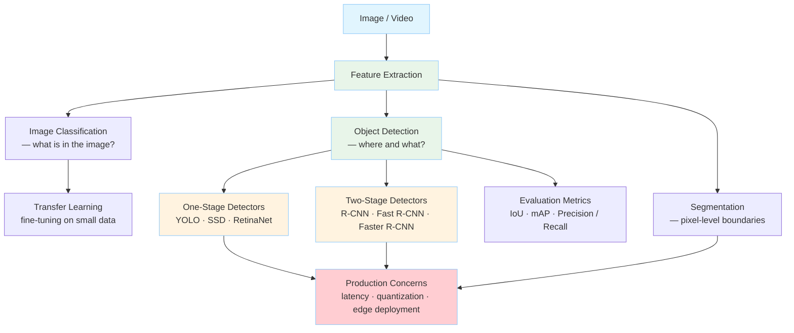
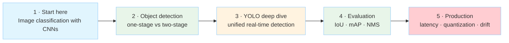

# Computer Vision

How machines extract meaning from images and video — from classical
features and handcrafted pipelines to modern deep-learning models that
segment, detect, track, and generate visual content.

---

## Position in the Atlas

| Dimension     | Value                                                                 |
|---------------|-----------------------------------------------------------------------|
| Group         | Machine Learning & LLMs                                               |
| Connects to   | Large Language Models (multimodal models), Languages (Python/C++ performance stacks), Engineering (observability of model serving), Distributed Systems (training and inference at scale) |
| Key authors   | Redmon, Girshick, He, Karpathy, Fei-Fei Li                            |
| Key works     | You Only Look Once (2016), R-CNN (2014), ResNet (2015), ImageNet (2009) |

---

## What This Topic Covers

This topic approaches computer vision from the perspective of a **software
engineer** who needs to understand what vision models can do, how they fail,
and how to integrate them into products. The goal is not to train models
from scratch, but to reason about architectures, trade-offs, and failure
modes: when to use a one-stage detector versus a two-stage one, what
latency-accuracy curves mean in practice, and how production systems
deal with occlusion, scale, and drift.

---

## Map of Concepts

---

## Foundations

### The core tasks

Computer vision is usually decomposed into a hierarchy of tasks, each
adding spatial precision:

| Task | Output | Example question |
|------|--------|------------------|
| Classification | A single label | Is this a cat or a dog? |
| Localization | A bounding box around the main object | Where is the cat? |
| Object Detection | Multiple boxes + labels | How many cats and where? |
| Segmentation | Pixel-level masks | Which pixels belong to each cat? |
| Tracking | Object identities across frames | Where did each cat move? |

Each task builds on the previous one. Detection combines classification
and localization; segmentation replaces coarse boxes with precise masks.

### From handcrafted features to deep learning

Before 2012, vision pipelines were dominated by **handcrafted features**:

- **Haar cascades** — fast rectangular filters used for face detection.
- **HOG (Histogram of Oriented Gradients)** — gradient histograms that
capture shape, widely used in pedestrian detection.
- **SIFT / SURF** — scale-invariant keypoint descriptors for matching.

These features were interpretable and fast, but brittle. In 2012,
AlexNet won ImageNet by a wide margin using a deep convolutional neural
network trained end-to-end. Since then, the field has shifted to
**representation learning**: the network learns both the features and
the classifier from data.

### Convolutional neural networks

A **convolutional neural network (CNN)** is the workhorse of modern vision.
Three ideas make it effective for images:

1. **Local receptive fields.** Each neuron looks at only a small patch
   of the image, matching the intuition that edges and textures are local.
2. **Shared weights.** The same filter slides across the image, reducing
   parameters and enforcing translation invariance.
3. **Spatial pooling.** Downsampling progressively discards exact location
   in favor of higher-level structure.

Modern backbones (ResNet, EfficientNet, ConvNeXt, Vision Transformers)
stack these operations to produce rich feature maps that downstream
heads use for detection, segmentation, or classification.

---

## Object Detection

Object detection is the task of finding all objects of interest in an
image and labeling them. It is the natural next step after classification
because most real-world images contain more than one thing.

See [Object Detection](object-detection.md) for a deep dive into
one-stage and two-stage approaches, with a focus on YOLO.

### One-stage vs two-stage detectors

| Aspect | Two-stage (e.g., Faster R-CNN) | One-stage (e.g., YOLO, SSD) |
|--------|--------------------------------|-----------------------------|
| Pipeline | Propose regions, then classify | Single forward pass |
| Speed | Slower, ~10–30 FPS | Fast, ~45–140+ FPS |
| Accuracy | Higher mAP on dense / small objects | Lower mAP historically; competitive today |
| Use case | High-accuracy offline analysis | Real-time video, edge devices |

The trade-off is between **precision** (two-stage) and **speed**
(one-stage). YOLO redefined what was possible at the real-time end of
the spectrum.

---

## Segmentation

Segmentation assigns a class label to every pixel. Two common variants:

**Semantic segmentation** groups pixels by class (e.g., all road pixels
are "road"), without distinguishing instances.
**Instance segmentation** separates individual objects (car 1, car 2,
pedestrian 3).

Architectures such as U-Net, Mask R-CNN, and Segment Anything Model (SAM)
use encoder-decoder structures or transformer-based prompting to produce
dense masks.

---

## Evaluation

Vision models are evaluated with metrics that capture different kinds of
correctness:

- **IoU (Intersection over Union)** — overlap between predicted and ground-truth boxes.
- **Precision / Recall** — fraction of predictions that are correct versus fraction of ground truth that was found.
- **mAP (mean Average Precision)** — the standard single-number metric for detection; averages precision over recall levels and classes.
- **F1 Score** — harmonic mean of precision and recall, useful when classes are imbalanced.

A prediction is usually counted as correct if its IoU with a ground-truth
box exceeds a threshold (commonly 0.5 or 0.75).

---

## Production Concerns

Deploying vision models introduces engineering problems that differ from
training them:

**Latency budgets.** Real-time video requires consistent frame rates.
Model size, input resolution, and batch size all affect throughput.

**Quantization and pruning.** Reducing model precision (INT8, FP16) or
removing redundant weights makes models faster and smaller, often with
minimal accuracy loss.

**Edge deployment.** Running on cameras, phones, or embedded boards means
working with limited memory, thermal constraints, and specialized
accelerators (NPUs, GPUs, DSPs).

**Data drift.** Lighting, weather, camera angles, and occlusion patterns
change in production. Models need monitoring, retraining pipelines, and
human-in-the-loop fallback.

**Explainability.** Unlike classification, detection outputs spatial
boundaries. Engineers often need to inspect why a box was predicted,
especially in safety-critical domains.

---

## Key Authors

| Author | Contribution |
|--------|--------------|
| Joseph Redmon | Created YOLO (v1–v3); pioneered real-time one-stage detection |
| Ross Girshick | Led R-CNN, Fast R-CNN, Faster R-CNN; two-stage detection lineage |
| Kaiming He | ResNet; foundational backbone for modern vision |
| Fei-Fei Li | Founded ImageNet; catalyzed the deep-learning revolution in vision |
| Andrej Karpathy | Applied CNNs at Tesla Autopilot; popularized vision education |

---

## Key Works

| Work | Authors | Year | Significance |
|------|---------|------|--------------|
| ImageNet | Deng et al. | 2009 | Large-scale dataset that enabled supervised pretraining |
| R-CNN | Girshick et al. | 2014 | Deep learning for object detection via region proposals |
| ResNet | He et al. | 2015 | Skip connections enabling very deep networks |
| YOLO | Redmon et al. | 2016 | Unified, real-time one-stage object detector |
| Faster R-CNN | Ren et al. | 2015 | End-to-end trainable two-stage detector |

---

## Reading Path

---

*Computer Vision connects to [Large Language Models](../llm/index.md)
through multimodal models, to [Languages](../../languages/python/index.md)
through the dominant Python ML ecosystem, and to [Developer Tools](../tools/dev-tools/index.md)
through annotation, experiment tracking, and model-serving infrastructure.*
