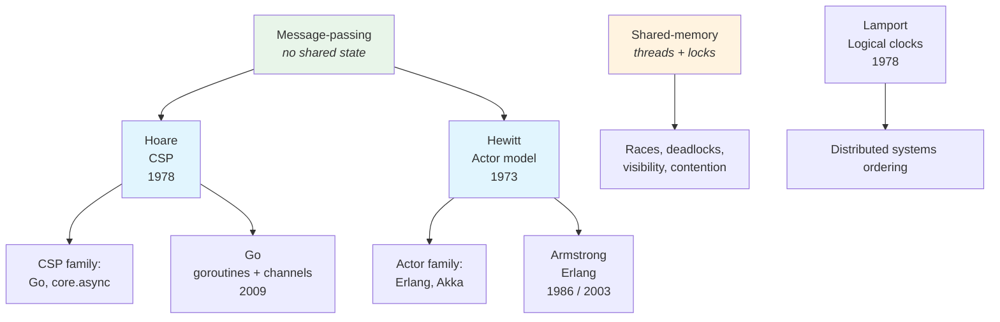

# Concurrency

How we structure programs that do multiple things "at the same time".

Concurrency is about **composition of activities**, not just performance.

## The Big Picture

## Two Families of Models

### 1) Shared Memory: Threads + Locks

**Idea:** multiple threads operate on shared state; synchronization primitives ensure correctness.

Tools:
- mutex / monitor / synchronized block
- semaphores
- condition variables
- atomics (CAS)
- concurrent data structures

**Failure modes:**
- data races
- deadlocks
- priority inversion
- "it works on my machine" timing bugs

This model maps to hardware, but is hard to reason about.

### 2) Message Passing: CSP and Actors

**Idea:** isolate state; communicate by messages. Avoid shared mutable state.

Two major variants:

#### CSP (Hoare 1978): Channels
- Communicating Sequential Processes
- Synchronization via channel operations
- Fits pipelines / dataflow

Go made CSP mainstream via goroutines + channels.

→ [Hoare — CSP (1978)](../../../works/papers/hoare-1978-csp.md)

#### Actors (Hewitt 1973 / Erlang 1986): Mailboxes
- Each actor/process has private state
- Communication via asynchronous messages
- Fits distributed & fault-tolerant systems

Erlang embodies this model: "let it crash", supervisors, isolation.

→ [Joe Armstrong](../../../authors/joe-armstrong.md)

## Async/Await (Structured Concurrency-ish)

Async/await is typically:
- **single-threaded concurrency** with an event loop (JS, Python asyncio)
- or **task-based concurrency** that may use threads under the hood (Rust tokio, Kotlin)

It changes how you write I/O-bound concurrent code:
- avoid callback hell
- keep sequential style

But it doesn't automatically solve shared-state issues; it just changes scheduling.

### The Event Loop

Many async/await systems (JavaScript, Python asyncio) run on a
**single-threaded event loop**: tasks yield at `await` points, and the
loop picks the next ready task. Between yields, a task runs
uninterrupted. A CPU-bound task that never yields blocks everything.

→ [Synchronous vs Asynchronous: Four Axes](./sync-async-axes.md)

## Scheduling: Preemptive vs Cooperative

Scheduling is an **orthogonal axis** to shared-memory vs message-passing.
The same CSP-style code can run on preemptive OS threads or on a cooperative
event loop — these are independent design choices.

### Preemptive

The scheduler can take control away from a task **at any point** —
typically via a timer interrupt or a runtime-level counter (reduction count).
The running task does not have to cooperate.

- **Pros** — fairness, no starvation from a "greedy" task, predictable latency
- **Cons** — context switches are more expensive, memory barriers required,
  more complex to implement
- **Examples** — OS threads on Linux / Windows / macOS, Erlang BEAM processes
  (reduction-based preemption), Go goroutines since 1.14 (2020)

### Cooperative

A task **yields control voluntarily** — at explicit `yield`, `await`, or
when it makes a blocking I/O call. Between yield points the task runs uninterrupted.

- **Pros** — cheap switches, simpler memory model, well-defined switch points
- **Cons** — a single "greedy" CPU-bound task blocks everyone else;
  requires programmer discipline
- **Examples** — Simula coroutines (1967), classic Mac OS / Windows 3.x,
  Python generators and `asyncio`, JavaScript event loop, Kotlin coroutines,
  Java virtual threads, Go goroutines before 1.14

### Where the Scheduler Lives

The scheduler can sit at three different levels of the stack:

| Level | Mechanism | Scheduling |
|---|---|---|
| **OS kernel** | Threads / processes (Linux CFS, Windows scheduler) | Preemptive |
| **Language runtime** | Go goroutines, Erlang BEAM, JVM virtual threads, Kotlin coroutines | Mixed — preemptive runtime over user-space tasks, or cooperative continuations |
| **User code** | Simula coroutines, Python generators, JS Promises, async tasks | Cooperative |

A useful rule of thumb: *the lower the scheduler sits, the more preemptive it tends to be*.

### Quick Comparison

| Property | Preemptive | Cooperative |
|---|---|---|
| Switch point | Anywhere | Only at `yield` / `await` / blocking I/O |
| Starvation risk | Low | High (one greedy task blocks all) |
| Switch cost | Higher (full context save) | Lower (continuation only) |
| Typical use | OS threads, fault-isolated runtimes | I/O-bound concurrency, lightweight tasks |

→ [Simula coroutines](../../../languages/simula/index.md) ·
  [Erlang processes](../../../languages/erlang/index.md) ·
  [Go goroutines](../../../languages/go/index.md) ·
  [Java virtual threads](../../../languages/java/index.md) ·
  [Kotlin coroutines](../../../languages/kotlin/index.md)

## A Practical Rule: Prefer Immutability + Explicit Boundaries

A useful modern default:
- keep state immutable where possible
- isolate mutation behind boundaries
- communicate via messages or queues
- keep concurrency mechanisms local (don't leak locks everywhere)

This is compatible with:
- Functional Core / Imperative Shell
- Hexagonal architecture (ports/adapters)
- DDD bounded contexts (own their data)

## Timeline

| Year | Event | Impact |
|---|---|---|
| 1965 | Dijkstra — semaphores | Classic shared-memory primitive |
| 1973 | Hewitt — Actor model | Message-based concurrency |
| 1978 | Hoare — CSP | Channels + process algebra |
| 1978 | Lamport — logical clocks | Ordering without global time |
| 1986 | Erlang begins | Industrial actor model |
| 1995 | Windows 95 / NT preemptive | End of cooperative consumer OS era |
| 2009 | Go | CSP for everyday developers |
| 2014+ | async/await mainstream | Task concurrency everywhere |
| 2020 | Go 1.14 fully preemptive runtime | User-space preemption matures |
| 2022 | Java 19 — Structured Concurrency (preview) | Scoped parallel tasks |
| 2023 | Java 21 — Virtual Threads GA | Blocking code becomes cheap |

## Further Reading

- [Hoare — CSP (1978)](../../../works/papers/hoare-1978-csp.md)
- [Lamport — Time, Clocks... (1978)](../../../works/papers/lamport-1978-clocks.md)
- *The Little Book of Semaphores* (Allen B. Downey)
- *Java Concurrency in Practice* (Goetz et al.)

## Related Topics

- [Synchronous vs Asynchronous: Four Axes](./sync-async-axes.md) — the four axes of execution models
- [Distributed Systems](../../distributed/index.md) — reliability, consensus, CAP
- [Functional Programming](../functional/index.md) — immutability prevents data races
- [Paradigms](../paradigms/index.md) — concurrency models in broader context
- [Architecture & Modularity](../../architecture/index.md) — system decomposition

## Maps

- [Concurrency Map](../../../maps/concurrency-map.md) — visual overview of how concurrency models evolved
