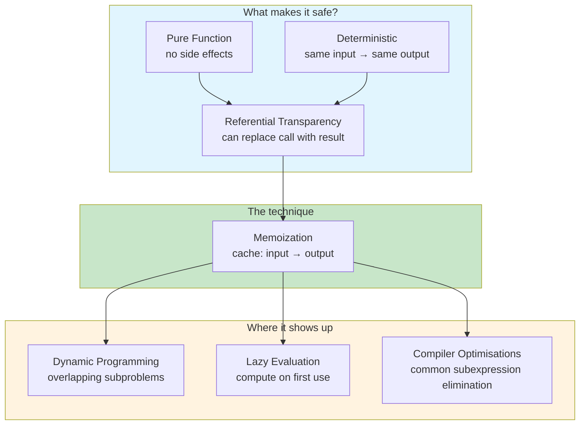

# Memoization

Memoization is the technique of caching the result of a function call
and returning the cached result when the same inputs occur again. It is
not a new idea — it is as old as dynamic programming — but it is
powerful because it turns time into space.

What makes memoization safe is not the cache itself. It is the
**referential transparency** of the function being memoized: the
guarantee that the same input always produces the same output, with no
side effects. Without that guarantee, memoization is not an
optimization — it is a bug.

## The Big Picture



## Referential Transparency: The Prerequisite

A function is **referentially transparent** if you can replace any call
to it with its result without changing the program's meaning.

```haskell
-- These are equivalent:
let x = add 3 4 in x + x
-- same as:
add 3 4 + add 3 4
-- same as:
7 + 7
-- same as:
14
```

This is the property that makes memoization correct. If `f(5)` always
returns `25`, storing `25` and returning it later is indistinguishable
from calling `f(5)` again.

**Without referential transparency, memoization changes behaviour:**

```javascript
function logAndDouble(x) {
    console.log(x);      // side effect!
    return x * 2;
}

// Memoized version:
const memoLogAndDouble = memoize(logAndDouble);
memoLogAndDouble(2);  // console logs "2"
memoLogAndDouble(2);  // console does NOT log — cached result returned
```

The memoized function is faster, but it no longer does the same thing.

## Manual Memoization

The simplest form: a hash map inside the function.

```java
// Fibonacci with manual memoization
private final Map<Integer, Long> cache = new HashMap<>();

public long fib(int n) {
    if (n <= 1) return n;
    return cache.computeIfAbsent(n,
        k -> fib(k - 1) + fib(k - 2));
}
// O(n) time instead of O(2ⁿ)
```

```python
# Python: manual memoization with a decorator
def memoize(fn):
    cache = {}
    def wrapper(*args):
        if args not in cache:
            cache[args] = fn(*args)
        return cache[args]
    return wrapper

@memoize
def fib(n):
    if n <= 1:
        return n
    return fib(n - 1) + fib(n - 2)
```

```javascript
// JavaScript: closure-based memoization
function memoize(fn) {
    const cache = new Map();
    return function(...args) {
        const key = JSON.stringify(args);
        if (!cache.has(key)) {
            cache.set(key, fn(...args));
        }
        return cache.get(key);
    };
}

const fib = memoize(function(n) {
    if (n <= 1) return n;
    return fib(n - 1) + fib(n - 2);
});
```

## Library Support

Most languages provide built-in or standard-library memoization.

```python
# Python: functools.lru_cache
from functools import lru_cache

@lru_cache(maxsize=128)  # LRU eviction when cache grows
def fib(n):
    if n <= 1:
        return n
    return fib(n - 1) + fib(n - 2)

# Python 3.9+: unlimited cache
from functools import cache

@cache
def expensive_lookup(key):
    return db.query(key)
```

```java
// Java: Guava Suppliers.memoize
Supplier<String> memoized = Suppliers.memoize(this::expensiveCall);

// Java: Caffeine (production-grade, with TTL and size limits)
Cache<String, User> cache = Caffeine.newBuilder()
    .expireAfterWrite(10, TimeUnit.MINUTES)
    .maximumSize(1000)
    .build();

User user = cache.get(userId, this::fetchFromDatabase);
```

```scala
// Scala: lazy val (memoization of a parameterless expression)
lazy val expensive: BigInt = computeExpensiveValue()
// Computed once, on first access, then cached
```

```haskell
-- Haskell: memoization is built into the language via lazy evaluation
fib :: Int -> Integer
fib 0 = 0
fib 1 = 1
fib n = fibs !! n
  where fibs = map fib' [0..]
        fib' 0 = 0
        fib' 1 = 1
        fib' n = fibs !! (n - 1) + fibs !! (n - 2)

-- The infinite list `fibs` is memoized automatically
-- thanks to Haskell's call-by-need semantics
```

## Memoization vs Caching

These words are often used interchangeably, but they are not the same:

| | Memoization | Caching |
|---|---|---|
| **Scope** | Function-level | System-level |
| **Key** | Function arguments | Arbitrary key (URL, query, entity ID) |
| **Invalidation** | Usually none (pure inputs) | Required (data changes) |
| **Side effects** | None (requires pure function) | May read mutable state |
| **Goal** | Avoid redundant computation | Avoid redundant data fetching |
| **Examples** | `lru_cache`, `lazy val` | Redis, CDN, Hibernate L2 |

```java
// MEMOIZATION: pure function, no invalidation needed
@Cacheable("products")  // Spring — but this is technically CACHING
Product getById(Long id) {
    return productRepository.findById(id);
}
// This is CACHING because the database is mutable.
// The @Cacheable annotation needs eviction when data changes.
```

```python
# MEMOIZATION: pure function, no invalidation
@lru_cache
def factorial(n):
    if n <= 1:
        return 1
    return n * factorial(n - 1)
# factorial(5) always returns 120. No eviction needed.
```

The line blurs in practice. A SQL query cache is technically caching,
but it behaves like memoization: `SQL + parameters → rows`. The
difference is that the underlying data can change, so the cache needs
invalidation. True memoization has no invalidation because the function
is pure.

## When Memoization Goes Wrong

### 1. Non-deterministic inputs

```java
// DON'T: memoizing a non-deterministic function
@lru_cache  // ❌ Dangerous!
def getCurrentTemperature(city) {
    return weatherApi.fetch(city);  // Result changes every minute!
}
```

### 2. Side effects in the memoized function

```javascript
// DON'T: side effects get lost on cache hit
const sendEmail = memoize((to, subject) => {
    mailer.send(to, subject);  // side effect!
    return "sent";
});

sendEmail("user@example.com", "Welcome");  // email sent
sendEmail("user@example.com", "Welcome");  // email NOT sent — cached!
```

### 3. Memory leaks

```python
# DON'T: unbounded cache with unbounded inputs
@cache  # ❌ No maxsize!
def process(request_id):
    return heavy_computation(request_id)

# Every unique request_id grows the cache forever
```

### 4. Mutating the cached value

```java
// DON'T: returning a mutable reference
Map<Integer, List<String>> cache = new HashMap<>();

public List<String> getTags(int productId) {
    return cache.computeIfAbsent(productId, this::fetchTags);
}

// Caller mutates the list:
getTags(42).add("new-tag");  // Corrupts the cache for all future calls!
```

## Memoization in Practice

| Language | Mechanism | Notes |
|----------|-----------|-------|
| **Python** | `functools.lru_cache` / `@cache` | Standard library, LRU eviction |
| **Java** | `Map.computeIfAbsent`, Guava `Suppliers.memoize`, Caffeine | Caffeine is production-grade |
| **Scala** | `lazy val` | Built into the language |
| **Haskell** | Lazy evaluation | Automatic memoization of thunks |
| **JavaScript** | Manual closure | No built-in standard memoization |
| **Rust** | Manual `HashMap` | No std memoization; crates available |

## Timeline

| Year | Event | Significance |
|------|-------|------------|
| 1950s | Dynamic programming (Bellman) | Memo tables as a core technique |
| 1958 | McCarthy — Lisp | First language where functions are values |
| 1978 | Backus — FP Manifesto | Referential transparency as a principle |
| 1990 | Haskell 1.0 | Lazy evaluation makes memoization implicit |
| 2004 | Python 2.4 — `functools` module | `lru_cache` added later (Python 3.2, 2011) |
| 2009 | Guava `Suppliers.memoize` | Production memoization for Java |
| 2015 | Caffeine cache library | High-performance Java caching with memoization API |
| 2017 | Python 3.8 — `functools.cache` | Unlimited memoization decorator |

## Further Reading

- [Pure Functions](./index.md#1-pure-functions) — the prerequisite for safe memoization
- [Lazy Evaluation](./index.md#advanced) — Haskell's implicit memoization
- [Idempotency](../../distributed/idempotency.md) — the difference between memoization (performance) and idempotency (correctness)
- Hughes — ["Why Functional Programming Matters"](../../../works/papers/hughes-1989-why-fp.md) (1989)

## Related Topics

- [Functional Programming](./index.md) — purity, immutability, composition
- [Concurrency](../concurrency/index.md) — memoization is safe across threads only with immutable values
- [Distributed Systems](../../distributed/index.md) — caching vs memoization at scale
- [Type Systems](../types/index.md) — types that enforce purity
