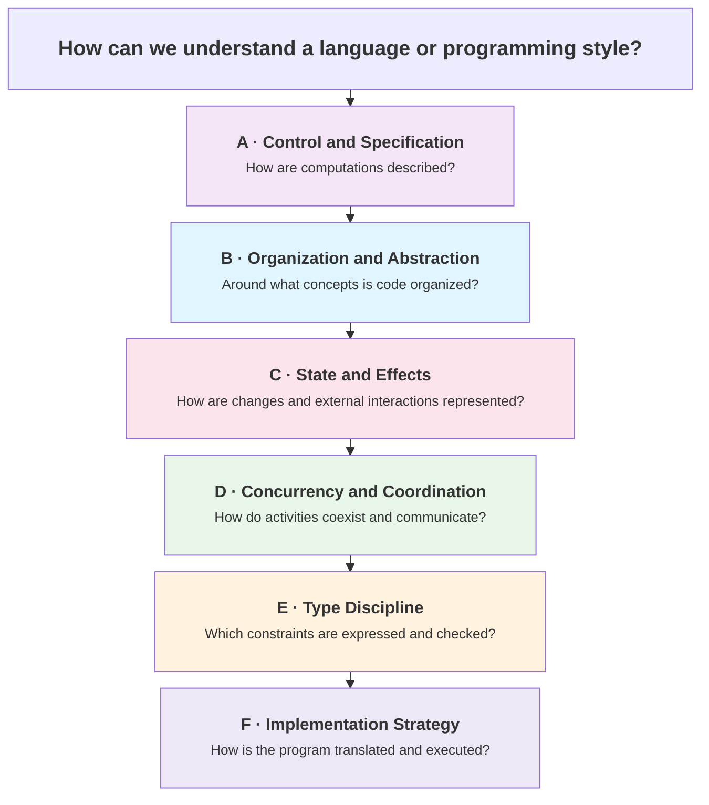
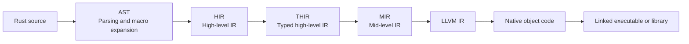
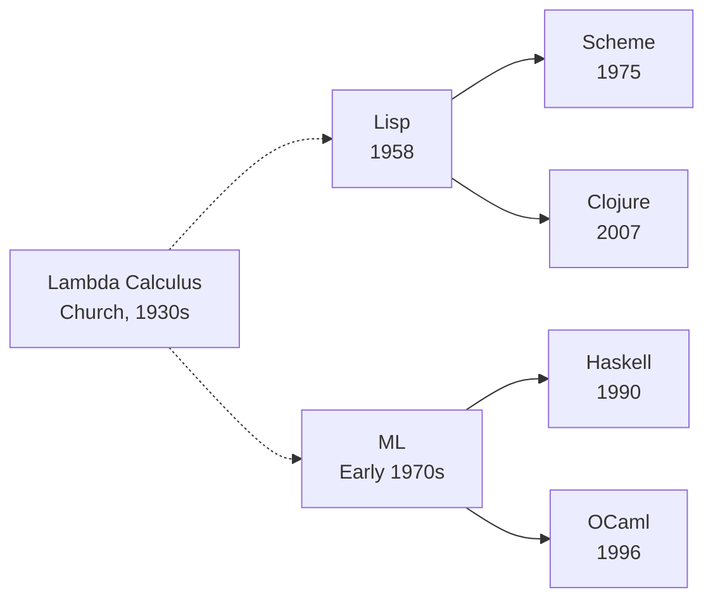
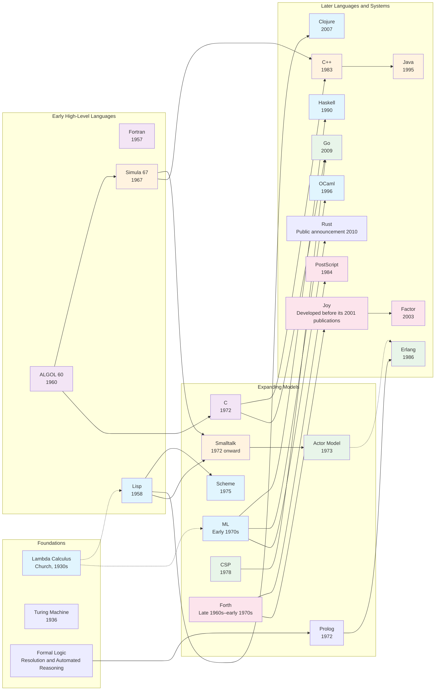

# Paradigms

How we think about computation. Programming paradigms offer different
mental models for structuring programs — different answers to questions
such as "what is a program?", "how does it compute?", and "how do its
parts interact?"

This page maps those models alongside related properties of languages
and implementations. It is a practical guide to their relationships,
not a claim that there is one universally accepted classification.

## Contents

- [What Is a Paradigm?](#what-is-a-paradigm)
- [The Big Picture: Six Complementary Questions](#the-big-picture-six-complementary-questions)
    - [A. Control and Specification Style](#a-control-and-specification-style)
    - [B. Organization and Abstraction](#b-organization-and-abstraction)
    - [C. State and Effects](#c-state-and-effects)
    - [D. Concurrency and Coordination](#d-concurrency-and-coordination)
    - [E. Type Discipline](#e-type-discipline)
    - [F. Implementation Strategy](#f-implementation-strategy)
- [Mapping Languages and Styles](#mapping-languages-and-styles)
- [Organization Models in Depth](#organization-models-in-depth)
    - [Procedural Programming](#procedural-programming)
    - [Object-Oriented Programming](#object-oriented-programming)
    - [Functional Programming](#functional-programming)
    - [Logic Programming](#logic-programming)
    - [Applicative vs Concatenative Style](#applicative-vs-concatenative-style)
- [Execution Models in Depth](#execution-models-in-depth)
    - [Actor Model](#actor-model)
    - [CSP — Communicating Sequential Processes](#csp-communicating-sequential-processes)
    - [Comparison](#comparison)
- [Declarative Techniques and DSLs](#declarative-techniques-and-dsls)
- [Type Discipline in Practice](#type-discipline-in-practice)
- [The Pragmatic View](#the-pragmatic-view)
- [Historical Evolution](#historical-evolution)
- [Further Reading](#further-reading)
- [Related Topics](#related-topics)

## What Is a Paradigm?

A programming paradigm is a **style of programming** supported by a set
of concepts, abstractions, and computational conventions.

The term is used at different levels:

- **Imperative and declarative programming** describe broad approaches
  to expressing computation.
- **Procedural, object-oriented, functional, and logic programming**
  emphasize particular abstractions and ways of composing programs.
- **Actor, dataflow, and reactive programming** emphasize interaction,
  dependencies, or the organization of ongoing computation.

These categories overlap. Functional programming is commonly classified
as declarative, and procedural programming as imperative. Those are useful
classifications in some contexts, but they do not describe every aspect
of a language or program.

For example:

- Object-oriented code can use immutable objects and expression-based
  transformations.
- A functional language can support mutable references and imperative I/O.
- Actor-based concurrency can coexist with functional or object-oriented
  organization.
- A statically typed language can be interpreted, and a dynamically typed
  language can be compiled.

The atlas therefore treats paradigms as **regions in a multidimensional
map**, rather than requiring each one to occupy a single branch of a tree.

Not every important language property is itself a paradigm. Type checking,
garbage collection, and compilation strategy matter greatly, but answer
different questions from "what abstractions organize this program?"



These questions are **complementary, not strictly orthogonal**. A paradigm
may influence several dimensions, and each dimension may contain multiple
choices rather than a single scale.

The distinction between language and implementation is especially important:

- A **language specification** defines constructs and their meaning.
- An **implementation** realizes that language through a compiler,
  interpreter, runtime, or a combination of them.
- A **programming style** is how developers use those facilities.
- Libraries and frameworks can introduce additional models, such as
  actors, reactive streams, or declarative configuration.

For example, "Java with immutable domain objects, Reactor, and HotSpot"
describes a more specific combination than simply "Java is object-oriented."

#### Additional dimensions worth exploring 

The six questions are an overview, not an exhaustive taxonomy. Other important dimensions include:

- **Evaluation strategy:** call-by-value, call-by-name, call-by-need;
      strict and non-strict semantics.
- **Memory and resource management:** manual allocation, tracing GC,
      reference counting, ownership, borrowing, and deterministic cleanup.
- **Abstraction and modularity:** modules, interfaces, traits, functors,
      separate compilation, and dependency boundaries.
- **Metaprogramming and staging:** macros, reflection, code generation,
      compile-time evaluation, and staged computation.
- **Determinism and search:** deterministic evaluation, nondeterministic
      choice, backtracking, and probabilistic computation.
- **Domain and specialization:** general-purpose languages, DSLs,
      query languages, modeling languages, and configuration languages.

These dimensions intersect with the six questions above. They are
neighboring topics for the atlas to develop, not additional boxes
into which every language must fit.

---

### A. Control and Specification Style

**Question:** How explicitly does the program prescribe computational
steps, rather than describe transformations, relationships, constraints,
or desired results?

Two broad tendencies are:

- **Imperative:** express commands, state changes, and control flow.
- **Declarative:** express relationships or desired properties while
  leaving some operational choices to an evaluator, solver, or framework.

A useful illustration is:

```text
More explicit operational control             More declarative specification

State updates and loops → Transformation pipelines → Relations and constraints
```

This is not an objective ranking of languages. Declarativeness depends on
the construct, the domain, and the level of abstraction.

A pipeline specifies the order of transformations, for example, while
leaving iteration mechanics implicit. A SQL query leaves many execution-plan
choices to the database, but still specifies an exact relational operation.

The same language supports different approaches:

```java
import java.math.BigDecimal;
import java.util.List;

public class Example {
    record Order(BigDecimal price) {}

    public static void main(String[] args) {
        List<Order> orders = List.of(
            new Order(new BigDecimal("10.00")),
            new Order(new BigDecimal("25.00"))
        );
        BigDecimal threshold = new BigDecimal("15.00");

        // Explicit iteration and accumulator updates.
        BigDecimal imperativeTotal = BigDecimal.ZERO;
        for (Order order : orders) {
            if (order.price().compareTo(threshold) > 0) {
                imperativeTotal = imperativeTotal.add(order.price());
            }
        }

        // Transformation pipeline; iteration mechanics are implicit.
        BigDecimal pipelineTotal = orders.stream()
            .map(Order::price)
            .filter(price -> price.compareTo(threshold) > 0)
            .reduce(BigDecimal.ZERO, BigDecimal::add);

        System.out.println(imperativeTotal); // 25.00
        System.out.println(pipelineTotal);   // 25.00
    }
}
```

The second version is **more declarative about traversal**, but it still
specifies a particular sequence of transformations.

Likewise, sequential-looking syntax does not determine the paradigm:

```haskell
main :: IO ()
main = do
    putStrLn "Name?"
    name <- getLine
    putStrLn ("Hi " ++ name)
```

Haskell's `do` notation is syntax for composing monadic computations.
In `IO`, it expresses sequencing of effects. It is not an imperative mode
that disables Haskell's semantics, and it is also used with abstractions
other than `IO`.

**Broad paradigms and narrower models**

Imperative and declarative programming are commonly called paradigms.
This page separates control style from organization to make their
relationships clearer, not to invalidate that terminology.

---

### B. Organization and Abstraction

**Question:** Around what central abstractions is code organized?

| Model | Useful mental model | Central abstractions |
|-------|---------------------|----------------------|
| **Procedural** | Procedures operate on data | Procedures, functions, modules |
| **Object-oriented** | Objects provide behavior through interfaces | Objects, methods, messages, interfaces |
| **Functional** | Functions and expressions compose transformations | First-class functions, composition, values |
| **Logic** | Relations describe what holds; queries ask for solutions | Predicates, facts, rules, logical variables |
| **Component-based** | Components compose through defined contracts | Components, ports, interfaces, lifecycle |
| **Concatenative** | Program fragments compose by juxtaposition | Words, quotations, composition |

These are not mutually exclusive or all at the same conceptual level.
For example, concatenative programming primarily distinguishes a
composition model; component-based development often describes
coarser-grained architecture.

Functional and logic programming also make claims about computation,
not merely source-code organization. Actor-based programming likewise
influences both organization and coordination.

---

### C. State and Effects

**Question:** How are changing state and interactions with the outside
world represented and controlled?

An **effect** is an observable interaction beyond returning a value,
such as mutation, I/O, or an exception. Which interactions count as
effects depends on the semantic model being discussed.

| Concern | Common approaches |
|---------|-------------------|
| **Data mutation** | Mutable objects and arrays; immutable values and persistent data structures |
| **State sharing** | Shared references; actor-local state; ownership-controlled access |
| **Effect expression** | Ordinary effectful calls; explicit effectful computations; effect systems |
| **Coordination of updates** | Locks, atomics, transactions, message passing |
| **Resource lifecycle** | Explicit cleanup, RAII, scoped resource management, ownership |

Several distinctions matter:

- **Immutability** means a value or data structure is not changed after
  creation.
- **Purity** concerns whether a computation has observable effects and
  whether its result depends only on its inputs.
- **Isolation** limits which computations can access particular state.
- **Ownership** controls responsibility for and access to values or
  resources; it does not necessarily prohibit mutation.

Examples:

- Java can use either mutable objects or immutable domain values.
- Haskell distinguishes pure expressions from effectful computations
  through abstractions such as `IO`; controlled mutation is still possible.
- Clojure combines persistent immutable collections with explicit state
  mechanisms such as atoms and refs.
- Erlang processes can maintain evolving private state while ordinary
  data values remain immutable.
- Rust permits mutation but uses ownership and borrowing to constrain
  aliasing and access in safe code.

**Immutable data does not eliminate every state-related bug**
Immutable data avoids in-place modification of those values. It does
not prevent stale snapshots, incorrect update logic, or races involving
external resources and mutable coordination mechanisms.

---

### D. Concurrency and Coordination

**Question:** How do computational activities coexist, communicate, and
respond to change?

This question contains several related dimensions:

| Concern | Key idea | Examples |
|---------|----------|----------|
| **Sequential computation** | Activities proceed without concurrent progress at the level being modeled | A simple batch algorithm |
| **Concurrency** | Multiple logical activities can make progress | Goroutines, Erlang processes, async tasks |
| **Parallelism** | Computations execute at the same physical time | Multicore workers, GPU kernels |
| **Communication** | Activities exchange information or coordinate access | Shared memory, actors, channels |
| **Event-driven organization** | Events trigger handlers or state transitions | GUI applications, Node.js servers |
| **Reactive/dataflow organization** | Dependencies or streams drive propagation | Spreadsheets, reactive streams, dataflow graphs |

A program can be **event-driven, concurrent, and parallel** at the same
time. These labels are not alternatives in a single list.

**Concurrent ≠ Parallel**
Concurrency concerns the organization of multiple activities.
Parallelism concerns simultaneous execution.

    A concurrent program may run on one core. Conversely, a compiler or
    library may parallelize an operation without the programmer explicitly
    creating tasks.

    See Rob Pike —
    ["Concurrency Is Not Parallelism"](https://go.dev/blog/waza-talk).

Reactive programming and event-driven programming overlap but are not
synonyms. Event-driven code may consist of independent handlers, whereas
reactive abstractions typically make dependencies, streams, or propagation
rules explicit.

Similarly, dataflow is broader than any one reactive library: spreadsheets
and batch processing graphs also organize computation through dependencies.

---

### E. Type Discipline

**Question:** What constraints on values and expressions can be described,
and when and how are they checked?

The familiar distinction is:

- **Static typing:** type analysis checks constraints before the relevant
  code executes.
- **Dynamic typing:** operations inspect or check relevant type properties
  during execution.

This does not mean statically typed languages perform no runtime checks,
or dynamically typed languages cannot receive static analysis.

Type discipline includes several additional dimensions:

| Dimension | Question | Examples |
|-----------|----------|----------|
| **Annotations and inference** | Which types must be written, and which can be inferred? | Local inference in Java and Rust; extensive inference in ML-family languages |
| **Nominal and structural compatibility** | Does compatibility depend on declared identity, structure, or both? | Java classes; TypeScript object types; Go interfaces |
| **Expressiveness** | Which properties can types describe? | Generics, algebraic data types, dependent types, effect types |
| **Guarantees** | What does successful checking establish under the system's assumptions? | Type safety in a specified safe subset |
| **Gradual integration** | How do typed and dynamically unknown values interact? | Python typing tools, TypeScript, Sorbet, research gradual languages |

These dimensions are not binary labels for whole languages:

- Java has nominal class types and also supports type inference.
- Go uses structural compatibility for interfaces, but also has named types
  with identity.
- TypeScript is predominantly structural, with some nominal-like behavior.
- Rust infers many local types but generally requires explicit public
  function signatures.

Terms such as **strong typing** and **weak typing** have inconsistent
definitions. Prefer a specific claim about coercions, checking, memory
safety, or type-system guarantees.

#### Trade-offs in Gradual Typing

Gradual typing studies how statically typed and dynamically typed parts of
a program can coexist and interact.

In practical ecosystems, related terms such as **optional typing** are also
used. They are not always interchangeable:

- An optional checker may analyze annotations without changing execution.
- A sound gradual language may insert runtime checks at typed/dynamic
  boundaries to enforce its guarantees.
- Merely making validation rules optional does not turn a contract library
  into a gradual type system.

Important trade-offs include:

- strength and scope of guarantees;
- compatibility with existing dynamic code;
- annotation and migration effort;
- precision of inference and diagnostics;
- runtime checking costs;
- implementation complexity.

There is no general theorem that a system must choose exactly two of
"sound," "gradual," and "developer-friendly." In particular, soundness
does not require complete manual annotation: inference can establish
strong guarantees with relatively little annotation.

#### What Does Soundness Mean Here?

A soundness claim must identify the property being guaranteed and the
assumptions under which it holds.

Distinguish three questions:

1. **Type safety:** can an accepted program perform an operation forbidden
   by the language's type-safety model?
2. **Diagnostic validity:** if the checker reports a particular error,
   is that diagnosis justified?
3. **Analysis completeness:** will every relevant error be detected?

These are different guarantees.

A checker that reports only definitely invalid operations may leave many
potential failures unreported. Conversely, a conservative checker may
reject programs that would execute successfully.

In sound gradual systems, a program can pass static checking and later
fail a **defined runtime cast or boundary check**. Such a controlled failure
does not automatically contradict the system's soundness theorem.

**No warning is not a universal correctness proof**
    Even strong type systems generally do not establish all of termination,
    absence of exceptions, correct business logic, valid input contents,
    and safe foreign code.

    Guarantees must be stated for a particular language, configuration, and safe subset.

#### Gradual and Optional Typing Across the Ecosystem

**Python — annotations and external analysis**

```python
from typing import Any

# By default, mypy usually does not type-check the body of a
# completely unannotated function. Configuration can change this.
def add_untyped(x, y):
    return x + y

def add_typed(x: int, y: int) -> int:
    return x + y

# Any permits an unchecked flow through the annotated boundary.
def process(value: Any) -> str:
    return value

result = process(42)  # Checker permits it; runtime result is an int.
```

Python annotations are not normally enforced by the Python runtime.
Tools such as mypy and Pyright analyze them externally.

`Any` permits operations and assignments that a checker could not justify
for an arbitrary unknown value. It weakens guarantees wherever those
unchecked flows matter, but does not necessarily erase every unrelated
type fact in the program.

**TypeScript — structural checking with deliberate soundness trade-offs**

```typescript
interface HasName {
    name: string;
}

function greet(value: HasName): string {
    return "Hello, " + value.name;
}

const user = { name: "Alice", age: 30 };
greet(user); // OK: structurally compatible.

// A fresh object literal receives an additional excess-property check:
// greet({ name: "Alice", age: 30 }); // Error: age is not declared in HasName.

function risky(value: any) {
    value.nonExistent(); // No static error; may fail at runtime.
}

function safer(value: unknown) {
    if (typeof value === "string") {
        console.log(value.toUpperCase());
    }
}
```

TypeScript deliberately trades some soundness for compatibility and
usability. Its unchecked cases are not limited to `any`.

For example, with `strict` enabled but `noUncheckedIndexedAccess` disabled:

```typescript
const values: number[] = [1];
const value: number = values[10]; // Actually undefined at runtime.
```

`unknown` is safer than `any` for representing an unknown value because
it requires narrowing before most operations. It does not make the
entire type system sound, and it is not the same kind of escape hatch.

**Ruby — Sorbet, RBS, and separate roles**

```ruby
# typed: true

require "sorbet-runtime"
extend T::Sig

sig { params(value: T.untyped).returns(String) }
def process(value)
  value.to_s
end

sig { params(name: String, age: Integer).returns(String) }
def greet(name, age)
  "#{name} is #{age}"
end
```

Sorbet combines static analysis with an optional runtime signature-checking
library. `T.untyped` allows unchecked interactions.

File-level strictness affects checking:

- `typed: false` still participates in parts of analysis and contributes
  definitions.
- `typed: true` enables type checking without requiring every method
  signature.
- `typed: strict` imposes stronger signature and typing requirements.
- `typed: ignore` more substantially excludes a file from analysis.

**RBS** is a language for describing Ruby type signatures. Tools such as
Steep use those signatures for checking; RBS itself is not a type checker.

**Clojure — specifications and runtime validation**

```clojure
(require '[clojure.spec.alpha :as s])
(require '[clojure.spec.test.alpha :as stest])

(s/def ::age pos-int?)
(s/def ::name string?)
(s/def ::user (s/keys :req [::name ::age]))

(s/valid? ::user {::name "Alice" ::age 30})  ; => true
(s/valid? ::user {::name "Alice" ::age -1})  ; => false

(defn greet [name age]
  (str name " is " age))

(s/fdef greet
  :args (s/cat :name ::name :age ::age)
  :ret string?)

;; fdef declares a specification; instrument enables argument checking.
(stest/instrument `greet)
```

`clojure.spec` supports validation, function specifications,
instrumentation, and generative testing. Standard instrumentation checks
function arguments; it does not automatically enforce every `:ret` and
`:fn` specification on every call. Those specifications also support
checks such as generative testing with `stest/check`.

Optional specifications are useful but are not, by themselves, a sound
gradual type system. Clojure also has separate static-typing projects;
runtime contracts are not its only possible approach.

**Elixir — evolving compiler analysis and gradual set-theoretic typing**

Elixir's compiler type analysis is being developed incrementally.
Its design uses set-theoretic types and gradual information to improve
checking without requiring developers to annotate every function.

Patterns, guards, and operations already provide useful information:

```elixir
defmodule Example do
  def read_port do
    case System.get_env("PORT") do
      nil ->
        :not_found

      value ->
        # Here value is a binary.
        # Its contents may still be invalid as an integer.
        {:ok, String.to_integer(value)}
    end
  end

  def add_a_and_b(%{a: a, b: b})
      when is_number(a) and is_number(b) do
    a + b
  end
end
```

The design can retain constraints on dynamically known values rather than
treating every uncertain value as completely unconstrained. Its
`dynamic()` terminology should be explained in terms of Elixir's own type
system, not assumed to mean exactly the same thing as TypeScript's `any`.

However:

- Compatibility with **some** possible value does not establish safety
  for **every** possible value.
- Reporting definitely incompatible operations is not equivalent to
  proving that every accepted program is free of type errors.
- Type narrowing is not unique to Elixir.
- A value known to be a binary is not necessarily a valid numeric string.

Exact inference capabilities, warning categories, and guarantees are
release-dependent. They should be documented against a specific Elixir
release and its official type-system documentation, rather than grouped
under an open-ended claim such as "1.18+ is sound."

#### Comparison of Practical Guarantees

| Ecosystem | Main checking mechanism | Runtime behavior | Important limitation |
|-----------|-------------------------|------------------|----------------------|
| Python + mypy/Pyright | External static analysis | Annotations normally do not add runtime enforcement | `Any`, untyped code, and inaccurate declarations weaken guarantees |
| TypeScript | Static structural checking | Types are erased; JavaScript executes | Deliberate unsoundness exists beyond `any` |
| Ruby + Sorbet | Static analysis; optional runtime signature checks | Enforcement depends on library and configuration | `T.untyped` and unchecked boundaries limit guarantees |
| Clojure + spec | Explicit validation, instrumentation, generative testing | Checks occur where enabled | Not a whole-program static type-safety guarantee |
| Elixir compiler analysis | Evolving inference and gradual type analysis | Existing language runtime behavior remains relevant | Guarantees depend on the implemented analysis and release |
| Haskell | Static type checking with extensive inference | No automatic gradual boundary-checking layer | Guarantees concern the safe subset; exceptions, nontermination, and unsafe facilities remain |

**Gradual typing is an active research area**
    Jeremy Siek and Walid Taha introduced the term in their 2006 work on
    gradual typing for functional languages.

    Modern ecosystems implement different combinations of annotations,
    inference, unknown types, runtime checks, and escape hatches. Compare
    their stated guarantees rather than treating "gradual" as a single
    quality level.

---

### F. Implementation Strategy

**Question:** How does a particular implementation translate and execute
a program?

Compilation and interpretation are mechanisms, not mutually exclusive
categories of languages.

- A **compiler** translates a program from one representation into another.
- An **interpreter** executes a program by processing its representation.
- A system may compile one representation and interpret the next.
- The same language can have implementations with different strategies.

Common implementation properties include:

| Property | Possibilities |
|----------|---------------|
| **Compilation timing** | Ahead-of-time (AOT), just-in-time (JIT), combinations |
| **Translation target** | Native machine code, bytecode, another intermediate representation, another source language |
| **Interpretation level** | Syntax tree, bytecode, another executable representation |
| **Runtime adaptation** | Profiling, specialization, tiered compilation, deoptimization |
| **Runtime services** | Garbage collection, scheduling, dynamic loading, exception handling |

These describe an **execution pipeline**, not a single spectrum.

#### Typical Pipelines

| Implementation / configuration | Typical path | Important qualification |
|--------------------------------|--------------|-------------------------|
| C through GCC or Clang | Source → compiler IRs → native object code → linked executable | C can also be interpreted; AOT is the conventional implementation strategy |
| Rust through standard `rustc` with LLVM | Source → AST → HIR → THIR → MIR → LLVM IR → native object code → linked executable | Simplified internal pipeline; alternate backends and targets exist |
| Java through HotSpot | Source → JVM bytecode → interpretation and tiered JIT → native execution | Some code may remain interpreted; other JVM and AOT configurations differ |
| Python through conventional CPython | Source → AST → bytecode → bytecode evaluation | JIT facilities depend on version and build; they are not assumed here |
| Python through PyPy | Bytecode interpretation + tracing JIT for hot paths | Runtime profiling drives compilation decisions |
| JavaScript through V8 | Source → bytecode → interpretation and tiered JIT | Engine tiers and details evolve |
| TypeScript through `tsc`, then a JS engine | Type checking + JavaScript emission → JavaScript implementation pipeline | Type checking and execution are separate; types are erased |
| Haskell through GHC, native-code configuration | Source → Core → STG and lower-level representations → native code | GHC also provides interactive execution modes; backends vary |
| Erlang/Elixir on Erlang/OTP | Source → BEAM code → interpreter or BeamAsm JIT, depending on runtime configuration | The VM supplies process scheduling and other runtime services |

The table describes common configurations, not essential properties
of the languages.

#### Rust: Multiple Intermediate Representations

Rust is a useful example of why "compiled to machine code" is only the
outermost description of a compiler.

A simplified LLVM-backed pipeline is:



| Representation | Main role |
|----------------|-----------|
| **Source** | Programmer-facing Rust syntax, including macros |
| **AST** | Syntactic structure used during parsing, expansion, and related front-end work |
| **HIR** | A lowered high-level representation with syntactic constructs normalized |
| **THIR** | Typed representation of bodies used during lowering toward MIR |
| **MIR** | Explicit control-flow representation used for borrow checking, analysis, optimization, and interpretation machinery |
| **LLVM IR** | Backend representation used by LLVM for optimization and target-specific code generation |
| **Object code** | Machine code and metadata prepared for linking |

These are **intermediate representations**, not successive versions of
ordinary Rust source code.

The diagram is intentionally simplified:

- `rustc` is query-driven, not merely a sequence of complete files emitted
  at each stage.
- Different representations serve different analyses.
- Compile-time evaluation uses MIR-based interpretation machinery.
- Miri interprets MIR to detect certain classes of undefined behavior
  during execution.
- LLVM is the standard backend, but alternative backends exist.
- A WebAssembly target does not follow the final native-executable steps
  shown above.

Thus Rust can involve **AOT compilation and interpretation within the same
toolchain**, without changing its source-language type discipline or
programming paradigms.

See the [Rust Compiler Development Guide](https://rustc-dev-guide.rust-lang.org/)
and [Miri](https://github.com/rust-lang/miri).

**Implementation strategy does not determine semantics**
    JIT compilation does not imply dynamic typing.
    Bytecode does not imply interpretation.
    Native compilation does not imply manual memory management.
    Lazy evaluation does not imply interpretation.

    These properties can influence implementation choices, but they answer
    different questions.

---

## Mapping Languages and Styles

The following table describes typical styles and facilities, not exclusive
classifications. The two parts share the same examples so that all six
questions remain readable.

### Style, Organization, State

| Language / style | A: Control and specification | B: Organization | C: State and effects |
|------------------|------------------------------|-----------------|----------------------|
| C | Predominantly imperative | Procedural, modular | Explicit mutation; shared state and manual resource management are common |
| Java | Imperative with declarative APIs | Class-based OOP; functional features | Mutable and immutable objects; ordinary effectful methods |
| Haskell | Predominantly expression-based and declarative | Functional | Pure expressions; explicit effectful computations; controlled mutation |
| Erlang / Elixir | Functional expressions, pattern matching | Functional; process-oriented organization | Immutable values; evolving process-local state |
| Go | Predominantly imperative | Procedural; interfaces and methods | Mutation; shared memory or channel-based coordination |
| Rust | Imperative and expression-based styles | Procedural, functional features, traits | Ownership and borrowing constrain mutation and aliasing |
| Clojure | Functional transformations with controlled effects | Functional | Persistent values; atoms, refs, agents, ordinary I/O |
| SQL queries | Declarative relational specification | Query-based | Queries read database state; statements and transactions can change it |
| Prolog | Relational specification with operational search behavior | Logic | Logical bindings; practical systems also provide effects and mutable facilities |
| Python | Mixed | Procedural, OOP, functional features | Mutable and immutable values; ordinary effectful functions |
| TypeScript | Mixed | OOP, functional, component-oriented styles | JavaScript state and effects; static checking layered above |
| Ruby | Predominantly imperative with functional idioms | OOP; blocks and modules | Mutable objects; ordinary effectful methods |
| Forth | Explicit stack transformations and control flow | Concatenative; word definitions | Stack operations, memory access, and I/O |

### Coordination, Types, Implementation

| Language / style | D: Concurrency and coordination | E: Type discipline | F: Typical implementation |
|------------------|--------------------------------|--------------------|---------------------------|
| C | Threads, atomics, libraries; sequential programs are common | Static; largely explicit declarations | AOT native compilation |
| Java | Threads, executors, virtual threads, reactive libraries | Static; nominal classes; inference in selected contexts | JVM bytecode with interpretation/JIT |
| Haskell | Sequential evaluation, explicit concurrency, parallel abstractions | Static; extensive inference | GHC native compilation; interactive modes also available |
| Erlang / Elixir | Lightweight processes and asynchronous messages | Dynamic foundations; Elixir adds evolving compiler type analysis | BEAM runtime |
| Go | Goroutines, channels, shared-memory synchronization | Static; inferred locals; structural interface compatibility | Commonly AOT native compilation with runtime support |
| Rust | Threads, channels, atomics, async libraries | Static; local inference; nominal types and traits | Commonly `rustc` with LLVM |
| Clojure | JVM concurrency; atoms, STM, agents, libraries | Dynamic; optional specs and external analysis | JVM bytecode compilation and JVM execution |
| SQL queries | Planning, scheduling, and parallelism delegated to DBMS | Typed; rules depend on SQL dialect | DBMS planning and execution machinery |
| Prolog | Commonly sequential search; extensions support other models | Commonly dynamic/runtime-checked | Implementation-dependent compilation and interpretation |
| Python | Threads, processes, async tasks, libraries | Dynamic; optional static analysis | Commonly CPython bytecode evaluation |
| TypeScript | JavaScript host mechanisms: events, promises, workers | Static structural checking with gradual features and deliberate unsoundness | JavaScript emission followed by JS execution |
| Ruby | Threads, fibers, processes, runtime-specific mechanisms | Dynamic; optional Sorbet/RBS-based tooling | Interpreter, VM, and JIT strategies vary by implementation |
| Forth | Implementation- and application-dependent | Often little or no static type checking; stack-effect conventions | Threaded code, native compilation, and interpretation vary |

**Evaluation strategy is a separate question**
    Haskell has non-strict semantics and is commonly implemented using
    call-by-need evaluation. That does not imply automatic parallelism.

    Conversely, a strict language can provide lazy iterators or explicit
    delayed computations without becoming globally non-strict.

---

## Organization Models in Depth

Examples in the following sections are illustrative fragments unless
presented as complete programs. Alternative definitions are alternatives,
not declarations intended to coexist in the same scope.

### Procedural Programming

**Core idea:** organize computation into procedures or functions that
operate on data, often grouped into modules.

```c
#include <stddef.h>

int sum_values(const int *values, size_t count) {
    int total = 0;

    for (size_t i = 0; i < count; ++i) {
        total += values[i];
    }

    return total;
}
```

The **procedure** provides the organizational boundary. The loop and
accumulator show one possible **imperative implementation** inside it.

Procedural organization does not require every procedure to mutate state,
and it does not prevent encapsulation through modules or abstract data types.

**Strengths:**

- Direct decomposition into operations and subproblems
- Clear call structure for many algorithms
- Straightforward integration with modules and explicit data structures
- Can support low-level control in languages designed for it

**Trade-offs:**

- Procedures may depend on hidden global state or effects
- Shared representations can couple many procedures
- Mutation and order dependence require careful reasoning
- Data abstraction depends on the language's module and interface facilities

Efficiency is not a guarantee of the paradigm. C's low-level facilities
and implementations are one practical realization, not the definition of
procedural programming.

**Historical connection:** structured programming promoted disciplined
control flow through sequence, selection, and iteration, together with
decomposition. Dijkstra's 1968 letter was an influential intervention in
that movement, not its sole origin.

**Languages:** C, Pascal, Fortran, BASIC; procedural styles also appear in
most multi-paradigm languages.

→ [Edsger Dijkstra](../../../authors/edsger-dijkstra.md) ·
[Go To Considered Harmful](../../../works/papers/dijkstra-1968-goto.md)

---

### Object-Oriented Programming

**Core idea:** organize programs around objects that expose behavior
through methods or messages, often encapsulating state and representation.

Objects may be mutable or immutable. Classes and inheritance are common,
but prototype-based languages demonstrate that they are not the only
basis for object-oriented organization.

> **Deep dive:** For encapsulation, inheritance, polymorphism, and design
> principles, see [OOP & Design](../../design/index.md).

#### Two Historical Emphases

Two influential emphases help explain OOP's development. They overlap;
they are not mutually exclusive definitions.

##### Kay and Smalltalk: Messaging and Late Binding

Alan Kay emphasized communication, encapsulated state, and late binding:

> "OOP to me means only messaging, local retention and protection
> and hiding of state-process, and extreme late-binding of all things."

See the [2003 correspondence containing this explanation](https://www.purl.org/stefan_ram/pub/doc_kay_oop_en).

This emphasis highlights:

- interacting entities rather than passive records;
- behavior selected by the receiver;
- encapsulation of internal representation;
- late binding that allows implementations to vary.

Smalltalk also has classes, inheritance, and shared object references.
Its message sends are not a guarantee of actor-like isolation.

Erlang processes and microservices provide useful **analogies** for
independent entities communicating through messages, but should not be
treated as identical realizations of Smalltalk's object model.

##### Simula: Modeling, Classes, and Inheritance

Dahl and Nygaard's Simula developed objects and classes in the context
of modeling and simulation.

Important contributions include:

- classes representing related entities;
- object instances with state and behavior;
- inheritance and class specialization;
- virtual procedures supporting runtime variation.

This tradition strongly influenced C++, Java, and C#.

```java
// Animal.java
public class Animal {
    private final String name;

    public Animal(String name) {
        this.name = name;
    }

    public String name() {
        return name;
    }

    public String speak() {
        return "...";
    }
}
```

```java
// Dog.java
public class Dog extends Animal {
    public Dog(String name) {
        super(name);
    }

    @Override
    public String speak() {
        return "Woof!";
    }
}
```

##### Comparing the Emphases

| Concern | Messaging-oriented emphasis | Classification-oriented emphasis |
|---------|-----------------------------|---------------------------------|
| Main design question | How do entities collaborate through protocols? | How are related entities modeled and specialized? |
| Prominent mechanisms | Message sends, receiver-selected behavior, late binding | Classes, inheritance, virtual methods |
| Typical focus | Behavioral boundaries and collaboration | Domain modeling and subtype relationships |
| Shared ground | Encapsulation, objects, polymorphism | Encapsulation, objects, polymorphism |

A dynamically dispatched method call and a message send are not necessarily
opposing mechanisms; terminology and semantics differ between languages.

#### Classes Are Not the Only Object Model

Prototype-based OOP, associated with Self and JavaScript, organizes reuse
through objects and delegation rather than requiring class-based
instantiation as the foundational mechanism.

JavaScript's modern `class` syntax operates within its prototype-based
object model.

#### OOP Does Not Require Mutable Imperative Methods

An object can encapsulate a collection and expose a calculation without
mutating it:

```java
import java.math.BigDecimal;
import java.util.List;

record Order(BigDecimal price) {}

final class OrderBook {
    private final List<Order> orders;

    OrderBook(List<Order> orders) {
        this.orders = List.copyOf(orders);
    }

    BigDecimal totalAbove(BigDecimal threshold) {
        return orders.stream()
            .map(Order::price)
            .filter(price -> price.compareTo(threshold) > 0)
            .reduce(BigDecimal.ZERO, BigDecimal::add);
    }
}
```

This combines object-oriented organization, immutable stored data, and
a transformation pipeline.

**Strengths:**

- Encapsulation can protect invariants and hide representation
- Interfaces and polymorphism support substitution and extension
- Objects can model domain entities, resources, or collaborating services

**Trade-offs:**

- Inheritance can introduce fragile dependencies
- Shared mutable object graphs complicate reasoning and concurrency
- Over-modeling can create unnecessary classes and indirection
- Object boundaries do not automatically produce good modularity

**Languages:** Simula, Smalltalk, Self, C++, Java, C#, Python, Ruby,
JavaScript, Kotlin.

→ [Alan Kay](../../../authors/alan-kay.md) ·
[Ole-Johan Dahl](../../../authors/ole-johan-dahl.md) ·
[Smalltalk](../../../languages/smalltalk/index.md) ·
[Simula](../../../languages/simula/index.md)

---

### Functional Programming

**Core idea:** emphasize functions as values, expression-based
transformations, and composition.

**Pure functional programming** additionally restricts observable effects
in ordinary function evaluation. Functional programming more broadly can
coexist with mutation, exceptions, and I/O.

```haskell
total :: Integer
total = sum [0..9]

-- Alternative expression:
-- total = foldr (+) 0 [0..9]
```

#### Core Concepts

**First-class and higher-order functions**

Functions can be stored, passed as arguments, and returned as results.

Operations such as `map`, `filter`, and folds express recurring patterns
without repeating traversal mechanics.

**Pure functions and referential transparency**

A pure computation has no observable side effects and depends only on
its inputs.

Referential transparency allows an expression to be replaced by an
equivalent value or expression without changing observable behavior,
subject to the language's semantics.

This makes local reasoning, testing, caching, and some optimizations easier.

**Immutable and persistent data**

Immutable values are not modified after creation. Persistent data structures
allow old and new versions to coexist, often sharing unchanged structure
rather than copying everything.

Immutability prevents races caused by in-place updates to those values.
It does not remove every coordination or consistency problem.

**Algebraic data types and pattern matching**

These are especially prominent in statically typed functional languages,
though not exclusive to FP:

```haskell
data Shape
    = Circle Double
    | Rectangle Double Double

area :: Shape -> Double
area (Circle radius) = pi * radius * radius
area (Rectangle width height) = width * height
```

#### FP Across the Six Questions

FP spans several dimensions:

- **Organization:** composition of functions and transformations.
- **Control:** often expression-based and relatively declarative.
- **State and effects:** frequently emphasizes immutable data and explicit
  handling of effects.
- **Types:** may be static, dynamic, or gradually checked.
- **Coordination:** may use sequential execution, actors, STM, or other models.
- **Implementation:** may use native compilation, bytecode, interpretation,
  or JIT compilation.

Haskell, OCaml, Scheme, and Clojure are therefore not interchangeable
examples of one fixed computational package.

#### Historical Connections



Solid arrows indicate broad language-family or design influence.
Dashed arrows indicate theoretical connections; they are not claims of
exclusive ancestry.

Other influential works include Backus's 1978 argument against the
von Neumann style and Hughes's explanation of how higher-order functions
and lazy evaluation support modularity.

**Strengths:**

- Pure transformations support local reasoning
- Function composition provides reusable abstraction
- Immutable data simplifies some sharing and concurrency problems
- Explicit inputs and outputs often make tests easier to construct

**Trade-offs:**

- Effect management introduces additional abstractions
- Allocation and persistent structures have workload-dependent costs
- Laziness can complicate performance and space reasoning
- Pure code is not automatically terminating, efficient, or correct
- Parallel execution still depends on task independence, granularity,
  scheduling, and runtime support

**Languages:** Lisp, Scheme, ML, Haskell, OCaml, Erlang, Clojure, F#,
Scala, Elixir.

→ [Alonzo Church](../../../authors/alonzo-church.md) ·
[John McCarthy](../../../authors/john-mccarthy.md) ·
[John Backus](../../../authors/john-backus.md) ·
[Functional Programming topic](../functional/index.md)

---

### Logic Programming

**Core idea:** describe relationships using predicates, facts, and rules;
ask queries whose solutions satisfy those relationships.

#### Facts, Rules, and Queries

```prolog
% Facts
parent(tom, bob).
parent(tom, liz).
parent(bob, ann).

% Rule
grandparent(X, Z) :-
    parent(X, Y),
    parent(Y, Z).

% Query:
% ?- grandparent(tom, Who).
% Who = ann.
```

Logical variables participate in substitutions and unification rather
than ordinary assignment to mutable storage.

#### Declarative and Operational Readings

A logic program has both:

- a **declarative reading**: which relationships hold;
- an **operational reading**: how an implementation searches for answers.

In Prolog, execution commonly uses unification and depth-first search
with backtracking. Clause order and goal order can affect performance,
the order of answers, and termination.

Practical Prolog also includes control constructs, `cut`, I/O, and
facilities with effects. Negation as failure should not be confused
with unrestricted classical logical negation.

Logic programming in general is broader than Prolog's search mechanism.
Datalog systems, for example, often evaluate rules by computing a
fixed point rather than using Prolog-style depth-first backtracking.

#### Constraint Logic Programming

Constraint logic programming combines relational descriptions with
specialized constraint solvers.

For Sudoku, a model can state:

- cells contain values from a finite domain;
- rows, columns, and boxes contain distinct values;
- given cells have fixed values.

A finite-domain solver propagates constraints and performs search when
necessary. The programmer still chooses a model and may select search
strategies; declarative specification does not make operational concerns
disappear.

#### Modern Connections

- **Databases:** relational algebra and logic underpin important parts
  of query languages and database theory.
- **Type inference:** many type systems formulate inference as constraint
  generation and solving.
- **Rule engines:** policies and business rules can be expressed through
  facts and inference.
- **Datalog:** used in static analysis, authorization, and data processing.
- **Constraint solvers:** used in scheduling, configuration, verification,
  and combinatorial search.

SQL optimization searches for an execution plan; that is different from
Prolog searching for substitutions that answer a query.

**Languages and systems:** Prolog, Datalog, miniKanren, core.logic,
constraint logic programming systems.

---

### Applicative vs Concatenative Style

This distinction concerns **application and composition**. It crosses
the boundaries between functional, procedural, and other styles.

#### Applicative Style

In applicative notation, a function is applied to explicit arguments:

```text
f(x)
f x
f(g(x))
```

Arguments can be literals, expressions, or named values. They do not have
to be named parameters in the calling code.

```python
from functools import reduce
from operator import add

def double(value):
    return value * 2

def positive(value):
    return value > 0

numbers = [1, -2, 3, -4, 5]

result = reduce(
    add,
    filter(positive, map(double, numbers)),
    0,
)
```

Composition may be expressed through nesting, intermediate bindings,
higher-order combinators, or explicit composition operators.

**Applicative style ≠ applicative-order evaluation**
    Applicative-order refers to an evaluation strategy in which arguments
    are evaluated before function application.

    A language can use application-based notation without using that
    strategy. Haskell is the prominent example: function application is
    fundamental, but its semantics are non-strict.

    This terminology is also separate from Haskell's `Applicative`
    type class.

#### Concatenative Style

In concatenative programming, concatenating program fragments expresses
their composition.

A common model interprets fragments as transformations of a stack:

```forth
\ Forth: compute (3 + 4) * 2

3 4 + 2 *
```

The sequence pushes `3` and `4`, adds them, pushes `2`, and multiplies,
leaving `14`.

```factor
! Factor: transform, filter, and sum.

USING: kernel math math.order sequences ;

: double ( n -- n ) 2 * ;
: positive? ( n -- ? ) 0 > ;

{ 1 -2 3 -4 5 }
[ double ] map
[ positive? ] filter
0 [ + ] reduce
```

Stack effects describe the input and output shape of words:

```text
+       ( a b -- sum )
double  ( n -- n )
```

The important semantic idea is composition by concatenation.
An implicit stack is a common realization, not a reason to equate every
stack-based execution system with a concatenative source language.

#### The Core Contrast

| Concern | Applicative style | Concatenative style |
|---------|-------------------|---------------------|
| Basic expression | Apply a function to arguments | Compose program fragments by juxtaposition |
| Example | `f(g(h(x)))` | `h g f` |
| Argument plumbing | Explicit operands, nesting, bindings | Often implicit stack or data context |
| Reading challenge | Track nested dependencies and bindings | Track stack effects and transformations |
| Composition | Explicit operators or language constructs | Concatenation is the central operation |

For compatible fragments, composition is associative:

```text
(f g) h = f (g h)
```

This permits **regrouping while preserving order**. It does not permit
arbitrary reordering:

```text
f g ≠ g f   in general
```

Associativity is not unique to concatenative programming; it is also a
property of ordinary function composition.

#### Related, Not Identical: Stack-Based and Point-Free

- **Concatenative** describes how program composition corresponds to
  concatenation.
- **Stack-based** describes an operand or execution model.
- **Point-free**, or **tacit**, describes expressions that omit explicit
  mention of their arguments.

These ideas frequently occur together, but are not synonyms.

In Haskell:

```haskell
double :: Integer -> Integer
double value = value * 2

positive :: Integer -> Bool
positive value = value > 0

process :: [Integer] -> [Integer]
process = filter positive . map double

-- Alternative, with an explicit argument:
-- process values = filter positive (map double values)
```

Here `(f . g) x = f (g x)`. The composition is written right-to-left,
unlike the usual left-to-right execution of Forth words.

#### Practical Uses

| Area | Examples and qualifications |
|------|-----------------------------|
| Embedded systems and firmware | Forth implementations can be small and suitable for bare-metal environments |
| Interactive development | Forth and Factor support incremental definition and testing of words |
| Page description | PostScript is a stack-based programming language used in publishing and printing |
| Language research | Joy explores concatenative combinators and equational reasoning |
| Blockchain scripting | Bitcoin Script uses a constrained stack-based execution model |
| Pipeline-oriented thinking | Unix pipes provide a useful analogy for composition through an implicit stream |

Forth implementations commonly use both a data stack and a return stack.
They do not universally lack a call-return mechanism, heap allocation,
or operating-system integration.

PostScript is not implemented by every printer. PDF content streams use
postfix operators for page description, but should not simply be treated
as full PostScript programs.

Forth's extensibility also makes parsing subtler than "split on whitespace":
words can control interpretation and consume additional input.

**Unix pipes as an analogy**
    `grep pattern file | sort | uniq -c` composes stream processors without
    named intermediate files.

    This resembles concatenative dataflow, but operating-system pipes,
    processes, and shell syntax have their own semantics.

#### Concatenative Resources

- [concatenative.org](https://concatenative.org/) — language surveys,
  explanations, and links to research
- [Factor](https://factorcode.org/) — a practical concatenative language
- [Forth](../../../languages/forth/index.md) — historical and practical context
- [Forth standard](https://forth-standard.org/) — language specification

---

## Execution Models in Depth

Concurrency models influence both program structure and execution.
A functional or object-oriented program can use actors, channels,
shared-memory synchronization, or combinations of them.

The actor model and CSP are influential theoretical foundations.
Modern libraries and languages adapt them rather than necessarily
implementing the original models without modification.

### Actor Model

The actor model was introduced by Carl Hewitt, Peter Bishop, and
Richard Steiger in 1973.

An actor responds to a message by potentially:

- sending messages to other actors;
- creating new actors;
- determining behavior for subsequent messages.

Communication is asynchronous. Actor identity provides a destination
for messages.

Practical actor systems commonly provide private state and serialized
message handling. Exact scheduling, delivery, ordering, mailbox, and
failure semantics depend on the implementation.

```erlang
%% counter.erl
-module(counter).
-export([start/0, increment/1, get/1]).

start() ->
    spawn(fun() -> loop(0) end).

increment(Pid) ->
    Pid ! increment,
    ok.

get(Pid) ->
    Ref = make_ref(),
    Pid ! {get, self(), Ref},
    receive
        {count, Ref, N} -> {ok, N}
    after 1000 ->
        {error, timeout}
    end.

loop(N) ->
    receive
        increment ->
            loop(N + 1);
        {get, From, Ref} ->
            From ! {count, Ref, N},
            loop(N)
    end.
```

The reference correlates a response with a request. The timeout prevents
an indefinite wait, but this is still an introductory example rather than
a complete failure-handling protocol. Production Erlang commonly uses OTP
behaviors such as `gen_server`.

"No shared mutable state" is a useful actor-model discipline. An actor
library in a language with ordinary shared objects may not enforce it
automatically.

### CSP — Communicating Sequential Processes

Tony Hoare introduced CSP in 1978 and developed it further as a process
algebra.

Its central ideas include:

- independently described processes;
- communication and synchronization through shared events;
- synchronous rendezvous-style interaction in the classical model.

Modern CSP-inspired systems often expose channels directly.

```go
package main

import "fmt"

func producer(ch chan<- int) {
    for i := 0; i < 10; i++ {
        ch <- i
    }
    close(ch)
}

func main() {
    ch := make(chan int)

    go producer(ch)

    for value := range ch {
        fmt.Println(value)
    }
}
```

Go's unbuffered channel coordinates a send with a corresponding receive.
Buffered channels decouple them up to their capacity.

Go channels are first-class values, but that is a property of Go's
facilities, not a universal definition of classical CSP. Go also supports
shared memory and locks, so it is more accurate to call its channel-based
concurrency **CSP-inspired**.

### Comparison

| Concern | Actor-oriented systems | CSP-inspired channel systems |
|---------|------------------------|------------------------------|
| Communication endpoint | Actor identity or address | Channel or shared communication event |
| Typical interaction | Asynchronous message sending | Rendezvous or buffered channel operations |
| State organization | Commonly actor-local | Commonly local to sequential processes/tasks |
| Synchronization | Often expressed through message protocols | Often directly tied to communication |
| Practical examples | Erlang/Elixir processes, Akka actors | Go channels, occam, core.async |
| Caveat | Delivery and isolation guarantees vary | Modern channel systems differ from classical CSP |

Neither model automatically solves distributed-system failures,
deadlocks, overload, or application-level protocol correctness.

→ [Tony Hoare](../../../authors/tony-hoare.md) ·
[Joe Armstrong](../../../authors/joe-armstrong.md) ·
[Concurrency topic](../concurrency/index.md)

---

## Declarative Techniques and DSLs

Declarative thinking appears in many domains. Some of these approaches are
also described as paradigms in their own right; here the focus is on the
abstractions they provide.

```sql
-- Specify a relational result; the DBMS chooses an execution plan.
SELECT name, age
FROM users
WHERE age > 18
ORDER BY name;
```

```html
<!-- Describe document structure; rendering depends on browser and styles. -->
<h1>Hello, World!</h1>
<p>This is a paragraph.</p>
```

| Technique | Domain | Declarative element |
|-----------|--------|---------------------|
| SQL queries | Data access | Relations, filtering, grouping, projection |
| HTML / CSS | Documents and presentation | Structure, semantics, style constraints |
| Regular expressions | Text matching | Patterns describing accepted text |
| Build systems | Dependency management | Targets and dependency relationships |
| Infrastructure as code | Provisioning | Desired resources and configuration |
| Constraint programming | Search and optimization | Variables, domains, constraints |
| Reactive/dataflow systems | Propagation | Dependencies and stream transformations |
| Framework metadata | Configuration | Declared behavior attached to program elements |

Real systems often mix styles:

- Makefiles combine dependency declarations with imperative recipes.
- Gradle DSLs can execute arbitrary configuration logic.
- Infrastructure tools combine desired-state descriptions with procedural
  providers and lifecycle operations.
- SQL includes state-changing statements and dialect-specific procedural
  extensions.

**Annotations are a mechanism**
    Annotations can encode declarative configuration, but do not themselves
    define a paradigm.

    In Spring, `@Transactional` and `@Cacheable` often work through
    interceptors and proxies. `@RestController` supplies metadata for web
    framework registration and request handling; it is not simply the
    same AOP mechanism.

    Implementations may inspect metadata, register handlers, create proxies,
    instrument code, or perform ahead-of-time processing.

**Aspect-oriented programming** focuses on modularizing cross-cutting
concerns such as tracing, security, and transactions. It is often described
as a paradigm or programming approach in its own right. In this map it
primarily connects to organization, modularity, and implementation mechanisms.

→ [Build Systems](../../tools/build-systems/index.md)

---

## Type Discipline in Practice

Type discipline affects API design, refactoring, abstraction, and tooling,
but it should not be mistaken for either a paradigm or an implementation
strategy.

Practical examples:

- **Java:** nominal interfaces and classes support object-oriented API
  boundaries; local inference reduces some declaration overhead.
- **Python:** optional analysis can improve a dynamic codebase incrementally,
  but annotations are not normally runtime contracts.
- **Haskell:** inference and algebraic data types support functional
  modeling; types also distinguish effectful computations.
- **Go:** structural interface satisfaction supports implementation
  independence without explicit interface declarations on each type.
- **Rust:** ownership and borrowing contribute to memory and concurrency
  safety in safe code; they do not establish application correctness.
- **TypeScript:** structural checking improves JavaScript tooling and
  catches many errors, while intentionally allowing some unsound cases.
- **Elixir:** compiler analysis extracts information from existing code,
  with capabilities and guarantees tied to release-specific development.

Some useful engineering conclusions:

- Static analysis moves certain errors earlier, but does not replace tests.
- Dynamic typing does not necessarily mean high annotation overhead would
  otherwise be unavoidable; static inference can also reduce annotations.
- Structural compatibility helps ad hoc interoperability but can admit
  unintended matches between similarly shaped concepts.
- Nominal identity can distinguish domain concepts with similar
  representations, at the cost of more explicit declarations.
- Unknown or dynamic values require a clear boundary policy:
  validation, runtime checks, narrowing, trusted declarations, or acceptance
  of reduced guarantees.
- Type checking and code generation are separate activities, even when a
  single compiler performs both.

The most useful question is not "which type system wins?" but:

> Which guarantees does this system provide, at which boundaries, under
> which assumptions, and at what cost?

---

## The Pragmatic View

Modern software combines models at different levels.

One useful pattern is **Functional Core / Imperative Shell**, associated
with Gary Bernhardt:

- Put business transformations in a largely pure core.
- Keep I/O and coordination at explicit boundaries.
- Pass data into the core and interpret its results at the edges.

Objects can organize the core or shell. SQL can describe data queries.
Actors can manage ongoing processes. Static or dynamic checking can support
any of these choices.

These additional choices are compatible with the pattern; they are not
all part of its definition.

### One Task, Several Perspectives

Assume non-null prices, a common numeric interpretation, and an empty-input
result of zero.

```text
Task: select orders whose price exceeds a threshold, then sum their prices.

Procedural:
    Call total_above(orders, threshold); use a loop inside the procedure.

Object-oriented:
    Ask an OrderBook for totalAbove(threshold).

Functional:
    Map orders to prices, filter, then fold with addition.

Logic:
    Define a relation connecting orders, a threshold, and the resulting total.

Concatenative:
    Compose price extraction, threshold filtering, and summation.

SQL:
    SELECT COALESCE(SUM(price), 0)
    FROM orders
    WHERE price > :threshold;
```

A concrete concatenative-style Factor expression is:

```factor
USING: assocs kernel math math.order sequences ;

! orders is a sequence of associations containing a "price" entry.
! Illustrative fixed threshold: 20.

orders
[ "price" of ] map
[ 20 > ] filter
0 [ + ] reduce
```

Under the stated assumptions, these approaches can express the same result.
They differ in abstraction boundaries, operational control, and how
dependencies and effects are exposed.

No paradigm automatically guarantees readability, performance, testability,
or maintainability. The benefit depends on how well the chosen model fits
the problem and how consistently it is used.

→ [Gary Bernhardt — Boundaries](../../../authors/gary-bernhardt.md) ·
[Rich Hickey — Simple Made Easy](../../../authors/rich-hickey.md)

---

## Historical Evolution

Programming ideas developed through multiple intersecting histories:
mathematical foundations, language design, implementation techniques,
and practical constraints.

The diagram is selective. Solid arrows show broad historical or language-family
influence; dashed arrows show theoretical connections. Neither implies
exclusive ancestry.



The Turing machine is shown as a general foundation of computability,
not as a direct design ancestor of each imperative language.

Language-family pages and work entries should provide the more detailed
sources behind individual historical relationships.

### Timeline

Dates below distinguish language development, publication, public
announcement, and stable release where that distinction matters.

| Year / period | Event | Significance |
|---------------|-------|--------------|
| 1930s; landmark work in 1936 | Church — lambda calculus and computability | Major theoretical foundation for functional computation |
| 1936 | Turing — Turing machine | Foundational model of effective computation |
| 1957 | Backus and IBM team — Fortran | One of the first widely adopted high-level programming languages |
| 1958 | McCarthy — Lisp development begins | Foundational language for symbolic and functional programming |
| 1960 | ALGOL 60 | Influential block structure, scope, and procedural notation |
| 1965 | Robinson — resolution principle | Important foundation for automated reasoning and logic programming |
| 1967 | Dahl and Nygaard — Simula 67 | Classes, objects, inheritance, and simulation-oriented modeling |
| 1968 | Dijkstra — “Go To Statement Considered Harmful” | Influential argument for disciplined control flow |
| Late 1960s–early 1970s | Moore — Forth | Early and influential concatenative, stack-oriented language |
| Early 1970s | Milner and colleagues — ML | Functional programming in the LCF theorem-proving environment |
| 1972 | Colmerauer and colleagues — Prolog | Early practical logic programming |
| 1972 | Smalltalk-72 | Early Smalltalk realization of message-oriented objects |
| 1972 | Ritchie — C | Influential systems-oriented procedural language |
| 1973 | Hewitt, Bishop, and Steiger — actor model | Message-based model of concurrent computation |
| 1975 | Sussman and Steele — Scheme | Lexically scoped Lisp with a small semantic core |
| 1978 | Hoare — CSP | Influential model of communicating processes |
| 1978 | Milner — “A Theory of Type Polymorphism in Programming” | Foundational account of polymorphic type inference |
| 1978 | Backus — “Can Programming Be Liberated from the von Neumann Style?” | Argument for function-level alternatives to conventional programming |
| 1983 | Stroustrup's language takes the name C++ | Development of C-compatible abstraction and object-oriented facilities |
| 1984 | Adobe — PostScript | Programmable page description using a stack-oriented language |
| 1986 | Armstrong, Virding, and Williams — Erlang development | Concurrent programming for reliable telecommunications systems |
| 1989 | Hughes — “Why Functional Programming Matters” | Explains modularity benefits of higher-order functions and lazy evaluation |
| 1990 | Haskell 1.0 | Standardized pure functional language with non-strict semantics |
| 1995 | Java public release | Mainstream class-based OOP with a portable VM platform |
| 1996 | OCaml | Development of the ML family with objects and a practical compiler toolchain |
| 2001 | von Thun — Joy publications | Published exposition of concatenative programming and combinators; not the language's sole origin date |
| 2003 | Pestov — Factor | Development of a practical concatenative language |
| 2006 | Siek and Taha — gradual typing | Formal study of integrating static and dynamic typing |
| 2007 | Hickey — Clojure | Functional programming and persistent data on the JVM |
| 2009 | Griesemer, Pike, and Thompson — Go public release | Practical goroutines and CSP-inspired channels |
| 2010 | Rust publicly announced | Emerging systems language combining safety and low-level control |
| 2012 | Microsoft — TypeScript | Static checking and structural types layered over JavaScript |
| 2015 | Rust 1.0 | First stable release |
| 2024 onward | Elixir compiler type-analysis rollout | Incremental development of static analysis and gradual set-theoretic typing |

Historical labels such as "first functional language" or "invention of OOP"
compress a complex development into a memorable milestone. Use them
carefully: earlier experiments, collaborators, and later refinements
usually matter.

---

## Further Reading

### Paradigms and Program Structure

- Van Roy and Haridi — *Concepts, Techniques, and Models of Computer Programming* (2004)
- Backus — [“Can Programming Be Liberated from the von Neumann Style?”](../../../works/papers/backus-1978-liberated.md) (1978)
- Hughes — [“Why Functional Programming Matters”](../../../works/papers/hughes-1989-why-fp.md) (1989)
- Hickey — [“Simple Made Easy”](../../../works/talks/hickey-2011-simple-made-easy.md) (2011)
- [Alan Kay on object-oriented programming](https://www.purl.org/stefan_ram/pub/doc_kay_oop_en) — correspondence and historical terminology

### Concurrency

- Hewitt, Bishop, and Steiger — *A Universal Modular ACTOR Formalism for Artificial Intelligence* (1973)
- Hoare — *Communicating Sequential Processes* (1978 paper; 1985 book)
- Pike — [“Concurrency Is Not Parallelism”](https://go.dev/blog/waza-talk)

### Types and Gradual Typing

- Pierce — *Types and Programming Languages* (2002)
- Siek and Taha — *Gradual Typing for Functional Languages* (2006)
- Siek — [“What Is Gradual Typing?”](https://wphomes.soic.indiana.edu/jsiek/what-is-gradual-typing/) — explanatory introduction
- [TypeScript: Type Compatibility](https://www.typescriptlang.org/docs/handbook/type-compatibility.html) — including its soundness trade-offs
- [Python typing specification](https://typing.python.org/en/latest/spec/)
- [Sorbet documentation](https://sorbet.org/docs/overview)
- [Clojure spec guide](https://clojure.org/guides/spec)
- [Elixir documentation](https://hexdocs.pm/elixir/) — consult the documentation for the release being discussed

### Implementations and Concatenative Languages

- [Rust Compiler Development Guide](https://rustc-dev-guide.rust-lang.org/)
- [Miri](https://github.com/rust-lang/miri)
- [CPython Developer's Guide](https://devguide.python.org/)
- [V8 documentation](https://v8.dev/docs)
- [concatenative.org](https://concatenative.org/)
- [Factor](https://factorcode.org/)
- [Forth standard](https://forth-standard.org/)

## Related Topics

- [Functional Programming](../functional/index.md) — functions, values, composition, and effects
- [OOP & Design](../../design/index.md) — object models and design principles
- [Concurrency](../concurrency/index.md) — coordination and concurrent execution
- [Type Systems](../types/index.md) — typing, inference, and guarantees
- [Languages](../../../languages/index.md) — concrete embodiments of programming ideas