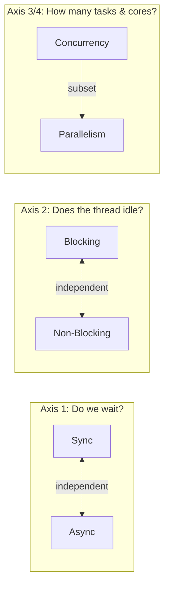
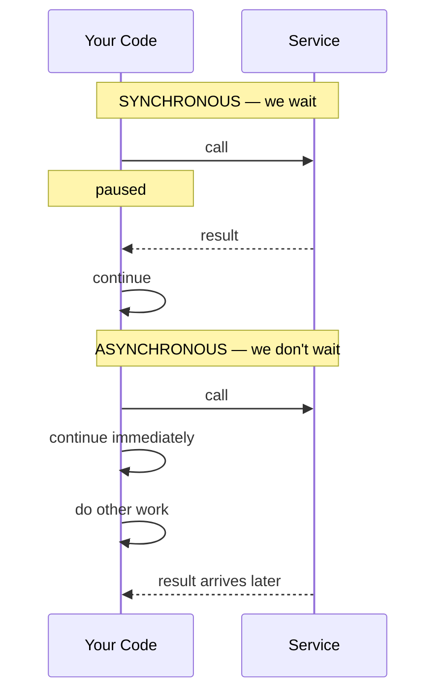
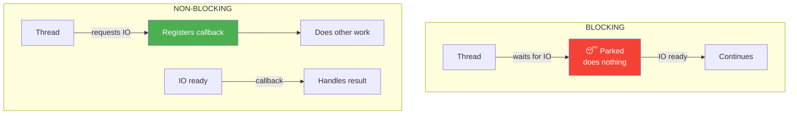
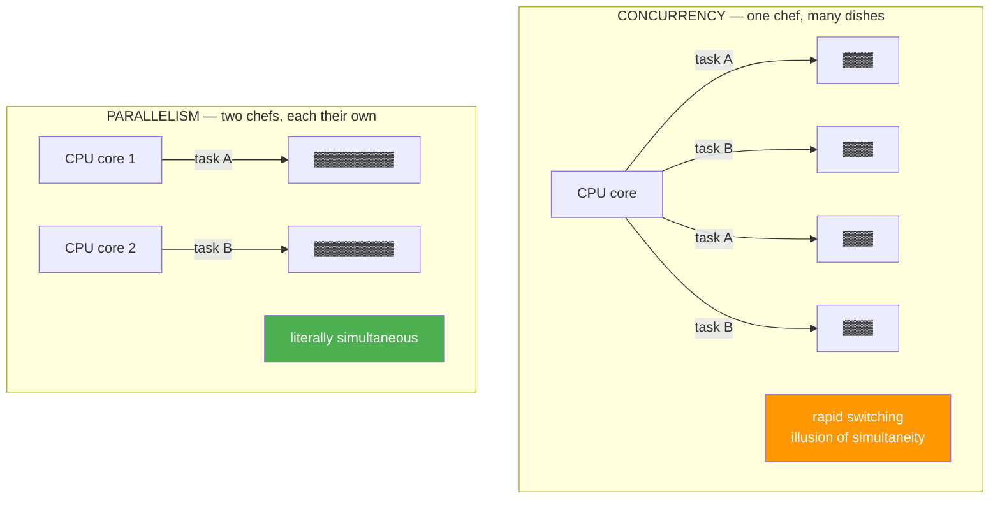
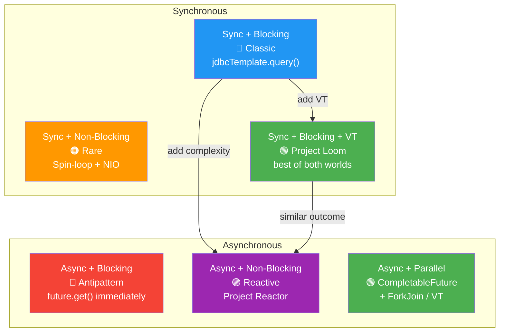

# Synchronous vs Asynchronous: Four Axes of Execution

How we wait for work to complete is one of the most consequential decisions
in program design. Yet the vocabulary around it — sync, async, blocking,
non-blocking, concurrent, parallel — is often used interchangeably, as if
they were synonyms. They are not.

These are **independent axes**. A program can be synchronous and non-blocking.
It can be asynchronous and blocking (usually a mistake). Understanding the
combinations, and when each is appropriate, is essential for writing
systems that are both correct and efficient.

## The Big Picture



> **Key insight:** Sync/async and blocking/non-blocking are **orthogonal**.
> You can be synchronous without blocking (spin-wait), and asynchronous
> while blocking (calling `.get()` immediately on a future).

## Axis 1: Synchronous vs Asynchronous

**Do we wait for the result before continuing?**

| | Synchronous | Asynchronous |
|---|---|---|
| **Mental model** | "Call and wait" | "Call and continue" |
| **Control flow** | Sequential | Deferred / callback-based |
| **Coupling** | Caller blocked until done | Caller free immediately |



```java
// Synchronous — next line runs only after result arrives
String result = httpClient.get(url);
System.out.println(result); // guaranteed after result

// Asynchronous — next line runs immediately
CompletableFuture<String> future = httpClient.getAsync(url);
System.out.println("already here!"); // runs before result
future.thenAccept(r -> System.out.println(r)); // later
```

```javascript
// Synchronous
const result = fs.readFileSync('data.txt', 'utf8');
console.log(result);

// Asynchronous
fs.readFile('data.txt', 'utf8', (err, result) => {
    console.log(result); // callback runs later
});
console.log('already here!');
```

```python
# Synchronous
result = requests.get(url).text
print(result)

# Asynchronous
async def fetch():
    result = await aiohttp_get(url)  # yields control, not the thread
    print(result)

asyncio.run(fetch())
print("scheduled")  # runs before fetch completes
```

## Axis 2: Blocking vs Non-Blocking

**Does the operating-system thread sit idle while waiting?**

| | Blocking | Non-Blocking |
|---|---|---|
| **Thread state** | Parked / sleeping | Active, doing other work |
| **OS cost** | Context switch to another thread | No context switch |
| **Programming model** | Simple, sequential | Event-driven, callback-based |



```java
// BLOCKING — thread is parked until data arrives
byte[] data = inputStream.read(); // thread sleeps here

// NON-BLOCKING — thread never sleeps
channel.read(buffer, attachment, new CompletionHandler<>() {
    public void completed(Integer result, Object att) {
        process(buffer); // called when data is ready
    }
});
// thread is already here, not waiting
```

```rust
// BLOCKING — thread sleeps
let data = std::fs::read_to_string("file.txt")?;

// NON-BLOCKING (tokio)
let data = tokio::fs::read_to_string("file.txt").await?;
// current task yields, executor runs other tasks
```

```go
// Go makes blocking cheap via goroutine multiplexing
// The goroutine parks, but the OS thread continues
resp, err := http.Get(url) // blocking call
// Under the hood: goroutine parks, thread runs other goroutines
```

## Axis 3/4: Concurrency vs Parallelism

**How many tasks are in progress, and on how many cores?**

- **Concurrency** — multiple tasks make progress within the same time
  period. On a single core, this is achieved by rapid switching
  (time-slicing). The "chef juggling multiple dishes" model.

- **Parallelism** — multiple tasks execute literally at the same time,
  on different cores. The "two chefs, each with their own dish" model.



```python
# CONCURRENCY — tasks interleaved on one thread (asyncio)
async def main():
    await asyncio.gather(task_a(), task_b())
    # Event loop switches between coroutines on a single thread

# PARALLELISM — tasks on different cores (multiprocessing)
from multiprocessing import Pool
with Pool(4) as p:
    p.map(heavy_computation, data)  # truly parallel on 4 cores
```

```rust
// CONCURRENCY — async tasks on a single thread (or few)
let (a, b) = tokio::join!(fetch_a(), fetch_b());

// PARALLELISM — rayon splits work across cores
let sum: i32 = data.par_iter().map(|x| x * x).sum();
```

## Six Combinations

When you combine the first two axes, you get six practical patterns:



### 1. Sync + Blocking — The Classic

The simplest model. The thread waits, and while waiting it does nothing.

```java
public String getUser(long id) {
    String user = jdbcTemplate.query(
        "SELECT * FROM users WHERE id = ?", id
    );                  // thread parks here
    return process(user);
}
```

**When:** simple scripts, low load, readability matters more than throughput.

### 2. Sync + Non-Blocking — The Rare Beast

You wait for the result, but the thread does not park. Instead it spins
or polls, checking repeatedly.

```java
SocketChannel channel = SocketChannel.open();
channel.configureBlocking(false);

ByteBuffer buffer = ByteBuffer.allocate(1024);
while (channel.read(buffer) == 0) {
    Thread.onSpinWait(); // hint to JVM: we're in a spin-loop
}
processData(buffer); // result obtained synchronously
```

**When:** ultra-low-latency systems where even thread parking is too slow.

### 3. Async + Blocking — The Antipattern

You launch work asynchronously, then immediately block waiting for it.
Two threads sit idle instead of one.

```java
// ANTIpATTERN — async launch, then immediate block
CompletableFuture<String> future = CompletableFuture
    .supplyAsync(() -> httpClient.get(url));

String result = future.get(); // BLOCKED! Two threads wasted.
```

**When:** never intentionally. A sign of misunderstanding the model.

### 4. Async + Non-Blocking — The Reactive Model

The thread never waits and never blocks. Maximum throughput per thread.

```java
// Project Reactor style
Mono.fromCallable(() -> fetchUserId())
    .flatMap(id -> Mono.zip(
        userRepository.findById(id),
        orderClient.getOrders(id),
        Tuple2::of
    ))
    .map(tuple -> buildResponse(tuple.getT1(), tuple.getT2()))
    .subscribe(response -> sendToClient(response));
```

```javascript
// Node.js event loop
Promise.all([
    fetchUser(userId),
    fetchOrders(userId)
]).then(([user, orders]) => {
    return buildResponse(user, orders);
}).then(sendToClient);
```

**When:** maximum throughput, high-load microservices, I/O-bound workloads.

### 5. Sync + Blocking + Virtual Threads — The Best of Both

Java 21+ changes the economics. You write sync + blocking code, but
virtual threads park instead of OS threads, so the carrier thread
remains free.

```java
try (var scope = new StructuredTaskScope.ShutdownOnFailure()) {
    // Each fork runs in its own virtual thread
    var user   = scope.fork(() ->
        jdbcTemplate.query("SELECT...", id)  // blocks — but VT parks
    );
    var orders = scope.fork(() ->
        httpClient.get(ordersUrl)            // blocks — but VT parks
    );

    scope.join();

    // Synchronous, readable code
    // Parallel execution
    // No callbacks
    return new Response(user.get(), orders.get());
}
```

**When:** Java 21+, you want simple code with async-level efficiency.

### 6. Async + Parallel — The Compute Model

Multiple tasks, truly simultaneous, on different cores.

```java
ExecutorService executor = Executors.newVirtualThreadPerTaskExecutor();

List<String> urls = List.of(url1, url2, url3, url4);

List<CompletableFuture<String>> futures = urls.stream()
    .map(url -> CompletableFuture.supplyAsync(
        () -> httpClient.get(url), executor
    ))
    .toList();

List<String> results = futures.stream()
    .map(CompletableFuture::join)
    .toList();
```

**When:** CPU-bound workloads, batch processing, fan-out/fan-in.

## Cheat Sheet

| Combination | Thread idles? | Waits for result? | Code complexity | When to use |
|-------------|--------------|-------------------|-----------------|-------------|
| **Sync + Blocking** | Yes | Yes | 🟢 Simple | Low load, scripts |
| **Sync + Non-Blocking** | No | Yes | 🟡 Medium | Ultra-low latency, HFT |
| **Async + Blocking** | Yes | No | 🟡 Medium | 🔴 Antipattern — avoid |
| **Async + Non-Blocking** | No | No | 🔴 Complex | Maximum throughput |
| **Sync + Blocking + VT** | No* | Yes | 🟢 Simple | Java 21+, general purpose |
| **Async + Parallel** | No | No | 🟡 Medium | Parallel computation |

> \* Virtual thread parks, but the carrier thread is free — this is not
> true idling from the system's perspective.

## The Event Loop

Many async + non-blocking systems (Node.js, Python asyncio, browser JS)
run on a **single-threaded event loop**:

```
┌─────────────────────────────────────────┐
│           Event Loop                    │
│  ┌─────────┐    ┌─────────┐            │
│  │ Task 1  │───→│ Task 2  │───→ ...    │
│  └─────────┘    └─────────┘            │
│       ↑                                  │
│   ┌───┴───┐                              │
│   │ Queue │ ← OS signals, timers, I/O   │
│   └───────┘                              │
└─────────────────────────────────────────┘
```

**Key properties:**
- One thread runs all tasks
- Tasks yield at `await` or I/O boundaries
- Between yield points, a task runs uninterrupted
- A CPU-bound task without yields blocks everything

This is why the event loop is **cooperative scheduling** at the
application level. See [Scheduling: Preemptive vs Cooperative](./index.md#scheduling-preemptive-vs-cooperative).

## Timeline

| Year | Event | Impact |
|------|-------|--------|
| 1965 | Dijkstra — semaphores | First shared-memory primitive |
| 1978 | Hoare — CSP | Channels for safe concurrency |
| 1995 | Java 1.0 — threads | OS threads for everyone |
| 2009 | Node.js | Event loop goes mainstream |
| 2012 | C# async/await | Ergonomic async syntax |
| 2015 | Python 3.5 — asyncio | Event loop in standard library |
| 2015 | JavaScript Promises (ES6) | Composable async values |
| 2017 | JavaScript async/await (ES2017) | Async in the browser |
| 2019 | Rust async/await | Zero-cost futures |
| 2021 | Java 17 — preview Loom | Virtual threads debut |
| 2022 | Java 19 — Structured Concurrency (preview) | Scoped async tasks |
| 2023 | Java 21 — Virtual Threads GA | Blocking code becomes cheap |

## Further Reading

- [Hoare — CSP (1978)](../../works/papers/hoare-1978-csp.md)
- [Java Virtual Threads](../../languages/java/index.md)
- [Kotlin Coroutines](../../languages/kotlin/index.md)
- [Go Goroutines](../../languages/go/index.md)
- *Java Concurrency in Practice* (Goetz et al.)
- Nystrom, Bob — "What Color is Your Function?" (2015)

## Related Topics

- [Concurrency](./index.md) — shared-memory vs message-passing models
- [Concurrency Map](../../maps/concurrency-map.md) — visual overview of how models evolved
- [Distributed Systems](../distributed/index.md) — async across machines
- [Functional Programming](../functional/index.md) — purity eliminates shared-state races
- [Languages](../../languages/index.md) — how different languages approach concurrency
