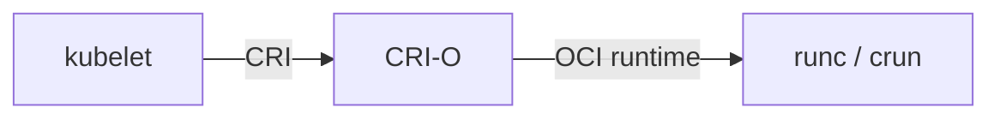

# Alternatives

Tools and runtimes worth knowing alongside the headline names. Each entry
gives the **type**, the **problem it solves**, **where it fits**, and
its **status**.

---

## Contents

- [System Containers](#system-containers)
- [Daemonless / Rootless Image Builders](#daemonless--rootless-image-builders)
- [Alternative CRI Runtimes](#alternative-cri-runtimes)
- [Sandboxed Runtimes](#sandboxed-runtimes)
- [MicroVM Runtimes](#microvm-runtimes)
- [Helm Alternatives](#helm-alternatives)
- [When to Reach for Which](#when-to-reach-for-which)

---

## System Containers

### LXC / LXD

- **Type:** System container manager (Canonical) — containers behave like lightweight VMs
- **Solves:** Running a full Linux userspace (init, multiple processes) inside a container
- **Fits:** Replacing VMs for legacy workloads; Proxmox host containers; multi-tenant labs
- **Status:** Active. **Incus** (2023) is a community fork of LXD after the Canonical license change.

LXC predates Docker by five years and remains the canonical choice when you
want **a container that looks like a server**, not a single-process app.

---

## Daemonless / Rootless Image Builders

### Buildah

- **Type:** Image builder (Red Hat / Podman project)
- **Solves:** Building OCI images without a daemon, scriptably
- **Fits:** Podman environments; image build pipelines that need imperative scripting
- **Status:** Stable; ships with Podman.

### BuildKit

- **Type:** Build engine (CNCF, originated at Docker)
- **Solves:** Modern build with parallel stages, advanced cache, secrets, multi-platform output
- **Fits:** Default Docker builder; standalone via `buildctl`; embedded in Bazel, ko, depot.dev
- **Status:** Stable; the de facto standard for OCI image builds.

### Kaniko

- **Type:** Image builder (Google)
- **Solves:** Building images **inside** an unprivileged container (typically a Kubernetes pod)
- **Fits:** Kubernetes-native CI (Tekton, Argo Workflows) where running a Docker daemon is undesirable
- **Status:** Stable; widely used in K8s-native pipelines.

### img

- **Type:** Standalone CLI built on BuildKit
- **Solves:** Daemonless, rootless builds without containerd
- **Fits:** Niche; mostly superseded by `buildctl` and `nerdctl build`
- **Status:** Maintenance only.

### ko

- **Type:** Go-specific image builder (CNCF)
- **Solves:** Build a container image for a Go binary — no Dockerfile needed
- **Fits:** Go projects; reproducible, distroless-by-default images
- **Status:** Active; widely used in Knative and other Go-heavy projects.

### Jib

- **Type:** Maven / Gradle plugin (Google)
- **Solves:** Build container images for JVM apps without a Docker daemon
- **Fits:** Java / Kotlin / Scala projects in CI
- **Status:** Active.

---

## Alternative CRI Runtimes

### CRI-O

- **Type:** Minimal CRI implementation (Kubernetes project)
- **Solves:** Running containers under Kubernetes without containerd's broader scope
- **Fits:** OpenShift; environments that prefer a Kubernetes-only runtime
- **Status:** Stable; widely deployed alongside containerd.

---

## Sandboxed Runtimes

### gVisor

- **Type:** Userspace kernel (Google)
- **Solves:** Stronger isolation by intercepting guest syscalls in a user-space kernel
- **Fits:** Multi-tenant container hosts; Google Cloud Run; sandboxed CI
- **Status:** Production at Google.

### Kata Containers

- **Type:** VM-isolated containers (OpenStack Foundation)
- **Solves:** Running each container in a lightweight VM for hardware-level isolation
- **Fits:** Untrusted workloads, regulated tenants, container-as-VM hosting
- **Status:** Active.

---

## MicroVM Runtimes

### Firecracker

- **Type:** Minimal KVM-based hypervisor (AWS)
- **Solves:** Strong isolation with VM-fast startup (<125 ms) and tiny per-instance overhead
- **Fits:** AWS Lambda, Fargate, Fly.io machines; serverless and FaaS platforms
- **Status:** Production at scale at AWS; open source.

### Cloud Hypervisor / QEMU + microvm

- **Type:** Alternative VMMs targeting the same niche
- **Fits:** Custom serverless and confidential-compute platforms

---

## Helm Alternatives

### Kustomize

- **Type:** Overlay-based YAML customization (built into `kubectl`)
- **Solves:** Per-environment patches without string templating
- **Fits:** Shops that dislike Go templates; combined with Helm via post-renderer
- **Status:** Stable; first-class in `kubectl apply -k`.

### Carvel (`ytt` + `kapp`)

- **Type:** Templating + apply orchestrator (VMware)
- **Solves:** Strongly-typed YAML transformations; ordered, drift-aware apply
- **Fits:** Teams wanting more rigor than Helm without ArgoCD's footprint
- **Status:** Active.

### CUE / jsonnet

- **Type:** Configuration languages
- **Solves:** Type-checked, programmable configuration
- **Fits:** Large monorepos with many similar services
- **Status:** Active in specific ecosystems.

---

## When to Reach for Which

| Situation | Reach for |
|-----------|-----------|
| Replace VMs with lighter containers, full init | LXC / LXD or Incus |
| Build images in Kubernetes CI without a daemon | Kaniko or BuildKit (rootless) |
| Build a Go service container | ko |
| Run untrusted multi-tenant workloads | gVisor or Kata Containers |
| Sub-second cold start with VM isolation | Firecracker |
| Avoid Helm templating | Kustomize, Carvel, or jsonnet |
| Use Kubernetes without containerd | CRI-O |

---

## Related

- [Containers & Orchestration](index.md) — overview
- [Docker](docker.md) — the headline runtime these alternatives compare to
- [Podman](podman.md) — Buildah and Skopeo are its siblings
- [containerd](containerd.md) — CRI-O is the other major CRI runtime
- [Kubernetes](kubernetes.md) — gVisor and Kata are commonly deployed as runtime classes
- [Helm](helm.md) — Kustomize and Carvel as alternatives
