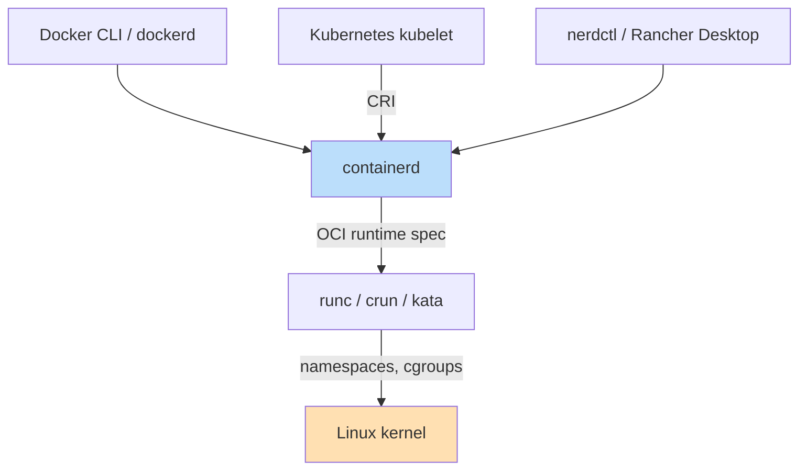

# containerd

**Type:** Low-level OCI container runtime (CNCF graduated project)  
**Config file:** `/etc/containerd/config.toml`  
**Docs:** https://containerd.io

---

## Contents

- [Key Concepts](#key-concepts)
- [Position in the Stack](#position-in-the-stack)
- [Where to Find Things](#where-to-find-things)
- [Lifecycle](#lifecycle)
- [Snapshotters](#snapshotters)
- [CRI Integration](#cri-integration)
- [CLIs: ctr, crictl, nerdctl](#clis-ctr-crictl-nerdctl)
- [Common Patterns](#common-patterns)
- [Limitations](#limitations)

---

## Key Concepts

| Term | Meaning |
|------|---------|
| **Runtime** | The thing that actually runs containers; containerd shells out to `runc` (or `crun`, `kata-runtime`, `gvisor`) |
| **Namespace** (containerd) | Tenant-style isolation inside containerd; not the Linux namespace |
| **Snapshot** | A filesystem layer presented to a container by a snapshotter |
| **Bundle** | An OCI runtime bundle (`config.json` + rootfs) handed to `runc` |
| **Task** | A running container (containerd separates "container" config from "task" execution) |
| **Plugin** | Runtime, snapshotter, content store, or service plugin loaded at startup |
| **CRI** | Kubernetes Container Runtime Interface — gRPC contract between kubelet and runtimes |

---

## Position in the Stack



Docker, Kubernetes, and standalone CLIs all sit **above** containerd. containerd
sits **above** the OCI runtime (`runc`), which talks to the kernel.

---

## Where to Find Things

| What | Where |
|------|-------|
| Daemon binary | `/usr/bin/containerd` |
| Config | `/etc/containerd/config.toml` (generate default with `containerd config default`) |
| Socket | `/run/containerd/containerd.sock` |
| State and content | `/var/lib/containerd/` |
| `ctr` CLI (admin tool) | `/usr/bin/ctr` |
| `crictl` CLI (CRI debug) | `/usr/local/bin/crictl` (CRI tools project) |
| `nerdctl` CLI (Docker-compatible UX) | `/usr/local/bin/nerdctl` |
| Logs | `journalctl -u containerd` |

---

## Lifecycle

For a container, containerd separates **definition** (Container) and
**execution** (Task):

```
pull image  →  unpack to snapshot  →  create container  →  create task  →  start  →  stop  →  delete
```

Practically, this is invisible to most users — the kubelet, Docker, or `nerdctl`
hide it. Direct interaction happens via `ctr` (tenant-aware, advanced) or
`crictl` (CRI-level debugging on Kubernetes nodes).

---

## Snapshotters

Snapshotters present image layers as a filesystem to the container.

| Snapshotter | Notes |
|-------------|-------|
| `overlayfs` | Default on Linux; copy-on-write via the overlay filesystem |
| `native` | Plain copy; portable but slow |
| `devmapper` | Block-level snapshots; useful with thin-pool storage |
| `btrfs` / `zfs` | Filesystem-native snapshots |
| `stargz` / `nydus` | Lazy pulling — start the container before the full image is fetched |

Lazy-pulling snapshotters dramatically reduce cold-start time on large images
and are common in serverless container platforms.

---

## CRI Integration

containerd implements the **Container Runtime Interface** that Kubernetes'
kubelet talks to. Since Kubernetes 1.24 (May 2022) the Docker shim is gone,
so every modern Kubernetes distribution uses containerd or CRI-O directly.

```text
kubelet → CRI gRPC → containerd → runc → kernel
```

This is why `crictl ps` (CRI-level) gives different output than `docker ps`
on a Kubernetes node — Docker isn't there anymore.

---

## CLIs: ctr, crictl, nerdctl

| CLI | Purpose | Audience |
|-----|---------|----------|
| `ctr` | Admin / debugging; understands containerd namespaces | containerd developers, troubleshooting |
| `crictl` | CRI-level CLI; matches what kubelet does | Kubernetes operators |
| `nerdctl` | Docker-compatible UX (build, run, compose) on top of containerd | End users replacing Docker |

`nerdctl` adds features Docker doesn't have natively: lazy-pull snapshotters,
P2P image distribution, and image encryption.

---

## Common Patterns

| Pattern | Description |
|---------|-------------|
| **Drop-in Docker replacement on K8s nodes** | Default since K8s 1.24 — no behavior change for workloads |
| **Lazy pulling** | `stargz`/`nydus` snapshotter for fast cold starts |
| **Multiple runtimes side by side** | Use `runc` for default workloads, `kata-runtime` for untrusted ones |
| **Image distribution** | `nerdctl ipfs` or P2P snapshotters in large clusters |
| **Embedded in higher-level tools** | Rancher Desktop, k3s, kind, Lima — all embed containerd |

---

## Limitations

- **Not a user-facing tool** — meant to be embedded; raw `ctr` is intentionally minimal
- **No Compose / orchestration** — that's the layer above containerd's job
- **Less ecosystem visibility than Docker** — most users interact via Docker / Kubernetes / nerdctl, not directly
- **Configuration is TOML-heavy** — node-level changes typically managed by the Kubernetes distribution

---

## Related

- [Containers & Orchestration](index.md) — overview
- [Docker](docker.md) — uses containerd internally since Docker 1.11
- [Kubernetes](kubernetes.md) — the primary consumer of containerd today
- [Alternatives](alternatives.md) — CRI-O, the other CRI implementation
- [Podman](podman.md) — does not use containerd (uses `crun`/`runc` directly)
