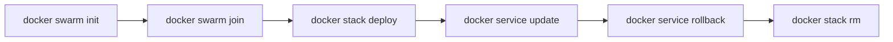

# Docker Swarm

**Type:** Container orchestrator built into Docker Engine  
**Config files:** `compose.yaml` (v3 spec) deployed via `docker stack deploy`  
**Docs:** https://docs.docker.com/engine/swarm/

---

## Contents

- [Key Concepts](#key-concepts)
- [Where to Find Things](#where-to-find-things)
- [Lifecycle](#lifecycle)
- [Stacks and Compose](#stacks-and-compose)
- [Networking](#networking)
- [Secrets and Configs](#secrets-and-configs)
- [Common Patterns](#common-patterns)
- [Limitations](#limitations)

---

## Key Concepts

| Term | Meaning |
|------|---------|
| **Swarm** | Cluster of Docker engines acting as one |
| **Manager** | Node running the control plane (Raft consensus) |
| **Worker** | Node running tasks |
| **Service** | Long-running workload definition (image + replicas + constraints) |
| **Task** | An individual replica of a service (≈ a container) |
| **Stack** | Group of services deployed from a Compose file |
| **Routing mesh** | Built-in load balancer that publishes service ports across all nodes |

---

## Where to Find Things

| What | Where |
|------|-------|
| Cluster state | Raft log on managers (`/var/lib/docker/swarm/`) |
| Daemon socket | `/var/run/docker.sock` (same as standalone Docker) |
| Compose stacks | Authored as `compose.yaml`, deployed via `docker stack deploy` |
| Service logs | `docker service logs <service>` |
| Visualizer | Community Swarm visualizer images (no built-in dashboard) |

---

## Lifecycle



| Verb | What it does |
|------|--------------|
| `swarm init` | Bootstrap the first manager |
| `swarm join` | Add a node as manager or worker |
| `node ls` / `node update` | List or relabel nodes |
| `service create` / `update` | Create or change a service |
| `service scale` | Change replica count |
| `service rollback` | Revert to previous spec |
| `stack deploy -c compose.yaml <name>` | Create or update a stack |
| `stack rm <name>` | Tear down a stack |

---

## Stacks and Compose

Swarm consumes Compose v3 files via `docker stack deploy`. The same file
that runs locally with `docker compose up` can be deployed to a cluster
with minor additions (`deploy:` block):

```yaml
services:
  web:
    image: ghcr.io/me/web:1.2.3
    ports: ["8080:8080"]
    deploy:
      replicas: 4
      update_config: { parallelism: 1, order: start-first }
      restart_policy: { condition: on-failure }
      resources:
        limits: { cpus: "0.50", memory: 256M }
```

This was the original "Docker dev → Docker prod" promise; for many small
production setups it still holds.

---

## Networking

- **Overlay networks** — multi-host VXLAN networks created with `docker network create -d overlay`
- **Routing mesh** — when a service publishes a port, it is reachable on that port on every node, even nodes not running the task
- **Encryption** — `--opt encrypted` on overlay networks for IPsec
- **Service discovery** — built-in DNS resolves service names to virtual IPs

---

## Secrets and Configs

```bash
echo 'p@ss' | docker secret create db_password -
docker service create --secret db_password --name db postgres:16
```

Secrets and configs are mounted as files inside `/run/secrets/` (read-only,
in tmpfs). Stored encrypted on managers and only sent to workers running
tasks that need them.

---

## Common Patterns

| Pattern | Description |
|---------|-------------|
| **Same Compose, more nodes** | Promote `compose.yaml` from dev to prod with a `deploy:` block |
| **Constraint-based placement** | `deploy.placement.constraints: [node.labels.role == db]` |
| **Rolling updates** | `update_config` controls parallelism, delay, and order |
| **Highly available managers** | 3 or 5 managers (odd numbers, Raft quorum) |
| **External proxies** | Traefik or Caddy for HTTPS / advanced routing in front of the routing mesh |

---

## Limitations

- **Effectively in maintenance mode since 2017** — Mirantis owns Swarm; small fixes only
- **Smaller ecosystem than Kubernetes** — no operators, fewer third-party tools
- **No native ingress beyond the routing mesh** — TLS termination needs an external proxy
- **No autoscaling** — scale changes are manual or scripted
- **Limited multi-tenancy** — fewer RBAC primitives than Kubernetes
- **Less observability tooling** — community-driven; no flagship dashboard

Swarm remains a reasonable choice for **small clusters**, **single-team
operations**, and teams that have already standardized on Compose. For
new projects of any complexity, [Kubernetes](kubernetes.md) or
[Nomad](nomad.md) usually wins.

---

## Related

- [Containers & Orchestration](index.md) — overview
- [Docker](docker.md) — Swarm is built into the Docker engine
- [Kubernetes](kubernetes.md) — feature-rich alternative
- [Nomad](nomad.md) — middle ground in complexity
