# Docker

**Type:** Container runtime + image builder + local orchestrator (Compose)  
**Config files:** `Dockerfile`, `compose.yaml`, `~/.docker/config.json`  
**Docs:** https://docs.docker.com

---

## Contents

- [Key Concepts](#key-concepts)
- [Architecture](#architecture)
- [Where to Find Things](#where-to-find-things)
- [Lifecycle](#lifecycle)
- [Dockerfile](#dockerfile)
- [Docker Compose](#docker-compose)
- [Images and Registries](#images-and-registries)
- [Networking](#networking)
- [Storage](#storage)
- [Security](#security)
- [Common Patterns](#common-patterns)
- [Limitations](#limitations)

---

## Key Concepts

| Term | Meaning |
|------|---------|
| **Image** | Immutable, layered, content-addressed package — what you ship |
| **Container** | Running (or stopped) instance of an image |
| **Layer** | Filesystem diff produced by one Dockerfile instruction |
| **Volume** | Persistent storage managed by Docker, decoupled from container lifecycle |
| **Network** | Virtual network connecting containers (`bridge`, `host`, `overlay`, `none`, `macvlan`) |
| **Registry** | Server storing images (Docker Hub, GHCR, ECR, GAR, Harbor) |
| **Daemon** | Long-running `dockerd` process that manages images, containers, networks, volumes |
| **Engine API** | REST API exposed by the daemon over a Unix socket or TCP |

---

## Architecture

### High-Level Components

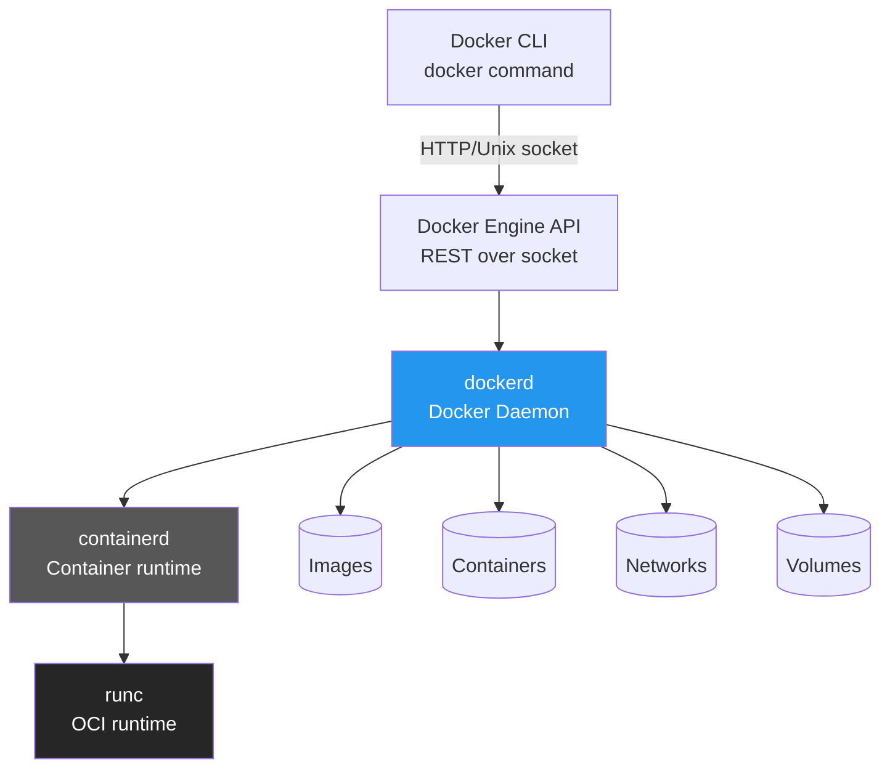

### Image Layer Architecture

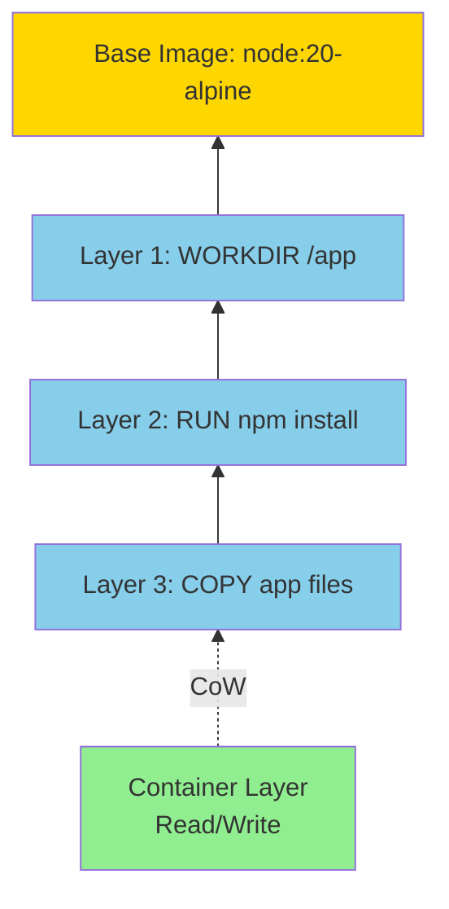

### Container Runtime Stack

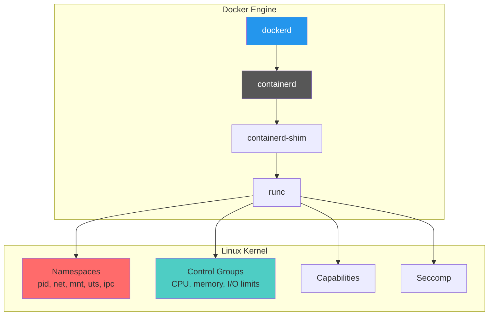

### Network Architecture

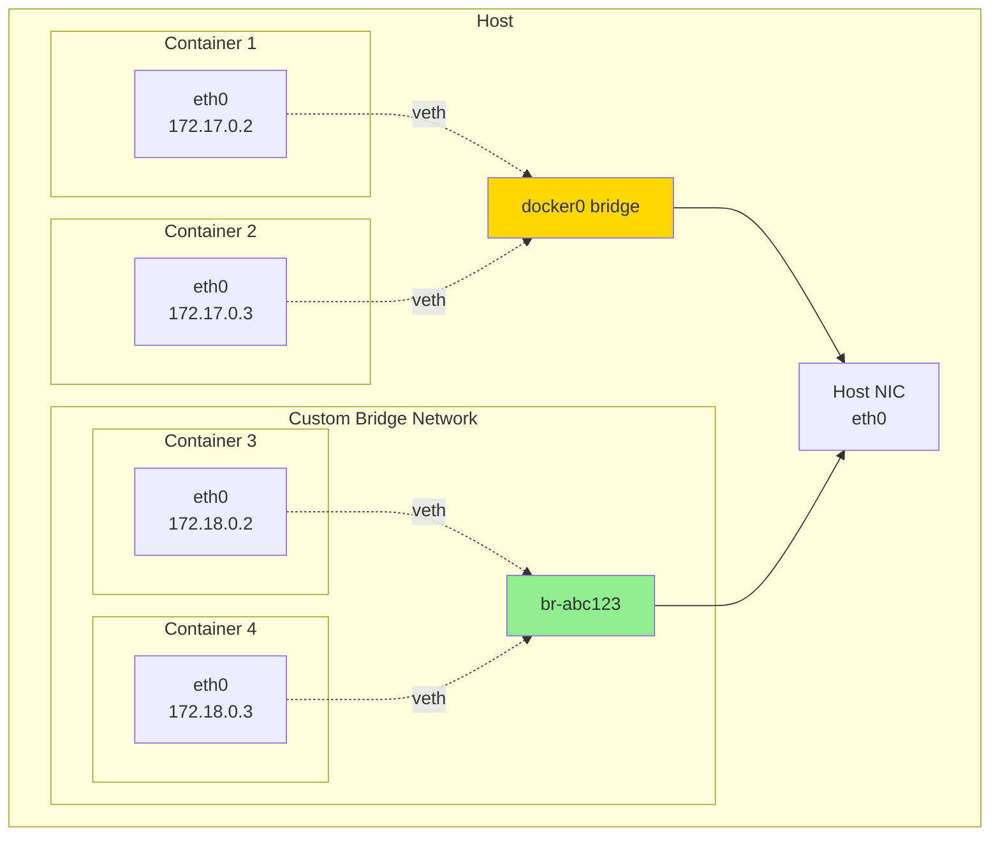

### Storage Driver Architecture

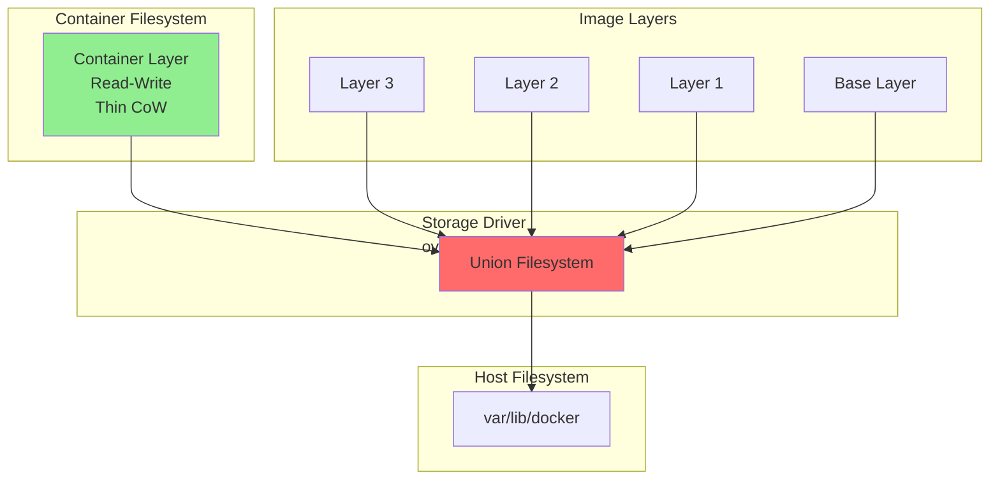

---

## Where to Find Things

| What | Where |
|------|-------|
| Daemon socket (Linux) | `/var/run/docker.sock` |
| Image and container storage | `/var/lib/docker/` |
| Per-user CLI config | `~/.docker/config.json` |
| Daemon config | `/etc/docker/daemon.json` |
| Registry credentials | `~/.docker/config.json` `auths` block (or credential helper) |
| Build cache | `/var/lib/docker/buildkit/` |
| Compose files | `compose.yaml` (or `docker-compose.yml`) in project root |
| Docker Desktop GUI | Containers / Images / Volumes / Builds tabs |

---

## Lifecycle

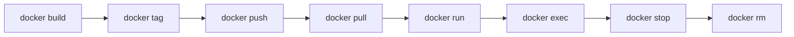

### Container State Machine

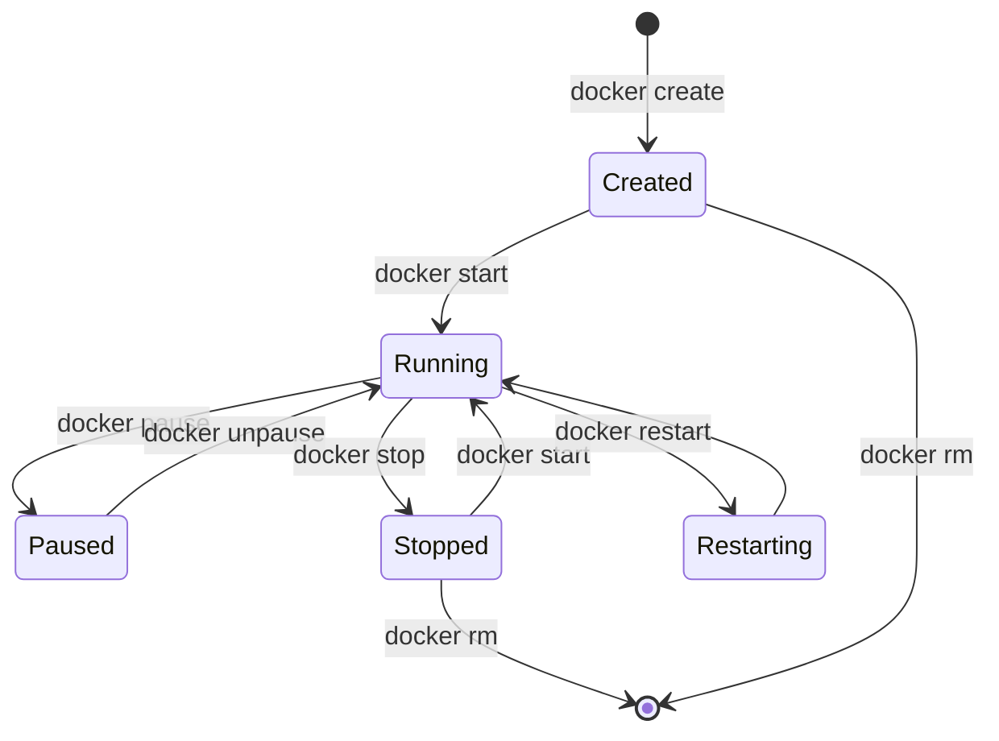

| Verb | What it does |
|------|--------------|
| `build` | Read `Dockerfile`, produce a tagged image |
| `tag` | Add a name (`registry/repo:tag`) to an existing image ID |
| `push` / `pull` | Move images between local store and registry |
| `run` | Create + start a container in one step |
| `start` / `stop` / `restart` | Manage running state without recreating |
| `exec` | Run a process in a running container |
| `logs` | Stream stdout/stderr of a container |
| `inspect` | Dump container or image metadata as JSON |
| `rm` / `rmi` | Remove containers / images |
| `system prune` | Garbage-collect stopped containers, dangling images, unused networks |

---

## Dockerfile

Declarative recipe for building an image. Each instruction creates a new layer.

```dockerfile
# syntax=docker/dockerfile:1.7
FROM node:20-alpine AS build
WORKDIR /app
COPY package*.json ./
RUN --mount=type=cache,target=/root/.npm npm ci
COPY . .
RUN npm run build

FROM node:20-alpine
WORKDIR /app
COPY --from=build /app/dist ./dist
COPY --from=build /app/node_modules ./node_modules
USER node
EXPOSE 3000
CMD ["node", "dist/server.js"]
```

### Multi-Stage Build Flow

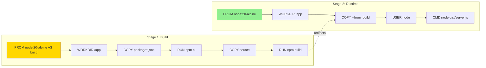

**Key instructions:**

| Instruction | Purpose |
|-------------|---------|
| `FROM` | Base image (use `AS <name>` for multi-stage builds) |
| `WORKDIR` | Set working directory; preferred over `RUN cd` |
| `COPY` / `ADD` | Add files into the image (prefer `COPY`; `ADD` also handles URLs/tar) |
| `RUN` | Execute a command at build time |
| `ENV` / `ARG` | Runtime env vars / build-time args |
| `EXPOSE` | Document the port (does not publish it) |
| `USER` | Drop root before `CMD` runs |
| `ENTRYPOINT` / `CMD` | Default command and its arguments |
| `HEALTHCHECK` | Container-level liveness probe |

**BuildKit features** (default since Docker 23):

- Parallel stage execution
- Cache mounts (`--mount=type=cache`)
- Secret mounts (`--mount=type=secret`)
- Multi-platform builds via `docker buildx`
- Remote cache export/import

---

## Docker Compose

Declarative spec for multi-container apps on a single host.

```yaml
services:
  web:
    build: .
    ports: ["3000:3000"]
    environment:
      DATABASE_URL: postgres://app@db:5432/app
    depends_on:
      db:
        condition: service_healthy
  db:
    image: postgres:16
    volumes: [pgdata:/var/lib/postgresql/data]
    healthcheck:
      test: ["CMD-SHELL", "pg_isready -U app"]
      interval: 5s
volumes:
  pgdata:
```

### Compose Architecture

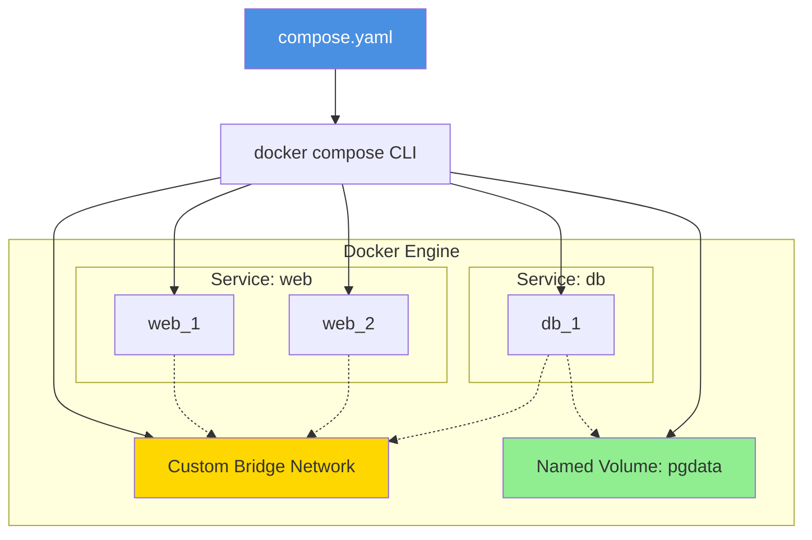

| Verb | What it does |
|------|--------------|
| `compose up` | Build + create + start all services |
| `compose down` | Stop + remove containers, networks (volumes optional) |
| `compose logs -f` | Follow logs of all services |
| `compose ps` | Show service state |
| `compose exec <svc>` | Shell into a running service |
| `compose --profile <p>` | Activate a profile-tagged subset of services |

---

## Images and Registries

### Image Distribution Flow

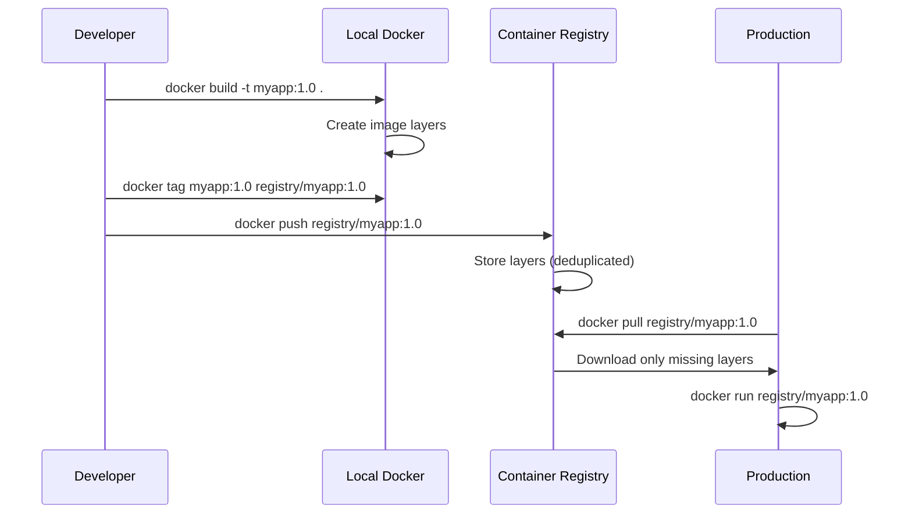

- **Layered storage** — each instruction is a layer; layers are content-addressed
  and shared across images, so pulls are deduplicated.
- **Tags** — mutable pointers (`myapp:1.2.3`, `myapp:latest`); also content
  digests (`myapp@sha256:…`) for immutable references.
- **Registries** — Docker Hub (default), GitHub Container Registry (`ghcr.io`),
  Amazon ECR, Google Artifact Registry, Azure Container Registry, Harbor (self-hosted).
- **Authentication** — `docker login`; in CI prefer short-lived OIDC tokens
  (GitHub `id-token`, AWS `aws-actions/configure-aws-credentials`).

---

## Networking

### Network Drivers Comparison

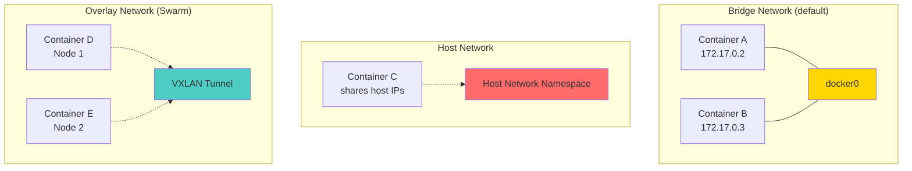

| Driver | Use case |
|--------|----------|
| `bridge` | Default, single-host private network |
| `host` | Container shares the host's network namespace |
| `overlay` | Multi-host network (Swarm or external orchestrator) |
| `macvlan` | Container gets its own MAC on the physical network |
| `none` | No networking; only loopback |

Containers on the same custom bridge can resolve each other by name (built-in DNS).

---

## Storage

### Volume Types Comparison

```mermaid
graph TB
    subgraph "Named Volume"
        V1[/var/lib/docker/volumes/mydata]
        C1[Container] -.mount.-> V1
    end
    
    subgraph "Bind Mount"
        H1[/home/user/project]
        C2[Container] -.mount.-> H1
    end
    
    subgraph "tmpfs Mount"
        M1[Memory]
        C3[Container] -.mount.-> M1
    end
    
    style V1 fill:#90EE90
    style H1 fill:#FFD700
    style M1 fill:#FF6B6B
```

| Mount type | Use case |
|------------|----------|
| **Volume** | Docker-managed storage (preferred for persistent data) |
| **Bind mount** | Map a host path into the container (best for dev) |
| **tmpfs** | In-memory only; nothing persisted |

Volumes survive container removal; bind mounts depend on host filesystem.

---

## Security

### Security Layers

```mermaid
graph TB
    subgraph "Container Security"
        User[Non-root User<br/>USER node]
        ReadOnly[Read-only Rootfs<br/>--read-only]
        Caps[Dropped Capabilities<br/>--cap-drop ALL]
        Seccomp[Seccomp Profile]
        AppArmor[AppArmor/SELinux]
        Scan[Image Scanning<br/>Trivy, Grype]
    end
    
    subgraph "Runtime Security"
        Namespaces[Kernel Namespaces]
        Cgroups[Resource Limits]
        Rootless[Rootless Docker]
    end
    
    User --> ReadOnly
    ReadOnly --> Caps
    Caps --> Seccomp
    Seccomp --> AppArmor
    AppArmor --> Scan
    
    Namespaces --> Cgroups
    Cgroups --> Rootless
    
    style User fill:#90EE90
    style Scan fill:#4ECDC4
    style Rootless fill:#FFD700
```

- **Run as non-root** — `USER` in Dockerfile or `--user` at runtime
- **Drop capabilities** — `--cap-drop=ALL --cap-add=NET_BIND_SERVICE`
- **Read-only root filesystem** — `--read-only` plus tmpfs for writable areas
- **Seccomp and AppArmor profiles** — default profiles ship with Docker
- **Rootless mode** — run the daemon and containers as a non-root user
  (avoids the `docker` group = root tradeoff)
- **Image scanning** — `docker scout`, Trivy, Grype in CI
- **Distroless / minimal bases** — fewer packages, fewer CVEs

---

## Common Patterns

| Pattern | Description |
|---------|-------------|
| **Multi-stage build** | One stage builds, the next stage copies only artifacts — small final image |
| **Build once, deploy many** | Same digest goes through staging → prod; tags only point, never rebuild |
| **Sidecar** | Companion container shares network/volume with the main one |
| **Init container** | Run a setup task before the main container starts |
| **`.dockerignore`** | Exclude `.git`, `node_modules`, secrets from build context |
| **Reproducible tags** | Pin base image by digest (`FROM node:20-alpine@sha256:…`) |

---

## Limitations

- **Linux-only kernel sharing** — on Windows and macOS, Docker Desktop runs a Linux VM
- **Daemon as single point of failure** — restart kills all running containers (mitigated by `--restart` policies and `live-restore`)
- **Root daemon** — historical security concern; rootless mode addresses it but with caveats
- **Licensing** — Docker Desktop requires a paid subscription for larger organisations (since 2021)
- **Single-host scope** — Compose handles one machine; production scale needs an orchestrator

---

## Related

- [Containers & Orchestration](index.md) — overview
- [Podman](podman.md) — daemonless, rootless alternative
- [containerd](containerd.md) — Docker's underlying runtime
- [Kubernetes](kubernetes.md) — multi-host orchestration
- [Helm](helm.md) — packaging for Kubernetes
- [Solomon Hykes](../../authors/solomon-hykes.md) — Docker creator
- [CI/CD Providers](../process/ci-cd/index.md) — almost all use Docker as a runner